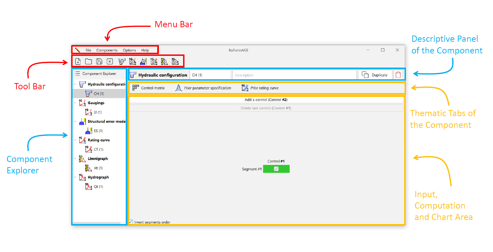
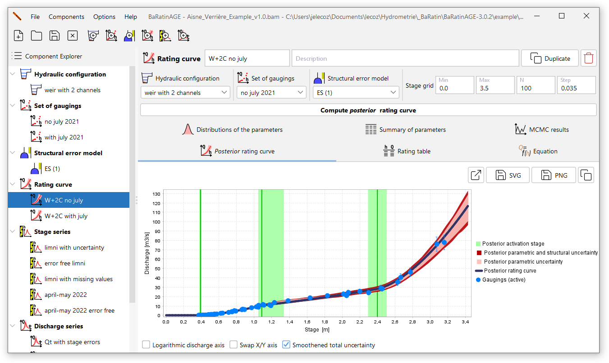

# General organisation

The window shown below appears when BaRatinAGE v3 starts up:

In addition to the classic menu and tool bars (the operation of which will be described in more detail later), this window has several main areas:

- On the left, the *component explorer* which allows you to navigate through the various components created in BaRatinAGE: hydraulic configurations, sets of gaugings, structural error models, rating curves, stage series and discharge series.
- On the right, from top to bottom:
    - the *descriptive panel of the component* selected in the explorer;
    - the *thematic tabs of the component*;
    - the *input, computation and chart area* corresponding to the selected thematic tab.

When BaRatinAGE starts up, a component of each type pre-exists, with fields that are either blank or filled in by default.

To illustrate how BaRatinAGE works more effectively, we are going to open a pre-registered study. To do this, click on the  *Open project...* tool or in the *File...Open project...* menu (Ctrl+O), and open the file named *Aisne_Verrieres_Example.bam* in the *example* directory (this directory is located in the folder where you installed BaRatinAGE).

# Navigating the graphical interface

The main window should now contain several components as shown in the figure below. The rationale of the GUI is to use the *component explorer* to navigate through BaRatinAGE. Left-click to select a component, which automatically updates the panels to the right. Right-clicking gives access to a number of tools (described in more detail later).

Note also that tooltips are omnipresent in the application. Don't hesitate to consult them, as they often provide more detailed information than the names of fields, buttons, etc.

The *descriptive panel of the component* shows the type of component selected (icon and name), its name and its description (free text). It also includes the buttons *Duplicate* and *Delete* the component.

The *thematic tabs of the component* are specific to the component in question: they will be described in the following pages of this documentation, which detail these components one by one.

The same applies to the associated *input, computation and chart area*. The following functions can be found in the chart area itself:

- You can zoom in with the mouse by holding down the left click and drawing a rectangle from the top left-hand corner to the bottom right-hand corner. To return to the original axes, follow a similar procedure, but draw the rectangle from the bottom right-hand corner to the top left-hand corner;
- Right-click on the graph to access a menu with the following actions (also available via buttons above the figure):
    - Draw the figure in an external window; 
    - Export the image in SVG vector format;
    - Export the image in PNG format;
    - Copy to clipboard.
    

# Menus and actions on the components

## "File" menu

This menu contains the usual tools for opening and saving a study, creating a new study and closing the application. It is only possible to open one study at a time, and the rationale of BaRatinAGE is that a study corresponds to a hydrometric station. For a given study, it is possible to define several hydraulic configurations, several sets of gaugings, several rating curves, etc.

## Basic handling of components

All BaRatinAGE components can be manipulated with a few basic actions, which can be accessed via the menus or by right-clicking in the tree structure: 

- *Create new* (also accessible via the toolbar buttons): allows you to create a new component after naming it. As components are identified by name in BaRatinAGE, it is not possible to give the same name to two components of the same type (for example, two rating curves, two hydraulic configurations, etc.);
- *Duplicate*: copies the properties of an existing component to a new component (which will be renamed);
- *Delete*: used to delete an existing component. 

Note: if a component that has been used to calculate results is modified or deleted, a warning message suggests that the user should keep or update these results. For example, when a set of gaugings is modified or deleted, this message will be issued for all the rating curves that used these gaugings, and therefore also for all the discharge series that used these rating curves.

The thematic tabs of certain components also offer results tables in various formats, which can be copied or exported.

## "Options" menu

This menu allows you to change the following options:

- *change language*: select BaRatinAGE language (27 languages available to date, feel free to add another language! See explanations in the [*Going further*](/en/doc/baratinage/going-further) page).

<!--- Options à venir, développements en cours :

-   *Préférences* : choix entre plusieurs coutumes régionales (choix entre les coefficients de Strickler ou de Manning, choix du système d'unités, etc.) ;
-   *Répertoire par défaut* : définit le répertoire par défaut qui sera proposé pour toutes les actions de sauvegarde, export, ouverture de fichiers, etc. (par défaut, ce répertoire est le dossier dans lequel est installé BaRatinAGE) ;
-   *Options MCMC* : permet de régler les propriétés de l'échantillonneur MCMC ([détails techniques](/fr/doc/topics/mcmc)).
-   *Options de sauvegarde* : permet d'activer ou de désactiver la sauvegarde de certains composants pouvant être très volumineux. L'activation de cette sauvegarde peut générer des fichiers extrêmement volumineux (potentiellement plusieurs Go !) et ralentir notablement les actions d'ouverture et de sauvegarde.
-->