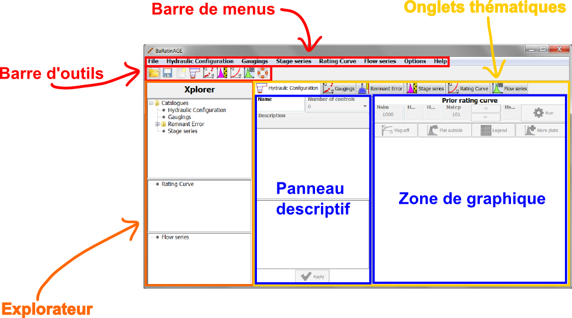
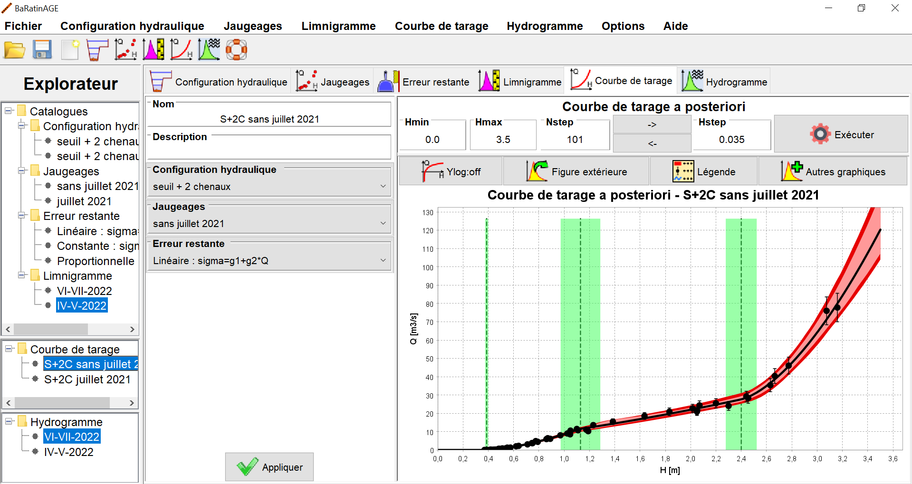

# Organisation générale

La fenêtre représentée ci-dessous apparaît au démarrage de BaRatinAGE. Outre les classiques barres de menus et d'outils (dont le fonctionnement sera détaillé ultérieurement), cette fenêtre comporte plusieurs zones principales :

-   A gauche, l'*explorateur* qui permettra de naviguer parmi les différents objets créés dans BaRatinAGE : configuration hydraulique, jaugeages, erreur restante, limnigramme, courbe de tarage et hydrogramme.
-   A droite, les *onglets thématiques* qui représentent ces objets. Cette zone est elle-même subdivisée en deux sous-zones:
    -   A gauche, le *panneau descriptif* de l'objet, qui permet notamment de spécifier ses propriétés;
    -   A droite, la *zone de graphique* dans laquelle chaque objet sera représenté par un graphique qui lui est propre.

Toutes ces zones sont vides pour le moment, puisqu'aucun objet n'existe dans BaRatinAGE au démarrage. Pour illustrer plus efficacement le fonctionnement de BaRatinAGE, nous allons ouvrir une étude pré-enregistrée. Pour ce faire, cliquez sur l'outil *Ouvrir* () ou dans le menu *Fichier...Ouvrir*, et ouvrez le fichier nommé *Aisne_Verrieres.bar.zip* dans le répertoire *exemple* (ce répertoire est situé dans le dossier où vous avez installé BaRatinAGE).

# Navigation via l'explorateur

La fenêtre principale devrait à présent comporter plusieurs objets comme illustré dans la figure ci-dessous. La logique de l'interface graphique est d'utiliser l'explorateur pour naviguer dans BaRatinAGE. Nous conseillons donc de cliquer sur l'arborescence plutôt que directement sur les onglets. Un clic gauche permet de sélectionner un objet, ce qui met automatiquement à jour l'onglet thématique correspondant. Un clic droit donne accès à un certain nombre d'outils (détaillés ultérieurement).

Notez également que les infos-bulles sont omniprésentes dans l'application. N'hésitez pas à les utiliser car elles fournissent souvent des indications plus détaillées que le nom des champs, boutons, etc.

# Panneau descriptif

Le panneau descriptif contient toutes les informations sur les objets gérés dans BaRatinAGE (configuration hydraulique, jaugeages, erreur restante, limnigramme, courbe de tarage et hydrogramme). Le contenu de ce panneau est donc complètement spécifique à l'objet considéré : il sera décrit dans les pages suivantes, qui détaillent ces objets un par un.

# Zone de graphique

Tous les panneaux graphiques sont organisés de manière similaire, avec les quatre boutons suivants au-dessus de la zone graphique :

-   Passage de l'axe des ordonnées en échelle log. Attention: les valeurs négatives ou nulles sont arbitrairement affectées à la valeur $10^{-6}$ dans cette représentation;
-   Reproduction de la figure dans une fenêtre externe. Ceci est particulièrement utile si vous souhaitez modifier le graphique (voir ci-dessous), ou comparer plusieurs objets du même type (par exemple, plusieurs courbes de tarages);
-   Affichage de la légende;
-   Réalisation d'un autre graphique. La liste des graphiques disponibles varie en fonction du type d'objet, et sera donc détaillée séparément pour chaque type.

Signalons également les fonctionnalités suivantes de la zone graphique elle-même :

-   On peut effectuer un zoom avec la souris en maintenant le clic gauche appuyé et en dessinant un rectangle depuis le coin supérieur gauche vers le coin inférieur droit. Pour revenir aux axes initiaux, on procède de manière similaire mais en dessinant le rectangle depuis le coin inférieur droit vers le coin supérieur gauche;
-   Le clic droit sur le graphique donne accès à un menu assez complet, au sein duquel les actions suivantes sont les plus utiles :
    -   copie dans le presse-papier;
    -   export dans un format image;
    -   impression;
    -   modification des propriétés du graphique. Nous conseillons vivement de reproduire la figure dans une fenêtre externe avant de modifier ces propriétés. En effet, la zone de graphique principale de BaRatinAGE est fréquemment retracée, et les modifications effectuées seront perdues lors de ce retraçage. Les propriétés du graphique qui peuvent être modifiées incluent les titres (du graphique et des axes), la police et la couleur des textes, l'échelle des axes, les bordures, etc.

# Menus et actions sur les objets

## Menu "Fichier"

Ce menu comporte les outils habituels pour ouvrir et sauvegarder une étude, créer une nouvelle étude et fermer l'application. Il n'est possible d'ouvrir qu'une seule étude à la fois, et la logique de BaRatinAGE est qu'une étude corresponde à une station hydrométrique. Pour une étude donnée, il est possible de définir plusieurs configurations hydrauliques, plusieurs jeux de jaugeages, plusieurs courbes de tarage, etc.

## Manipulations de base des objets

Tous les objets de BaRatinAGE peuvent être manipulés avec quelques actions de base, qui sont accessibles via les menus ou par un clic droit dans l'arborescence : \* Ajouter (également accessible via les boutons de la barre d'outils) : permet de créer un nouvel objet après l'avoir nommé. Les objets étant identifiés par nom dans BaRatinAGE, il n'est pas possible de donner le même nom à deux objets du même type (par exemple deux courbes de tarage, deux configurations hydrauliques, etc.); \* Renommer : permet de renommer un objet existant; \* Dupliquer : permet de copier les propriétés d'un objet existant dans un nouvel objet (qu'il faudra nommer); \* Effacer : permet d'effacer un objet existant. Attention : l'effacement d'un objet peut entraîner l'effacement d'autres objets qui en dépendent ! Par exemple, lorsqu'on efface un jeu de jaugeage, on efface également toutes les courbes de tarage qui ont utilisé ces jaugeages, et on efface donc également tous les hydrogrammes qui ont utilisé ces courbes de tarage ! Un message d'avertissement est émis pour alerter l'utilisateur sur ces effacements en chaîne.

Pour les objets *courbe de tarage* et *hydrogramme*, il existe également une action "Exporter" pour sauvegarder les résultats des calculs de BaRatinAGE sous divers formats.

Pour tous les objets, il existe un bouton "Appliquer" en bas du panneau descriptif qui sert à sauvegarder les changements effectués sur l'objet. Nous conseillons de cliquer régulièrement sur ce bouton, car un changement n'est pas sauvegardé tant que le bouton "Appliquer" n'a pas été actionné : vous risquez donc de perdre votre saisie si, par exemple, vous quittez l'onglet de votre objet sans avoir préalablement cliqué sur "Appliquer".

## Menu "Options"

Ce menu permet de modifier les options suivantes :

-   Langue : langue de BaRatinAGE (10 langues disponibles à ce jour, d'autres sont à venir !);
-   Préférences: choix entre plusieurs coutumes régionales (développement en cours, à venir : choix entre les coefficients de Strickler ou de Manning, choix du système d'unités, choix entre la représentation hauteur-débit ou débit-hauteur, etc.);
-   Répertoire par défaut : définit le répertoire par défaut qui sera proposé pour toutes les actions de sauvegarde, export, ouverture de fichiers, etc. (par défaut, ce répertoire est le dossier dans lequel est installé BaRatinAGE);
-   Options MCMC : permet de régler les propriétés de l'échantillonneur MCMC ([XXX détails techniques](MCMC.zip)).
-   Options de sauvegarde : permet d'activer ou de désactiver la sauvegarde de certains objets pouvant être très volumineux. L'activation de cette sauvegarde peut générer des fichiers extrêmement volumineux (potentiellement plusieurs Go !) et ralentir notablement les actions d'ouverture et de sauvegarde.
