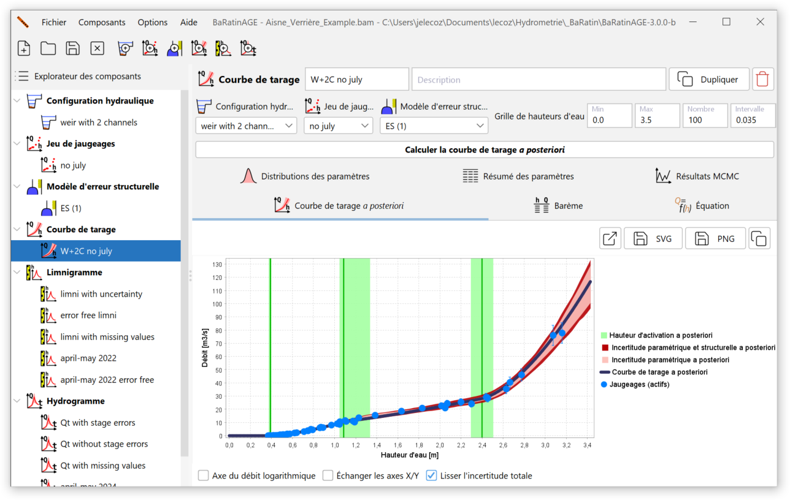

# Organisation générale

La fenêtre représentée ci-dessous apparaît au démarrage de BaRatinAGE v3 :

Outre les classiques barres de menus et d'outils (dont le fonctionnement sera détaillé ultérieurement), cette fenêtre comporte plusieurs zones principales :

-   A gauche, l'*explorateur des composants* qui permettra de naviguer parmi les différents composants créés dans BaRatinAGE : configurations hydrauliques, jeux de jaugeages, modèles d'erreur structurelle, courbe de tarage, limnigramme et hydrogramme.
-   A droite, de haut en bas :
    -   le *panneau descriptif du composant* sélectionné dans l'explorateur ;
    -   les *onglets thématiques du composant* ;
    -   la *zone de saisie, de calculs et de graphiques* correspondant à l'onglet thématique sélectionné.

Dans BaRatinAGE au démarrage, un composant de chaque type pré-existe, avec des champs vierges ou renseignés par défaut.

Pour illustrer plus efficacement le fonctionnement de BaRatinAGE, nous allons ouvrir une étude pré-enregistrée. Pour ce faire, cliquez sur l'outil  *Ouvrir un projet...* ou dans le menu *Fichier...Ouvrir un projet...* (Ctrl+O), et ouvrez le fichier nommé *Aisne_Verrieres_Example.bam* dans le répertoire *example* (ce répertoire est situé dans le dossier où vous avez installé BaRatinAGE).

# Navigation dans l'interface graphique

La fenêtre principale devrait à présent comporter plusieurs composants comme illustré dans la figure ci-dessous. La logique de l'interface graphique est d'utiliser l'*explorateur des composants* pour naviguer dans BaRatinAGE. Un clic gauche permet de sélectionner un composant, ce qui met automatiquement à jour les panneaux situés à droite. Un clic droit donne accès à un certain nombre d'outils (détaillés ultérieurement).

Notez également que les info-bulles sont omniprésentes dans l'application. N'hésitez pas à les consulter car elles fournissent souvent des indications plus détaillées que le nom des champs, boutons, etc.

Le *panneau descriptif du composant* rappelle le type de composant sélectionné (icône et nom), son nom et sa description (texte libre). Il comporte en outre les boutons *Dupliquer* et *Supprimer* le composant.

Les *onglets thématiques du composant* sont spécifiques au composant considéré : ils seront décrits dans les pages suivantes de cette documentation, qui détaillent ces composants un par un.

Il en va de même des *zones de saisie, de calculs et de graphiques* associées. Signalons les fonctionnalités suivantes de la zone graphique elle-même :

-   On peut effectuer un zoom avec la souris en maintenant le clic gauche appuyé et en dessinant un rectangle depuis le coin supérieur gauche vers le coin inférieur droit. Pour revenir aux axes initiaux, on procède de manière similaire mais en dessinant le rectangle depuis le coin inférieur droit vers le coin supérieur gauche ;
-   Le clic droit sur le graphique donne accès à un menu permettant les actions suivantes (également disponibles via des boutons situés au-dessus de la figure) :
    -   Tracer la figure dans une fenêtre extérieure ; 
    -   Exporter l'image au format vectoriel SVG ;
    -   Exporter l'image au format PNG ;
    -   copier dans le presse-papier.
    

# Menus et actions sur les composants

## Menu "Fichier"

Ce menu comporte les outils habituels pour ouvrir et sauvegarder une étude, créer une nouvelle étude et fermer l'application. Il n'est possible d'ouvrir qu'une seule étude à la fois, et la logique de BaRatinAGE est qu'une étude corresponde à une station hydrométrique. Pour une étude donnée, il est possible de définir plusieurs configurations hydrauliques, plusieurs jeux de jaugeages, plusieurs courbes de tarage, etc.

## Manipulations de base des composants

Tous les composants de BaRatinAGE peuvent être manipulés avec quelques actions de base, qui sont accessibles via les menus ou par un clic droit dans l'arborescence : 

-   *Créer un nouveau* (également accessible via les boutons de la barre d'outils) : permet de créer un nouvel composant après l'avoir nommé. Les composants étant identifiés par nom dans BaRatinAGE, il n'est pas possible de donner le même nom à deux composants du même type (par exemple deux courbes de tarage, deux configurations hydrauliques, etc.) ;
-   *Dupliquer* : permet de copier les propriétés d'un composant existant dans un nouvel composant (qui sera renommé) ;
-   *Supprimer* : permet d'effacer un composant existant. 

Note : en cas de modification ou de suppression d'un composant ayant été utilisé pour calculer des résultats, un message d'avertissement propose à l'utilisateur de conserver ou de mettre à jour ces résultats. Par exemple, lorsqu'on modifie ou supprime un jeu de jaugeages, ce message sera émis pour toutes les courbes de tarage qui ont utilisé ces jaugeages, et donc également pour tous les hydrogrammes qui ont utilisé ces courbes de tarage.

Les onglets thématiques de certains composants proposent également des tableaux de résultats sous divers formats, qui peuvent être copiés ou exportés.
.

## Menu "Options"

Ce menu permet de modifier les options suivantes :

-   *changer de langue* : langue de BaRatinAGE (27 langues disponibles à ce jour, n'hésitez pas à en ajouter !).

<!--- Options à venir, développements en cours :

-   *Préférences* : choix entre plusieurs coutumes régionales (choix entre les coefficients de Strickler ou de Manning, choix du système d'unités, etc.) ;
-   *Répertoire par défaut* : définit le répertoire par défaut qui sera proposé pour toutes les actions de sauvegarde, export, ouverture de fichiers, etc. (par défaut, ce répertoire est le dossier dans lequel est installé BaRatinAGE) ;
-   *Options MCMC* : permet de régler les propriétés de l'échantillonneur MCMC ([détails techniques](/fr/doc/topics/mcmc)).
-   *Options de sauvegarde* : permet d'activer ou de désactiver la sauvegarde de certains composants pouvant être très volumineux. L'activation de cette sauvegarde peut générer des fichiers extrêmement volumineux (potentiellement plusieurs Go !) et ralentir notablement les actions d'ouverture et de sauvegarde.
-->