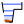
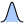

# Overview

The hydraulic configuration is the definition of all the controls that govern the physical stage-discharge relation, and their succession/combination as the water level increases. It plays a vital role in an analysis with BaRatinAGE because it determines the equation that will be used for the rating curve.

The specification of a hydraulic configuration must result from a hydraulic analysis of the operation of the hydrometric station. For a natural river, for example, the following situation is frequently encountered: at low flows, the stage-discharge relation is controlled by the geometry of a critical cross-section at one or more weirs (natural or artificial). When the water level rises, all the weirs get submerged and the stage-discharge relation is then controlled by the average geometry and roughness of the low-flow channel (or main channel). For an even greater water level, part of the flow may take place in a floodway or over the banks of the main channel: the stage-discharge relation is then controlled by two channels, the low-flow channel and the floodway.

BaRatinAGE formalises this hydraulic analysis for a wide variety of situations, which cover the vast majority of practical cases encountered in natural rivers (while making a few acceptable approximations).
The recommended practice in BaRatinAGE is to break down the real critical cross-sections into a combination of idealised weirs or orifices, and the real controlling channels into a combination of wide, rectangular channels. Each control introduced must correspond to physical elements that can be clearly identified in the field. For details on the hydraulic analysis of a hydrometric station, you may refer to [this document](/en/doc/topics/hydraulic-analysis).

# Creating a hydraulic configuration

By default, a blank hydraulic configuration named *HC (1)* pre-exists and can be used. There are several ways of creating a new hydraulic configuration:

- via the menu *Components... Create new hydraulic configuration*;
- by right-clicking on the  *Hydraulic configuration* node in the explorer tree;
- by clicking on the  button in the toolbar.

You will be able to rename this new hydraulic configuration and enter a description. An existing hydraulic configuration can be duplicated or deleted.

In the  *Control matrix* tab, you must specify the number of hydraulic controls that make up this configuration, and how they activate or deactivate for each stage segment. By way of illustration, we will work on the classic example mentioned above, valid for the example of the Aisne River at Verrières, and create 3 controls (weir, low-flow channel, floodway):

The matrix that appears, known as the "matrix of controls" or "Bonnifait matrix' (in honour of its venerable inventor), determines the way in which the controls follow on from or add to each other. Each row of the matrix corresponds to a stage segment, and each column to a hydraulic control. The matrix above can therefore be interpreted as follows:

- For segment 1 (the lowest stages, i.e. low flows), only control 1 (the weir) is activated;
- For segment 2 (intermediate stages), only control 2 (the low-flow channel) is activated;
- For segment 3 (the highest stages, i.e. high flows), only control 3 (the floodway) is activated.

This matrix is not appropriate for the example considered here. In fact, for the third segment, the flow takes place in both the low-flow channel and the floodway. The control by the floodway should therefore be added to the control by the low-flow channel (instead of replacing it). We can specify this combination of controls by selecting, for the third segment, both control 2 ("low-flow channel") and control 3 ("floodway") as shown below:

It is possible to reverse the display of the control matrix, by unchecking the *Invert segments order* box, so that the lowest water segment appears at the bottom, and the highest water segment appears at the top:

Note 1: There are some restrictions on filling the control matrix (for example, a control that has been deactivated cannot reactivate on a higher segment, etc.), which explains why not all the boxes in the matrix are clickable.

Note 2: The information contained in the control matrix is sufficient to write the equation for the rating curve. For more details on this equation, please consult [this document](/en/doc/topics/rating-curve).

# Specification of hydraulic controls

The hydraulic analysis not only allows us to identify the different types of controls that govern the stage-discharge relation, as well as their succession/combination: it also allows an initial quantitative estimate (albeit potentially very uncertain) of the rating curve.

In BaRatinAGE, each control is associated with a stage ($H$) - discharge ($Q$) relation in the form of the basic equation:

$Q = a(H-b)^c$ for $H > \kappa$ (and $Q = 0$ if $H \leq b$)

- $\kappa$ is the *activation stage*; when the water level falls below the value $k$, the control becomes inactive;
- $a$ is the *coefficient*, which depends on the physical properties of the control;
- $c$ is the *exponent*, which depends solely on the type of control;
- $b$ is the *offset*; when stage falls below the value $b$, discharge is zero. Note that this parameter is generally different from the activation stage $\kappa$. For example, for a channel control following a section control, parameter $b$ rthe average elevation of the channel bottom, but the control only activates when the weir is drowned, at a stage $\kappa$ which is different from $b$.

Each of these parameters can be related to physical characteristics of the control, as explained in detail in [this document](/en/doc/topics/hydraulic-controls). It is therefore possible to define approximate values for each parameter, and most importantly their (potentially large) uncertainty. We say we thus define prior parameters, the term prior being used here to mean that this first rough estimation can and must be done without using any gauging. Finally, note that in practice the definition of priors is done only for the parameters $\kappa$, $a$ and $c$. Indeed, the continuity of the rating curve is a constraint which implies that the parameter $b$ is automatically deduced from the other three parameters.

The prior parameters are specified in the  *Prior parameter specification* tab, where each control is associated with a tab. Using the example considered so far, the characteristics of the first control can be specified by entering a description of the control, then selecting its type from the drop-down menu (here,  *Rectangular weir*). The control's hydraulic formula including its physical parameters is displayed to remind you of their link with the $\kappa$, $a$ and $c$ parameters of the rating curve to be estimated.

You can enter uncertain values for the physical parameters in the fields at the top of the window. Some fields are pre-filled because they depend only on the type of control, but you can always change them if you wish. Note that throughout BaRatinAGE, uncertainties are expressed as 95% expanded uncertainties, i.e. as the half-length of a 95% probability interval. For a Gaussian distribution, this corresponds to 1.96 times the standard deviation. Using the example of the Aisne at Verrières, the first control (weir) can be specified as follows:

 
Once the fields for all the physical parameters of a control have been filled in, the values and uncertainties of the parameters $\kappa$, $a$ and $c$ are propagated to the fields at the bottom of the window. It is also possible to directly specify the prior distributions of the $\kappa$, $a$ and $c$ parameters, by clicking on the *Switch to k, a, c parameters mode* button. In this case, unlike the *physical parameters mode*, it is possible to specify a distribution type other than Gaussian (from the choices offered in the drop-down menu), and the parameters of each distribution as well as the initial value that must be specified for the MCMC simulations. You can also select "Fixed value": in this case, the parameter will not be estimated but fixed at the specified value.

 
You can proceed similarly for next control until all the controls have been completed. For the low-flow channel of the Aisne at Verrières:

 
And for the floodway:

 
# The prior rating curve

Once the prior specifications have been carried out for all the controls, it is possible to draw an initial rating curve (with uncertainties), which we call the prior rating curve because it is carried out without the aid of any gauging. The calculation of the prior rating curve uses a Monte Carlo approach: samples of the parameters $\kappa$, $a$ and $c$ of all the controls are generated using the uncertainties or distributions specified in the previous step. By generating a large number of samples, we obtain a large number of possible rating curves, which we use to calculate an uncertainty interval at a given probability level (95% in BaRatinAGE).

At the top of the  *Prior rating curve* tab, you need to specify the parameters of the *stage grid* on which the *prior rating curve* is calculated:
- The minimum stage in the grid (in metres) ;
- The maximum stage in the grid (in metres);
- The number of stage steps (default: 100);
- The stage grid step (in metres).

The last two parameters are calculated automatically if the other three parameters are specified. The calculation time is proportional to the size of the grid, but is generally very short. Once all this information has been entered, you can launch the calculation by clicking on the *Compute prior rating curve* button. The prior rating curve should quickly appear in the graphics panel, as shown below:

The parametric uncertainty (at the 95% probability level) around the *prior rating curve* is displayed in the form of a transparent blue envelope. Obviously, this prior curve will generally be very uncertain, but we will use the gaugings in the next step to reduce this uncertainty. The graph also represents the activation stages $\kappa$ of the various controls as purple vertical lines (with uncertainty). It is possible to transform the discharge axis into a logarithmic scale and swap the X/Y axes. You can open the graph in a new window, export the image in SVG or PNG format, or copy it to the clipboard. This visualization of the prior rating curve allows you to check the relevance and consistency of your prior assumptions about the controls.

# A few tips for specifying priors:

- First golden rule: **do not use the gaugings**. These will indeed be used in the next step, and using them also for "tuning" the prior curve would be using the same information twice: this is a guarantee to underestimate uncertainties! Also note that it is not possible to display gaugings in the prior rating curve graph (and it's done on purpose!);
- Second golden rule: **be honest!** You should not hesitate setting a large uncertainty when you do not know much about a parameter. Of course this will result in a very uncertain prior rating curve, but that curve is not the final curve since the information provided by the gaugings will be used in the next step to decrease the uncertainty. Here are some typical examples:
     - parameters that are often poorly known a priori: the activation stage of a control when it corresponds to the drowning of a weir; the geometric properties of a natural channel that is not very uniform along the controlling reach; the roughness of a natural channel (Strickler or Manning coefficient), etc.;
     -   parameters that are often quite well known a priori: the geometric properties of an artificial structure or channel; the exponent c, which depends only on the type of control; discharge coefficients of artificial controlling sections (rectangle, triangle, orifice, etc.), etc.
