# Généralités

La configuration hydraulique est la définition de l'ensemble des contrôles qui gouvernent la relation physique hauteur-débit, et de leur succession/combinaison lorsque la hauteur d'eau augmente. Elle joue un rôle capital dans une analyse avec BaRatinAGE car elle induit l'équation qui sera utilisée pour la courbe de tarage.

La spécification d'une configuration hydraulique doit résulter d'une analyse hydraulique du fonctionnement de la station hydrométrique. Pour une rivière naturelle, on rencontre par exemple fréquemment la situation suivante : en basses eaux, la relation hauteur-débit est contrôlée par la géométrie d’une section critique au niveau d’un ou plusieurs déversoirs (naturels ou artificiels). Lorsque la hauteur d'eau augmente, le déversoir s'ennoie et la relation hauteur-débit est alors contrôlée par la géométrie et la rugosité moyennes du chenal du lit actif. Pour une hauteur d'eau encore plus importante, une partie de l'écoulement peut s'effectuer dans le lit moyen ou par-dessus les bancs du lit mineur : la relation hauteur-débit est alors contrôlée par deux chenaux, celui du lit actif et celui du lit moyen.

BaRatinAGE permet de formaliser cette analyse hydraulique pour une grande variété de situations, qui couvrent la grande majorité des cas pratiques rencontrés en rivières naturelles (quitte à effectuer quelques approximations acceptables). La pratique recommandée dans BaRatinAGE est de décomposer les sections critiques en déversoirs ou orifices idéalisés, et les chenaux de contrôles en chenaux rectangulaires larges équivalents. Chaque contrôle ainsi introduit doit correspondre à des éléments physiques clairement identifiés sur le terrain. Pour plus de détails sur l'analyse hydraulique d'une station hydrométrique, vous pouvez consulter [ce document](/fr/doc/topics/analyse-hydraulique).

# Création d'une configuration hydraulique

Par défaut, une configuration hydraulique vierge nommée *CH (1)* pré-existe et peut être utilisée. Vous pouvez créer une nouvelle configuration hydraulique de plusieurs façons :

-    via le menu *Composants... Créer une nouvelle configuration hydraulique* ;
-    en effectuant un clic droit sur le noeud 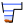 *Configuration hydraulique* dans l'arborescence de l'explorateur ;
-    en cliquant sur le bouton 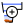 dans la barre d'outils.

Il vous sera possible de renommer cette nouvelle configuration hydraulique et d’en saisir une description. Une configuration hydraulique existante peut être dupliquée ou supprimée.

Dans l'onglet 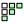 *Matrice des contrôles*, vous devez spécifier le nombre de contrôles hydrauliques qui constituent cette configuration, et la façon dont ils s'activent ou se désactivent pour chaque segment de hauteur d'eau. A titre d'illustration, nous allons travailler sur l'exemple classique mentionné ci-dessus, valable pour l'exemple de l'Aisne à Verrières,  et créons donc 3 contrôles (déversoir, lit actif, lit moyen):

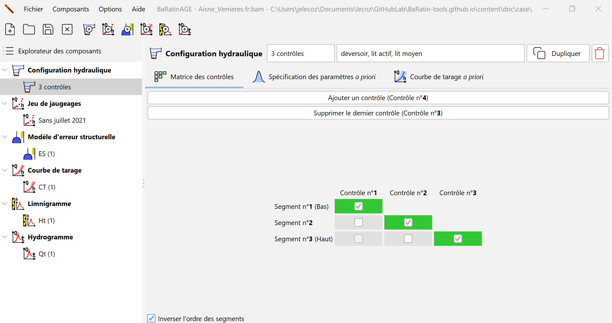

La matrice qui apparaît, nommée "matrice des contrôles" ou "matrice de Bonnifait" (en l'honneur de son vénérable inventeur), détermine la façon dont les contrôles se succèdent ou s'ajoutent les uns aux autres. Chaque ligne de la matrice correspond à un segment de hauteurs, et chaque colonne à un contrôle hydraulique. La matrice ci-dessus s'interprète donc de la façon suivante :

-    Pour le segment 1 (le plus bas, c'est-à-dire les basses eaux), seul le contrôle 1 (le déversoir) est activé ;
-    Pour le segment 2 (les hauteurs intermédiaires), seul le contrôle 2 (le chenal du lit actif) est activé ;
-    Pour le segment 3 (le plus haut, c'est-à-dire les hautes eaux), seul le contrôle 3 (le chenal du lit moyen) est activé.

Cette matrice n'est pas adéquate pour l'exemple considéré ici. En effet, pour le troisième segment, l'écoulement s'effectue à la fois dans le lit actif et dans le lit moyen. Le contrôle par le chenal du lit moyen devrait donc s'ajouter au contrôle par le chenal du lit actif, et non lui succéder. On peut spécifier cette combinaison de contrôles en sélectionnant, pour le troisième segment, à la fois le contrôle 2 ("lit actif") et le contrôle 3 ("lit moyen") comme illustré ci-dessous :

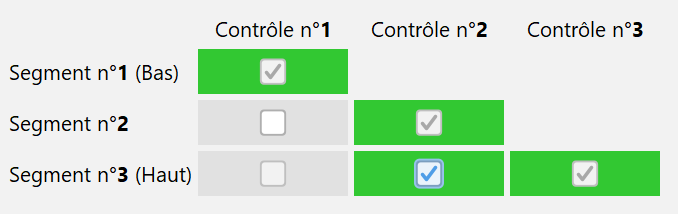

Il est possible de renverser l'affichage de la matrice des contrôles, en décochant la case *Inverser l'ordre des segments*, de façon que le segment des plus basses eaux apparaissent en bas, et celui des plus hautes eaux apparaissent en haut:

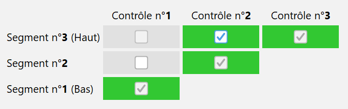

Note 1 : Il existe quelques restrictions sur le remplissage de la matrice des contrôles (par exemple, un contrôle qui a été désactivé ne peut pas se ré-activer sur un segment supérieur, etc.), ce qui explique pourquoi toutes les cases de la matrice ne sont pas cliquables.

Note 2 : L'information contenue dans la matrice des contrôles suffit à écrire l'équation de la courbe de tarage. Pour plus de détails sur cette équation, vous pouvez consulter [ce document](/fr/doc/topics/courbe-de-tarage).

# Spécification des contrôles hydrauliques

L'analyse hydraulique ne permet pas seulement d'identifier les différents types de contrôles qui régissent la relation hauteur-débit, ainsi que leur succession/combinaison : elle permet également une première estimation quantitative (quoique potentiellement très incertaine) de la courbe de tarage.

Dans BaRatinAGE, chaque contrôle est associé à une relation hauteur ($H$) - débit ($Q$) sous la forme de l'équation de base :

$Q = a(H-b)^c$ pour $H > \kappa$ (et $Q = 0$ si $H \leq b$)

-    $\kappa$ est la *hauteur d'activation* ; quand la hauteur d'eau descend sous la valeur $\kappa$, le contrôle devient inactif ;
-    $a$ est le *coefficient*, qui dépend des propriétés physiques du contrôle ;
-    $c$ est l'*exposant*, qui dépend uniquement du type de contrôle ;
-    $b$ est l'*offset* ; quand la hauteur d'eau descend sous la valeur $b$, le débit est nul. Notez que ce paramètre est en général différent de la hauteur d'activation $\kappa$. A titre d'exemple, pour un contrôle par chenal qui succède à un contrôle par déversoir, le paramètre $b$ représente la cote moyenne du fond du lit, mais le contrôle ne s'active qu'au-delà de la hauteur $\kappa$ d'ennoiement du déversoir, qui est différente de $b$.

Chacun de ces paramètres peut être relié à des caractéristiques physiques du contrôle, comme expliqué en détail dans [ce document](/fr/doc/topics/controles-hydrauliques). Il est donc possible de spécifier des valeurs pour chaque paramètre, ces valeurs étant assorties d'une incertitude (potentiellement importante). On parle de spécification des paramètres a priori, le terme a priori étant utilisé ici pour signifier que cette première estimation grossière peut et même doit se faire sans utiliser aucun jaugeage. Pour finir, précisons qu'en pratique, la spécification des a priori ne se fait que sur les paramètres $\kappa$, $a$ et $c$. En effet, la continuité de la courbe de tarage impose une contrainte qui implique que le paramètre $b$ se déduit automatiquement des trois autres paramètres.

La spécification des paramètres a priori se fait dans l'onglet  *Spécification des paramètres a priori*, où chaque contrôle est associé à un onglet. En reprenant l'exemple considéré jusqu'ici, on peut spécifier les caractéristiques du premier contrôle en saisissant une description du contrôle, puis en sélectionnant son type dans le menu déroulant (ici, 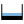 *Déversoir rectangulaire*). La formule hydraulique du contrôle comportant ses paramètres physiques est affichée pour rappeler leur lien avec les paramètres $\kappa$, $a$ et $c$ de la courbe de tarage à estimer.

Vous pouvez renseigner les valeurs incertaines des paramètres physiques dans les champs situés dans la partie haute de la fenêtre. Certains champs sont pré-remplis car ils ne dépendent que du type de contrôle, mais vous pouvez toujours les modifier si vous le souhaitez. Certains paramètres sont même fixés mais vous pouvez libérer leurs valeurs en décochant la case située à droite de leur champ.Notez que partout dans BaRatinAGE, les incertitudes sont exprimées sous la forme d’incertitudes élargies à 95%, c'est-à-dire comme la demi-longueur d'un intervalle de confiance à 95%. Pour une distribution gaussienne, cela correspond à 1.96 fois l'écart-type. En reprenant l'exemple de l'Aisne à Verrières, le premier contrôle (déversoir) peut être spécifié ainsi :

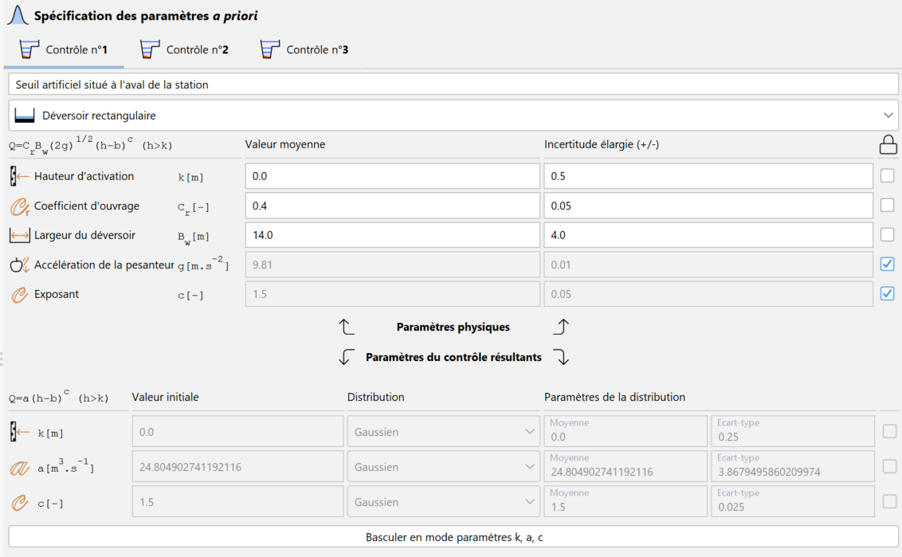
 
Une fois les champs de tous les paramètres physiques d'un contrôle renseignés, les valeurs et incertitudes des paramètres $\kappa$, $a$ et $c$ sont propagées dans les champs situés dans la partie basse de la fenêtre. Il est également possible de spécifier directement les distributions a priori des paramètres $\kappa$, $a$ et $c$, en cliquant sur le bouton *Basculer en mode paramètres k, a, c*. Dans ce cas, contrairement au *mode paramètres physiques*, il est possible de spécifier un type de distribution autre que gaussien (parmi les choix proposés dans le menu déroulant), et il faut spécifier les paramètres de chaque distribution ainsi que la valeur initiale pour les simulations MCMC. On peut également sélectionner "Valeur fixe" : dans ce cas, le paramètre ne sera pas estimé mais fixé à la valeur spécifiée.

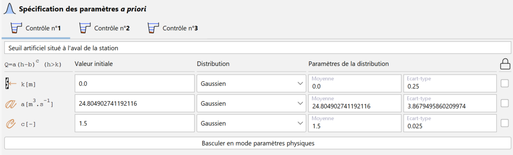
 
Vous pouvez passer au second contrôle en procédant de façon similaire, jusqu'à ce que tous les contrôles soient renseignés, pour le lit mineur :

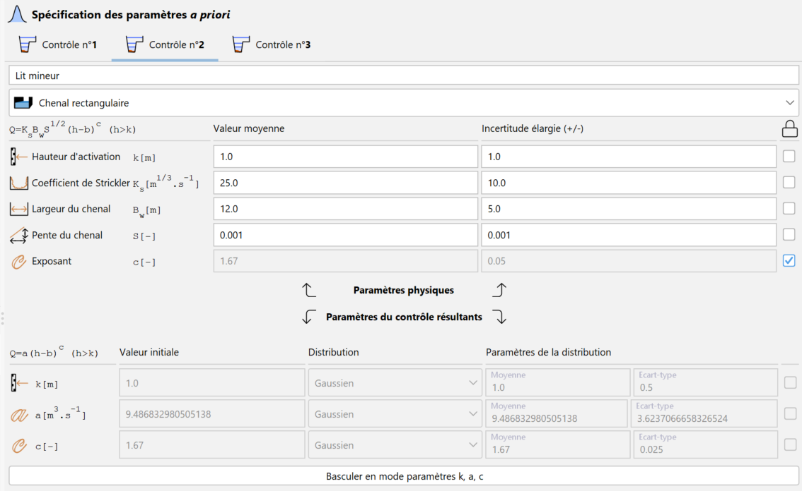
 
Et pour le lit moyen :

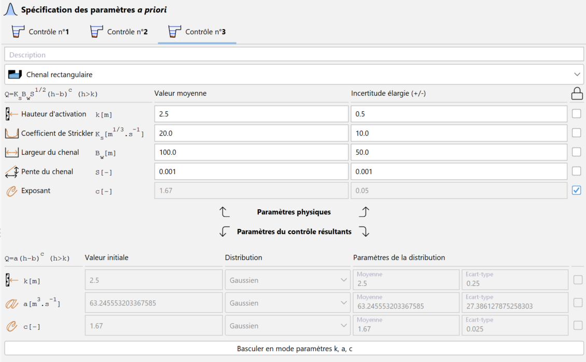

 
# La courbe de tarage a priori

Une fois les spécifications a priori réalisées pour tous les contrôles, il est possible de tracer une première courbe de tarage (avec incertitudes), que nous nommons la courbe de tarage a priori car elle est réalisée sans l'aide d'aucun jaugeage. Le calcul de la courbe de tarage a priori utilise une approche Monte Carlo : les paramètres $\kappa$, $a$ et $c$ de tous les contrôles sont tirés au hasard en utilisant les incertitudes ou distributions spécifiées à l'étape précédente. En réalisant un grand nombre de tirages, on obtient un grand nombre de courbes possibles, que l'on utilise pour calculer un intervalle d'incertitude à un niveau de confiance donné (95% dans BaRatinAGE).

En haut de l'onglet  *Courbe de tarage a priori*, vous devez spécifier les paramètres de la *Grille de hauteurs d'eau* sur laquelle la courbe de tarage *a priori* est calculée :
-    La hauteur d'eau minimale de la grille (en mètres) ;
-    La hauteur d'eau maximale de la grille (en mètres) ;
-    Le nombre de pas de la grille (par défaut égal à 100) ;
-    Le pas de la grille (en mètres).

Les deux derniers paramètres sont calculés automatiquement si les trois autres paramètres sont renseignés. Le temps de calcul est proportionnel à la taille de la grille, mais il est généralement très bref. Une fois toutes ces informations renseignées, vous pouvez lancer le calcul en cliquant sur le bouton *Calculer la courbe de tarage a priori*, la courbe de tarage a priori devant rapidement apparaître dans le panneau graphique, comme illustré ci-dessous:

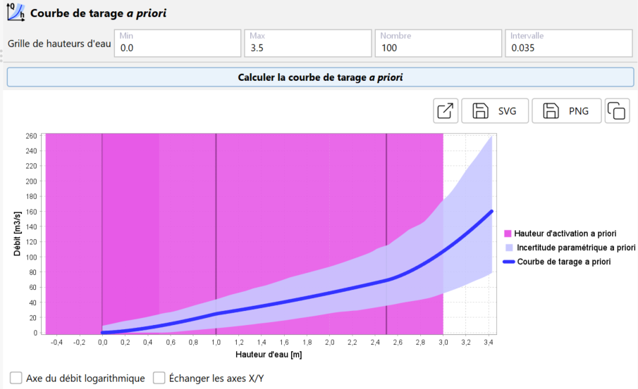

L'incertitude paramétrique (au niveau de probabilité de 95%) autour de la courbe de tarage *a priori* est affichée sous la forme d'une enveloppe transparente bleue. Evidemment, cette courbe a priori sera généralement très incertaine, mais nous utiliserons les jaugeages à l'étape suivante pour diminuer cette incertitude. Le graphique représente également les hauteurs d'activation $\kappa$ des différents contrôles comme des traits verticaux violets (avec incertitude). Il est possible de transformer l'axe des débits en échelle logarithmique et d'échanger les axes X/Y. Il est possible d'ouvrir le graphique dans une nouvelle fenêtre, d'exporter l'image au format SVG ou PNG, ou encore de la copier dans le presse-papier. Cette visualisation de la courbe a priori vous permet de vérifier la pertinence et la cohérence de vos hypothèses a priori sur les contrôles.

# Quelques conseils pour la spécification des a priori :

-    Première règle d'or: **ne pas utiliser les jaugeages**. Ceux-ci seront en effet utilisés à la prochaine étape, et les utiliser également pour "caler" la courbe a priori reviendrait à utiliser deux fois la même information: c'est la garantie de sous-estimer les incertitudes! Remarquons d'ailleurs qu'il n'est pas possible d'afficher des jaugeages dans le graphique de la courbe de tarage a priori (et c'est volontaire !);
-    Seconde règle d'or : **être honnête !** Il ne faut surtout pas hésiter à mettre de grandes incertitudes lorsqu'on ne sait pas grand-chose sur un paramètre. Evidemment cela résultera en une courbe de tarage a priori très incertaine, mais cette courbe n'est pas la courbe finale puisque l'information apportée par les jaugeages sera utilisée lors de la prochaine étape pour diminuer l'incertitude. Voici quelques exemples typiques :
     -   paramètres souvent mal connus a priori : la hauteur d'activation d'un contrôle lorsque celle-ci correspond à l'ennoiement d'un déversoir ; les propriétés géométriques d'un chenal qui n'est pas très homogène le long du tronçon de contrôle ; la rugosité d'un chenal naturel (coefficient de Strickler ou de Manning), etc.;
     -   paramètres souvent bien connus a priori : les propriétés géométriques d'un déversoir ou d'un chenal artificiels ; l'exposant c, qui ne dépend que du type de contrôle; les coefficients d'ouvrage pour les sections de contrôle artificielles (rectangle, triangle, orifice, etc.), etc.

