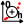

# Creating a set of gaugings

A gauging is a pair of simultaneous point measurements of stage (water level) and discharge, together with their uncertainties.

By default, a blank set of gaugings called *GS (1)* pre-exists and can be used. You can create a new set of gaugings in several ways:

- via the menu *Components...Create new set of gaugings*;
- by right-clicking on the  *Gaugings* node in the Component Explorer tree;
- by clicking on the  button in the toolbar.

You will be able to rename this new set of gaugings and enter a description.  An existing set of gaugings can be duplicated or deleted.

All that remains is to import the gaugings file by clicking on the *Import a set of gaugings* button, selecting the text file of your choice and specifying its format. The gaugings file is a free-format text file, but must contain at least three columns with the following data:

- Stage expressed in metres;
- Discharge expressed in cubic metres per second;
- Expanded uncertainty of the measured discharge, expressed as a percentage of this discharge.

Details of how to specify the uncertainty of gaugings are given in [this document](/en/doc/topics/gaugings).

As an example, you can select the *gauging_set.csv* file in the *example* directory, which contains 58 gaugings for the Aisne at Verrières, specifying the following import parameters:

The panel is then updated as follows, after deactivating the penultimate gauging:

The gaugings table contains the following columns:

- Stage expressed in metres;
- Discharge expressed in cubic metres per second;
- Expanded uncertainty of the measured discharge, expressed as a percentage of this discharge;
- Gauging status: if the box is unchecked, the gauging will be "inactive", i.e. it will not be used to estimate the rating curve.

The set of gaugings can be exported in CSV format or copied to the clipboard. You can also open the gaugings graphic in a new window, export the image in SVG or PNG format, or copy it to the clipboard.

# Managing gaugings in BaRatinAGE

At present, the management of gaugings is rudimentary in BaRatinAGE: the only modification possible is the activation/deactivation of a gauging. If you want to change a value or add a gauging, you have to modify the source file. The reason for this is that there are already hydrometric software packages dedicated to the management of gaugings (Barème, Jacinthe in particular), and we feel it is preferable to promote compatibility with these packages rather than re-invent the wheel. Nevertheless, we will be implementing a few simple tools in future versions of BaRatinAGE (entering and modifying gaugings, including dates and gauging methods, basic filters, etc.).

