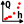
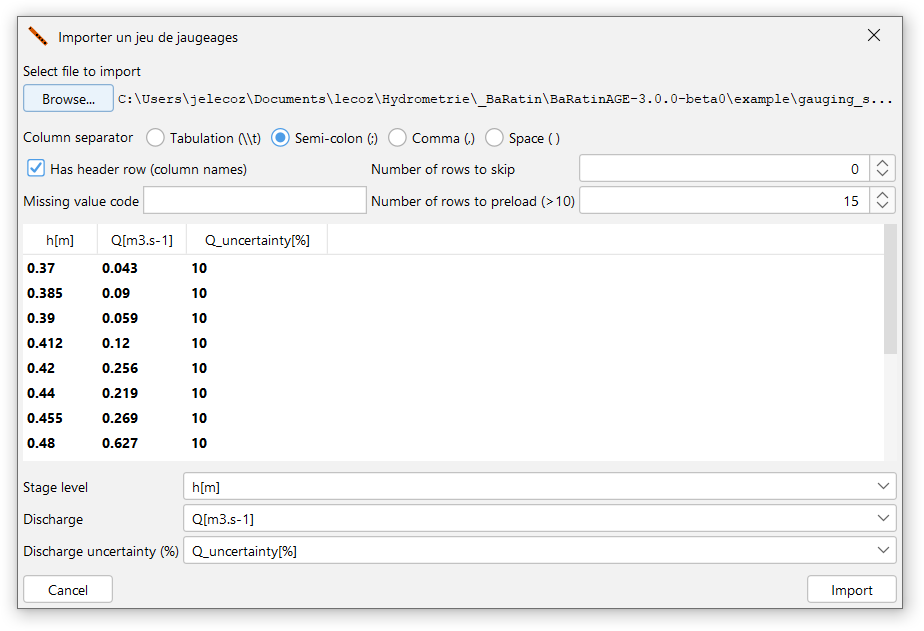
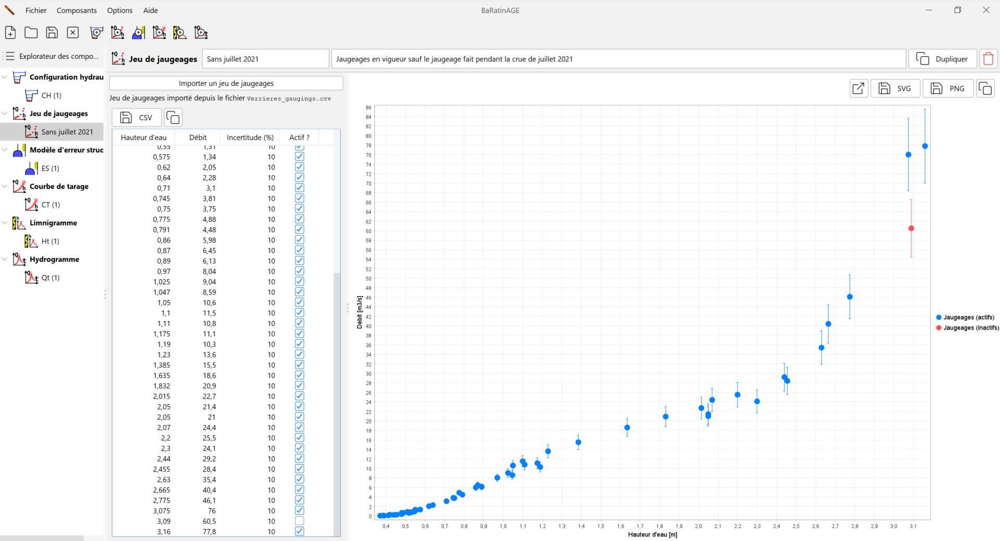

# Création d'un jeu de jaugeages

Un jaugeage est un couple de mesures ponctuelles de hauteur d'eau et débit simultanés, assortis de leurs incertitudes.

Par défaut, un jeu de jaugeages vierge nommé *JJ (1)* pré-existe et peut être utilisé. Vous pouvez créer un nouveau jeu de jaugeages de plusieurs façons :

-   via le menu *Composants...Créer un nouveau jeu de jaugeages* ;
-   en effectuant un clic droit sur le noeud  *Jeu de jaugeages* dans l'arborescence de l'Explorateur des composants ;
-   en cliquant sur le bouton  dans la barre d'outils.

Il vous sera possible de renommer ce nouveau jeu de jaugeages et d'en saisir une description.  Un jeu de jaugeages existant peut être dupliqué ou supprimé.

Il ne vous reste plus qu'à importer le fichier de jaugeages en cliquant sur le bouton *Importer un jeu de jaugeages*, en sélectionnant le fichier texte de votre choix, et en en spécifiant le format. Le fichier de jaugeage est un fichier texte de format libre mais devant comporter au moins trois colonnes avec les données suivantes :

-   Hauteur d'eau exprimée en mètres ;
-   Débit exprimé en mètres cubes par seconde ;
-   Incertitude élargie du débit jaugé, exprimée en pourcentage de ce débit.

Des détails sur la spécification des incertitudes des jaugeages sont donnés dans [ce document](/fr/doc/topics/jaugeages).

A titre d'exemple, vous pouvez sélectionner le fichier *gauging_set.csv* dans le répertoire *example*, qui contient 58 jaugeages pour l'Aisne à Verrières, en spécifiant les paramètres d'import suivants :

Le panneau se met alors à jour comme ceci, après avoir désactivé l'avant-dernier jaugeage :

Le tableau des jaugeages contient les colonnes suivantes :

-   Hauteur d'eau exprimée en mètres ;
-   Débit exprimé en mètres cubes par seconde ;
-   Incertitude élargie du débit jaugé, exprimée en pourcentage de ce débit ;
-   Statut du jaugeage : si la case est décochée, le jaugeage sera "inactif", c'est-à-dire qu'il ne sera pas utilisé pour l'estimation de la courbe de tarage.

Il est possible d'exporter le jeu de jaugeages au format CSV ou de le copier dans le presse-papier. Il est également possible d'ouvrir le graphique du jeu de jaugeages dans une nouvelle fenêtre, d'exporter l'image au format SVG ou PNG, ou encore de la copier dans le presse-papier.

# Gestion des jaugeages dans BaRatinAGE

A l'heure actuelle, la gestion des jaugeages est rudimentaire dans BaRatinAGE : la seule modification possible est l'activation/désactivation d'un jaugeage. Si vous souhaitez modifier une valeur ou ajouter un jaugeage, vous devez modifier le fichier source. La raison est qu'il existe déjà des logiciels spécialisés dans la gestion des jaugeages (Barème, Jacinthe en particulier), et qu'il nous semble préférable de favoriser la compatibilité avec ces logiciels plutôt que de ré-inventer la roue. Néanmoins, nous implémenterons quelques outils simples dans les futures versions de BaRatinAGE (saisie et modification des jaugeages, inclusion des dates et des méthodes de jaugeages, filtres élémentaires).