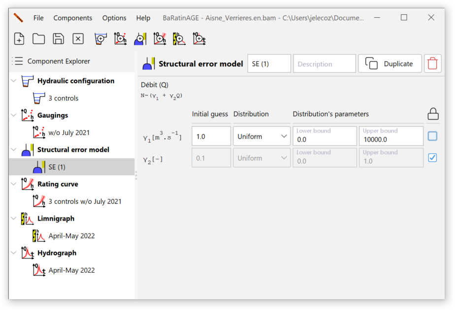

# Overview

Consider the following situation, which is obviously idealised and unrealistic: at a hydrometric station, we have perfect gaugings (i.e. zero uncertainty), and many of them. Accordingly, it is possible to estimate precisely the parameters of the rating curve, and thus the uncertainty surrounding the rating curve is very low - say it is even negligible for simplicity. Nevertheless, we still expect the gaugings do not line up perfectly with the rating curve. There is therefore always a scatter of the gaugings around the curve which is due neither to uncertainty in gaugings (which is zero), nor to uncertainty in calibration of the rating curve (which is negligible).

More generally, it is frequently observed that the uncertainties of gaugings and the uncertainty in estimating the parameters of the curve are not sufficient to explain the scatter of discharge measurements around the curve. It therefore "remains" a source of error, which has many possible causes: structural error of the rating curve (because the rating curve equation used is an approximation of the true physical relationship between stage and discharge), slight undetected shifts, ignored hysteresis, underestimated gaugings uncertainties, etc.

To address this problem, BaRatinAGE introduces the concept of remnant error, which will be called *structural error* to simplify interpretation. This structural error is used to add the uncertainty lacking to explain the scatter of the gaugings around the rating curve, without really assessing the origin of such missing uncertainty. This is somehow the uncertainty garbage collector (hence the icon used: ).

# Creating a structural error model

By default, a blank structural error model named *SE (1)* pre-exists and can be used. There are several ways of creating a structural error model:

- via the *Components...Create new structural error model* menu;
- by right-clicking on the  *Structural error model* node in the explorer tree;
- by clicking on the  button in the toolbar.

You will be able to rename this new structural error model and enter a description. An existing structural error model can be duplicated or deleted.

# Models available in BaRatinAGE

The *structural error* is assumed to be independent from one gauging to the next, Gaussian, with zero mean, and unknown standard deviation $\sigma$. This standard deviation will therefore be estimated along with the rating curve parameters. Several options for this unknown standard deviation were studied:

- The standard deviation is constant, so there is a single additional parameter to estimate. Experience shows that this assumption is not very well suited to the cases typically encountered in practice. More specifically, it is frequently observed that the standard deviation is greater for high discharges.
- To take account of this observation, the second option is to assume that the standard deviation $\sigma$ is a linear function of the discharge calculated using the rating curve: $\sigma = \gamma_1 + \gamma_2 \ Q$. In this case, there are two parameters to estimate, $\gamma_1$ and $\gamma_2$. 
- The third option is a purely proportional version of the previous option: $\sigma = \gamma_2 \ Q$.

In practice, we recommend using the second option ($\sigma = \gamma_1 + \gamma_2 \ Q$), as it generally distributes the *structural error* over the whole discharge range in a realistic way. For the moment, only this model of *structural error* is implemented in BaRatinAGE v3 (the other two will certainly be implemented in future versions of the software). By default, uniform distributions are chosen for the parameters $\gamma_1$ and $\gamma_2$ :

If you unlock the fields, you can specify the distributions of the $\gamma_1$ and $\gamma_2$ parameters yourself. For example, the default upper limit (10000 m$^3$/s) for the uniform distribution of $\gamma_1$ may not necessarily be well suited to the order of magnitude of the highest discharges recorded at the hydrometric station. It may therefore be useful to increase or decrease it. You can also select "Fixed value": in this case, the parameter will not be estimated but fixed at the specified value.

A more formal and complete description of *structural error models*, and more generally of the statistical models used in BaRatinAGE, is available in [this document](/en/doc/topics/statistical-model).
