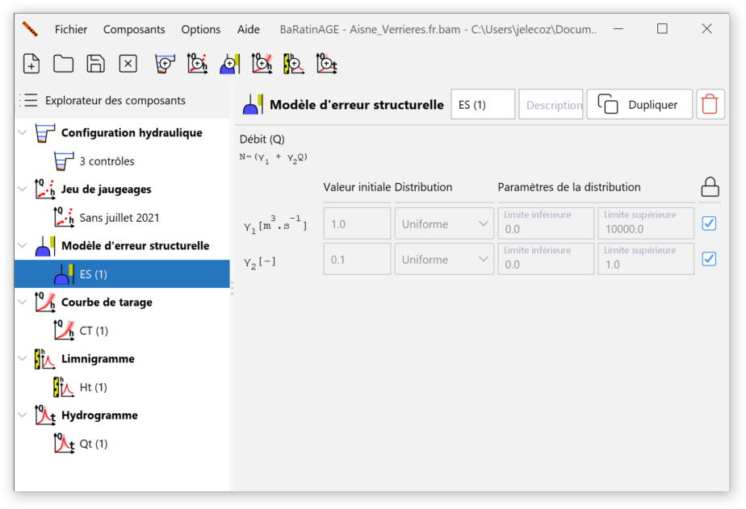

# Généralités

Imaginons la situation suivante, qui est idéalisée et donc forcément irréaliste : sur une station hydrométrique, nous disposons de jaugeages parfaits (sans aucune incertitude), et en très grand nombre. En conséquence, il est possible d'estimer très précisément les paramètres de la courbe de tarage, et donc l'incertitude autour de la courbe de tarage est très faible - disons qu'elle est même négligeable pour simplifier. Malgré tout, on s'attend toujours à ce que les jaugeages ne s'alignent pas parfaitement sur la courbe de tarage. Il existe donc toujours une dispersion des jaugeages autour de la courbe qui n'est due ni à l'incertitude des jaugeages (qui est nulle), ni à celle du calage des paramètres de la courbe (qui est négligeable).

Plus généralement, on observe fréquemment que les incertitudes des jaugeages et l'incertitude liée à l'estimation des paramètres de la courbe ne suffisent pas à expliquer la dispersion des jaugeages autour de la courbe. Il "reste" donc une source d'erreur, qui a certainement de multiples origines: erreur structurelle de la courbe de tarage (c'est-à-dire le fait que l'équation utilisée n'est qu'une approximation de la vraie relation physique hauteur-débit), légers détarages non détectés, phénomène d'hystérésis ignoré, incertitudes sur les jaugeages sous-estimées, etc.

Pour faire face à ce problème, BaRatinAGE introduit le concept d'erreur restante, qui sera appelée *erreur structurelle* pour simplifier l'interprétation, qui est utilisée pour ajouter l'incertitude qui manque pour expliquer la dispersion des jaugeages autour de la courbe de tarage, sans vraiment préjuger de l'origine de cette incertitude manquante. C'est en quelque sorte le ramasse miettes des incertitudes (d'où l'icône utilisée : ).

# Création d'un modèle d'erreur structurelle

Par défaut, un modèle d'erreur structurelle vierge nommé *ES (1)* pré-existe et peut être utilisé. Vous pouvez créer un modèle d'erreur structurelle de plusieurs façons :

-    via le menu *Composants... Créer un nouveau modèle d'erreur structurelle* ;
-    en effectuant un clic droit sur le noeud  *Modèle d'erreur structurelle* dans l'arborescence de l'explorateur ;
-    en cliquant sur le bouton  dans la barre d'outils.

Il vous sera possible de renommer ce nouveau modèle d'erreur structurelle et d’en saisir une description. Un modèle d'erreur structurelle existant peut être dupliqué ou supprimé.

# Modèles disponibles dans BaRatinAGE

L'*erreur structurelle* est supposée indépendante d'un jaugeage à l'autre, gaussienne, de moyenne nulle, et d'écart-type inconnu $\sigma$. Cet écart-type sera donc estimé en même temps que les paramètres de la courbe de tarage. Plusieurs options pour cet écart-type inconnu ont été étudiées :

-    L'écart-type est constant, il y a donc un unique paramètre supplémentaire à estimer. L'expérience montre que cette hypothèse n'est pas très adaptée aux cas typiquement rencontrés en pratique. Plus précisément, on observe fréquemment que l'écart-type est plus grand pour les forts débits.
-    Pour tenir compte de cette observation, la seconde option est de supposer que l'écart-type $\sigma$ est une fonction affine du débit calculé par la courbe de tarage : $\sigma = \gamma_1 + \gamma_2 \ Q$. Dans ce cas, il y a deux paramètres à estimer, $\gamma_1$ et $\gamma_2$. 
-    La troisième option est une version purement proportionnelle de l'option précédente : $\sigma = \gamma_2 \ Q$.

En pratique, nous recommandons d'utiliser la deuxième option ($\sigma = \gamma_1 + \gamma_2 \ Q$), car elle permet généralement de distribuer l’*erreur structurelle* sur toute la gamme de débit de façon réaliste. Pour l'instant, seul ce modèle d'*erreur structurelle* est implémentée dans BaRatinAGE (les deux autres le seront sans doute dans de futures versions du logiciel). Par défaut, des distributions uniformes sont choisies pour les paramètres $\gamma_1$ et $\gamma_2$ :  

Si on déverrouille les champs, il est possible de spécifier soi-même les distributions des paramètres $\gamma_1$ et $\gamma_2$. Par exemple, la borne supérieure par défaut (10000 m$^3$/s) de la distribution uniforme de $\gamma_1$ peut ne pas être forcément bien adaptée à l'ordre de grandeur des débits les plus forts enregistrés à la station hydrométrique. Il peut alors être utile de l'augmenter ou de la diminuer. On peut également sélectionner "Valeur fixe" : dans ce cas, le paramètre ne sera pas estimé mais fixé à la valeur spécifiée.

Une description plus formelle et plus complète des *modèles d'erreur structurelle*, et plus généralement des modèles statistiques utilisés dans BaRatinAGE, est disponible dans [ce document](/fr/doc/topics/modele-stat).
