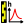

# Creating a stage series

A *stage series* (or stage hydrograph) is a time series of water levels (or stages).

By default, a stage series named *Ht (1)* pre-exists and can be used. There are several ways of creating a new stage series:

- via the menu *Components...Create new stage series*;
- by right-clicking on the  *Stage series* node in the Component Explorer tree;
- by clicking on the  button in the toolbar.

You will be able to rename this new stage series and enter a description.  An existing stage series can be duplicated or deleted.

All that remains is to import the stage series file by clicking on the *Import a stage series* button, selecting the text file of your choice and specifying its format. The stage series file is a free-format text file, but it must contain at least five columns with the following data:

- The date/time, in a format to be specified (*YYYY/MM/DD hh:mm:ss* or a variant);
- The water elevation (or *stage*) recorded, in metres;
- The expanded uncertainty due to non-systematic errors;
- The index of the period with constant systematic error;
- The expanded uncertainty related to the constant systematic error.

The window then updates, displaying the stage series table as well as the graph in the  *Chart* tab:

The table contains the following columns:

- The date, in the format YYYY-MM-DD hh:mm:ss;
- The stage record, in metres;
- The 2.5% quantile, calculated from the uncertainty information;
- The 97.5% quantile, calculated from the uncertainty information.

In the  *Chart* tab, these quantiles are represented on the graph in the form of a yellow uncertainty envelope around the stage series.

In the  *Stage uncertainty* tab, the imported water level data and uncertainties are presented in the *stage and uncertainty* tab, while the sampled water level values used to establish the quantiles are presented in the *stage time series samples with errors* tab.

In each tab, it is possible to export the values in CSV format or copy them to the clipboard. You can also open the stage series graphic in a new window, export the image in SVG or PNG format, or copy it to the clipboard.

# Notes on stage series management in BaRatinAGE

At present, the stage series cannot be modified directly in BaRatinAGE: you have to create and modify the source file in CSV format yourself. Future versions of BaRatinAGE will offer more advanced tools for managing the stage series and its uncertainties.

In addition, it should be noted that stage series files can become large when the recording time interval is small and/or the duration is long. This can cause a slight slowdown when plotting the graph. This will also be improved in future versions of BaRatinAGE by offering sub-sampling tools.