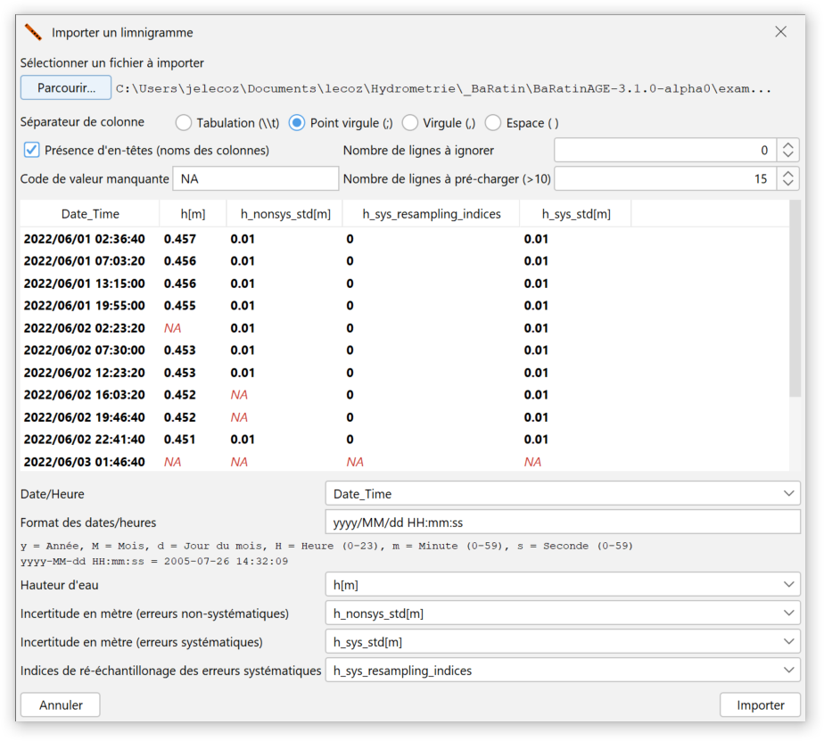
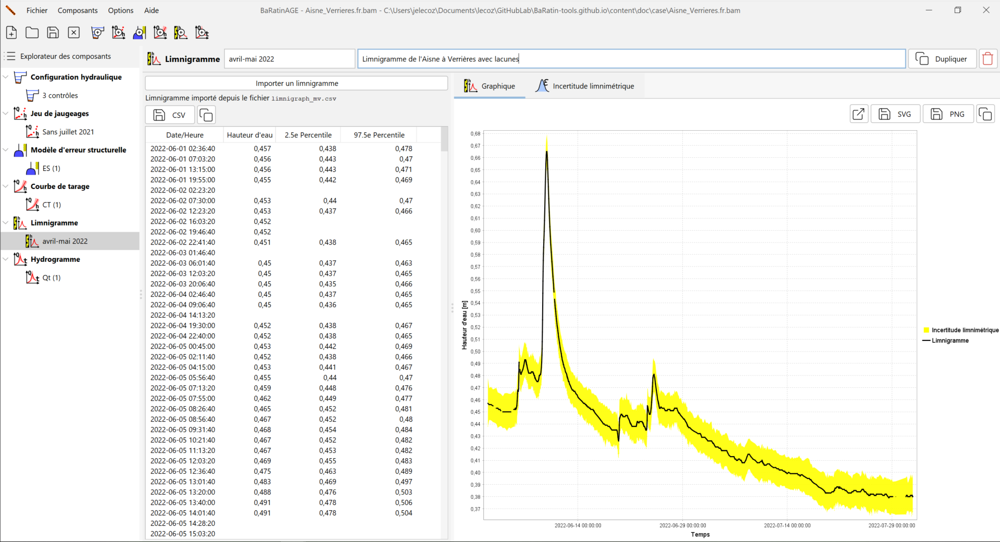

# Création d'un limnigramme

Un limnigramme est une série temporelle de hauteurs d'eau.

Par défaut, un limnigramme nommé *Ht (1)* pré-existe et peut être utilisé. Vous pouvez créer un nouveau limnigramme de plusieurs façons :

-   via le menu *Composants...Créer un nouveau limnigramme* ;
-   en effectuant un clic droit sur le noeud  *Limnigramme* dans l'arborescence de l'Explorateur des composants ;
-   en cliquant sur le bouton  dans la barre d'outils.

Il vous sera possible de renommer ce nouveau limnigramme et d'en saisir une description.  Un limnigramme existant peut être dupliqué ou supprimé.

Il ne vous reste plus qu'à importer le fichier de limnigramme en cliquant sur le bouton *Importer un limnigramme*, en sélectionnant le fichier texte de votre choix, et en en spécifiant le format. Le fichier de limnigramme est un fichier texte de format libre mais devant comporter au moins cinq colonnes avec les données suivantes :

-    La date/heure, à un format à spécifier (*AAAA/MM/JJ hh:mm:ss* ou une variante) ;
-    La hauteur d'eau enregistrée, en mètres ;
-    L'incertitude élargie liée aux erreurs non-systématiques ;
-    L'index de période à erreur systématique constante ;
-    L'ncertitude élargie liée l'erreur systématique constante.

Le traitement des incertitudes sur le limnigramme permet en effet de différencier deux types d'erreurs de mesure des hauteurs d'eau : les erreurs non-systématiques (qui varient à chaque pas de temps) et les erreurs systématiques (qui restent identiques sur un ensemble de pas de temps). Typiquement, les erreurs non-systématiques sont associées au bruit du capteur et au batillage ; les erreurs systématiques sont associées au recalage périodique du capteur par rapport à l'échelle de référence (pour une explication plus détaillée, voir [ce document](/fr/doc/topics/limni)). Ce dernier type d'erreur constitue en fait un biais inconnu, qui est supposé constant entre deux recalages du capteur. Un index de valeur 0 signifie que cette erreur est ignorée. On entrera la valeur 1 sur toutes les lignes correspondant à la première période, puis la valeur 2 pour la seconde période, etc.

A titre d'exemple, vous pouvez sélectionner le fichier *limnigraph_mv.csv* dans le répertoire *example*, qui contient un limnigramme pour l'Aisne à Verrières pour les mois d'avril et mai 2022 (avec des lacunes codées *NA*), en spécifiant les paramètres d'import suivants :

La fenêtre se met alors à jour en affichant le tableau du limnigramme ainsi que le graphique dans l'onglet  *Graphique* :

Le tableau contient les colonnes suivantes :

-    La date, au format AAAA-MM-JJ hh:mm:ss ;
-    La hauteur d'eau enregistrée, en mètres ;
-    Le quantile à 2.5%, calculé à partir des informations d'incertitude ;
-    Le quantile à 97.5%, calculé à partir des informations d'incertitude.

Dans l'onglet  *Graphique*, ces quantiles sont représentés sur le graphique sous la forme d'une enveloppe d'incertitude (jaune) autour du limnigramme.

Dans l'onglet  *Incertitude limnimétrique*, les données de hauteur d'eau et incertitudes importées sont présentées dans l'onglet *Hauteur d'eau et incertitude*, tandis que les valeurs de hauteur d'eau échantillonnées ayant servi à établir les quantiles sont présentées dans l'onglet *Echantillons de limnigrammes avec erreurs*.

Dans chaque onglet, il est possible d'exporter les valeurs au format CSV ou de les copier dans le presse-papier. Il est également possible d'ouvrir le graphique du limnigramme dans une nouvelle fenêtre, d'exporter l'image au format SVG ou PNG, ou encore de la copier dans le presse-papier.

# Remarques sur la gestion du limnigramme dans BaRatinAGE

A l'heure actuelle, le limnigramme ne peut pas être modifié directement dans BaRatinAGE : vous devez créer et modifier vous-même le fichier source au format CSV. Les futures versions de BaRatinAGE proposeront des outils plus développés pour la gestion du limnigramme et de ses incertitudes.

De plus, signalons que les fichiers de limnigramme peuvent devenir volumineux lorsque le pas d'échantillonnage est faible et/ou la durée est longue. Ceci peut créer un léger ralentissement pour le tracé du graphique. Ceci sera également amélioré dans les futures versions de BaRatinAGE en proposant des outils de sous-échantillonnage.
