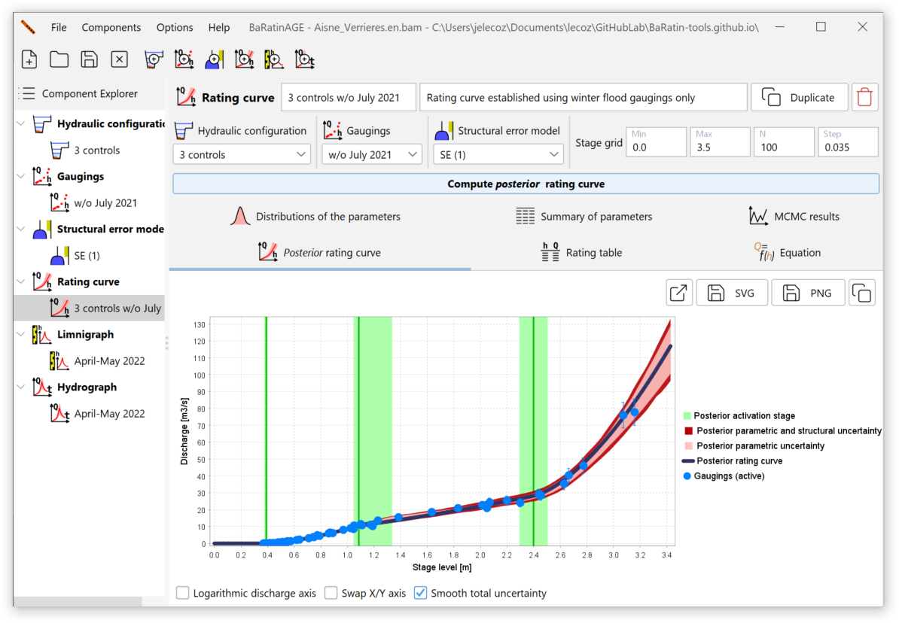
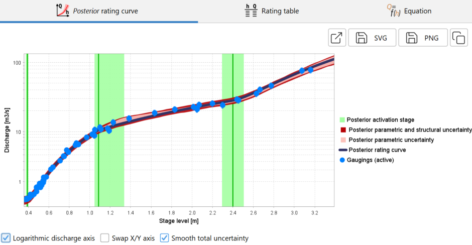
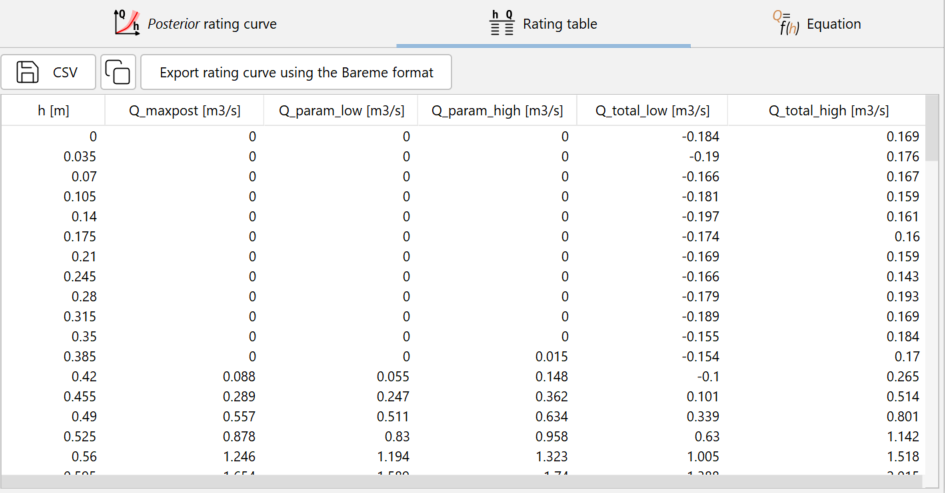
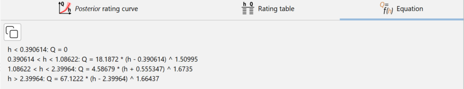
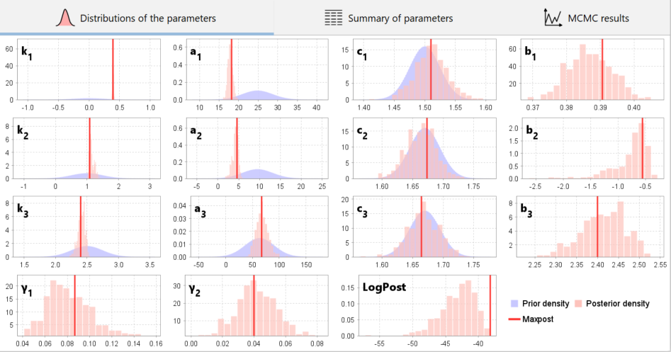
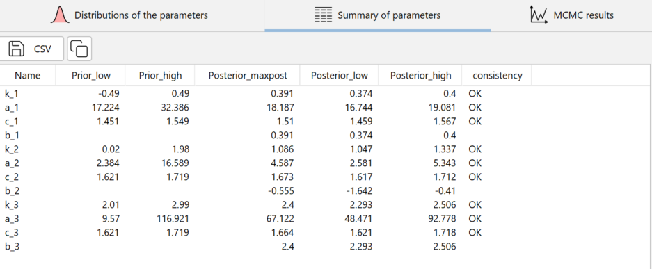
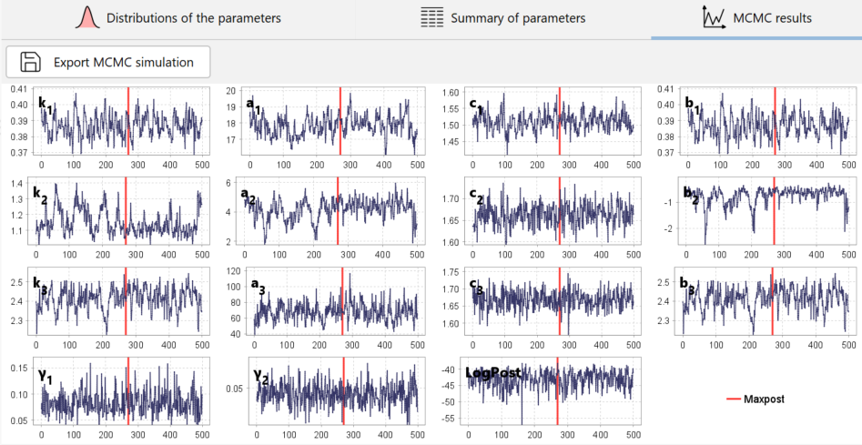

# Creating a rating curve

A rating curve is a function giving discharge as a function of stage.

By default, a blank rating curve called *RC (1)* pre-exists and can be used. There are several ways of creating a new rating curve:

- via the menu *Components...Create new rating curve*;
- by right-clicking on the  *Rating curve* node in the Component Explorer tree;
- by clicking on the  button in the toolbar.

You will be able to rename this new rating curve and enter a description. An existing rating curve can be duplicated or deleted.

The properties of the rating curve are then specified by selecting :

- A hydraulic configuration (which determines the equation of the rating curve and the priors);
- A set of gaugings (used to estimate the rating curve);
- A structural error model (we advise you to keep the default model).

You are now ready to start calculating the rating curve (full details of the underlying statistical models can be found in [this document](/en/doc/topics/statistical-model). In the graphics panel, define a grid of stages as you did for the prior rating curve, then click on the *Compute posterior rating curve* button. After a calculation that should not take more than a few tens of seconds, the panel is updated as follows:

The results are presented in a number of graphs and tables, which are described in the following section.

# Graphs and tables of results

## Posterior rating curve

The graph above shows the *posterior rating curve*. The term "posterior" indicates that this curve was estimated using the gaugings ("after observing them"), as opposed to the *prior rating curve* which did not use any gaugings. On this graph, the green vertical lines represent the activation stages of each control (with their uncertainty envelopes). The rating curve shown in black is the posterior rating curve, or "maxpost rating curve", because it is calculated with the set of parameters that maximises the posterior distribution. Around this posterior rating curve, the interval in light red represents the parametric uncertainty, i.e. the uncertainty linked solely to the estimation of the curve parameters. The dark red area represents the total uncertainty, i.e. the combination of the parametric uncertainty and the uncertainty induced by the structural error. It is recommended that the graph should also be viewed using a logarithmic scale for the discharges, as this often makes it easier to see how the controls fit together over the whole range of stages. In addition, the relative discharge deviations (in %) then appear with the same size whatever the discharge.

You can open the graph of the *posterior rating curve* in a new window, export the image in SVG or PNG format, or copy it to the clipboard.

The table of values for the posterior rating curve and its four uncertainty envelope curves is available in the form of a table:

These curves can be exported in CSV format or copied to the clipboard. By clicking on the button *Export rating curve using the Bareme format*, three rating curves are exported: the *posterior rating curve* (maxpost), and the curves corresponding to the lower and upper bounds of the 95% total uncertainty interval. The exported file can be re-imported and thus manipulated in the Barème hydrometric software.

Finally, the equation for the *posterior rating curve* with the values of the maxpost parameter set can be displayed and copied to the clipboard:

## Comparison of prior and posterior parameters

It is particularly important to check that the parameters estimated a posteriori are consistent with the assumptions made a priori about the hydraulic controls. A conflict between the prior and posterior parameters should be interpreted as a warning about the validity of the rating curve, i.e. the specified hydraulic configuration. Typically, an important control may have been overlooked, forcing the parameters to contort beyond what is physically reasonable to fit the gaugings. The problem may also arise from errors or incorrect assumptions about prior parameter values and/or about the gaugings and their uncertainties.

The graph above shows how prior knowledge of the parameters (distributions in blue) has been transformed into a posterior knowledge (histograms in red) by the information provided by the gaugings.

The same information is also available in table form, with a comparison between the prior and posterior estimates for each parameter of the rating curve, in the form of the lower and upper bounds of their 95% intervals. A consistency test between prior and posterior estimates is displayed for each parameter: an inconsistency is detected for a given parameter if at least 99% of the MCMC samples are greater (or less) than the samples taken from the prior distribution for that parameter. These results can be exported in CSV format or copied to the clipboard.

## MCMC simulations

The MCMC trace graph represents the parameter values simulated from the posterior distribution using the MCMC simulator (full technical details are explained in [this document](/en/doc/topics/mcmc)). Note that the graph only shows 500 simulated values, but in fact 10,000 values were initially generated, the first 5,000 being discarded. These 5,000 initial values were simply decimated and reduced to 500 values to avoid keeping too many simulations. 

In addition to the $\kappa$, $a$, $b$, and $c$ parameters for each control, samples of the $\gamma_1$ and $\gamma_2$ parameters for the standard deviation of the structural error and the logarithm of the posterior density ("LogPost") are also plotted. The position of the maxpost parameter set (maximising the posterior distribution) is indicated by a vertical red line for each parameter. These results can be exported in CSV format.
