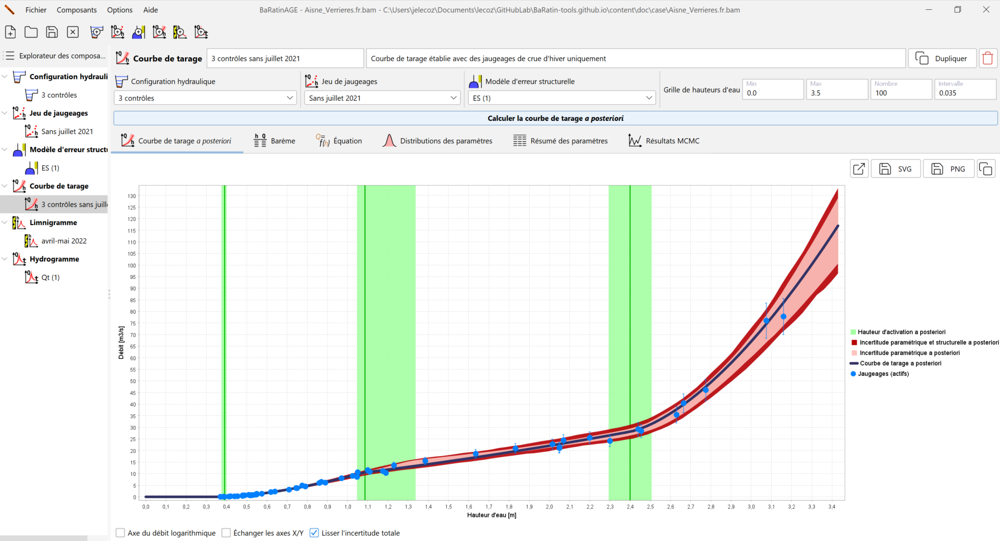
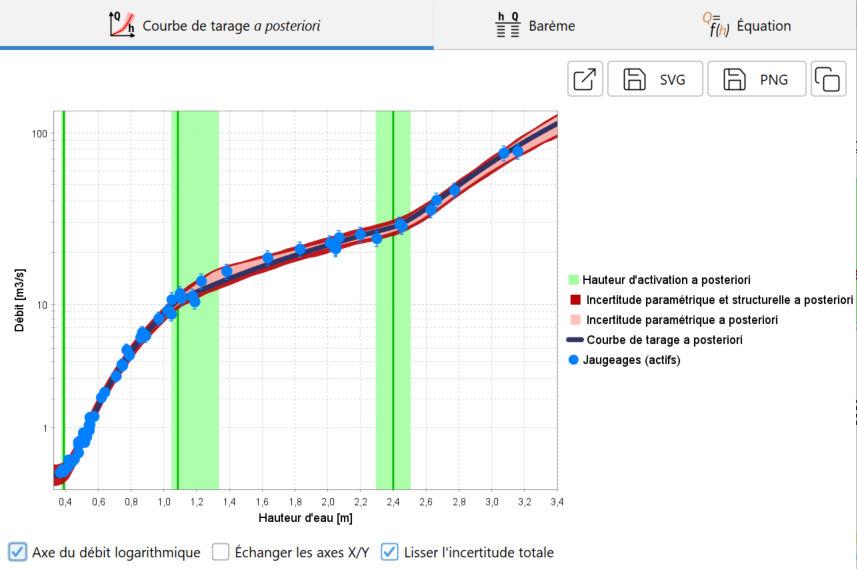
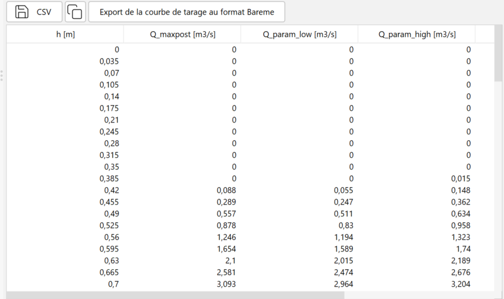
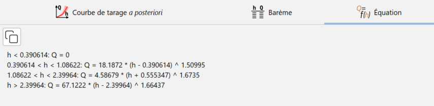
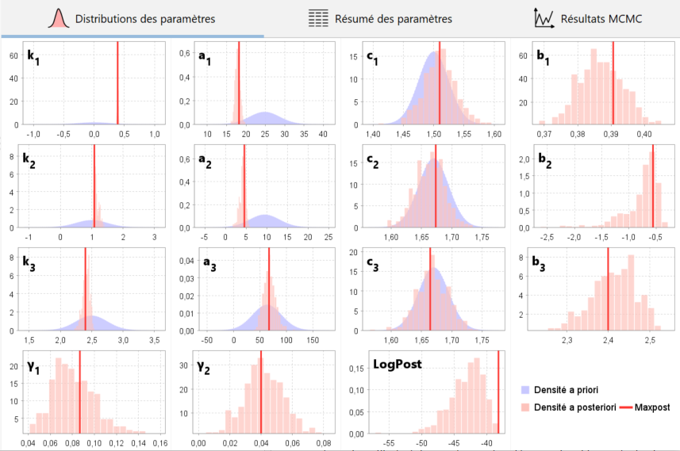
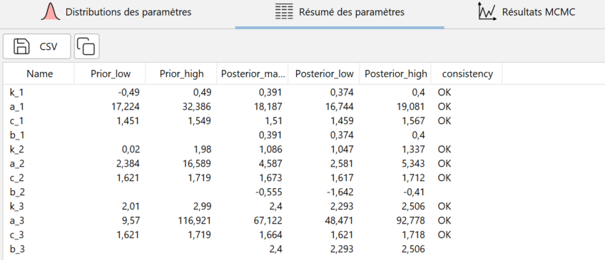
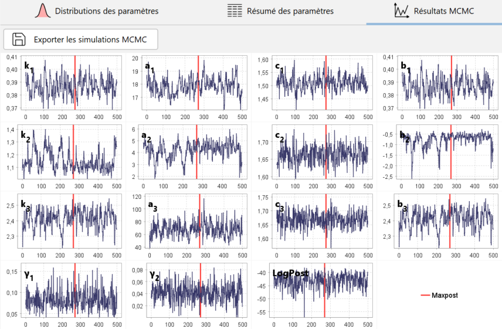

# Création d'une courbe de tarage

Une courbe de tarage est une fonction donnant le débit en fonction de la hauteur d'eau.

Par défaut, une courbe de tarage vierge nommée *CT (1)* pré-existe et peut être utilisée. Vous pouvez créer une nouvelle courbe de tarage de plusieurs façons :

-   via le menu *Composants...Créer une nouvelle courbe de tarage* ;
-   en effectuant un clic droit sur le noeud  *Courbe de tarage* dans l'arborescence de l'Explorateur des composants ;
-   en cliquant sur le bouton  dans la barre d'outils.

Il vous sera possible de renommer cette nouvelle courbe de tarage et d'en saisir une description. Une courbe de tarage existante peut être dupliquée ou supprimée.

La spécification des propriétés de la courbe de tarage se fait alors en sélectionnant :

-    Une configuration hydraulique (qui détermine l'équation de la courbe de tarage et les a priori) ;
-    Un jeu de jaugeages (utilisés pour estimer la courbe de tarage) ;
-    Un modèle d'erreur structurelle (nous conseillons de conserver le modèle proposé par défaut).

Vous êtes à présent prêts à lancer le calcul de la courbe de tarage (tous les détails sur les modèles statistiques sous-jacents sont dans [ce document](/fr/doc/topics/modele-stat). Dans le panneau graphique, définissez une grille de hauteurs d'eau comme vous l'aviez fait pour la courbe a priori, puis cliquer sur le bouton *Calculer la courbe de tarage a posteriori*. Après un calcul qui ne devrait pas excéder quelques dizaines de secondes, le panneau se met à jour comme ceci :

Les résultats sont présentés à travers plusieurs graphiques et tableaux qui sont décrits dans la section suivante.

# Graphiques et tableaux de résultats

## Courbe de tarage a posteriori

Le graphique ci-dessus montre la *courbe de tarage a posteriori*. Le terme "a posteriori" indique que cette courbe a été estimée en utilisant les jaugeages ("après les avoir observés"), par opposition à la *courbe de tarage a priori* qui n'utilisait aucun jaugeage. Sur ce graphique, les lignes verticales vertes représentent les hauteurs d'activation de chaque contrôle (avec leurs enveloppes d'incertitudes). La courbe de tarage représentée en noir est la courbe de tarage a posteriori, ou "courbe de tarage maxpost", car elle est calculée avec le jeu de paramètres qui maximise la distribution a posteriori. Autour de cette courbe de tarage a posteriori, l'intervalle en rouge clair représente l'incertitude paramétrique, c'est-à-dire l'incertitude liée uniquement à l'estimation des paramètres de la courbe. L'intervalle en rouge foncé représente l'incertitude totale, c'est-à-dire la combinaison de l'incertitude paramétrique et de l'incertitude induite par l'erreur structurelle. Il est recommandé de visualiser le graphique aussi en prenant une échelle logarithmique pour les débits, ce qui permet souvent de mieux voir l’articulation des contrôles sur toute la gamme de hauteur d’eau. De plus, les écarts relatifs de débit (en %) apparaissant alors avec la même taille quel que soit le débit.

Il est possible d'ouvrir le graphique de la *courbe de tarage a posteriori* dans une nouvelle fenêtre, d'exporter l'image au format SVG ou PNG, ou encore de la copier dans le presse-papier.

Le barème de la *courbe de tarage a posteriori* et de ses quatre courbes enveloppes d'incertitude est disponible sous forme d'un tableau :

Il est possible d'exporter ces barèmes au format CSV ou de les copier dans le presse-papier. En cliquant sur le bouton *Export de la courbe de tarage au format Bareme*, trois courbes de tarage sont exportées: la *courbe de tarage a posteriori* (maxpost), et les courbes correspondant aux limites inférieures et supérieures de l'intervalle d'incertitude totale à 95%. Le fichier exporté peut être ré-importé et donc manipulé dans le logiciel hydrométrique Barème.

Enfin, l'équation de la *courbe de tarage a posteriori* avec les valeurs du jeu de paramètres maxpost peut être affiché et copié dans le presse-papier :

## Comparaison des paramètres a priori et a posteriori

Il est particulièrement important de vérifier que les paramètres estimés a posteriori sont cohérents avec les hypothèses a priori faites sur les contrôles hydrauliques. Un conflit entre les paramètres a priori et a posteriori doit être interprété comme une alarme sur la validité de la courbe de tarage, c'est-à-dire de la configuration hydraulique spécifiée. Typiquement, un contrôle important a peut-être été oublié, ce qui force les paramètres à se contorsionner au-delà de ce qui est physiquement raisonnable pour coller aux jaugeages. Le problème peut également venir d'erreurs ou de mauvaises hypothèses sur les valeurs de paramètres a priori et/ou sur les jaugeages et leurs incertitudes.

Le graphique ci-dessus permet d'évaluer comment la connaissance a priori des paramètres (distributions en bleu) a été transformée en connaissance a posteriori (histogrammes en rouge) par l'information apportée par les jaugeages.

La même information est également disponible sous forme de tableau, avec pour chaque paramètre de la courbe de tarage une comparaison entre les estimations a priori et a posteriori, sous la forme des bornes inférieures et supérieures de leurs intervalles  à 95%. Un test de cohérence entre a priori et a posteriori est affiché pour chaque paramètre : les résultats sont jugés cohérents si la fréquence de non-dépassement de chaque échantillon MCMC par un échantillon tiré de la distribution a priori est comprise entre 0.01 et 0.99. Il est possible d'exporter ces résultats au format CSV ou de les copier dans le presse-papier.

## Simulations MCMC

Le graphique des traces MCMC représente les valeurs de paramètres simulées depuis la distribution a posteriori grâce au simulateur MCMC (tous les détails techniques sont expliqués dans [ce document](/fr/doc/topics/mcmc). Notez que le graphique ne montre que 500 valeurs simulées, mais en fait 10 000 valeurs ont été initialement générées, les 5 000 premières étant éliminées. Ces 5 000 valeurs initiales ont simplement été décimées et réduites à 500 valeurs pour éviter de conserver un nombre de simulations trop important. 

Outre les paramètres $\kappa$, $a$, $b$, et $c$ de chaque contrôle, les échantillons des paramètres $\gamma_1$ et $\gamma_2$ de l'écart-type de l'erreur structurelle ainsi que le logarithme de la densité a posteriori ("LogPost") sont également tracés. La position du jeu de paramètres maxpost (maximisant la distribution a posteriori) est indiquée par une ligne verticale rouge pour chaque paramètre. Ces résultats peuvent être exportés au format CSV.

