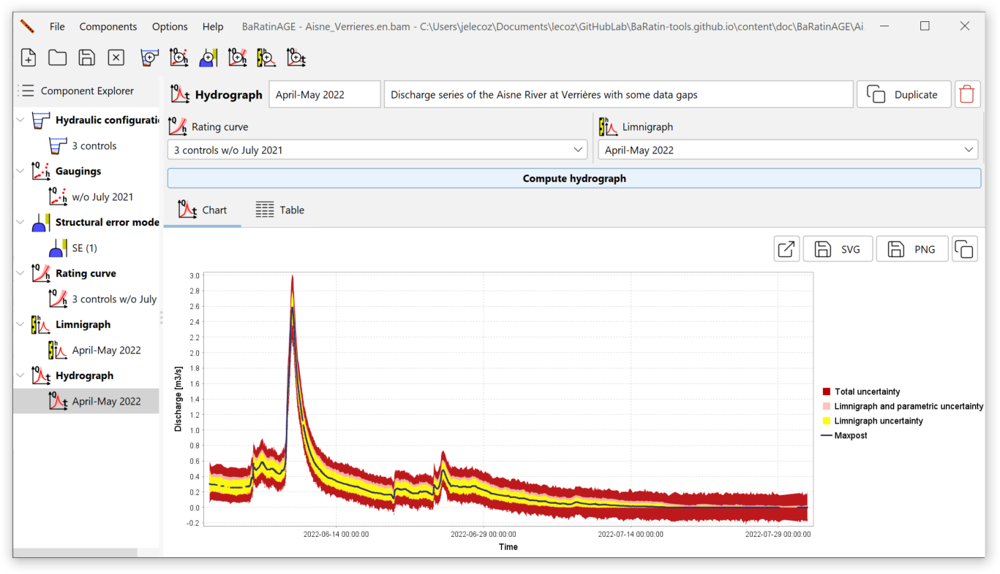
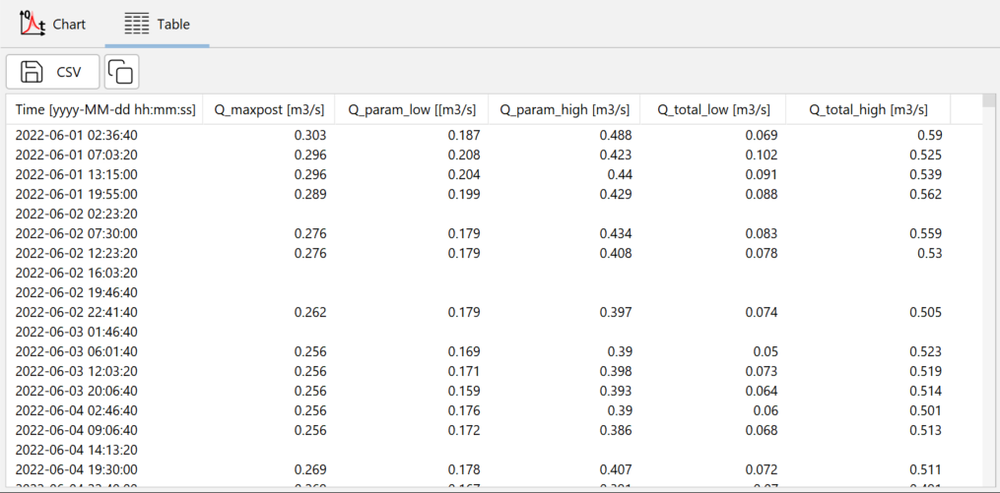
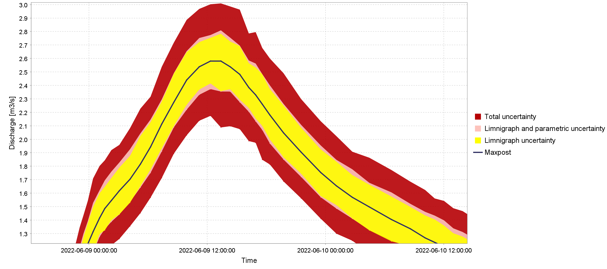

# Creating a discharge series

A discharge series is a time series of discharge (or streamflow) values.

By default, a discharge series named *Qt (1)* pre-exists and can be used. There are several ways of creating a new discharge series:

- via the menu *Components...Create new hydrograph*;
- by right-clicking on the  *Hydrograph* node in the Component Explorer tree;
- by clicking on the  button in the toolbar.

You will be able to rename this new discharge series and enter a description.  An existing discharge series can be duplicated or deleted.

The properties of the discharge series are then specified by selecting :

- A rating curve;
- A stage series.

You are now ready to start calculating the discharge series, by clicking on the *Compute hydrograph* button. At the end of the calculation, the panel is updated as follows:

Note: The calculation time at this stage can be significant, and is mainly determined by the number of time steps contained in the stage series As an order of magnitude, you can expect a calculation time of around one minute for a stage series containing 10,000 time steps. This is due to the calculation method used by BaRatinAGE to estimate uncertainties. In fact, to calculate the uncertainty intervals around the discharge series, several hundred discharge series are actually calculated, by propagating both the uncertainties of the stage series and those due to the estimation of the rating curve (spaghetti approach). For more details on this calculation, please consult [this document](/en/doc/topics/discharge-series)).

The discharge series and its 95% uncertainty intervals are available in table form:

The table contains the following columns:

- The date, in the format YYYY-MM-DD hh:mm:ss;
- The *a posteriori discharge* (maxpost) in m$^3$/s;
- The lower bound of the 95% *parametric* uncertainty interval, in m$^3$/s;
- The upper bound of the 95% *parametric* uncertainty interval, in m$^3$/s;
- The lower bound of the 95% *total* uncertainty interval, in m$^3$/s;
- The upper bound of the 95% *total* uncertainty interval, in m$^3$/s.

You can export these results in CSV format or copy them to the clipboard.

# Graphical representations

Zooming in on the graph panel reveals several uncertainty intervals around the calculated hydrograph, as shown below:

The elements of this graph should be interpreted as follows:

- The **black curve** represents the discharge series calculated by propagating the stage series (without uncertainties) through the *posterior rating curve* (maxpost, therefore without uncertainties);
- The **yellow interval** represents the *stage uncertainty* induced solely by the errors in the stage series: the uncertainty in the stage series is propagated through the maxpost rating curve (therefore without uncertainties);
- The **light red interval** represents the *parametric uncertainty* induced both by the stage series and by the rating curve parameters: the stage series uncertainty is propagated through a large number of rating curves, whose parameters vary according to the MCMC simulations carried out when estimating the rating curve;
- The **dark red interval** represents the *total uncertainty*: in addition to the two sources of uncertainty described above, the uncertainty induced by the structural error is added.

The breakdown of uncertainties presented in this graph is rich in information: we can see, for example, that for the extract shown above, the uncertainty linked to the stage series (yellow) dominates the uncertainty budget, due to the low sensitivity of the control (a horizontal weir) for low flows It can also be seen that, for this flow range, the parametric uncertainty (light red) is smaller than the structural uncertainty, which contributes to the total uncertainty interval (dark red). This suggests that, again for this flow range, the amount of prior information and gaugings is sufficient to accurately estimate the rating curve model (the hydraulic configuration), but that the latter could perhaps be improved to reduce the uncertainty of the discharge series.