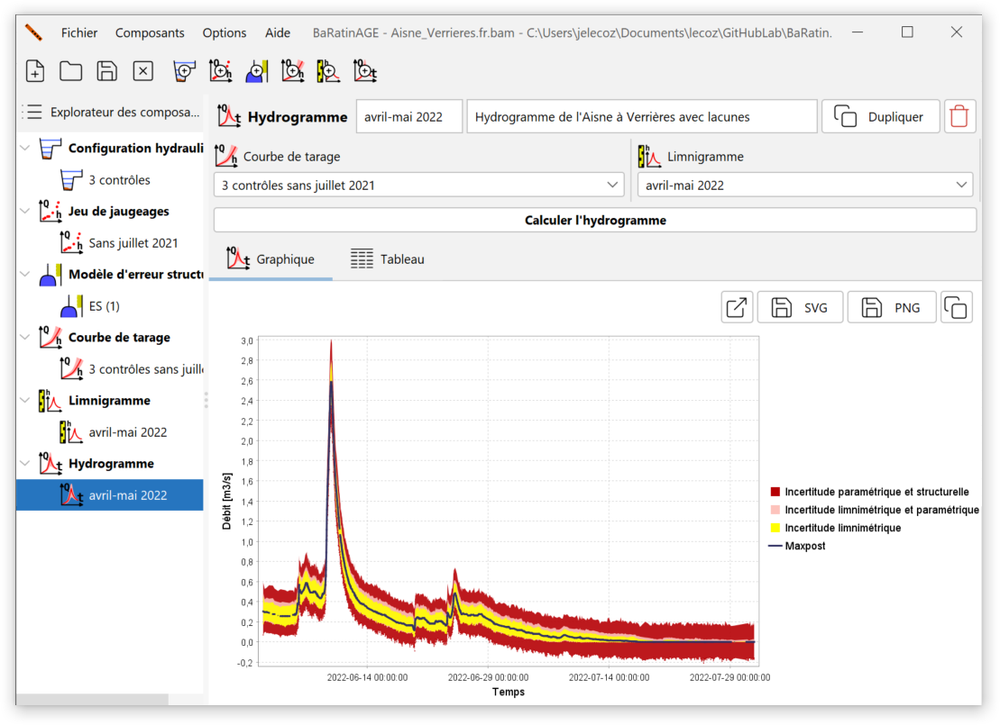
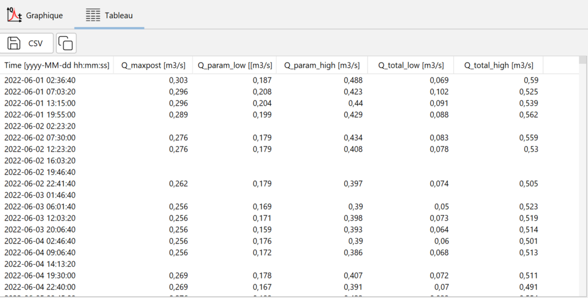
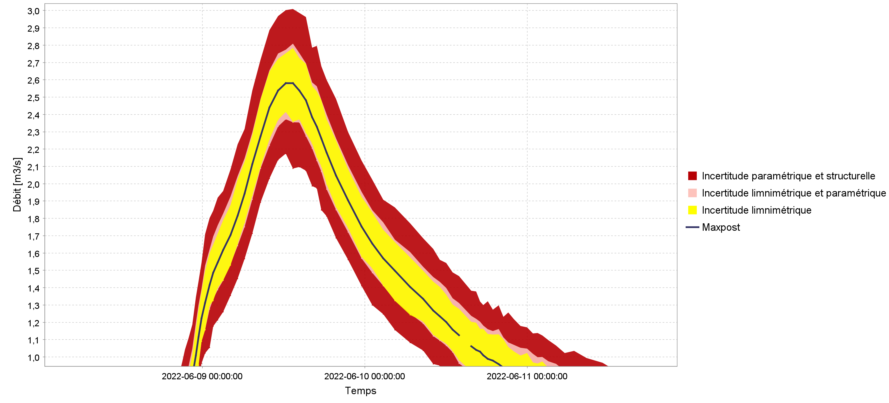

# Création d'un hydrogramme

Un hydrogramme est une série temporelle de débit.

Par défaut, un hydrogramme nommé *Qt (1)* pré-existe et peut être utilisé. Vous pouvez créer un nouvel hydrogramme de plusieurs façons :

-   via le menu *Composants...Créer un nouvel hydrogramme* ;
-   en effectuant un clic droit sur le noeud  *Hydrogramme* dans l'arborescence de l'Explorateur des composants ;
-   en cliquant sur le bouton  dans la barre d'outils.

Il vous sera possible de renommer ce nouvel hydrogramme et d'en saisir une description.  Un hydrogramme existant peut être dupliqué ou supprimé.

La spécification des propriétés de l'hydrogramme se fait alors en sélectionnant :

-    Une courbe de tarage ;
-    Un limnigramme.

Vous êtes à présent prêts à lancer le calcul de l'hydrogramme, en cliquant sur le bouton *Calculer l'hydrogramme*. A l'issue du calcul, le panneau se met à jour comme ceci :

Note : Le temps de calcul à cette étape peut être important, et il est principalement déterminé par le nombre de pas de temps que contient le limnigramme. En guise d'ordre de grandeur, il faut s'attendre à un temps de calcul de l'ordre de la minute pour un limnigramme contenant 10 000 pas de temps. Ceci est dû au mode de calcul utilisé par BaRatinAGE pour l'estimation des incertitudes. En effet, pour calculer les intervalles d'incertitudes autour de l'hydrogramme, ce sont plusieurs centaines d'hydrogrammes qui sont en fait calculés, en propageant à la fois les incertitudes du limnigramme et celles liées à l'estimation de la courbe de tarage (approche spaghetti). Pour plus de détails sur ce calcul, vous pouvez consulter **ce document** XX LIEN ? XX).

L'hydrogramme et ses intervalles d'incertitude à 95% sont disopnibles sous forme d'un tableau :

Le tableau contient les colonnes suivantes :

-    La date, au format AAAA-MM-JJ hh:mm:ss ;
-    Le *débit a posteriori* (maxpost) en m$^3$/s ;
-    La borne inférieure de l'intervalle d'incertitude *paramétrique* à 95%, en m$^3$/s ;
-    La borne supérieure de l'intervalle d'incertitude *paramétrique* à 95%, en m$^3$/s ;
-    La borne inférieure de l'intervalle d'incertitude *totale* à 95%, en m$^3$/s ;
-    La borne supérieure de l'intervalle d'incertitude *totale* à 95%, en m$^3$/s.

Il est possible d'exporter ces résultats au format CSV ou de les copier dans le presse-papier.

# Représentations graphiques

En zoomant dans le panneau graphique, on voit apparaître plusieurs intervalles d'incertitude autour de l'hydrogramme calculé, comme représenté ci-dessous :

Les éléments de ce graphique doivent être interprétés comme ceci :

-    La **courbe noire** représente l'hydrogramme calculé en propageant le limnigramme (sans incertitudes) dans la *courbe de tarage a posteriori* (maxpost, donc sans incertitudes) ;
-    L'**intervalle jaune** représente l'*incertitude limnimétrique* induite uniquement par les erreurs du limnigramme : l'incertitude du limnigramme est propagée dans la courbe de tarage maxpost (donc sans incertitudes) ;
-    L'**intervalle rouge clair** représente l'*incertitude paramétrique* induite à la fois par le limnigramme et par les paramètres de la courbe de tarage: l'incertitude du limnigramme est propagée dans un grand nombre de courbes de tarage, dont les paramètres varient suivant les simulations MCMC effectuées lors de l'estimation de la courbe de tarage ;
-    L'**intervalle rouge foncé** représente l'*incertitude totale* : en plus des deux sources d'incertitude décrites ci-dessus, on ajoute l'incertitude induite par l'erreur structurelle.

La décomposition des incertitudes présentée dans ce graphique est riche d'information : on voit par exemple que pour l'extrait représenté ci-dessus, l'incertitude liée au limnigramme (jaune) est dominante dans le budget d'incertitude, en raison de la faible sensibilité du contrôle (déversoir horizontal) pour les basses eaux. On observe aussi que, pour cette gamme de débit, l'incertitude paramétrique (rouge clair) est plus faible que l'incertitude stucturelle, qui contribue à l'intervalle d'incertitude totale (en rouge foncé). Ceci suggère que, toujours pour cette gamme de débit, la quantité d'information a priori et de jaugeages est suffisante pour estimer précisément le modèle de courbe de tarage (la configuration hydraulique), mais que ce dernier pourrait peut-être être amélioré pour diminuer l'incertitude de l'hydrogramme.