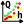
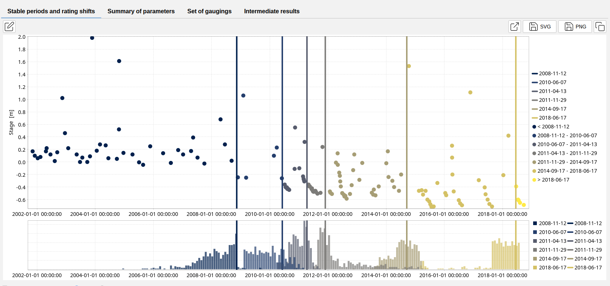
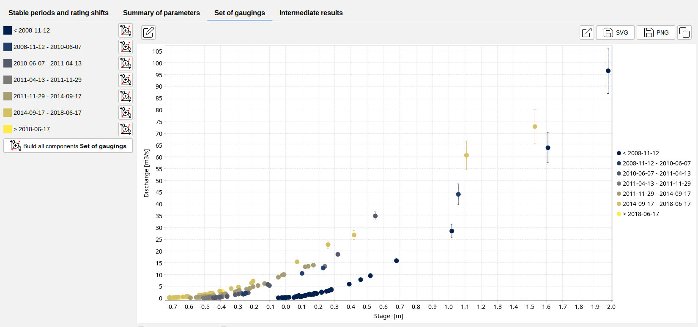

# Rating Curves Shifts

In the pratical world, rating curves are not static due to changes in the hydraulic conbtrols and parameters of the river. These can be due to countless number of causes such as sediment deposits, débris-jams, floods, etc.

It is important to consider them and detect them, this can be done through an assessment of the gauging data through the years and finding the times at which the rating curves shift.

As of BaRatinAGE 3.2, the ability to detect the rating curve shifts is implemented. In order to use the functionality, a rating shift detector needs to be created in your project:
- via the menu *Components...Create a rating shift detector*;
- by right-clicking on tools and then on  *Rating Shift Detector* node in the Component Explorer tree;
- by clicking on the  button in the toolbar.

You will be able to rename this new rating shift detector and enter a description. An existing rating shift detector can be duplicated or deleted.

The properties of the discharge series are then specified by selecting :

- A hydraulic configuration;
- A set of gaugings.

You are now ready to start calculating the rating shifts, by clicking on the *Launch the rating shift detections* button. At the end of the calculation, the panel is updated as follows:

The vertical lines indicate the time at which a rating shift occurs. 

Under the section set of gauging, different period of the guagings set can be found, with their period indicated in the left hand side. The gaugings of the different can be exported to the set of gaugings component menu through the use of the button *Build all components Set of Gaugings*. Enabling rating curves to be calculated for each time frame, using their respective set of gauging. 

## Notes on the methodology:

The methodology used to calculate rating shifts was initially implemented in the R package [*RatingShiftHappens*](https://github.com/Felipemendezrios/RatingShiftHappens) developed by Felipe MENDEZ and Benjamin RENARD (INRAE, RiverLy and RECOVER). The goal of the package is to create a tool for detecting, visualizing and estimating rating shifts. It was derived from [BayDERS](https://github.com/MatteoDarienzo/BayDERS) developed by [M. Darienzo et al.(2021)](https://theses.hal.science/tel-03211343).