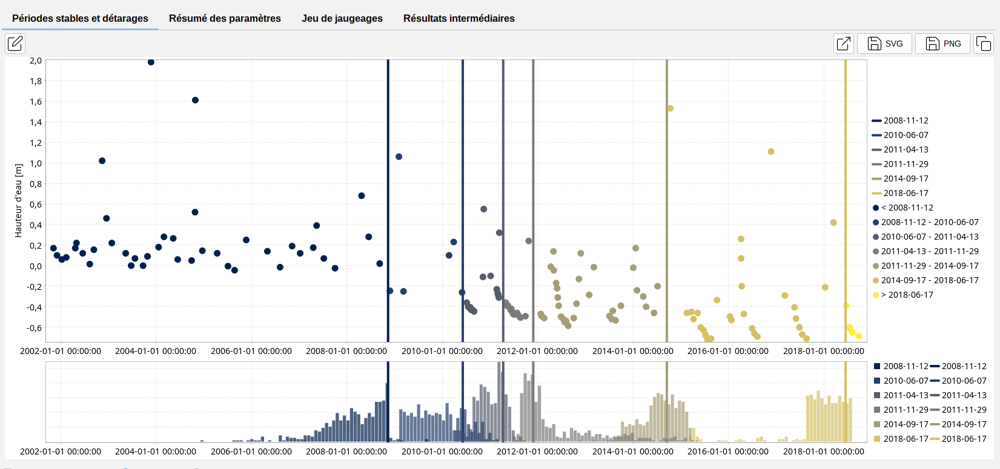
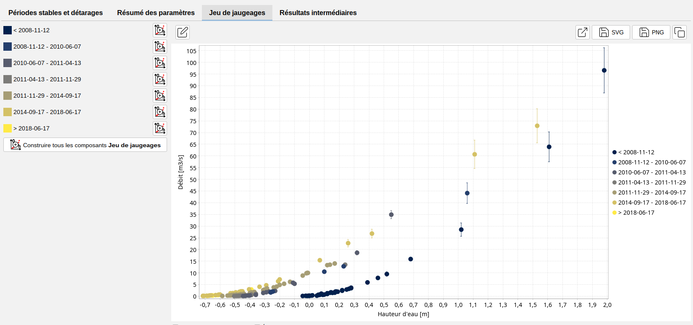

# Détarages

Dans la pratique, les courbes de tarages ne sont pas statiques en raison des changements dans les configurations hydrauliques et les paramètres des contrôles. Ces changements peuvent être dus à diverses causes telles que les dépôts de sédiments, les embâcles, les inondations, etc.

Il est important de prendre en compte les détarages et de les détecter, ce qui peut être fait en évaluant les données de jaugeage au fil des années et en déterminant les moments où un détarage a lieu.

À partir de BaRatinAGE 3.2, la possibilité de détecter les détarages est implémentée. Pour utiliser cette fonctionnalité, un détecteur de détarages doit être créé dans votre projet :

- via le menu *Composants...Créer un détecteur de détarages* ;
- en cliquant avec le bouton droit de la souris sur les outils, puis sur le nœud  *Détecteur de détarages* dans l'arborescence de l'explorateur de composants ;
- en cliquant sur le bouton  dans la barre d'outils.

Vous pourrez renommer ce nouveau détecteur de détarages et saisir une description. Un détecteur de détarages existant peut être dupliqué ou supprimé.

Les propriétés du détecteur de détarages sont ensuite spécifiées en sélectionnant :

- Une configuration hydraulique ;
- Un jeu de jaugeages.

Vous êtes maintenant prêt(e) à commencer le calcul des détarages en cliquant sur le bouton *Lancer la détection des détarages*. À la fin du calcul, le panneau est mis à jour comme suit :

Les points représentent la hauteur (ou le débit) des jaugeages au fil du temps. Les lignes verticales indiquent le moment où un détarage est susceptible de s'être produit. Elles sont définies comme les valeurs MaxPost des distributions a posteriori des temps de détarage, distributions qui sont affichées sous forme d'histogrammes.

Sous la section *Jeu de jaugeages*, vous trouverez différents jeux de jaugeages, dont la période est indiquée à gauche. Les différents jeux de jaugeages peuvent être exportés vers le composant *Jeu de jaugeages* à l'aide du bouton *Construire tous les composants jeu de jaugeages*. Cela permet de calculer, potentiellement, les courbes de tarage pour chaque période à l'aide de leur jeu de jaugeages respectif. 

L'onglet *Résumé des paramètres* liste les temps MaxPost des détarages ainsi que les bornes de l'intervalle à 95% de probabilité.  L'onglet *Résultats intermédiaires* présente les résultats obtenus à chaque itération du processus de segmentation des écarts entre le débit des jaugeages et le débit de la courbe de tarage établie pour chaque période.

## Remarques sur la méthodologie :

La méthodologie utilisée pour calculer les détarages est décrite dans [Darienzo et al. (2021)](https://doi.org/10.1029/2020WR028607) et a été initialement mise en œuvre dans le package R [*RatingShiftHappens*](https://github.com/Felipemendezrios/RatingShiftHappens) développé par Felipe MENDEZ et Ben RENARD (INRAE, RiverLy et RECOVER). L'objectif de ce package est de créer un outil permettant de détecter, de visualiser et d'estimer les détarages. Il est dérivé du package [BayDERS](https://github.com/MatteoDarienzo/BayDERS) développé par [Darienzo et al. (2021)](https://theses.hal.science/tel-03211343).

Attention, cet outil ne détecte pas nécessairement tous les détarages, et ne positionne pas précisément la date de détarage (il ne fait que séparer des séries de jaugeages, que vous pouvez ensuite utiliser pour calculer des courbes de tarage indépendantes). Il peut aider à identifier des détarages, mais aussi à fusionner des périodes de validité en ré-analyse, si aucun détarage significatif n'apparaît finalement. N'hésitez pas à nous faire des retours sur la pertinence des résultats sur vos stations tests.
