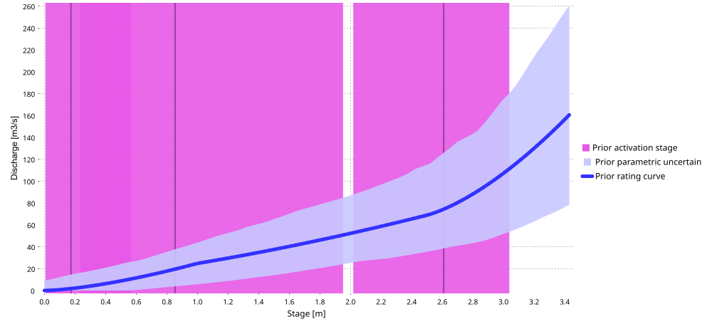
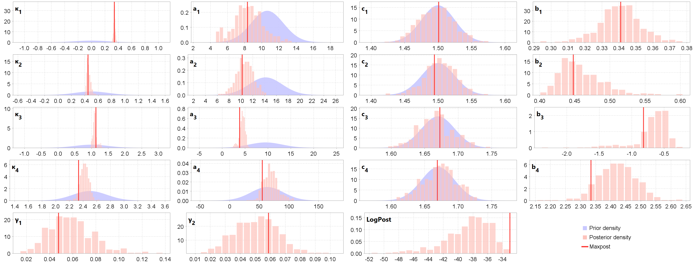
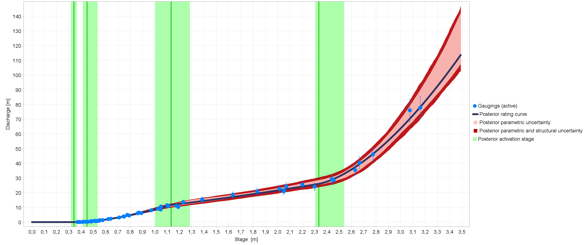
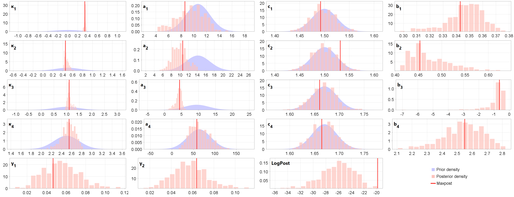
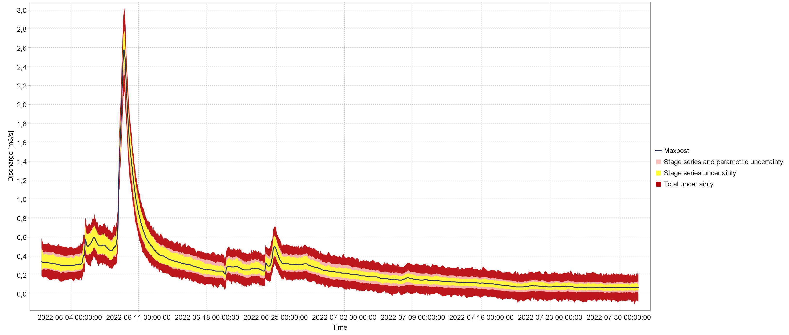

# Introduction 

This case is provided as an example in the distribution of the BaRatinAGE software (folder <i>/example</i>, file <i>Aisne_Verrière_Example_v1.0.bam</i>) because it presents a hydraulic configuration typical of many hydrometric stations (whether the low flow control is natural or artificial, as here), but also because, the floodplain being very wide, the corresponding control has a strong impact on the top of the rating curve. 

This also explains an unusual, strong rating shift at the top of the curve observed during the exceptional summer flood of July 2021, similar rating shifts of 20 to 60% having also been observed at other hydrometric stations in the region. These rating shifts are due to the vegetation of the floodplain which was very different from the winter conditions of the flood gaugings used to construct the tops of the existing rating curves. In July 2021, in fact, the floodplains were covered with tall summer crops that had not been harvested due to the exceptionally cold and rainy weather.

The BaRatin analysis of this station was carried out using data and information transmitted by local field hydrologists and information found on the internet (notably Google Maps, Géoportail and [Hydroportail](https://hydro.eaufrance.fr/sitehydro/H6021020/fiche)), without a field visit, topographic survey or numerical hydraulic modelling (see Fig. 1).

 

Figure 1. The Aisne River at Verrières (H6021020): location of the station (Hydroportail, Géoportail) and views of upstream/downstream controls (Google Street View).

# Hydraulic analysis

There appears to be a low weir or riffle downstream of the bridge and the station. A floodplain extends on the right bank about 100 m wide, very roughly. We therefore consider three hydraulic controls: a rectangular weir, a rectangular channel representing the main channel, and another rectangular channel representing the floodplain:

$$
\begin{array}{|c|c|c|}
\hline
  \text{Control} & \text{Nature} & \text{Type} \\ 
\hline
     1 & \text{Weir / riffle} & \text{section} \\ 
\hline
     2 & \text{Main channel} & \text{channel} \\ 
\hline
     3 & \text{Floodplain} & \text{channel} \\ 
\hline
\end{array}
$$

The hydraulic operation of this station can be summarized as follows: at low flows, the stage-discharge relationship is controlled by the geometry of a critical cross-section near the rectangular weir. When the water height increases, the weir is submerged and the stage-discharge relationship is then controlled by the average geometry and roughness of a rectangular channel corresponding to the main channel. For an even greater water height, the stage-discharge relationship is controlled by two rectangular channels, corresponding to the main channel and the floodplain.

The control matrix corresponding to this configuration is given below.

$$
\begin{array}{|c|}
\hline
  &\text{control 1} & \text{control 2} & \text{control 3}\\
\hline
  \text{segment 1} &\color{lime}{1} &\color{darkslategray}{0} &\color{darkslategray}{0}\\
\hline
  \text{segment 2} & \color{darkslategray}{0} & \color{lime}{1} &\color{darkslategray}{0}\\
\hline
  \text{segment 3} & \color{darkslategray}{0} & \color{lime}{1} & \color{lime}{1} \\
\hline
\end{array}
$$

# Specification of priors

The priors defined for these three controls are deduced from Géoportail:

 <ul>
  <li> Weir (low flow control):

 <ul>
  <li>$\kappa = 0~\mathrm{m} \pm 0.5~\mathrm{m}$ (deduced from the lowest waters of the stage series)</li>
  <li>$B_w = 14~\mathrm{m} \pm 4~\mathrm{m}$ (derived from distance measurements on the Géoportail aerial view, see Fig. 1)</li>
</ul> 

  <li> Main channel (medium and high flow control):
 <ul>
  <li>$\kappa = 1~\mathrm{m} \pm 1~\mathrm{m}$ (roughly estimated from Géoportail altitudes)
  <li>$B_w = 12~\mathrm{m} \pm 5~\mathrm{m}$ (deduced from distance measurements on the Géoportail aerial view, see Fig. 1)
  <li>$K_S = 25~\mathrm{m}^{1/3}\mathrm{/s} \pm 10~\mathrm{m}^{1/3}\mathrm{/s}$ (typical value for this type of main channel, cf. Chow 1959 table recalled in the BaRatinAGE documentation)
  <li>$S = 0.001 \pm 0.001$ (estimated by default for a lowland river)
</ul>

<li> Floodplain (high flow control):
 <ul>
  <li>$\kappa = = 2.5~\mathrm{m} \pm 0.5~\mathrm{m}$ (roughly estimated from Géoportail altitudes)
  <li>$B_w = 100~\mathrm{m} \pm 50~\mathrm{m}$ (roughly estimated from distance on the Géoportail aerial view, see Fig. 1)
  <li>$K_S = 20~\mathrm{m}^{1/3}\mathrm{/s} \pm 10~\mathrm{m}^{1/3}\mathrm{/s}$ (typical value for this type of floodplain, cf. Chow 1959 table recalled in the BaRatinAGE documentation)
  <li>$S = 0.001 \pm 0.001$ (estimated by default for a lowland river)
</ul> 
</ul> 

With these specifications, we obtain the prior rating curve shown below.

 

 Figure 2. Prior rating curve for the Aisne River at Verrières.

# Gaugings and posterior rating curves

The “normal” rating curve is estimated using the gaugings associated with the existing rating curve  without the single gauging of the July 2021 flood measured on 07/16/2021 (Fig. 2). We do not see any conflict between the posterior results and the prior distributions, with a more precise calibration of the main channel parameters. The rating curve estimated with BaRatin is very close to the existing rating curve.

 
a) 
b) 

 Figure 2. The Aisne River at Verrières (H6021020), "normal" rating curve: a) prior and posterior distributions of parameters, b) BaRatin rating curve with parametric (pink) and total (red) uncertainty envelopes.

The "July 2021" rating curve is estimated using the same gaugings except those with a stage greater than 2.4 m (before overbank flow) and this time with the gauging of the July 2021 flood (Fig. 3). The previous priors are kept except for the prior overbank flow stage set as previously ($\kappa_3 = 2.4~\mathrm{m} \pm 0.12~\mathrm{m}$). Indeed, we assume that the overbank flow stage of the floodplain does not change depending on the season, and we transfer this information that the only gauging after overbank flow in July 2021 cannot provide.

 
a) 
b) 

 Figure 3. The Aisne River at Verrières (H6021020), "July 2021" rating curve: a) prior and posterior distributions of parameters, b) BaRatin rating curve with parametric (pink) and total (red) uncertainty envelopes.

We do not see any conflict between the posterior results and the prior distributions, but the uncertainty of the rating curve is greater than previously, especially for flood discharges. The rating curve estimated with BaRatin deviates from the existing rating curve, which falls on the upper edge of the uncertainty envelope (not shown). For the floodplain, we find a coefficient $a_3 = 39 \pm 24$ for the 2021 flood against $a_3 = 63.5 \pm 22$ excluding the 2021 flood, i.e. a reduction by a factor of 1.6. This is exactly what is also obtained for the Mouron station further downstream on the Aisne River, analyzed in a similar way. The assumed Strickler coefficient $K_S = 20~\mathrm{m}^{1/3}\mathrm{/s}$ would therefore be reduced to 12.5 $\mathrm{m}^{1/3}\mathrm{/s}$, all things being equal.

# Stage series and discharge series

As an example of handling various data, two stage series extracted from the Hydroportail (instantaneous stages in mm) are offered in several versions:

 <ul>
  <li>Stages recorded at variable time intervals from 06/01/2022 to 07/31/2022, in three versions:
  
 <ul>
  <li><i>limni with uncertainty</i>: with uncertainties defined equal to 1 cm (non-systematic errors) and 1 cm (systematic errors, 1 single period)
  <li><i>error free limni</i>: without uncertainties
  <li><i>limni with missing values</i>: same version as the first one (with uncertainties) but with gaps (missing data)
 </ul>
 
  <li>Stages recorded at variable time intervals from 04/01/2022 to 05/31/2022, in two versions:
 
 <ul>
  <li><i>April-May 2022</i>: with defined uncertainties equal to 2 cm (non-systematic errors only)
  <li><i>april-may 2022 error free</i>: without uncertainties
 </ul>
 
 </ul>
  
The "normal" rating curve is applied to these five stage series to generate the corresponding discharge series with uncertainties (example Fig. 4).

 

 Figure 4. The Aisne River at Verrières (H6021020): discharge series estimated by BaRatin for the stage series <i>limni with uncertainty</i> and the "normal" rating curve, with envelope of stage (yellow), parametric (pink) and total (red) uncertainty at the 95% probability level.

