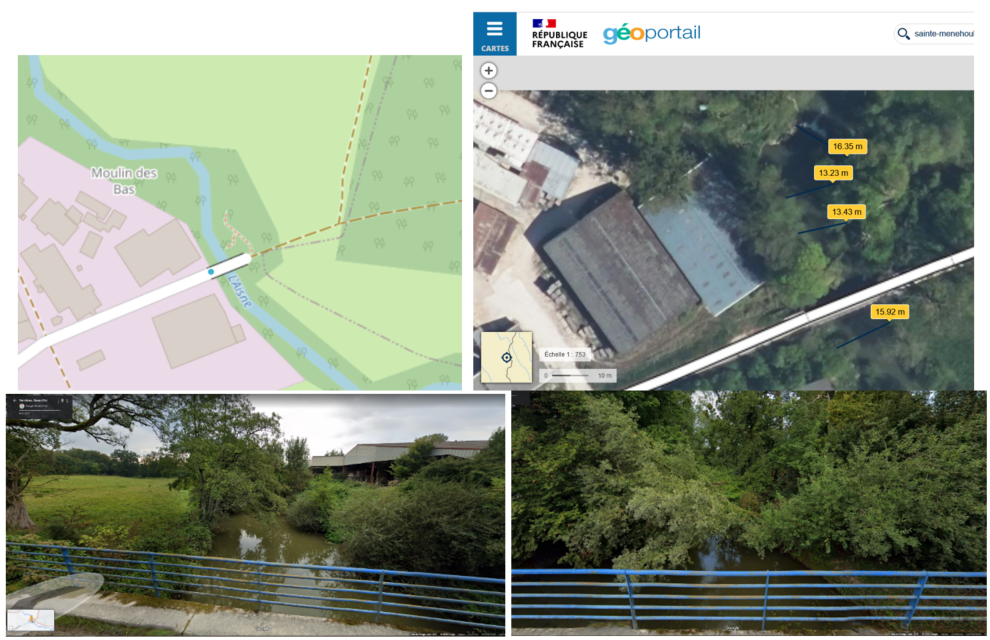
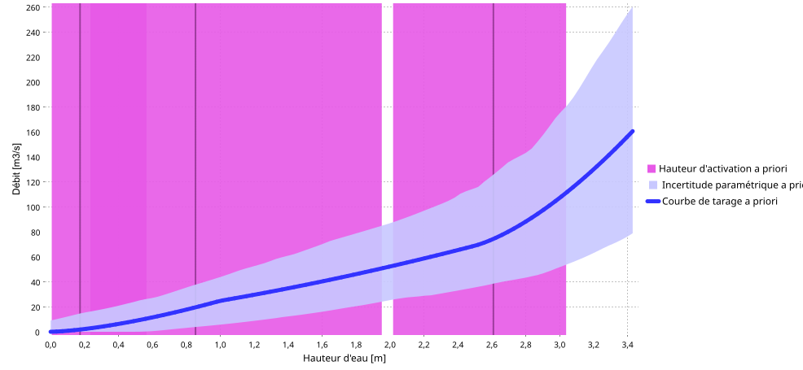
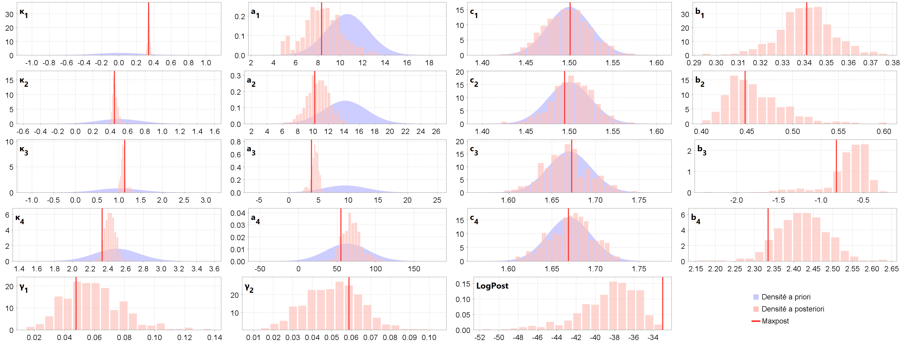
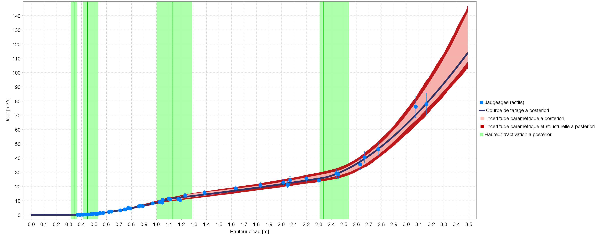
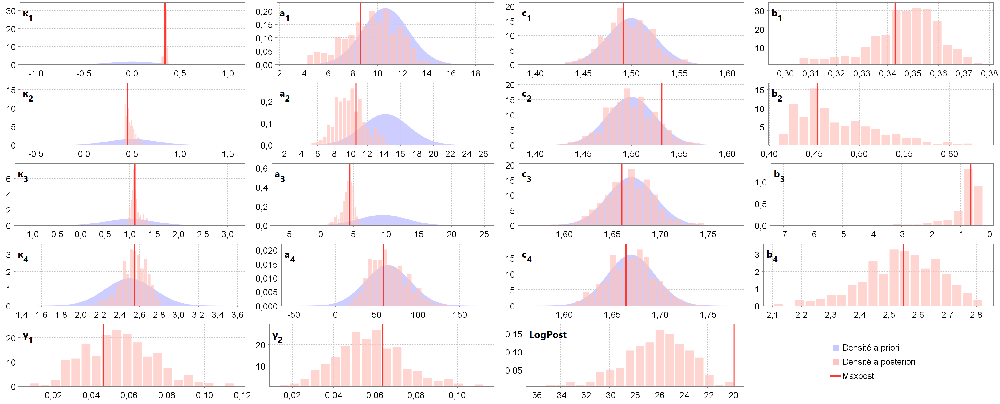
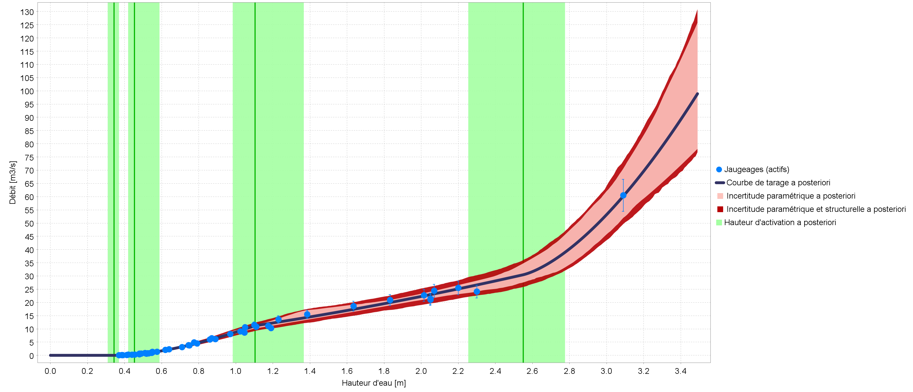
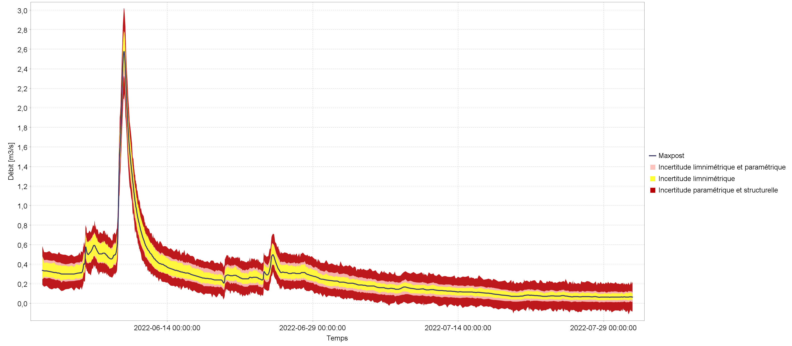

# Introduction 

Ce cas est fourni comme exemple dans la distribution du logiciel BaRatinAGE (dossier <i>/example</i>, fichier <i>Aisne_Verrière_Example_v1.0.bam</i>) car il présente une configuration hydraulique typique de nombreuses stations hydrométriques (que le contrôle bas débit soit naturel ou artificiel, comme ici), mais aussi parce que, le lit majeur étant très large, le contrôle correspondant a un fort impact sur le haut de la courbe de tarage. 

Ceci explique d’ailleurs un fort détarage inhabituel du haut de la courbe observé lors de la crue d’été exceptionnelle de juillet 2021, des détarages similaires de 20 à 60 % ayant également été constatés sur d’autres stations hydrométriques de la région. Ces détarages sont dus à la végétation du lit majeur qui était très différente des conditions hivernales des jaugeages de crue utilisés pour construire les hauts des courbes de tarage. En juillet 2021, en effet, les plaines inondables étaient couvertes de hautes cultures d'été qui n'avaient pas été récoltées en raison du temps exceptionnellement froid et pluvieux.

L’analyse BaRatin de cette station a été réalisée à partir des données et informations transmises par les hydromètres locaux et d’informations trouvées sur internet (notamment Google Maps, Géoportail et [Hydroportail](https://hydro.eaufrance.fr/sitehydro/H6021020/fiche)), sans visite de terrain ni levé topographique ni modélisation hydraulique numérique (cf. Fig. 1). 

 

Figure 1. L’Aisne à Verrières (H6021020) : situation de la station (Hydroportail, Géoportail) et vues des contrôles en amont/aval (Google Street View).

# Analyse hydraulique

Il semble y avoir un seuil ou radier peu élevé en aval du pont et de la station. Un lit majeur s’étend en rive droite sur environ 100 m de large, très grossièrement. On considère donc trois contrôles hydrauliques: un déversoir rectangulaire, un chenal rectangulaire représentant le lit mineur, et un autre chenal rectangulaire représentant le lit majeur :

$$
\begin{array}{|c|c|c|}
\hline
  \text{Contrôle} & \text{Nature} & \text{Type} \\ 
\hline
     1 & \text{Déversoir / radier} & \text{section} \\ 
\hline
     2 & \text{Lit mineur} & \text{chenal} \\ 
\hline
     3 & \text{Lit majeur} & \text{chenal} \\ 
\hline
\end{array}
$$

Le fonctionnement hydraulique de cette station peut se résumer ainsi : en basses eaux, la relation hauteur-débit est contrôlée par la géométrie d’une section critique au niveau d’un déversoir rectangulaire Lorsque la hauteur d'eau augmente, le déversoir s'ennoie et la relation hauteur-débit est alors contrôlée par la géométrie et la rugosité moyennes d'un chenal rectangulaire correspondant au lit mineur. Pour une hauteur d'eau encore plus importante, la relation hauteur-débit est contrôlée par deux chenaux rectangulaires, correspondant au lit mineur et au lit majeur.

La matrice des contrôles correspondant à cette configuration est donnée ci-dessous.

$$
\begin{array}{|c|}
\hline
  &\text{contrôle 1} & \text{contrôle 2} & \text{contrôle 3}\\
\hline
  \text{segment 1} &\color{lime}{1} &\color{darkslategray}{0} &\color{darkslategray}{0}\\
\hline
  \text{segment 2} & \color{darkslategray}{0} & \color{lime}{1} &\color{darkslategray}{0}\\
\hline
  \text{segment 3} & \color{darkslategray}{0} & \color{lime}{1} & \color{lime}{1} \\
\hline
\end{array}
$$

# Spécification des a priori

Les a priori définis sur ces trois contrôles sont déduits de Géoportail :

 <ul>
  <li> Seuil (contrôle de basses eaux) :

 <ul>
  <li>$\kappa = 0~\mathrm{m} \pm 0.5~\mathrm{m}$ (déduit des plus basses eaux du limnigramme)</li>
  <li>$B_w = 14~\mathrm{m} \pm 4~\mathrm{m}$ (déduit des mesures de distance sur la vue aérienne Géoportail, cf. Fig. 1)</li>
</ul> 

  <li> Lit mineur (contrôle de moyennes et hautes eaux) :
 <ul>
  <li>$\kappa = 1~\mathrm{m} \pm 1~\mathrm{m}$ (estimé grossièrement à partir des altitudes Geoportail)
  <li>$B_w  = 12~\mathrm{m} \pm 5~\mathrm{m}$ (déduit des mesures de distance sur la vue aérienne Géoportail, cf. Fig. 1)
  <li>$K_S = 25~\mathrm{m}^{1/3}\mathrm{/s}  \pm  10~\mathrm{m}^{1/3}\mathrm{/s}$ (valeur typique pour ce type de lit mineur, cf. table de Chow 1959 rappelée dans la documentation de BaRatinAGE)
  <li>$S = 0.001 \pm 0.001$ (estimée par défaut pour une rivière de plaine)
</ul>

  <li> Lit majeur (contrôle de hautes eaux) :
 <ul>
  <li>$\kappa = = 2.5~\mathrm{m} \pm 0.5~\mathrm{m}$ (estimé grossièrement à partir des altitudes Geoportail)
  <li>$B_w  = 100~\mathrm{m} \pm 50~\mathrm{m}$ (estimé grossièrement à partir de distance sur la vue aérienne Géoportail, cf. Fig. 1)
  <li>$K_S = 20~\mathrm{m}^{1/3}\mathrm{/s}  \pm 10~\mathrm{m}^{1/3}\mathrm{/s}$(valeur typique pour ce type de lit majeur, cf. table de Chow 1959 rappelée dans la documentation de BaRatinAGE)
  <li>$S = 0.001 \pm 0.001$ (estimée par défaut pour une rivière de plaine)
</ul> 
</ul> 

Avec ces spécifications, on obtient la courbe de tarage a priori représentée ci-dessous.

 

 Figure 2. Courbe de tarage a priori pour l’Aisne à Verrières

# Jaugeages et courbe de tarage a posteriori

La courbe de tarage "normale" est estimée en utilisant les jaugeages associés à la courbe de tarage en vigueur sans l’unique jaugeage de la crue de juillet 2021 mesuré le 16/07/2021 (Fig. 2). On ne constate pas de conflit entre les résultats a posteriori et les a priori, avec un calage plus précis des paramètres du lit mineur. La courbe de tarage estimée avec BaRatin est très proche de la courbe de tarage en vigueur.

 
a) 
b) 

 Figure 2. L’Aisne à Verrières (H6021020), courbes de tarage "normales" : a) distribution a priori et a posteriori des paramètres, b) courbe de tarage BaRatin avec enveloppe d’incertitude paramétrique (rose) et totale (rouge).

La courbe de tarage "juillet 2021" est estimée en utilisant les mêmes jaugeages sauf ceux à cote supérieure à 2.4 m (avant débordement) et cette fois-ci avec le jaugeage de la crue de juillet 2021 (Fig. 3). Les a priori précédents sont conservés sauf la hauteur de débordement calée précédemment ($\kappa_3 = 2.4~\mathrm{m} \pm 0.12~\mathrm{m}$ a priori). En effet, on fait l’hypothèse que la cote de débordement du lit majeur ne change pas selon la saison, et on transfère cette information que le seul jaugeage après débordement de juillet 2021 ne peut pas fournir.

 
a) 
b) 

 Figure 3. L’Aisne à Verrières (H6021020), courbes de tarage "juillet 2021" : a) distribution a priori et a posteriori des paramètres, b) courbe de tarage BaRatin avec enveloppe d’incertitude paramétrique (rose) et totale (rouge).

On ne constate pas de conflit entre les résultats a posteriori et les a priori, mais l’incertitude de la courbe de tarage est plus grande que précédemment, surtout en crue. La courbe de tarage estimée avec BaRatin s’écarte de la courbe de tarage en vigueur, qui tombe sur le bord supérieur de l’enveloppe d’incertitude. Pour le lit majeur, on trouve un coefficient $a_3 = 39 \pm 24$ pour la crue 2021 contre $a_3 = 63.5 \pm 22$ hors crue 2021, soit une réduction d’un facteur 1.6, exactement comme à la station de Mouron plus en aval sur l’Aisne, analysée de façon similaire. Le coefficient de Strickler supposé $K_S = 20~\mathrm{m}^{1/3}\mathrm{/s}$ serait donc réduit à 12.5 $\mathrm{m}^{1/3}\mathrm{/s}$, toutes choses étant égales par ailleurs.

# Limnigrammes et hydrogrammes

A titre d’exemple de manipulation de données variées, deux limnigrammes extraits de l’Hydroportail (hauteurs instantanées au mm) sont proposés en plusieurs versions :

 <ul>
  <li>Hauteurs d’eau enregistrées à pas de temps variable du 01/06/2022 au 31/07/2022, en trois versions :
  
 <ul>
  <li><i>limni with uncertainty</i> : avec incertitudes définies égales à 1 cm (erreurs non systématiques) et 1 cm (erreurs systématiques, 1 seule période)
  <li><i>error free limni</i> : sans incertitudes
  <li><i>limni with missing values</i> : même version que la première (avec incertitudes) mais avec des lacunes (données manquantes)
 </ul>
 
  <li>Hauteurs d’eau enregistrées à pas de temps variable du 01/04/2022 au 31/05/2022, en deux versions :
 
 <ul>
  <li><i>april-may 2022</i> : avec incertitudes définies égales à 2 cm (erreurs non systématiques uniquement)
  <li><i>april-may 2022 error free</i> : sans incertitudes
 </ul>
 
 </ul>
  
La courbe de tarage "normale" est appliquée à ces cinq limnigrammes pour générer les hydrogrammes correspondants avec incertitudes (exemple Fig. 4).

 

 Figure 4. L’Aisne à Verrières (H6021020) : hydrogramme estimé par BaRatin pour le limnigramme <i>limni with uncertainty</i> et la courbe de tarage "normale", avec enveloppe d’incertitude limnimétrique (jaune), paramétrique (rose) et totale (rouge) au niveau de probabilité de 95%.

