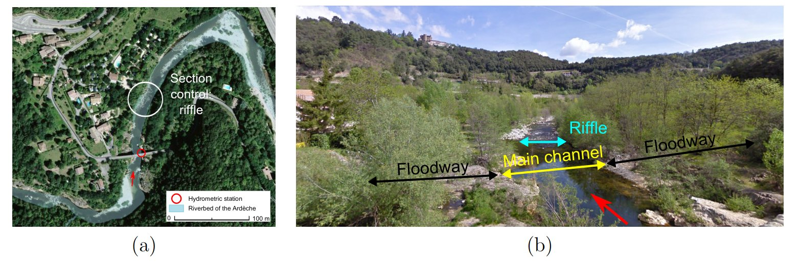

> Download the BaRatinAGE file for this case study: [Ardeche-Meyras.bam](/bam/Ardeche-Meyras.bam)

# Introduction 

The Ardèche River at Meyras station is of interest because it illustrates a frequently-encountered 3-control configuration (riffle, main channel, floodway). In addition, it is an iconic station for BaRatin because it served as the basis of several important developments (see in particular the works by [Mansanarez, 2017](https://theses.hal.science/tel-02605323v2) and [Darienzo, 2021](https://theses.hal.science/tel-03211343)).

# Hydraulic analysis 

The hydraulic configuration at this station is summarized in Figure 1: at low flows, the stage-discharge relation is controlled by the geometry of a critical section induced by a natural riffle. As stage increases, the riffle becomes drowned and the stage-discharge relation is controlled by the geometry and roughness of the main channel. At high flows, part of the water flows into two floodways located on the right and left banks. Since the two floodways get activated at roughly the same stage, they are combined into a single control. The stage-discharge relation if then controlled by two channel controls: (1) the main channel and (2) the combined floodway.

$$
\begin{array}{|c|c|c|}
\hline
  \text{Control} & \text{Nature} & \text{Type} \\ 
\hline
     1 & \text{Natural riffle} & \text{section} \\ 
\hline
     2 & \text{Main channel} & \text{channel} \\ 
\hline
     3 & \text{Floodways (right+left banks)} & \text{channel} \\ 
\hline
\end{array}
$$

 Figure 1. Analysis of hydraulic controls fot the Ardèche River at Meyras. (a) view from above ([Géoportail](https://www.geoportail.gouv.fr/carte?c=4.270544484920187,44.67058563887761&z=17&l0=ORTHOIMAGERY.ORTHOPHOTOS::GEOPORTAIL:OGC:WMTS(1)&permalink=yes)) ; (b) downstream view ([Google Maps](https://www.google.com/maps/@44.6700599,4.2695756,3a,75y,27.91h,67.4t/data=!3m7!1e1!3m5!1sAF1QipOfQ_5gYbqh2PsLOgtCVApr_4pdqYGWHsD01xBZ!2e10!3e11!7i12000!8i6000?entry=ttu)).

The control matrix is the following: 

$$
\begin{array}{|c|}
\hline
  &\text{control 1} & \text{control 2} & \text{control 3}\\
\hline
  \text{segment 1} &\color{lime}{1} & &\\
\hline
  \text{segment 2} & \color{darkslategray}{0} & \color{lime}{1} &\\
\hline
  \text{segment 3} & \color{darkslategray}{0} & \color{lime}{1} & \color{lime}{1} \\
\hline
\end{array}
$$

# Prior specification

Prior specification is performed as follows:

* A rectangular section control is used to describe the natural riffle. Its properties are known rather imprecisely: activation stage $\kappa = -0.6 \mathrm{m} \pm 1 \mathrm{m}$ and estimated width $B_w = 8 \mathrm{m} \pm 4 \mathrm{m}$.
* The main channel is modeled as a wide rectangular channel with fairly low roughness $K_S = 25 \pm 5$, width $B_w = 15 \mathrm{m} \pm 5 \mathrm{m}$ and slope $S = 0.0005 \pm 0.00025$. The activation stage corresponds to the stage above which the riffle is drowned, which can only be roughly estimated at $\kappa = 0 \mathrm{m} \pm 1 \mathrm{m}$.
* The combined floodway is modelled as a wide rectangular channel rougher than the main channel, $K_S = 15 \pm 5$, with total width $B_w = 30 \mathrm{m} \pm 10 \mathrm{m}$ and same slope as the main channel $S = 0.0005 \pm 0.00025$. The activation stage is easier to determine for this control as it corresponds to the elevation of the bottom of the floodway, which can be estimated at $\kappa = 1.2 \mathrm{m} \pm 0.4 \mathrm{m}$.

This prior specification leads to prior rating curve shown below.

 

 Figure 2. Prior rating curve for the Ardèche River at Meyras.

# Gaugings and posterior rating curve

25 gaugings are available during the period 04/11/2011 - 18/09/2014, during which no rating shift could be detected. The gauged discharges range between $0.14 \mathrm{m}^3.\mathrm{s}^{−1}$ and $93.5 \mathrm{m}^3.\mathrm{s}^{−1}$. For reference, the mean annual dischage is equal to $3.64 \mathrm{m}^3.\mathrm{s}^{−1}$ and a 2-year flood reach $150 \mathrm{m}^3.\mathrm{s}^{−1}$. 

The posterior rating curve combining the information brought by these gaugings with prior information is shown below. Gaugings allowed strongly reducing the prior rating curve uncertainty and to better identify the activation stages (the first two in particular). However, extrapolation toward discharge values exceeding $150 \mathrm{m}^3.\mathrm{s}^{−1}$, corresponding to noticeable floods, remains highly uncertain.

 

 Figure 3. Gaugings and posterior rating curve for the Ardèche River at Meyras (2011-2014 period).

