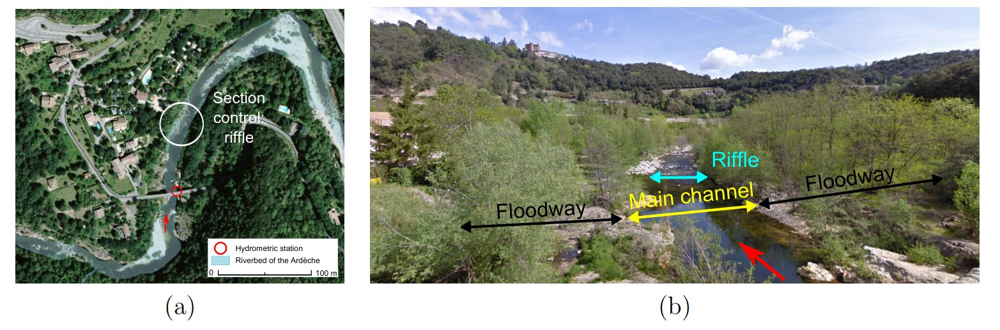
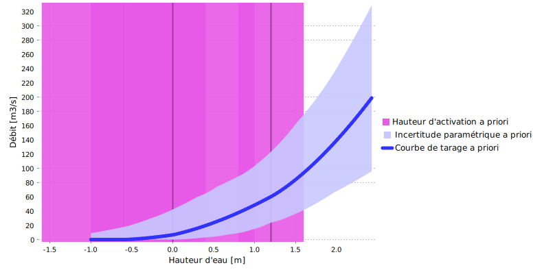
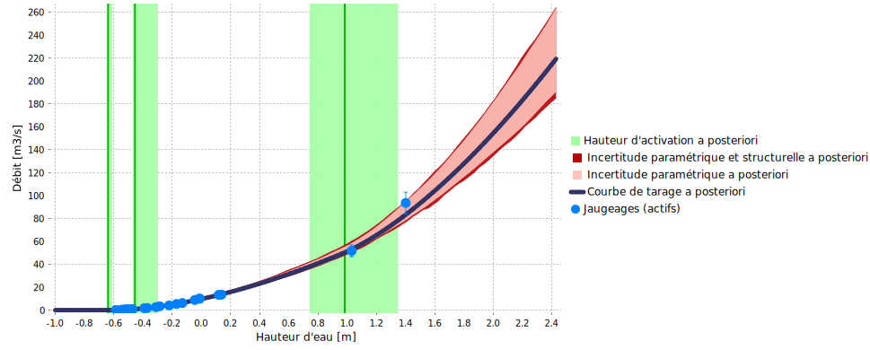

> Téléchargez le fichier BaRatinAGE de ce cas d'étude : [Ardeche-Meyras.bam](/bam/Ardeche-Meyras.bam)

# Introduction 

Le cas de l'Ardèche à Meyras est intéressant car il est typique d'une configuration à 3 contrôles fréquemment rencontrée dans les rivières naturelles (radier, lit actif, lit actif + lit moyen). De plus il s'agit d'une station emblématique pour BaRatin car elle a servi de support à de nombreux développements (voir notamment les travaux de [Mansanarez, 2017](https://theses.hal.science/tel-02605323v2), et [Darienzo, 2021](https://theses.hal.science/tel-03211343)).

# Analyse hydraulique

Le fonctionnement hydraulique de cette station est résumé dans la Figure 1 : en basses eaux, la relation hauteur-débit est contrôlée par la géométrie d’une section critique au niveau d’un radier. Lorsque la hauteur d'eau augmente, le radier s'ennoie et la relation hauteur-débit est alors contrôlée par la géométrie et la rugosité moyennes du chenal du lit actif. Pour une hauteur d'eau encore plus importante, une partie de l'écoulement peut s'effectuer dans les lits moyens en rive droite et en rive gauche, qui s'activent approximativement à la même hauteur et peuvent donc être combinés dans un unique contrôle. La relation hauteur-débit est alors contrôlée par deux chenaux, celui du lit actif et celui correspondant à la combinaisons des deux lits moyens.

$$
\begin{array}{|c|c|c|}
\hline
  \text{Contrôle} & \text{Nature} & \text{Type} \\ 
\hline
     1 & \text{Radier naturel} & \text{section} \\ 
\hline
     2 & \text{Lit actif} & \text{chenal} \\ 
\hline
     3 & \text{Lit moyen (rive droite + rive gauche)} & \text{chenal} \\ 
\hline
\end{array}
$$

 Figure 1. Analyse des contrôles hydrauliques pour l’Ardèche à Meyras. (a) vue du dessus ([Géoportail](https://www.geoportail.gouv.fr/carte?c=4.270544484920187,44.67058563887761&z=17&l0=ORTHOIMAGERY.ORTHOPHOTOS::GEOPORTAIL:OGC:WMTS(1)&permalink=yes)) ; (b) vue vers l'aval ([Google Maps](https://www.google.com/maps/@44.6700599,4.2695756,3a,75y,27.91h,67.4t/data=!3m7!1e1!3m5!1sAF1QipOfQ_5gYbqh2PsLOgtCVApr_4pdqYGWHsD01xBZ!2e10!3e11!7i12000!8i6000?entry=ttu)).

La matrice des contrôles correspondant à cette configuration est donnée ci-dessous.

$$
\begin{array}{|c|}
\hline
  &\text{contrôle 1} & \text{contrôle 2} & \text{contrôle 3}\\
\hline
  \text{segment 1} &\color{lime}{1} & &\\
\hline
  \text{segment 2} & \color{darkslategray}{0} & \color{lime}{1} &\\
\hline
  \text{segment 3} & \color{darkslategray}{0} & \color{lime}{1} & \color{lime}{1} \\
\hline
\end{array}
$$

# Spécification des a priori

La spécification des a priori est basée sur les raisonnements suivants :

* Pour le radier naturel, on utilise un contrôle section rectangulaire dont les propriétés sont connues de manière assez imprécise : activation pour une hauteur échelle de $\kappa = -0.6 \mathrm{m} \pm 1 \mathrm{m}$, largeur estimée à $B_w = 8 \mathrm{m} \pm 4 \mathrm{m}$.
* Le lit actif est assimilé à un contôle par chenal rectangulaire large de rugosité assez faible, que l'on estime à $K_S = 25 \pm 5$, de largeur $B_w = 15 \mathrm{m} \pm 5 \mathrm{m}$ et de pente $S = 0.0005 \pm 0.00025$. La hauteur d'activation de ce contôle correspond à la hauteur l'ennoiement du radier et est donc assez mal connue: $\kappa = 0 \mathrm{m} \pm 1 \mathrm{m}$.
* Le lit moyen est assimilé à un contôle par chenal rectangulaire large de rugosité plus élevée que le lit actif, $K_S = 15 \pm 5$, de largeur $B_w = 30 \mathrm{m} \pm 10 \mathrm{m}$ et de même pente que le lit actif $S = 0.0005 \pm 0.00025$. La hauteur d'activation de ce contôle est cette fois mieux connue puisqu'elle correspond à la hauteur à l'échelle du fond du lit moyen, que l'on estime à $\kappa = 1.2 \mathrm{m} \pm 0.4 \mathrm{m}$.

Avec ces spécifications, on obtient la courbe de tarage a priori représentée ci-dessous.

 

 Figure 2. Courbe de tarage a priori pour l’Ardèche à Meyras.

# Jaugeages et courbe de tarage a posteriori

Sur une période comprise entre le 04/11/2011 et le 18/09/2014, au cours de laquelle aucun détarage n'est à signaler, 25 jaugeages ont été effectués. Les débits jaugés varient entre $0.14 \mathrm{m}^3.\mathrm{s}^{−1}$ et $93.5 \mathrm{m}^3.\mathrm{s}^{−1}$, sachant que le débit moyen annuel s'établit à $3.64 \mathrm{m}^3.\mathrm{s}^{−1}$ et qu'une crue biennale atteint $150 \mathrm{m}^3.\mathrm{s}^{−1}$. 

La courbe de tarage a posteriori qui combine l'information portée par ces jaugeages et l'information a priori est représentée ci-dessous. On voit que les jaugeages ont permis de nettement réduire l'incertitude autour de la courbe et de préciser les hauteurs d'activation des contrôles (notamment des deux premiers). L'extrapolation vers les débits supérieurs à $150 \mathrm{m}^3.\mathrm{s}^{−1}$, qui correspondent à des crues notables, demeure cependant très incertaine.

 

 Figure 3. Jaugeages et courbe de tarage a posteriori pour l’Ardèche à Meyras (période 2011-2014).

