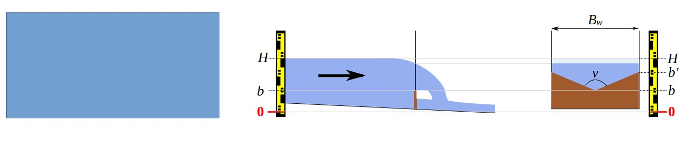
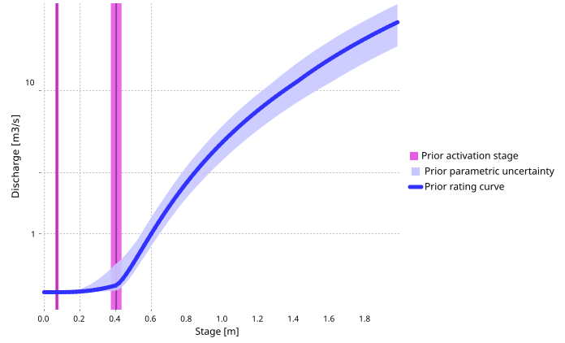
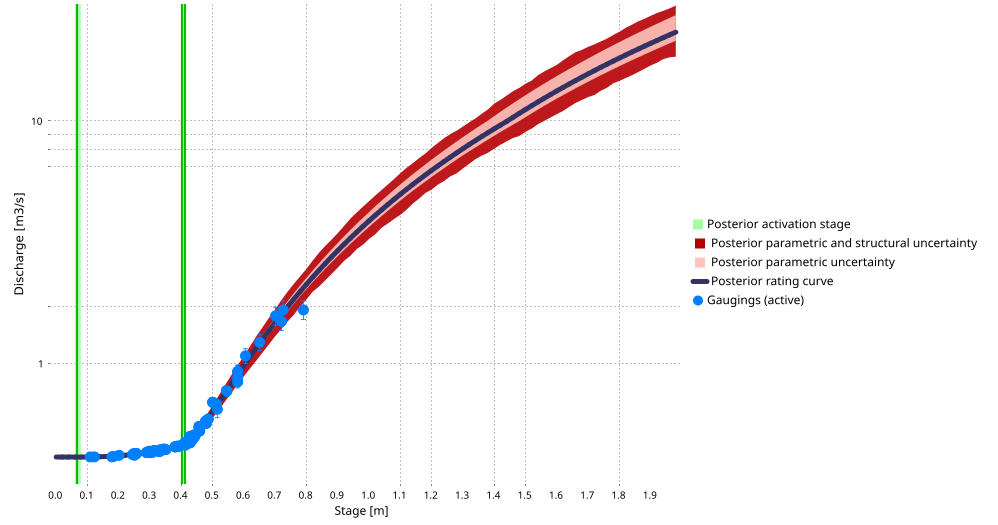
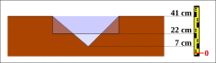
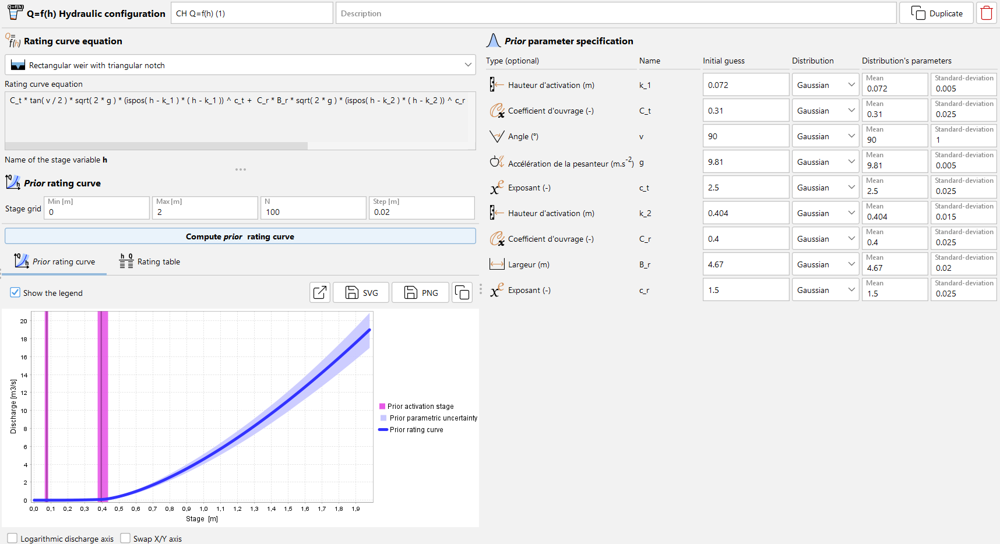
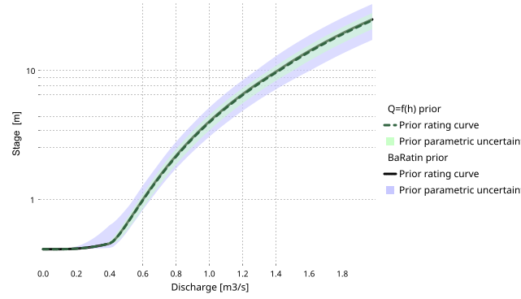
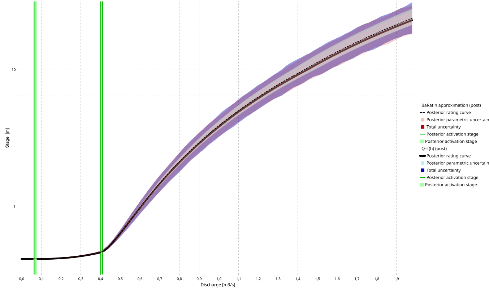

> Download the BaRatinAGE file for this case study: [Charbonnieres-CharbonnieresLesBains.bam](/bam/Charbonnieres-CharbonnieresLesBains.bam)

# Hydraulic analysis

This [station](https://bdoh.irstea.fr/YZERON/station/V301502301) is part of the [Yzeron catchment observatory](https://bdoh.irstea.fr/YZERON/) which has monitored the streamflows of several rivers  since 1997 in this peri-urban catchment located west of the city of Lyon, France. This station is located upstream of a rectangular weir fitted with a triangular notch, to improve the sensitivity of the stage-discharge relation for low flows (see Figure 1, top). This hydraulic configuration is encountered quite frequently in practice, but modelling it in BaRatin is not trivial because the exact $Q(H)$ equation of the ‘truncated triangle’ weir (limited by fictitious vertical walls) which is added to the rectangular weir is not compatible with the assumptions made by BaRatin. This case study therefore illustrates how:

- either use a BaRatin-compliant approximation;
- or use the exact equation in the form of a ‘Q=f(h)’ hydraulic configuration.

 Figure 1. Analysis of hydraulic controls for the Charbonnières stream at Charbonnières-Les-Bains. Top: photo taken from downstream, showing the "truncated triangle" inserted in a larger rectangular weir (photo: M. Lagouy); bottom: schematics of a "truncated triangle" weir considered in isolation.

The problematic part of this hydraulic configuration is the "truncated triangle" weir, schematized in Figure 1: a regular triangular weir laterally expands up to a given stage $b'$, then is framed with vertical walls. The equation of this control above stage $b'$ is given below. It can be interpreted as the addition of a « negative » triangular weir equation to remove the excess wetted area of the regular triangle when it reaches the vertical walls.

$$
Q(H)=\underbrace{C_t \sqrt{2g}\tan({\nu/2})}_{a_1}(H-b)^{c_t} - \underbrace{C_t \sqrt{2g}\tan({\nu/2})}_{a_2}(H-b')^{c_t}
$$

This equation is not BaRatin-compliant for the following reasons:

1. It cannot be factorized as a single power equation $Q(H)=a(H-b)^c$
2. Using a subtraction of two controls as suggested by the equation does not work because:
    a. BaRatin does not allow subtracting power equations, only adding them up; it would then be tempting to add a control with a negative coefficient $a'_2=-a_2$, but BaRatin does not allow negative coefficients either.
    b. The parameters of the two controls that should be subtracted are linked: in particular, they have the same coefficients $(a_1=a_2)$ and the same exponent $c_t$. BaRatin has no functionality to enforce such links.
    
These constraints that BaRatin enforces are a consequence of the [general formulation of the rating curve equation](/en/doc/topics/rating-curve/) and in particular the need to solve a continuity equation. Two possible approaches to circumvent these constraints are currently under investigation and are described at the end of this page. In the meantime, it is possible to use an approximation to make this type of control compliant with the BaRatin framework. A possible approximation is to use a triangular weir for stage values lower than $b'$, then to replace it with a rectangular weir for stage values higher than $b'$. The bottom stage of this rectangle (offset) should be estimated above the offset of the triangle, and the advantage of the rectangle weir is that its exponent $c=1.5$ is more in line with the laterally-constrained geometry (compare it with the triangle exponent $c=2.5$). It might also be desired in some situations to smooth the transition between the triangle and the rectangle. A parabolic weir may be used for this purpose, with an offset in between those of the triangle and the rectangle and dimensions to be adapted to the studied control.

Going back to the specific case of the Charbonnières stream, we opt for the following approximate  configuration (leading to the control matrix below):

1. Triangular weir for $H<b'$
2. Replacement by an equivalent rectangular weir for $H \geq b'$
3. Addition of a wide rectangular weir representing the large rectangle into which the truncated triangle is inserted for $H \geq b'$

$$
\begin{array}{|c|c|c|}
\hline
  \text{Control} & \text{Nature} & \text{Type} \\ 
\hline
     1 & \text{Triangular weir} & \text{section} \\ 
\hline
     2 & \text{Rectangular weir approximating the truncated triangle} & \text{section} \\ 
\hline
     3 & \text{Large rectangular weir} & \text{section} \\ 
\hline
\end{array}
$$

$$
\begin{array}{|c|}
\hline
  &\text{control 1} & \text{control 2} & \text{control 3}\\
\hline
  \text{segment 1} &\color{lime}{1} & &\\
\hline
  \text{segment 2} & \color{darkslategray}{0} & \color{lime}{1} &\\
\hline
  \text{segment 3} & \color{darkslategray}{0} & \color{lime}{1} & \color{lime}{1} \\
\hline
\end{array}
$$

# Prior specification

Once the hydraulic configuration has been defined, prior specification can proceed as follows:

* Control 1 (triangle) activates at $\kappa = 7.2 \mathrm{cm} \pm 1 \mathrm{cm}$ and the opening angle is equal to  $\nu = 90° \pm 2°$
* Control 2 (rectangle approximating the truncated triangle) activates at $\kappa = 40.3 \mathrm{cm} \pm 0.5 \mathrm{cm}$ and its width is equal to $B_w = 70 \mathrm{cm} \pm 3 \mathrm{cm}$
* Control 3 (wide rectangle added to the rectangle above) activates at $\kappa = 40.4 \mathrm{cm} \pm 3 \mathrm{cm}$. In theory one would wish to specify an activation stage equal to the previous one, but in practice it is specified $1 \mathrm{mm}$ above to avoid an error message due to the fact that BaRatin requires strictly increasing activation stages. This wide rectangle has a width equal to $B_w = 467 \mathrm{cm} \pm 2 \mathrm{cm}$

The prior rating curve resulting from these specifications is shown below and is already fairly precise, as is often the case when artificial weirs are used.

 

 Figure 2. Prior rating curve for the Charbonnières stream at Charbonnières-Les-Bains (note the log y-axis for discharge).

# Gaugings and posterior rating curve

88 gaugings are available to estimate the posterior rating curve. The highest ones (around $2 \mathrm{m}^3.\mathrm{s}^{−1}$) correspond to fairly frequent flood events, and are much smaller than the highest discharges observed at this station (discharge for the November 2016 flood was estimated around ten times larger). The posterior rating curve indicates that gaugings allowed reducing the uncertainty for low to medium flows, but extrapolation toward higher flows remains very uncertain. 

 

 Figure 3. Posterior rating curve for the Charbonnières stream at Charbonnières-Les-Bains (note the log y-axis for discharge).

A more thorough analysis of estimated parameters indicates that the bottom of the rectangle approximating the truncated triangle lies at $b_2=22 \mathrm{cm}$, wich is above the bottom of the triangle $(b_1=7 \mathrm{cm})$ but below the bottom of the wide rectangle $(b_3=41 \mathrm{cm})$. The Figure below illustrates the geometry resulting from the posterior parameter estimates. 

 

 Figure 4. Estimated geometries for the triangle (active for $H < 41 \mathrm{cm}$) and the equivalent rectangle (replacing the triangle when $H \geq 41 \mathrm{cm}$).

# Alternative approach: "Q=f(h)" hydraulic configuration

By using a "Q=f(h)" hydraulic configuration instead of the standard BaRatin model, it is possible to represent the truncated triangular weir control with the more exact equation indicated above. In fact, the set of predefined “Q=f(h)” hydraulic configurations offers, via the drop-down menu, the “Rectangular weir with triangular notch” control, which corresponds exactly to the configuration of the Charbonnières station, i.e. a truncated triangular weir added to a rectangular weir of the same height $b'$ and of width $B_r$ :

$$
Q(H)=C_t \sqrt{2g}\tan({\nu/2})(H-b)^{c_t} - C_t \sqrt{2g}\tan({\nu/2})(H-b')^{c_t} + C_r \sqrt{2g} B_r (H-b')^{c_r}
$$

The same priors as above are defined for the various physical parameters of the control, providing a new prior rating curve:

 

 Figure 5. "Q=f(h)" hydraulic configuration and prior rating curve for the Charbonnières stream at Charbonnières-Les-Bains. 

This prior "Q=f(h)" rating curve is close to the prior rating curve previously obtained with the BaRatin approximation, as this comparison shows:

 

 Figure 6. Comparison of prior “Q=f(h)” and BaRatin rating curves for the Charbonnières stream at Charbonnières-Les-Bains (discharge axis is in log scale). 

There is no conflict between the results and the prior parameters, and the "Q=f(h)" posterior rating curve is close to the posterior rating curve previously obtained with the BaRatin approximation, as this comparison shows:

 

 Figure 7. Comparison of the "Q=f(h)" and BaRatin posterior rating curves for the Charbonnières stream at Charbonnières-Les-Bains (discharge axis is in log scale).

