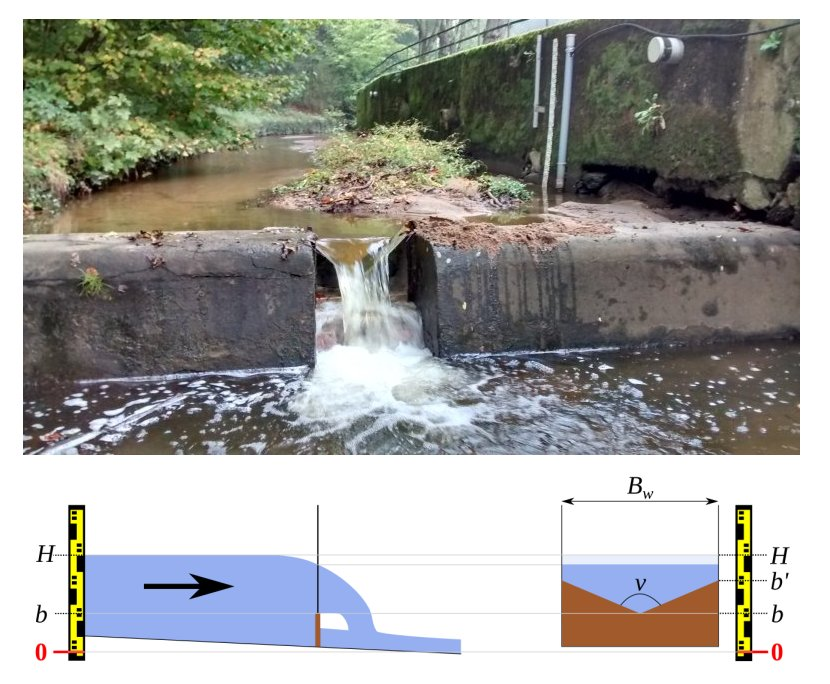

> Download the BaRatinAGE file for this case study: [Charbonnieres-CharbonnieresLesBains.bam](/bam/Charbonnieres-CharbonnieresLesBains.bam)

# Hydraulic analysis

This [station](https://bdoh.irstea.fr/YZERON/station/V301502301) is part of the [Yzeron observatory](https://bdoh.irstea.fr/YZERON/) monitoring several peri-urban catchments around the city of Lyon since 1997. A "truncated triangle" weir is used at this station. This geometry is used quite frequently in practice, but its modelling within BaRatin is not straightforward because its $Q(H)$ equation is not compatible with some BaRatin hypotheses. This case study therefore aims at illustrating a possible way to make BaRatin-compliant approximations for this particular geometry.

 Figure 1. Analysis of hydraulic controls for the Charbonnières stream at Charbonnières-Les-Bains. Left: photo taken from downstream, showing the "truncated triangle" inserted in a larger rectangular weir; right: schematics of a "truncated triangle" weir.

The problematic part of this hydraulic configuration is the "truncated triangle" weir, schematized in Figure 1: a regular triangular weir laterally expands up to a given stage $b'$, then is framed with vertical walls. The equation of this control above stage $b'$ is given below. It can be interpreted as the addition of a « negative » triangular weir equation to remove the excess wetted area of the regular triangle when it reaches the vertical walls.

$$
Q(H)=\underbrace{C_t \sqrt{2g}\tan({\nu/2})}_{a_1}(H-b)^c - \underbrace{C_t \sqrt{2g}\tan({\nu/2})}_{a_2}(H-b')^c
$$

This equation is not BaRatin-compliant for the following reasons:

1. It cannot be factorized as a single power equation $Q(H)=a(H-b)^c$
2. Using a subtraction of two controls as suggested by the equation does not work because:
    a. BaRatin does not allow subtracting power equations, only adding them up; it would then be tempting to add a control with a negative coefficient $a'_2=-a_2$, but BaRatin does not allow negative coefficients either.
    b. The parameters of the two controls that should be subtracted are linked: in particular, they have the same coefficients $(a_1=a_2)$ and the same exponent $c$. BaRatin has no functionality to enforce such links.
    
These constraints that BaRatin enforces are a consequence of the [general formulation of the rating curve equation](/en/doc/topics/rating-curve/) and in particular the need to solve a continuity equation. Two possible approaches to circumvent these constraints are currently under investigation and are described at the end of this page. In the meantime, it is possible to use an approximation to make this type of control compliant with the BaRatin framework. A possible approximation is to use a triangular weir for stage values lower than $b'$, then to replace it with a rectangular weir for stage values higher than $b'$. The bottom stage of this rectangle (offset) should be estimated above the offset of the triangle, and the advantage of the rectangle weir is that its exponent $c=1.5$ is more in line with the laterally-constrained geometry (compare it with the triangle exponent $c=2.5$). It might also be desired in some situations to smooth the transition between the triangle and the rectangle. A parabolic weir may be used for this purpose, with an offset in between those of the triangle and the rectangle and dimensions to be adapted to the studied control.

Going back to the specific case of the Charbonnières stream, we opt for the following approximate  configuration (leading to the control matrix below):

1. Triangular weir for $H<b'$
2. Replacement by an equivalent rectangular weir for $H \geq b'$
3. Addition of a wide rectangular weir representing the large rectangle into which the truncated triangle is inserted for $H \geq b'$

$$
\begin{array}{|c|c|c|}
\hline
  \text{Control} & \text{Nature} & \text{Type} \\ 
\hline
     1 & \text{Triangular weir} & \text{section} \\ 
\hline
     2 & \text{Rectangular weir approximating the truncated triangle} & \text{section} \\ 
\hline
     3 & \text{Large rectangular weir} & \text{section} \\ 
\hline
\end{array}
$$

$$
\begin{array}{|c|}
\hline
  &\text{control 1} & \text{control 2} & \text{control 3}\\
\hline
  \text{segment 1} &\color{lime}{1} & &\\
\hline
  \text{segment 2} & \color{darkslategray}{0} & \color{lime}{1} &\\
\hline
  \text{segment 3} & \color{darkslategray}{0} & \color{lime}{1} & \color{lime}{1} \\
\hline
\end{array}
$$

# Prior specification

Once the hydraulic configuration has been defined, prior specification can proceed as follows:

* Control 1 (triangle) activates at $\kappa = 7.2 \mathrm{cm} \pm 1 \mathrm{cm}$ and the opening angle is equal to  $\nu = 90° \pm 2°$
* Control 2 (rectangle approximating the truncated triangle) activates at $\kappa = 40.3 \mathrm{cm} \pm 0.5 \mathrm{cm}$ and its width is equal to $B_w = 70 \mathrm{cm} \pm 3 \mathrm{cm}$
* Control 3 (wide rectangle added to the rectangle above) activates at $\kappa = 40.4 \mathrm{cm} \pm 3 \mathrm{cm}$. In theory one would wish to specify an activation stage equal to the previous one, but in practice it is specified $1 \mathrm{mm}$ above to avoid an error message due to the fact that BaRatin requires strictly increasing activation stages. This wide rectangle has a width equal to $B_w = 467 \mathrm{cm} \pm 2 \mathrm{cm}$

The prior rating curve resulting from these specifications is shown below and is already fairly precise, as is often the case when artificial weirs are used.

 

 Figure 2. Prior rating curve for the Charbonnières stream at Charbonnières-Les-Bains (note the log y-axis for discharge).

# Gaugings and posterior rating curve

88 gaugings are available to estimate the posterior rating curve. The highest ones (around $2 \mathrm{m}^3.\mathrm{s}^{−1}$) correspond to fairly frequent flood events, and are much smaller the highest discharges observed at this station (discharge for the November 2016 flood was estimated around ten times larger). The posterior rating curve indicates that gaugings allowed reducing the uncertainty for low to medium flows, but extrapolation toward higher flows remains very uncertain. 

 

 Figure 3. Posterior rating curve for the Charbonnières stream at Charbonnières-Les-Bains (note the log y-axis for discharge).

A more thorough analysis of estimated parameters indicates that the bottom of the rectangle approximating the truncated triangle lies at $b_2=22 \mathrm{cm}$, wich is above the bottom of the triangle $(b_1=7 \mathrm{cm})$ but below the bottom of the wide rectangle $(b_3=41 \mathrm{cm})$. The Figure below illustrates the geometry resulting from the posterior parameter estimates. 

 

 Figure 4. Estimated geometries for the triangle (active for $H < 41 \mathrm{cm}$) and the equivalent rectangle (replacing the triangle when $H \geq 41 \mathrm{cm}$).

# Alternative approaches

Two alternative approaches are currently being investigated to allow using controls such as the Charbonnières one that do not fit into the BaRatin framework. These two approaches are not yet available in BaRatinAGE, but they have already been implemented in [RBaM](/en/doc/case/rbam). We are currently working on documenting them and we will propose illustrative case studies soon. These two approaches are as follows:

1. Type the equation of the control: this can be done in RBaM by means of a specific model called [`TextFileModel`](https://github.com/BaM-tools/RBaM/blob/main/vignettes/TextFileModel.Rmd) which allows defining a new model "on the fly" by just typing its equation.
2. Deduce the equation of the control from its bathymetry. This can be done for a section-type control by means of the model `HydraulicControl_section` implemented in RBaM and that is currently being documented.

The two approaches above should enable estimating the parameters of a single arbitrary control. However, they do not enable the estimation of a combination of such arbitrary controls, as may be encountered in a multi-segment rating curve. As already mentioned earlier, solving the continuity equation may become difficult outside of the simple-power-law framework enforced by BaRatin. In particular, the solution of the continuity equation is in general not explicit, and its existence and unicity are not even ensured.
