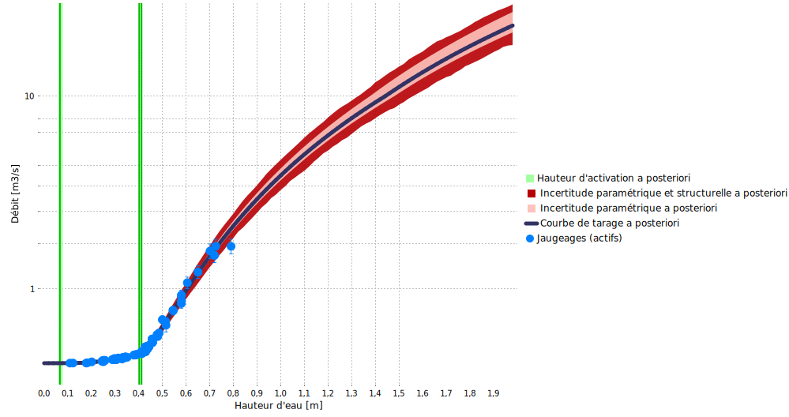

> Téléchargez le fichier BaRatinAGE de ce cas d’étude : [Charbonnieres-CharbonnieresLesBains.bam](/bam/Charbonnieres-CharbonnieresLesBains.bam)

# Analyse hydraulique

Cette [station](https://bdoh.irstea.fr/YZERON/station/V301502301) fait partie de [l'observatoire du bassin versant de l’Yzeron](https://bdoh.irstea.fr/YZERON/) qui suit plusieurs bassins peri-urbains autour de la ville de Lyon depuis 1997. Un déversoir de type "triangle tronqué" est utilisé à cette station. Cette géométrie est rencontrée assez fréquemment en pratique, mais sa modélisation dans le cadre de BaRatin n'est pas triviale car l'équation exacte de ce déversoir n'est pas compatible avec les hypothèses faites par BaRatin. Ce cas d'étude illustre donc comment s'en sortir avec une approximation compatible avec le cadre imposé par BaRatin.

 Figure 1. Analyse des contrôles hydrauliques pour le ruisseau de Charbonnières à Charbonnières-Les-Bains. Haut: photo prise depuis l'aval, avec vue du déversoir "triangle tronqué" inséré dans un déversoir rectangulaire plus large (photo: M. Lagouy); bas: schéma d'un déversoir de type "triangle tronqué" pris isolément.

La partie problématique de cette configuration hydraulique est le déversoir de type "triangle tronqué" inséré dans le plus large déversoir rectangulaire, et qui est schématisé en isolation dans la Figure 1. Le déversoir "triangle tronqué" est constitué d'un déversoir triangulaire dont l’évasement s'interrompt à partir d’une certaine hauteur pour être bordé de parois verticales. L'équation de ce type de déversoir au-dessus de la cote $b'$ à laquelle les bords du triangle rencontrent les parois verticales est donnée ci-dessous. Elle peut être interprétée comme l’ajout d'un déversoir triangulaire « négatif » au déversoir triangulaire réel pour retrancher l’excès de section mouillée quand la hauteur d’eau atteint les parois verticales.

$$
Q(H)=\underbrace{C_t \sqrt{2g}\tan({\nu/2})}_{a_1}(H-b)^c - \underbrace{C_t \sqrt{2g}\tan({\nu/2})}_{a_2}(H-b')^c
$$

Cette équation ne rentre pas dans le cadre de BaRatin pour les raisons suivantes :

1. Elle ne peut pas être factorisée sous la forme d'une équation puissance simple de type $Q(H)=a(H-b)^c$
2. Il semblerait naturel d'utiliser une soustraction de deux contrôles, mais cette approche ne fonctionne pas car :
    a. BaRatin ne permet pas de soustraire des équations puissance, seulement de les ajouter; on serait tenté de dire qu'il suffit alors d'ajouter un contrôle avec un coefficient $a'_2=-a_2$ négatif, mais BaRatin n'autorise pas les coefficients négatifs.
    b. Les paramètres des 2 contrôles qu'il faudrait soustraire sont liés : en particulier ils ont les mêmes coefficients $(a_1=a_2)$ et le même exposant $c$. BaRatin ne permet pas d'imposer de tels liens.
    
Ces contraintes imposées par BaRatin sont liées à la [formulation générale de la courbe de tarage](/fr/doc/topics/courbe-de-tarage/), et en particulier à la nécessité de résoudre une équation de continuité. Nous décrivons à la fin de cette page des pistes en cours d'investigation pour contourner ces contraintes, mais en attendant une approche par approximation est nécessaire pour "faire rentrer" ce type de contrôle dans le cadre de BaRatin. Un moyen commode de modéliser ce type de situation est d'utiliser un déversoir triangulaire pour les hauteurs inférieures à $b'$, puis de le remplacer par un déversoir rectangulaire pour les hauteurs supérieures à $b'$. La cote du fond de ce rectangle (offset) devrait être estimée au-dessus de la côte du fond du triangle, et l'avantage est que l'exposant $c=1.5$ correspond plus à la géométrie contrainte latéralement par les parois verticales (à comparer avec l'exposant $c=2.5$ du triangle). Eventuellement, une transition acceptable entre les approximations triangles et rectangles peut être obtenue avec un déversoir parabolique équivalent, d'offset intermédiaire et de dimensions appropriées.

Dans le cas particulier du ruisseau de Charbonnières, nous adoptons la configuration approximative suivante (conduisant à la matrice des contrôles ci-après) :

1. Déversoir triangulaire pour $H<b'$
2. Remplacement par un déversoir rectangulaire équivalent pour $H \geq b'$
3. Ajout d'un déversoir rectangulaire plus large représentant le rectangle dans lequel le triangle tronqué est encastré pour $H \geq b'$

$$
\begin{array}{|c|c|c|}
\hline
  \text{Contrôle} & \text{Nature} & \text{Type} \\ 
\hline
     1 & \text{Déversoir triangulaire} & \text{section} \\ 
\hline
     2 & \text{Déversoir rectangulaire approximant le triangle tronqué} & \text{section} \\ 
\hline
     3 & \text{Déversoir rectangulaire large} & \text{section} \\ 
\hline
\end{array}
$$

$$
\begin{array}{|c|}
\hline
  &\text{contrôle 1} & \text{contrôle 2} & \text{contrôle 3}\\
\hline
  \text{segment 1} &\color{lime}{1} & &\\
\hline
  \text{segment 2} & \color{darkslategray}{0} & \color{lime}{1} &\\
\hline
  \text{segment 3} & \color{darkslategray}{0} & \color{lime}{1} & \color{lime}{1} \\
\hline
\end{array}
$$

# Spécification des a priori

Une fois la configuration hydraulique choisie, la spécification des a priori peut être effectuée comme suit :

* Le contrôle 1 (triangle) s'active à $\kappa = 7.2 \mathrm{cm} \pm 1 \mathrm{cm}$ et l'angle d'ouverture est égal à  $\nu = 90° \pm 2°$
* Le contrôle 2 (rectangle approximant le triangle tronqué) s'active à $\kappa = 40.3 \mathrm{cm} \pm 0.5 \mathrm{cm}$ et a pour largeur $B_w = 70 \mathrm{cm} \pm 3 \mathrm{cm}$
* Le contrôle 3 (rectangle large ajouté au rectangle ci-dessus) s'active à $\kappa = 40.4 \mathrm{cm} \pm 3 \mathrm{cm}$. En théorie on souhaiterait spécifier une hauteur d'activation égale à la précédente, mais en pratique on la spécifie $1 \mathrm{mm}$ au-dessus pour éviter un message d'erreur du au fait que BaRatin impose des hauteurs d'activation strictement croissantes dans l'ordre des contrôles. Ce rectangle large a pour largeur $B_w = 467 \mathrm{cm} \pm 2 \mathrm{cm}$

La courbe de tarage a priori qui résulte de ces spécifications est montrée ci-dessous, et elle est déjà relativement précise, comme c'est souvent le cas lorsque des déversoirs artificiels sont utilisés.

 

 Figure 2. Courbe de tarage a priori pour le ruisseau de Charbonnières à Charbonnières-Les-Bains (l'axe des débits est en échelle log).

# Jaugeages et courbe de tarage a posteriori

88 jaugeages peuvent être utilisés pour estimer la courbe de tarage a posteriori. Les jaugeages les plus hauts (autour de $2 \mathrm{m}^3.\mathrm{s}^{−1}$) correspondent à des crues relativement fréquentes sur ce bassin, et restent bien en deçà des plus forts débits observés à cette station, puisqu'un débit environ 10 fois plus important a été estimé lors de la crue de novembre 2016. La courbe de tarage a posteriori ci-dessous suggère que les jaugeages ont permis de réduire l'incertitude de la courbe de tarage a priori pour les faibles débits, mais que l'extrapolation vers les forts débits reste très incertaine. 

 

 Figure 3. Courbe de tarage a posteriori pour le ruisseau de Charbonnières à Charbonnières-Les-Bains (l'axe des débits est en échelle log).

Une analyse plus poussée des paramètres estimés a posteriori révèle que la cote du fond du rectangle approximant le triangle tronqué est d'environ $b_2=22 \mathrm{cm}$, ce qui est bien au-dessus de la cote du fond du triangle tronqué $(b_1=7 \mathrm{cm})$ mais en-dessous de la cote du fond du rectangle large $(b_3=41 \mathrm{cm})$. La Figure ci-dessous illustre la géométrie obtenue à partir de ces paramètres estimés.

 

 Figure 4. Géométries estimées du triangle actif pour $H < 41 \mathrm{cm}$ et du rectangle équivalent qui le remplace lorsque $H \geq 41 \mathrm{cm}$.

# Approches alternatives

Deux approches sont en cours d'investigation pour utiliser des contrôle comme celui de Charbonnières qui n'entrent dans le cadre classique de BaRatin. Ces deux approches ne sont pas encore disponibles dans BaRatinAGE, mais elles sont d'ores et déjà implémentées dans [RBaM](/fr/doc/case/rbam). Nous travaillons à leur documentation et proposerons prochainement des cas d'étude pour illustrer leur utilisation. Ces deux approches sont les suivantes :

1. Ecrire "à la main" l'équation du contrôle: ceci peut etre fait dans RBaM via un modèle particulier nommé [`TextFileModel`](https://github.com/BaM-tools/RBaM/blob/main/vignettes/TextFileModel.Rmd) qui permet de définir un nouveau modèle "à la volée" à partir de son équation.
2. Déduire l'équation du contrôle à partir de sa bathymétrie. Ceci est possible pour un contrôle de type section via le modèle `HydraulicControl_section` implementé dans RBaM et en cours de documentation.

Si les deux approches ci-dessus devraient permettrent d'estimer les paramètres d'un contrôle quelconque pris en isolation, elles ne permettront pas forcément d'estimer une combinaison de plusieurs de ces contrôles dans une courbe de tarage multi-segments. Comme mentionné précédemment, la résolution de l'équation de continuité est en effet plus compliquée hors du cadre des équations puissance simples imposé par BaRatin. En particulier, cette équation n'a en général pas de solution explicite, et existence et unicité de cette solution ne sont pas toujours assurées. 

