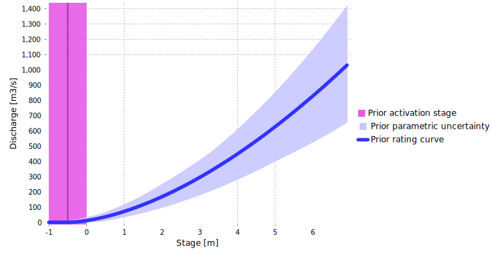

> Download the BaRatinAGE file for this case study: [Isere-Grenoble.bam](/bam/Isere-Grenoble.bam)

# Hydraulic analysis

This [station](https://ense3.grenoble-inp.fr/fr/plateformes/station-hydrometrique-isere-campus) can be modeled with a single control as a wide rectangular channel (see Figure below). Even the lowest flows do not show a section control, and overbank flows are strictly limited by close dikes. The impact of the overflow on the toe of the wooded embankments is negligible due to the very rough and very narrow way of this additional channel. The controlling channel has a relatively uniform rectangular cross-section upstream and downstream of the station. The cross-section of the gaugings is considered to be representative of the channel average cross-section.

$$
\begin{array}{|c|c|c|}
\hline
  \text{Control} & \text{Nature} & \text{Type} \\ 
\hline
     1 & \text{Channelised between dikes} & \text{channel} \\ 
\hline
\end{array}
$$

 Figure 1. Analysis of hydraulic controls for the Isère River at Grenoble-Campus. (a) upstream view of the channel; (b) topographical survey of the gauging cross-section, representative of the average channel.

Since a single control is needed, the control matrix is straightforward:

$$
\begin{array}{|c|}
\hline
  &\text{contrôle 1} \\
\hline
  \text{segment 1} &\color{lime}{1}\\
\hline
\end{array}
$$

The minimum stage $h_{min}$ of the rating curve is lower than the lowest measured stages, since the latter are are high enough above the bottom for the single control channel to remain valid. The maximum stage $h_{max}$ can be taken as the crest level of the dikes, beyond which new controls or circumvention of the station will appear.

# Prior specification

Prior specification for the unique channel control is performed as follows:

* Based on observations and on the cross-section, it is possible to say that the control channel is activated at a water level of $\kappa = -0.5 \mathrm{m} \pm 0.5 \mathrm{m}$
* According to the available cross-section, the width of the representative channel is estimated at $B_w = 65 \mathrm{m} \pm 10 \mathrm{m}$
* Since the bed is clear, channelised and well-maintained a relatively low roughness is estimated, $K_S = 25 \pm 5$
* Channel slope was estimated from maps at $S = 0.0005 \pm 0.00025$.

The resulting prior rating curve is shown below.

 

 Figure 2. Prior rating curve for the Isère River at Grenoble-Campus.

# Gaugings and posterior rating curve

A very high number of gaugings can be used for rating curve estimation, since 147 gaugings are available on the period 2018-2024, 4during which no noticeable rating shift occurred. These gaugings span a large discharge range since the highest ones correspond to discharge values reached by a 10-year flood or so.

The combination of a fairly simple rating curve with a large number of gaugings leads to a posterior rating curve affected by small uncertainties. The agreement between the curve and the gaugings is excellent for low to medium flows.  However, the highest 7 gaugings happen to all lie below the curve. Although gaugings and rating curve uncertainties can partly explain this discrepancy, its systematic nature may lead to legitimately question the validity of the hydraulic configuration at high flows. 

 

 Figure 3. Posterior rating curve for the Isère River at Grenoble-Campus.

