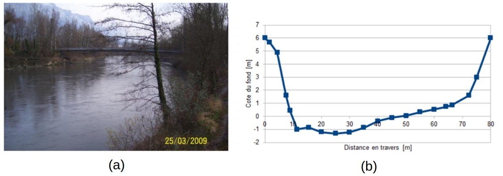
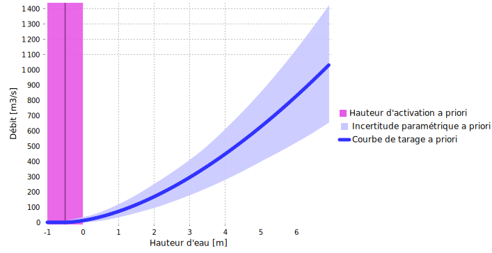
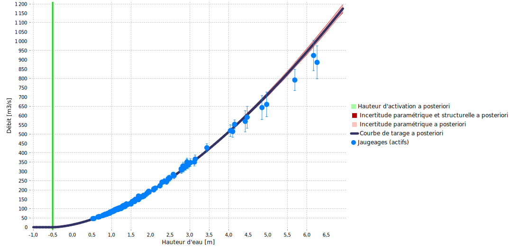

> Téléchargez le fichier BaRatinAGE de ce cas d'étude: [Isere-Grenoble.bam](/bam/Isere-Grenoble.bam)

# Analyse hydraulique

Cette [station](https://ense3.grenoble-inp.fr/fr/plateformes/station-hydrometrique-isere-campus) peut se modéliser avec un seul contrôle par un chenal rectangulaire large (voir Figure ci-dessous). En effet, même les débits les plus faibles ne font pas apparaître de contrôle par section, et les débordements sont fortement limités par des digues très serrées. L'impact du débordement sur les pieds de digues boisés est très faible en raison de la forte rugosité et de la très faible largeur de ce lit moyen additionnel. Le chenal de contrôle présente un gabarit rectangulaire relativement uniforme en amont en aval de la station, dont la section de jaugeage est jugée représentative.

$$
\begin{array}{|c|c|c|}
\hline
  \text{Contrôle} & \text{Nature} & \text{Type} \\ 
\hline
     1 & \text{Lit endigué} & \text{chenal} \\ 
\hline
\end{array}
$$

 Figure 1. Analyse des contrôles hydrauliques pour l’Isère à Grenoble-Campus. (a) vue du chenal vers l'amont ; (b) levé topographique de la section de jaugeage, représentative du chenal moyen.

Etant donné qu'il n'y a qu'un seul contrôle, la matrice des contrôles est triviale:

$$
\begin{array}{|c|}
\hline
  &\text{contrôle 1} \\
\hline
  \text{segment 1} &\color{lime}{1}\\
\hline
\end{array}
$$

La hauteur minimale $h_{min}$ d’application de la courbe de tarage est inférieure aux plus faibles hauteurs mesurées, puisqu’elles restent suffisamment au-dessus du niveau du fond et que le contrôle chenal unique reste valable. La hauteur maximale $h_{max}$ d’application de la courbe de tarage peut être prise égale à la hauteur de submersion des digues, au-delà de laquelle de nouveaux contrôles, voire un contournement de la station vont se manifester.

# Spécification des a priori

La spécification des a priori de l’unique contrôle est basée sur les raisonnements suivants:

* D'après les observations et le profil en travers, il est possible de dire que le contrôle chenal s'active pour une hauteur échelle de $\kappa = -0.5 \mathrm{m} \pm 0.5 \mathrm{m}$
* D'après le profil en travers disponible, la largeur du chenal représentatif est estimée à $B_w = 65 \mathrm{m} \pm 10 \mathrm{m}$
* La propreté du lit, sa nature endiguée et entretenue induit une rugosité assez faible, que l'on estime à $K_S = 25 \pm 5$
* La pente du chenal a été estimée à $S = 0.0005 \pm 0.00025$.

Avec ces spécifications, on obtient la courbe de tarage a priori représentée ci-dessous.

 

 Figure 2. Courbe de tarage a priori pour l’Isère à Grenoble-Campus.

# Jaugeages et courbe de tarage a posteriori

Un très grand nombre de jaugeages peut être utilisé pour raffiner la courbe de tarage a priori, puisque 147 jaugeages sont disponibles sur la période 2018-2024, au cours de laquelle aucun détarage n’a été observé. Ces jaugeages sont bien répartis sur toute la gamme de débits puisque les jaugeages les plus hauts correspondent à des débits de crue environ décennale.

La combinaison d'une courbe de tarage relativement simple et du grand nombre de jaugeages disponibles conduit à une courbe de tarage a posteriori aux incertitudes très faibles. L'ajustement de la courbe aux jaugeages est globalement très satisfaisant pour les débits faibles à moyen. Néanmoins, les 7 jaugeages les plus forts sont tous sous la courbe. Bien que les incertitudes affectant les jaugeages et la courbe expliquent une partie de cette dispersion, le caractère systématique de cette observation peut conduire à se questionner sur l'adéquation de la configuration hydraulique pour les plus forts débits. 

 

 Figure 3. Courbe de tarage a posteriori pour l’Isère à Grenoble-Campus.

