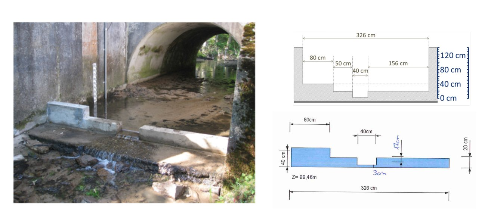

> Download the BaRatinAGE file for this case study: [Mercier-D610.bam](/bam/Mercier-D610.bam)

# Hydraulic analysis

This [station](https://bdoh.irstea.fr/YZERON/station/V3015810) is part of the [Yzeron observatory](https://bdoh.irstea.fr/YZERON/) monitoring several peri-urban catchments around the city of Lyon since 1997. It is of interest because the stage-discharge relation is controlled by a combination of artificial weirs whose properties are known quite precisely (see Figure below). Priors can therefore be specified easily and already lead to a fairly precise prior rating curve.

 Figure 1. Analysis of hydraulic controls for the Mercier River at D610 road. Left: picture taken from downstream, right: weirs dimensions.

Figure 1 suggests that the hydraulic configuration is a combination of three rectangular section controls. The first one is activated when stage reaches $3\mathrm{cm}$ above the bottom (which corresponds at this station to the zero of the staff gauge). The second one is activated when stage reaches $20\mathrm{cm}$, and includes the crests on the left and on the right of the first weir. The third one is activated when stage reaches $40\mathrm{cm}$. These three controls successively add up to each other, leading to the control matrix shown below.

$$
\begin{array}{|c|c|c|}
\hline
  \text{Control} & \text{Nature} & \text{Type} \\ 
\hline
     1 & \text{Artificial rectangular weir} & \text{section} \\ 
\hline
     2 & \text{Artificial rectangular weir} & \text{section} \\ 
\hline
     3 & \text{Artificial rectangular weir} & \text{section} \\ 
\hline
\end{array}
$$

$$
\begin{array}{|c|}
\hline
  &\text{control 1} & \text{control 2} & \text{control 3}\\
\hline
  \text{segment 1} &\color{lime}{1} & &\\
\hline
  \text{segment 2} & \color{lime}{1} & \color{lime}{1} &\\
\hline
  \text{segment 3} & \color{lime}{1} & \color{lime}{1} & \color{lime}{1} \\
\hline
\end{array}
$$

# Prior specification

The dimensions given in Figure 1 lead to the following priors:

* Control 1 is activated at $\kappa = 3 \mathrm{cm} \pm 2 \mathrm{cm}$ and has a width equal to $B_w = 40 \mathrm{cm} \pm 5 \mathrm{cm}$
* Control 2 is activated at $\kappa = 20 \mathrm{cm} \pm 4 \mathrm{cm}$ and has a width equal to $B_w = 50+156=206 \mathrm{cm} \pm 20 \mathrm{cm}$
* Control 3 is activated at $\kappa = 40 \mathrm{cm} \pm 4 \mathrm{cm}$ and has a width equal to $B_w = 80 \mathrm{cm} \pm 10 \mathrm{cm}$

The resulting prior rating curve is shown below, and as expected, it is already quite precise.

 

 Figure 2. Prior rating curve for the Mercier River at D610 road.

# Gaugings and posterior rating curve

34 gaugings can be used for rating curve estimation, and the figure below highlights quite a bit of dispersion. The highest gauging remains well below the largest flows observed at this station, which may reach $2-3 \mathrm{m}^3.\mathrm{s}^{−1}$ during large floods.

 

 Figure 3. Available gaugings.

The posterior rating curve shown below suggests that the gaugings did not help in reducing the prior rating curve uncertainty. In fact, the dispersion of the gaugings leads to identifying a quite large structural uncertainty (dark red area), resulting in a quite uncertain extrapolation toward large flows. 

 

 Figure 4. Posterior rating curve for the Mercier River at D610 road.

