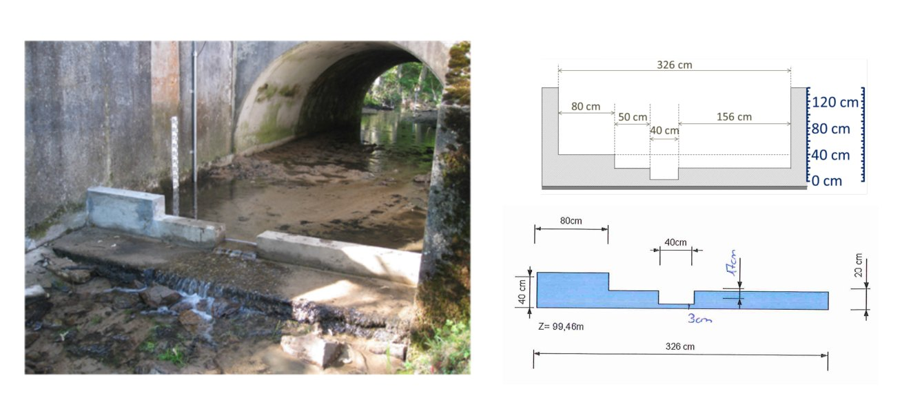
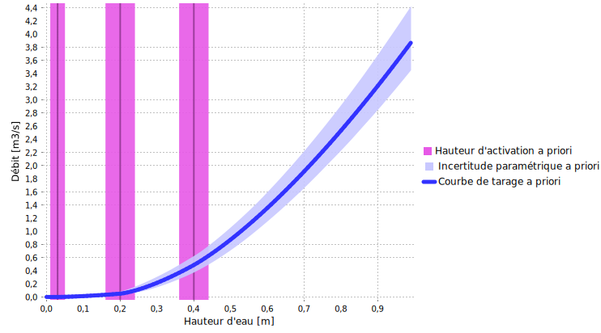
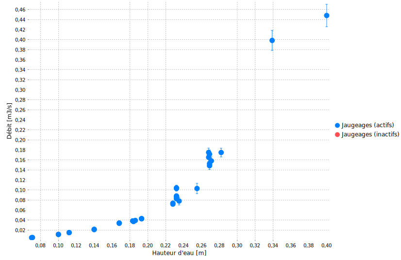
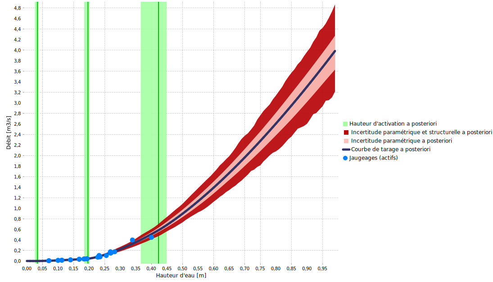

> Téléchargez le fichier BaRatinAGE de ce cas d’étude : [Mercier-D610.bam](/bam/Mercier-D610.bam)

# Analyse hydraulique

Cette [station](https://bdoh.irstea.fr/YZERON/station/V3015810) fait partie de [l'observatoire du bassin versant de l’Yzeron](https://bdoh.irstea.fr/YZERON/) qui suit plusieurs bassins peri-urbains autour de la ville de Lyon depuis 1997. Ce cas est intéressant car la relation hauteur-débit est contrôlée par une combinaison de déversoirs artificiels dont les dimensions sont bien connues (voir Figure ci-dessous). Les a priori peuvent donc être spécifiés facilement et conduire à une courbe de tarage a priori qui est déjà relativement précise.

 Figure 1. Analyse des contrôles hydrauliques pour le Mercier au pont de la D610. Gauche: photo prise depuis l'aval, droite: dimensions des déversoirs.

La Figure 1 suggère que la configuration hydraulique est une combinaison de trois contrôle de type section rectangulaire. Le premier contrôle s'active pour une hauteur de $3\mathrm{cm}$ au-dessus du fond (qui correspond au zéro de l'échelle à cette station). Le second contrôle s'active pour une hauteur de $20\mathrm{cm}$, et inclue les crêtes à la gauche et à la droite du premier contrôle. Le troisième contrôle s'active pour une hauteur de $40\mathrm{cm}$. Ces trois contrôles s'ajoutent successivement les uns aux autres, conduisant à la matrice des contrôles ci-dessous.

$$
\begin{array}{|c|c|c|}
\hline
  \text{Contrôle} & \text{Nature} & \text{Type} \\ 
\hline
     1 & \text{Déversoir rectangulaire artificiel} & \text{section} \\ 
\hline
     2 & \text{Déversoir rectangulaire artificiel} & \text{section} \\ 
\hline
     3 & \text{Déversoir rectangulaire artificiel} & \text{section} \\ 
\hline
\end{array}
$$

$$
\begin{array}{|c|}
\hline
  &\text{contrôle 1} & \text{contrôle 2} & \text{contrôle 3}\\
\hline
  \text{segment 1} &\color{lime}{1} & &\\
\hline
  \text{segment 2} & \color{lime}{1} & \color{lime}{1} &\\
\hline
  \text{segment 3} & \color{lime}{1} & \color{lime}{1} & \color{lime}{1} \\
\hline
\end{array}
$$

# Spécification des a priori

Les dimensions données dans la Figure 1 conduisent aux a priori suivants :

* Le contrôle 1 s'active à $\kappa = 3 \mathrm{cm} \pm 2 \mathrm{cm}$ et a pour largeur $B_w = 40 \mathrm{cm} \pm 5 \mathrm{cm}$
* Le contrôle 2 s'active à $\kappa = 20 \mathrm{cm} \pm 4 \mathrm{cm}$ et a pour largeur $B_w = 50+156=206 \mathrm{cm} \pm 20 \mathrm{cm}$
* Le contrôle 3 s'active à $\kappa = 40 \mathrm{cm} \pm 4 \mathrm{cm}$ et a pour largeur $B_w = 80 \mathrm{cm} \pm 10 \mathrm{cm}$

La courbe de tarage a priori qui en résulte est montrée ci-dessous, et comme attendu elle est déjà relativement précise.

 

 Figure 2. Courbe de tarage a priori pour le Mercier au pont de la D610.

# Jaugeages et courbe de tarage a posteriori

34 jaugeages peuvent être utilisés pour estimer la courbe de tarage a posteriori, et la Figure ci-dessous indique une dispersion notable. Le jaugeage le plus haut reste bien en deçà des plus forts débits observés à cette station, qui peuvent atteindre $2-3 \mathrm{m}^3.\mathrm{s}^{−1}$ lors des fortes crues.

 

 Figure 3. Jaugeages disponibles.

La courbe de tarage a posteriori ci-dessous suggère que les jaugeages n'ont pas permis de réduire l'incertitude de la courbe de tarage a priori. En fait, leur dispersion conduit à identifier une incertude structurelle forte (zone rouge foncé), qui conduit à une extrapolation très incertaine vers les plus forts débits.

 

 Figure 4. Courbe de tarage a posteriori pour le Mercier au pont de la D610.

