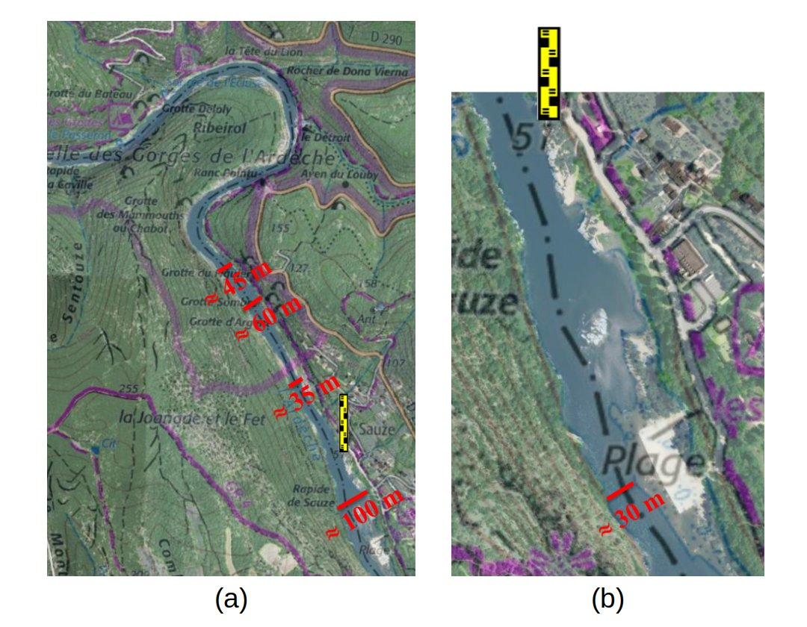

```{r setup, include=FALSE}
knitr::opts_chunk$set(echo=TRUE,results='hide',
                      fig.path = "en/fig-")
reRun=FALSE # When TRUE, BaM is re-run, potentially changing runs and hence figures
```

# Introduction

BaM (Bayesian Modeling) est un outil permettant d'estimer un modèle par inférence Bayésienne - n'importe quel modèle en principe, mais ici nous nous intéresserons au [modèle de courbe de tarage](/fr/doc/topics/courbe-de-tarage) de BaRatin. Le package [RBaM](https://github.com/BaM-tools/RBaM) est une interface `R` au [code de calcul de BaM](https://github.com/BaM-tools/BaM). Il permet de définir les objets qui constituent les briques de base d'un cas d’étude opéré avec BaM, et fournit les outils d'analyse associés. Son utilisation typique peut être résumée comme suit:

1. Rassembler les données qui serviront à caler le modèle.
2. Définir le modèle et spécifier des distributions a priori pour ses paramètres.
3. Effectuer un inférence Bayésienne par simulation MCMC.
4. Effectuer les prédictions désirées.

`RBaM` doit être installé une fois lors de la première utilisation, puis chargé avant chaque utilisation. 

```{r message=FALSE}
# devtools::install_github('BaM-tools/RBaM') # Première utilisation : installer le package depuis GitHub
library(RBaM) # Charger le package
```

Le catalogue des distributions a priori disponibles peut être affiché comme indiqué ci-dessous. La commande montre aussi le catalogue des modèles disponibles, mais ici nous aborderons uniquement le modèle BaRatin.

```{r results='markup'}
getCatalogue()
```

# Estimation d'une courbe de tarage BaRatin

La première chose à faire est de définir un dossier faisant office d'espace de travail (workspace), dans lequel seront sauvegardés tous les resultats.

```{r}
workspace=file.path(getwd(),'BaM_workspace')
```

L'exemple utilisé ci-dessous est la courbe de tarage de l'[Ardèche](https://fr.wikipedia.org/wiki/Ard%C3%A8che_(rivi%C3%A8re)) à la station de [Sauze-Saint-Martin](https://www.hydro.eaufrance.fr/stationhydro/V506401001/fiche). 

## Définition des données de jaugeage

Les données de jaugeage utilisées pour estimer cette courbe de tarage sont incluses dans le package `RBaM` sous la forme d'un dataframe nommé `SauzeGaugings` qui contient trois colonnes : la hauteur `H`, le débit `Q` et l'incertitude-type du débit `uQ`. **ATTENTION**: l'incertitude est exprimée comme un *écart-type* et non sous la forme d'une *incertitude étendue* comme dans `BaRatinAGE`. Cette dernière est égale à 1.96 fois l’écart-type, et correspond à la demie-longueur d'un intervalle d'incertitude à 95\% sous hypothèse Gaussienne.

```{r}
# Tracé des données du data frame SauzeGaugings
# Notez le facteur 1.96 pour passer de l'incertitude-type à un intervalle à 95%
plot(x=SauzeGaugings$H,y=SauzeGaugings$Q)
segments(x0=SauzeGaugings$H,y0=SauzeGaugings$Q-1.96*SauzeGaugings$uQ,y1=SauzeGaugings$Q+1.96*SauzeGaugings$uQ)
```

Le code ci-dessous est utilisé pour définir les variables d'entrée/sortie du modèle. Le modèle utilisé ici étant une courbe de tarage, la hauteur est la variable d’entrée et le débit la variable de sortie. L'incertitude-type sur le débit jaugé est également indiquée, et en cas d'omission elle sera considérée comme nulle. Notez qu'encore une fois c'est l'incertitude-type qui est attendue par `RBaM`\, et non l'incertitude étendue comme dans `BaRatinAGE`. 

```{r}
# Définition du jeu de données de calage:  
# variable d’entrée (X), de sortie (Y) et incertitude-type sur la variable de sortie (Yu).
# Une copie de ce jeu de données sera écrite dans le dossier défini dans data.dir.
D=dataset(X=SauzeGaugings['H'],Y=SauzeGaugings['Q'],Yu=SauzeGaugings['uQ'],data.dir=workspace)

```

## Définition du modèle de courbe de tarage

La station de Sauze-Saint-Martin est caractérisée par une configuration hydraulique assez simple à 2 contrôles: un radier naturel fait office de contrôle section pour les basses eaux, puis un chenal rectangulaire large contrôle les hautes eaux, comme illustré ci-dessous. 

<br>

<p style="text-align: center;color: gray;"> Configuration hydraulique pour l'Ardèche à Sauze-Saint-Martin (l'eau s’écoule du haut vers le bas de l'image, l’échelle est indiquée en jaune). (a) Propriétés du chenal contrôlant les hautes eaux ; (b) zoom sur la section de contrôle des basses eaux.</p>

Le code ci-dessous spécifie les distributions a priori des 6 paramètres de la courbe de tarage: hauteur d'activation, coefficient et exposant de chacun des deux contrôles. Pour plus de détails sur la spécification des a priori à cette station, vous pouvez consulter l'article de [Le Coz et al., 2014](https://hal.science/hal-00934237).

```{r}
# Paramètres du contrôle section en basses eaux: hauteur d'activation k, coefficient a et exposant c
k1=parameter(name='k1',init=-0.5,prior.dist='Uniform',prior.par=c(-1.5,0))
a1=parameter(name='a1',init=50,prior.dist='LogNormal',prior.par=c(log(50),1))
c1=parameter(name='c1',init=1.5,prior.dist='Gaussian',prior.par=c(1.5,0.05))
# Paramètres du contrôle chenal en hautes eaux: hauteur d'activation k, coefficient a et exposant c
k2=parameter(name='k2',init=1,prior.dist='Gaussian',prior.par=c(1,1))
a2=parameter(name='a2',init=100,prior.dist='LogNormal',prior.par=c(log(100),1))
c2=parameter(name='c2',init=1.67,prior.dist='Gaussian',prior.par=c(1.67,0.05))
```

La matrice des contrôles est ensuite définie comme suit :

```{r}
# Matrice des contrôles : les colonnes représentent les contrôles, les lignes les segments de hauteur.
# Ici la matrice signifie que le contrôle section est l'unique contrôle actif en basses eaux,
# puis le contrôle chenal est l'unique contrôle actif en hautes eaux.
controlMatrix=rbind(c(1,0),
                    c(0,1))
```

Pour finir, toutes ces informations sont transmises à `RBaM` en créant un objet de type `model` comme indiqué ci-dessous :

```{r}
# Tout réunir dans un objet de type "model"
M=model(ID='BaRatin', # ID du modèle considéré - ici, BaRatin
        nX=1,nY=1, # nombre de variables d’entrée/sortie : ici, 1 entrée (H) et 1 sortie (Q)
        par=list(k1,a1,c1,k2,a2,c2), # liste des paramètres du modèle - bien respecter l'ordre (k,a,c) pour chaque contrôle successif
        xtra=xtraModelInfo(object=controlMatrix)) # faire passer la matrice des contrôles via xtraModelInfo() comme indiqué ici
```

Nous avons donc à présent défini le modèle à estimer `M` ainsi que les données de calage `D`: tout est paré pour le calage !

## Lancer BaM et explorer les simulations MCMC

La fonction `BaM` est utilisée pour effectuer l'estimation des paramètres. Ceci lancera un [simulateur MCMC](/fr/doc/topics/mcmc) et sauvegardera les résultats dans le workspace.

```{r results='markup', eval=reRun}
BaM(mod=M,data=D) # Estimer les paramètres du modèle M en utilisant les données de calage D
```

Les échantillons MCMC peuvent à présent être lus. Il y a 2 fichiers MCMC: 'Results_MCMC.txt' contient les simulations brutes et est donc assez volumineux. 'Results_Cooking.txt' contient les simulations post-traitées avec un 'brûlage' de la première partie des itérations et un 'affinage' des simulations restantes (voir [cette page](/fr/doc/topics/mcmc) pour des explications plus détaillées). Ce dernier fichier devrait être favorisé dans la plupart des cas. Les propriétés des simulations MCMC peuvent évidemment être modifiées si nécessaire : pour cela voir les pages d'aide `?BaM`, `?mcmcOptions` et `?mcmcCooking`.

```{r results='markup'}
# Lecture des simulations MCMC post-traitées
MCMC=readMCMC(file.path(workspace,'Results_Cooking.txt'))
head(MCMC)
```

Quelques fonctions sont fournies avec `RBaM` pour explorer les simulations MCMC. La première fonction trace les valeurs simulées pour chaque paramètre ("trace plot") et est utile pour juger visuellement de la convergence des simulations MCMC.

```{r fig.height=6, fig.width=9}
# Trace plot pour chaque paramètre, utile pour évaluer la convergence
plots=tracePlot(MCMC)
patchwork::wrap_plots(plots,ncol=3)
```

La seconde fonction trace la densité a posteriori de chaque paramètre.

```{r fig.height=6, fig.width=9, warning=FALSE}
# Densité  pour chaque paramètre
plots=densityPlot(MCMC)
patchwork::wrap_plots(plots,ncol=3)
```

La troisième fonction crée un  "[violin plot](https://en.wikipedia.org/wiki/Violin_plot)" qui est utile pour comparer les distributions a posteriori de plusieurs paramètres dans un unique graphique (ici par exemple l'exposant de chaque contrôle).

```{r fig.height=3, fig.width=6}
# Violin plot, utile pour des paramètres 'comparables'
violinPlot(MCMC[c('c1','c2')])
```

## Estimer la courbe de tarage et ses incertitudes

La courbe de tarage et ses incertitudes peuvent être estimées à partir des simulations MCMC. Pour y parvenir, il faut d'abord définir la grille de valeurs de hauteur sur laquelle la courbe de tarage est calculée. Il faut ensuite définir un objet de type `prediction` qui spécifie quels types d'incertitude doivent être propagés. Par exemple, l'incertitude totale réclame de propager à la fois l'incertitude paramétrique (induite par la connaissance imparfaite des paramètres de la courbe) et l'[incertitude structurelle](/fr/doc/baratinage/erreurs-structurelles/) (induite par le caractère approximatif de toute courbe de tarage).  

```{r}
# Définition de la grille de hauteurs sur laquelle la courbe de tarage est calculée
hgrid=data.frame(H=seq(-1,7,0.1))
# Définition d'un objet 'prediction' pour l'incertitude totale
totalU=prediction(X=hgrid, # hauteurs
                  spagFiles='hQ_totalU.spag', # fichier dans lequel les prédictions sont sauvegardées
                  data.dir=workspace, # Une copie des jeux de données sera écrite dans ce dossier
                  doParametric=TRUE, # propager l'incertitude paramétrique ?
                  doStructural=TRUE) # propager l'incertitude structurelle ?
```

La propagation d'incertitude est ensuite effectuée en utilisant la même fonction `BaM` que précédemment, mais en mode "prédiction". Pour cela les options `doCalib=FALSE` et `doPred=TRUE` indiquent que le calage a déjà été effectué, et que la tâche à accomplir est d'utiliser les simulations MCMC existantes pour effectuer une prédiction incertaine (en l'occurrence, estimer la courbe de tarage et ses incertitudes). Notez que le mot "prédiction" est utilisé ici dans un sens très générique qui signifie "estimer les sorties incertaines du modèle".

```{r, eval=reRun}
# Re-lancer BaM, mais en mode "prédiction"
BaM(mod=M,data=D, # modèle et données
    pred=totalU, # prédiction à effectuer
    doCalib=FALSE,doPred=TRUE) # Ne pas re-caler mais faire les prédictions
```

Le fichier 'spaghetti' résultant de l'appel de cette fonction peut être lu dans le workspace et visualisé comme indiqué ci-dessous. Bien que les spaghetti constituent les sorties brutes des prédictions, il est souvent plus pratique de tracer des intervalles d'incertitude. Ceux-ci ont été calculés automatiquement par `BaM` et sauvegardés dans les fichiers portant l’extension '.env' (comme 'enveloppe').

```{r fig.height=4, fig.width=9}
par(mfrow=c(1,2)) # 2 figures sur la même ligne
# spaghetti représentant l'incertitude totale
Q=read.table(file.path(workspace,'hQ_totalU.spag'))
matplot(hgrid$H,Q,col='red',type='l',lty=1,main='spaghetti')
# Intervalles à 95% pour l'incertitude totale
Q=read.table(file.path(workspace,'hQ_totalU.env'),header=T)
matplot(hgrid$H,Q[,2:3],col='red',type='l',lty=1,main='uncertainty envelop')
```

La même logique peut être utilisée pour estimer l'incertitude paramétrique seule (ce qui revient à "désactiver" l'incertitude structurelle) et la courbe de tarage maxpost (ce qui revient à "désactiver" les incertitudes paramétriques et structurelle).

```{r, eval=reRun}
# Définir un objet 'prediction' pour l'incertitude paramétrique seule - notez le doStructural=FALSE
paramU=prediction(X=hgrid,spagFiles='hQ_paramU.spag',data.dir=workspace,
                  doParametric=TRUE,doStructural=FALSE)
# Définir un objet 'prediction' sans incertitude, ce qui conduit à la courbe de tarage maxpost
maxpost=prediction(X=hgrid,spagFiles='hQ_maxpost.spag',data.dir=workspace,
                  doParametric=FALSE,doStructural=FALSE)
# Lancer BaM en mode prédiction
BaM(mod=M,data=D, # model and data
    pred=list(paramU,maxpost), # prédictions à effectuer - quand il y en a plusieurs, il faut les rassembler dans une liste
    doCalib=FALSE,doPred=TRUE) # Ne pas re-caler mais faire les prédictions
```

Il est maintenant possible de recréer la figure proposée par `BaRatinAGE`, qui superpose l'incertitude totale, l'incertitude paramétrique, la courbe de tarage maxpost et les jaugeages.

```{r fig.height=6, fig.width=9}
# Lire et tracer en rouge l'enveloppe représentant l'incertitude totale
Q=read.table(file.path(workspace,'hQ_totalU.env'),header=T)
matplot(hgrid$H,Q[,2:3],col='red',type='l',lty=1)
# Lire et tracer en rose l'enveloppe représentant l'incertitude paramétrique
Q=read.table(file.path(workspace,'hQ_paramU.env'),header=T)
matplot(hgrid$H,Q[,2:3],col='pink',type='l',lty=1,add=TRUE)
# Lire et tracer en noir la courbe de tarage maxpost
Q=read.table(file.path(workspace,'hQ_maxpost.spag'))
matplot(hgrid$H,Q,col='black',type='l',lty=1,add=TRUE)
# Ajouter les jaugeages
points(x=SauzeGaugings$H,y=SauzeGaugings$Q,pch=19)
segments(x0=SauzeGaugings$H,y0=SauzeGaugings$Q-1.96*SauzeGaugings$uQ,y1=SauzeGaugings$Q+1.96*SauzeGaugings$uQ)
```

## Production d'un hydrogramme incertain

La production d'un hydrogramme incertain est quasiment identique à celle d'une courbe de tarage incertaine : la seule chose à changer est de remplacer la grille de hauteurs par un limnigramme, comme celui représenté ci-dessous par exemple (le fichier de données peut être téléchargé [ici](SauzeHt.csv))

```{r fig.height=4, fig.width=9}
# Lecture et tracé du limnigramme
ht=read.table('SauzeHt.csv',header=T,sep=';',colClasses=c('POSIXct','numeric'))
plot(ht,type='l')
```

Le code est le même que précédemment, à l'exception du fait que les valeurs de hauteur utilisées dans les prédictions proviennent du limnigramme (`ht['stage']`) plutôt que de la grille de hauteur (`hgrid`).

```{r, eval=reRun}
# Objet 'prediction' pour l'incertitude totale
totalU=prediction(X=ht['stage'],spagFiles='Qt_totalU.spag',data.dir=workspace, 
                  doParametric=TRUE,doStructural=TRUE) 
# Objet 'prediction' pour l'incertitude paramétrique
paramU=prediction(X=ht['stage'],spagFiles='Qt_paramU.spag',data.dir=workspace,
                  doParametric=TRUE,doStructural=FALSE)
# Objet 'prediction' pour l'hydrogramme maxpost
maxpost=prediction(X=ht['stage'],spagFiles='Qt_maxpost.spag',data.dir=workspace,
                  doParametric=FALSE,doStructural=FALSE)
# lancer BaM en mode prédiction
BaM(mod=M,data=D,pred=list(totalU,paramU,maxpost),doCalib=FALSE,doPred=TRUE)
```

L'hydrogramme résultant de ce calcul peut être tracé avec ses incertitudes.

```{r fig.height=6, fig.width=9}
# Incertitude totale en rouge
Q=read.table(file.path(workspace,'Qt_totalU.env'),header=T)
matplot(ht$time,Q[,2:3],col='red',type='l',lty=1)
# Incertitude paramétrique en rose
Q=read.table(file.path(workspace,'Qt_paramU.env'),header=T)
matplot(ht$time,Q[,2:3],col='pink',type='l',lty=1,lwd=2,add=TRUE)
# Hydrogramme maxpost en noir
Q=read.table(file.path(workspace,'Qt_maxpost.spag'))
matplot(ht$time,Q,col='black',type='l',lty=1,add=TRUE)
```

Notez qu'aucune incertitude n'a été considérée sur le limnigramme. Il est possible de rajouter cette composante en utilisant, plutôt qu'un unique limnigramme, des "spaghetti de limnigramme", c'est à dire de nombreux limnigrammes répliqués qui quantifient l'incertitude. L'exemple ci-dessous montre comment générer ces spaghetti dans le cas d'erreurs Gaussiennes indépendantes d’écart-type constant $\sigma_h=5 \mathrm{cm}$. Des modèles d’erreurs plus avancés pourraient être  utilisés (comme décrit dans [cette page](/fr/doc/topics/limni/)) mais pour le moment `RBaM` ne propose pas de fonctionnalité dédiée - la génération des spaghetti de limnigramme reste donc de votre responsabilité.

```{r fig.height=4, fig.width=9}
set.seed(82487)
# Créer 100 réplications pour ht, avec un écart-type de 5cm
htrep=matrix(rnorm(n=NROW(ht)*100,mean=ht$stage,sd=0.05),nrow=NROW(ht),ncol=100)
# Tracer les spaghetti de limnigramme 
matplot(ht$time,htrep,col='gray',type='l',lty=1)
```

Le reste de l'analyse se déroule comme précédemment, en remplaçant le limnigramme unique par les spaghetti de limnigramme.

```{r, eval=reRun}
# Incertitude totale
totalU=prediction(X=list(htrep), # spaghetti, doivent obligatoirement être placés dans une liste
                  spagFiles='Qt_param_struct_hU.spag', data.dir=workspace,
                  doParametric=TRUE, doStructural=TRUE)
# Incertitudes param+hauteur (incertitude structurelle désactivée)
param_hU=prediction(X=list(htrep),spagFiles='Qt_param_hU.spag',data.dir=workspace,
                  doParametric=TRUE,doStructural=FALSE)
# Incertitude de hauteur seulement  (incertitudes structurelle et paramétrique désactivées)
hU=prediction(X=list(htrep),spagFiles='Qt_hU.spag',data.dir=workspace,
                  doParametric=FALSE,doStructural=FALSE)
# lancer BaM en mode prédiction
BaM(mod=M,data=D,pred=list(totalU,param_hU,hU),doCalib=FALSE,doPred=TRUE)
```

Ceci conduit à la figure ci-dessous. Notez qu'un axe des ordonnées logarithmique a été utilise pour mettre en avant les moyennes et basses eaux pour lesquelles l'incertitude due aux hauteurs est notable. 

```{r fig.height=6, fig.width=9}
# Incertitude totale en rouge
Q=read.table(file.path(workspace,'Qt_param_struct_hU.env'),header=T)
matplot(ht$time,Q[,2:3],col='red',type='l',lty=1,log='y')
# Incertitude paramétrique+hauteur en rose
Q=read.table(file.path(workspace,'Qt_param_hU.env'),header=T)
matplot(ht$time,Q[,2:3],col='pink',type='l',lty=1,lwd=2,add=TRUE)
# Incertitude hauteur en jaune
Q=read.table(file.path(workspace,'Qt_hU.env'),header=T)
matplot(ht$time,Q[,2:3],col='goldenrod1',type='l',lty=1,lwd=2,add=TRUE)
# Hydrogramme maxpost en noir
Q=read.table(file.path(workspace,'Qt_maxpost.spag'))
matplot(ht$time,Q,col='black',type='l',lty=1,add=TRUE)
```

# Conclusion

Le package `RBaM` permet de piloter BaRatin directement depuis `R` sans passer par l'interface graphique `BaRatinAGE`. Bien que cela demande un apprentissage plus long, le jeu peut en valoir la chandelle, surtout pour les utilisateurs qui sont déjà familiers avec le language `R`:

* `RBaM` offre plus de flexibilité dans l'application de BaRatin
* `RBaM` facilite l’intégration d'analyses BaRatin dans d'autres processus d'analyse existants
* `RBaM` permet d’accéder à tous les outils de l'écosystème `R`, en particulier pour préparer les données, visualiser les résultats, effectuer des analyses statistiques, etc.
* Enfin, et c'est important, `RBaM` ne se restreint pas au modèle de courbe de tarage de BaRatin. En particulier, des modèles de courbes de tarage non-univoques (par exemple dans le cas de remous variable, d'influence de la végétation, de détarages multiples etc.) sont disponibles dans `RBaM` mais pas encore dans `BaRatinAGE`. De manière générale, tout nouveau modèle sera disponible dans `RBaM` bien avant qu'il le soit dans `BaRatinAGE`.

```{r message=FALSE, warning=FALSE, include=FALSE}
# Cleanup
# unlink(workspace, recursive=TRUE)
```
