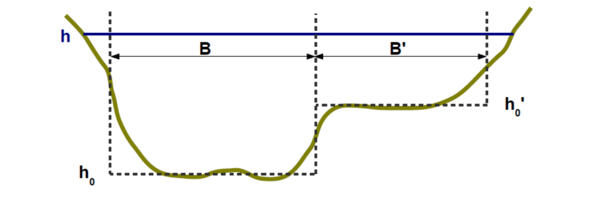

# The stage-discharge relation: hydraulic controls

In the river section where the hydrometric station is located, the relation between the water depth and the discharge is determined by the physical characteristics of the channel called "hydraulic controls" or “controls”.

## Two main types of controls

### Section control

The stage-discharge relation is determined almost solely by the geometry of the controlling cross-section, where the flow becomes critical, which is materialised by a **fall** and an almost horizontal water line upstream. Typically: rectangular weir/sill, triangular weir, pressurised orifice.

 Figure 1: Diagram of a section control (water depth h is under the influence of the fall). 

 

 Figure 2. Example of a real site. For the actual discharge at the time of the photo, the water level at the gauge (located under the bridge upstream) is controlled by the natural weir (riffles) visible in the foreground.

### Channel control

The flow is assumed to be uniform. No fall will control the water level. It is then governed by the geometry and the flow resistance of the channel, sometimes incorrectly called "roughness". The controlling channel corresponds to an homogeneous section which extends not only downstream, but also upstream of the gauge.

 Figure 3. Diagram of a channel control (the red line represents the gauge site). 

## Standard controls

Standard controls are specific hydraulic controls which have been extensively studied and for which
there are stage-discharge formulas (see [hydraulic controls](/en/doc/topics/hydraulic-controls) page).

The standard controls used in BaRatin are:

* Rectangular, triangular and parabolic weir
* Orifice
* wide rectangular, triangular and parabolic channel

In a hydraulic analysis, each identified control should be compared to a standard control, or broken down into a combination of standard controls, according to a compound channel (or “divided channel”) approach. In the example of the previous real site, the natural weir will thus be approximated by a rectangular weir equation.

## Approximation of real controls by standard controls

The assimilation of a real control to a standard control is obviously an approximation; Nevertheless, the practice shows that it is often acceptable, in the sense that it properly matches the gaugings while maintaining a physical meaning (see [hydraulic controls](/en/doc/topics/hydraulic-controls) page for details).

In a hydraulic analysis, for each newly identified control, the questions defining which standard control to consider are summarised in the following flowchart. Of course, with experience, such investigation becomes natural. The first question should always be whether the water level is controlled by a fall or not: "*If I modified this fall, and lowered or raised it, would it change the stage at the gauge?* ".

 Figure 4. Diagram for selecting a standard control to represent a real control. 

In the case of a downstream bridge or opening still not completely pressurised, there is no standard control, with a classic formula, hence the question mark. These cases are always unique, and only hydraulic modelling can help to express their probable hydraulic behaviour (see [hydraulic controls](/en/doc/topics/hydraulic-controls) page).

# Hydraulic analysis

Hydraulic analysis is a fundamental step towards understanding the flow. Part of this analysis is to determine the range of stage where the rating curve is valid. Thereafter, it proceeds with the systematic identification of hydraulic controls influencing stage throughout the valid range. Each identified control is modelled by a standard control with a Q(h) formula.

## Application range of the rating curve

### Minimum stage

A rating curve relates stage to discharge. This curve starts at a minimum water level which must be estimated. Specifically, it is the minimum stage at which the model chosen for the first control is valid. In practice, it is appropriate for this stage to be less than the minimum gauge height that can be recorded at the site.

### Maximum stage

It is also important to estimate the maximum stage beyond which the rating curve no longer applies. This is usually the elevation above which the measured stage is no longer representative of the flow (e.g. station is bypassed through a side channel). It can also be the stage beyond which it is not possible to predict the stage-discharge relation. Unfortunately, the maximum applicable stage for the rating curve may be lower than the maximum stage recorded at the station...

## Identifying the controls and their succession

When discharge and stage increase, active controls may follow on another or be added to each other,
as shown by the simple but typical example in the next figure.

 Figure 5. Simplified illustration of controls at a typical gauging station: right, longitudinal profile of the bottom and water lines for different discharge values; left, water levels are shown on the cross-section of the station. 

The hydraulic analysis usually begins with the study of lower flows and gradually extends to increasingly higher flows.

To find out if an element of the site is a hydraulic control, it is helpful to imagine the effect on the water level of a significant change to this element (e.g., bed scour or aggradation, widening or narrowing of the section, changing the width of a riffle, the bed roughness, etc.). If the water level would likely be influenced by the supposed change, then the studied site element is a hydraulic control or at least one of its components.

Example of hydraulic analysis at the dummy station (Figure 5):

* For very low flows
    * The water level is controlled by a small natural riffle.
    * This control can be approximated with a rectangular weir control.
* For low flows
    * The first smaller riffle is flooded. The water level is then visibly controlled by a second natural riffle further downstream and displaying a greater fall.
    * The second control can be approximated with a rectangular weir control.
* For moderate to high flows, before overbank flow
    * This second riffle is in turn flooded and there is no longer any fall controlling the water level. The water level is then controlled by the main river channel.
    * This control can be approximated with a standard uniform channel control, with a wide rectangular cross-section.
* For high flows, beyond overbank flow
    * When the overbank flow occurs, a control by floodplain is added to the main channel control. The water level is then under the simultaneous and added influence of both controls. The hydraulic interaction between the two flows is ignored.
    * The floodplain control is still treated as a standard uniform channel control, with a wide rectangular cross-section.
    
Notes: Although optional for a BaRatin analysis, hydraulic modeling can be useful for the hydraulic analysis, to help identify the sequence of controls, including their zone of influence relative to stage and their association within complex channels (cf. example [the Sarre River at Sarrebourg](/en/doc/case/Sarre-Sarrebourg)). 

## Equivalent geometry

Downstream and near the hydrometric station, the water flows through one or more controls. In a hydraulic analysis, we seek to ensure that we adequately addressed all the water "paths", so as to not miss any control. This is to combine simple geometries of standard controls to best represent the possibly complex geometry of real controls.

### Example of control by the main channel and the floodplain

To represent a real channel control, we may combine as many rectangular channel standard controls as needed to model the actual geometry. Figure 6 shows how well the uneven riverbed is represented by an equivalent rectangular channel width B, and how the floodplain is represented by an equivalent rectangular channel width B'.

Note: remind that the vertical and horizontal scales of graphics are generally very distorted. Controls are often very flat, therefore neglecting the vertical edges in the calculation of the wetted perimeter is acceptable. The vertical water boundary between the two channels is especially very small compared to the horizontal extent of the riverbed.

 Figure 6. Approximation of main channel and floodplain by equivalent rectangular channels. 

### Example for successive riffles

The figure below shows the representative cross-section of a site where at very low discharge, the flow is concentrated in a kind of "notch" which is the first control. This can be modelled by a rectangular weir standard control of width B'. For a little higher discharge, the flow takes the full width of the riverbed. For the second segment of the rating curve, the situation will be modelled using a single rectangular weir standard control of width B whose geometry encompasses that of the notch. For this segment, the first control is no longer considered active since it is integrated in the second control.

 Figure 7. Approximation of two successive riffles by equivalent rectangular weirs. 

## The matrix of controls

In the BaRatin method, and in particular in the BaRatinAGE GUI software, the hydraulic analysis is summarised as a matrix of controls. It comes in the form presented below.

 Figure 8. Exemple of a matrix of controls in BaRatinAGE. 

Segments are stage segments for which the controls affecting the water level do not change. For example if from a certain stage, a new control becomes active then the previous segment ends and a new segment begins. There are therefore as many segments as identified controls.

The segments are numbered in increasing stage. Thus segment 1, and therefore control 1 always, correspond to the lowest considered flows.

On the row of a stage segment, a green cell means that the corresponding control affects the stage of the segment. On the same row / segment, several controls can influence the water level.

When a control is no longer active on a segment, it will no longer be active on a later segment. For instance, a weir flooded at a given stage cannot be unflooded at a greater stage.

Getting back to the example of the fictitious station (Figure 5) presented earlier, we counted four controls, so four stage segments:

* Segment 1 : First natural riffle - rectangular weir (control 1)
* Segment 2 : Second natural riffle - rectangular weir (control 2)
* Segment 3 : Main channel (control 3)
* Segment 4 : Main channel (control 3) + Floodplain (control 4)

The matrix of controls for this hydraulic analysis is shown below.

 Figure 9. Matrix of controls for the fictitious station presented in Figure 5. 

# Conclusions

With some practice, identifying the controls of a hydrometric station is not difficult. This does not require extensive expertise in hydraulics but mostly common sense in observing the essential elements on the site and the flows for various discharges. It is obviously always useful to collect the knowledge of field hydrologists that operated the station and all of the station's record. Attention: normally gaugings should not be used for hydraulic analysis; However, if some gaugings are still considered essential to this analysis they must be removed from the set of gaugings used for BaRatin calculations. Valuable information on the nature, geometry and operation of controls can generally be deduced from photos of the flows, topographic maps, GIS such as Google Earth or national GIS portals, surveys of cross-sections and bridges, an last but not least… field visits!

The following diagram summarises the steps of a hydraulic analysis.

 Figure 10. General diagram of a hydraulic analysis. 

