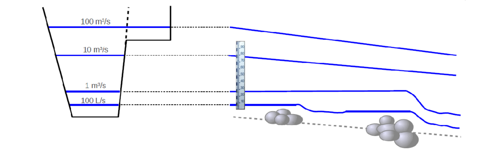

# La relation hauteur-débit : les contrôles hydrauliques

Dans la section de cours d'eau où est située la station hydrométrique, la relation entre la hauteur d'eau et le débit est déterminée par des caractéristiques physiques du chenal que l'on appelle « contrôles hydrauliques ».

## Deux grandes familles de contrôles hydrauliques

### Contrôle par une section

La relation hauteur-débit est déterminée presque uniquement par la géométrie de la section de contrôle, où l'écoulement passe par le régime critique, ce qui se matérialise par une **chute** et une ligne d'eau quasi horizontale en amont. Exemples : seuil rectangulaire, seuil triangulaire, orifice en charge.

 Figure 1: Schéma d'un contrôle section (la hauteur h est sous influence de la chute). 

 

 Figure 2. Exemple d'un site réel. Pour le débit effectif au moment de la photo, la hauteur d'eau au capteur (situé sous le pont amont) est contrôlée par le seuil naturel visible au premier plan. 

### Contrôle par un chenal

L'écoulement est supposé uniforme, aucune chute ne contrôle la hauteur d'eau. Celle-ci est alors gouvernée par la géométrie et la résistance à l'écoulement du chenal, parfois abusivement appelée « rugosité ». Le chenal de contrôle comprend l'ensemble du tronçon homogène qui s'étend non seulement à l'aval, mais aussi à l'amont du point de mesure.

 Figure 3. Schéma d'un contrôle chenal (le trait rouge représente le point de mesure). 

## Les contrôles-types

Les contrôles-types sont des contrôles hydrauliques spécifiques qui ont été beaucoup étudiés et pour lesquels il existe des formules Q(h) liant le débit à la hauteur d'eau (voir la page sur les [contrôles hydrauliques](/fr/doc/topics/controles-hydrauliques)).

Les contrôles-types utilisés dans les analyses BaRatin sont :

* Déversoir rectangulaire, triangulaire, parabolique
* Orifice
* Contrôle chenal rectangulaire large, triangulaire, parabolique

Lors d'une analyse hydraulique, chaque contrôle identifié pourra être assimilé à un contrôle-type, ou décomposé en une combinaison de contrôles-types, selon une approche de chenal composé (« divided channel »). Dans l'exemple du site réel précédent, le seuil naturel sera ainsi assimilé à un seuil rectangle.

## Assimilation des contrôles réels à des contrôles-type

L’assimilation d’un contrôle réel à un contrôle type est évidemment une approximation ; néanmoins la pratique montre qu’elle est très souvent acceptable, dans le sens où elle permet de décrire convenablement les jaugeages tout en conservant un sens physique (cf. page sur les [contrôles hydrauliques](/fr/doc/topics/controles-hydrauliques) pour plus de détails).

Lors d'une analyse hydraulique, et à chaque nouveau contrôle identifié, les questions à se poser pour
savoir à quel contrôle-type il faut l'assimiler sont synthétisées dans le logigramme suivant. Bien sûr,
avec l'habitude, ce questionnement se fait naturellement. La première question à se poser est toujours
de savoir si la hauteur d'eau est contrôlée par une chute ou pas : « Si je modifiais cette chute, en la
creusant ou en la relevant, est-ce que la hauteur à la station serait changée ? ».

 Figure 4. Logigramme pour la sélection d’un contrôle-type visant à représenter un contrôle réel. 

Dans le cas d'un ouvrage aval pas encore complètement en charge, il n'existe pas de contrôle-type,
d'une loi mathématique classique, d'où le point d'interrogation. Ces cas-là sont toujours uniques, et
seule une modélisation hydraulique peut permettre d'appréhender le fonctionnement hydraulique
probable (voir page sur les [contrôles hydrauliques](/fr/doc/topics/controles-hydrauliques)).

# L'analyse hydraulique

L'analyse hydraulique est une phase fondamentale de compréhension de l'écoulement. Une partie de cette analyse consiste à déterminer la gamme de hauteur pour laquelle la courbe de tarage est valable. Par la suite, il s'agit de procéder à l'identification systématique des contrôles hydrauliques influençant la hauteur d'eau tout au long de cette gamme de validité. Chaque contrôle identifié est assimilé à un contrôle-type pour lequel nous disposons d'une formule Q(h).

## Domaine de validité de la courbe de tarage

### Hauteur minimale

Une courbe de tarage relie la hauteur au débit. Cette courbe commence pour une certaine hauteur d'eau minimale qu'il est important d'estimer. Concrètement, c'est la hauteur minimale pour laquelle le modèle choisi pour le premier contrôle reste valide. En pratique, il convient que cette hauteur soit inférieure à la hauteur minimale qui peut être rencontrée sur le site.

### Hauteur maximale
Il est également important d'estimer la hauteur maximale au-delà de laquelle la courbe de tarage n'est plus pertinente. Il s'agit le plus souvent de la hauteur à partir de laquelle la hauteur mesurée n'est plus représentative du débit (exemple: contournement de la station par une partie du cours d'eau). Il peut également s'agir de la hauteur au-delà de laquelle on estime être incapable de prédire la relation hauteur-débit. Malheureusement, il peut arriver que la hauteur maximale d'application de la courbe de tarage soit inférieure à la hauteur maximale enregistrée à la station...

## Identifier les contrôles hydrauliques et leur enchaînement

Lorsque le débit et la hauteur d'eau augmentent, les contrôles hydrauliques en jeu peuvent se
succéder ou s'ajouter les uns aux autres, comme illustré par l'exemple simple mais typique de la
figure suivante.

 Figure 5. llustration simplifiée des contrôles hydrauliques pour une station hydrométrique typique : à droite, profil en long du fond et des lignes d'eau pour différentes valeurs de débit ; à gauche, les niveaux d'eau sont reportés sur le profil en travers de la section de la station. 

L'analyse hydraulique commence en général par l'étude des plus bas débits, puis progressivement s’étend à celle des débits de plus en plus élevés.

Pour savoir si un élément du site constitue un contrôle hydraulique, il peut être éclairant d'imaginer l'effet sur la hauteur d'eau d'une modification importante de cet élément (par exemple, creusement du lit, exhaussement d'un fond sableux, élargissement ou rétrécissement de la section, largeur d'un seuil rocheux, rugosité du lit, etc.). S'il s'avère probable que la hauteur d'eau serait influencée par la modification imaginée, alors l'élément étudié du site est un contrôle hydraulique ou a minima une de ses composantes.

Exemple d'analyse hydraulique de la station fictive (Figure 5) :

* Pour les très faibles débits
    * Le niveau d'eau est contrôlé par un petit seuil naturel.
    * Ce contrôle peut être assimilé à un contrôle de seuil rectangulaire.
* Pour les faibles débits
    * Le premier petit seuil est ennoyé. Le niveau d'eau est alors visiblement contrôlé par un deuxième seuil naturel situé plus en aval et présentant une plus grande chute.
    * Ce second contrôle peut être assimilé à un contrôle de seuil rectangulaire.
* Pour les débits moyens à forts, avant débordement
    * Ce deuxième seuil est à son tour ennoyé, il n'y a plus de chute contrôlant le niveau d'eau. Le niveau d'eau est alors contrôlé par le chenal du lit mineur.
    * Ce contrôle peut être assimilé à un contrôle de type chenal uniforme, de section rectangulaire large.
* Pour les débits forts, à compter du débordement
    * Lorsque le débordement se produit, le contrôle hydraulique par le lit majeur vient s'ajouter à celui par le lit mineur. Le niveau d'eau est alors sous influence simultanée de ces deux contrôles, qui s'ajoutent. L'interaction hydraulique entre les deux écoulements est négligée.
    * Le contrôle par le lit majeur est là encore assimilé à un contrôle de type chenal uniforme, de section rectangulaire large.
    
Note : bien que facultative pour une étude BaRatin, la modélisation hydraulique peut s'avérer utile pour l'analyse hydraulique en aidant à identifier l’enchaînement des contrôles, notamment l'ennoiement des sections de contrôle ou la décomposition de contrôles par chenal composé (cf. exemple de [la Sarre à Sarrebourg](/fr/doc/case/Sarre-Sarrebourg)). 

## Géométrie équivalente

A l'aval et aux abords de la station hydrométrique, l'eau s'écoule via un ou plusieurs contrôles. Lors d'une analyse hydraulique, on cherchera à s'assurer qu'on a bien pris en compte tous les "chemins" empruntés par l'eau, afin de ne manquer aucun contrôle hydraulique. Il s'agit de combiner les géométries simples des contrôles-type pour représenter au mieux la géométrie éventuellement complexe des contrôles réels.

### Exemple d'un contrôle par le lit mineur et le lit majeur

Pour un fonctionnement de type chenal, on combinera autant de contrôles "rectangles" que nécessaire pour modéliser la géométrie réelle. La Figure 6 montre ainsi comment le lit mineur irrégulier est représenté par un chenal rectangulaire équivalent de largeur B, et comment le lit majeur est représenté par un chenal rectangulaire équivalent de largeur B'.

Note : ne pas oublier que les échelles verticale et horizontale des représentations graphiques sont
généralement très distordues. Les formes des contrôles sont souvent très aplaties, ce qui permet de
négliger les bords verticaux dans le calcul du périmètre mouillé. La limite verticale en eau entre les
deux lits est notamment très petite par rapport à l'emprise horizontale du fond.

 Figure 6. Assimilation des lits mineur et majeur à des chenaux rectangulaires équivalents. 

### Exemple pour des radiers successifs

La figure ci-dessous montre la section représentative d'un site où à très bas débit, l'écoulement se concentre dans une sorte « d'encoche » qui constitue le premier contrôle. Celui-ci peut être modélisé par un contrôle du type seuil rectangulaire de largeur B'. Pour des débits un peu plus importants, l'écoulement se fait sur la largeur totale du lit mineur. Pour ce second segment, la situation sera modélisée par un unique contrôle du type seuil rectangulaire de largeur B dont la géométrie englobe celle de l'encoche. Sur ce segment, le premier contrôle n'est donc plus considéré comme actif puisqu'il est intégré dans le second contrôle.

 Figure 7. Assimilation de deux radiers successifs à des seuils rectangulaires équivalents. 

## La matrice des contrôles

Dans la méthode BaRatin, et en particulier dans l'interface graphique du logiciel BaRatinAGE, l'analyse hydraulique est synthétisée dans une matrice des contrôles. Elle se présente sous la forme présentée ci-dessous.

 Figure 8. Exemple de matrice des contrôles dans BaRatinAGE. 

Les segments sont des segments de hauteur pour lesquels le nombre de contrôles influençant la hauteur d'eau ne varie pas. Par exemple si à partir d'une certaine hauteur, un nouveau contrôle entre en jeu, alors le segment précédent se termine et un nouveau segment commence. Il y a par conséquent autant de segments que de contrôles identifiés.

Les segments sont numérotés par hauteur d'eau croissante. Ainsi le segment 1, et donc le contrôle 1 correspondent toujours aux plus faibles débits observés. 

Sur la ligne d'un segment de hauteur, la couleur verte à la verticale d'un contrôle signifie que celui-ci influence la hauteur d'eau sur le segment considéré. Sur un même segment, plusieurs contrôles peuvent influencer la hauteur d'eau.

Lorsque sur un segment, un contrôle n'est plus considéré comme influençant la hauteur d'eau, il ne pourra plus l'être sur un segment ultérieur. En effet, par exemple un seuil ennoyé à une certaine hauteur ne peut naturellement pas se "dénoyer" pour une hauteur d'eau supérieure. 

Pour reprendre l'exemple de la station fictive (Figure 5) vu précédemment, nous avions compté 4 contrôles, et donc 4 segments de hauteur :

* Segment 1 : Premier seuil naturel - seuil rectangulaire (contrôle 1)
* Segment 2 : Second seuil naturel - seuil rectangulaire (contrôle 2)
* Segment 3 : Chenal du lit mineur (contrôle 3)
* Segment 4 : Chenal du lit mineur (contrôle 3) + Chenal du lit majeur (contrôle 4)

La matrice des contrôles correspondant à cette analyse hydraulique est représentée ci-dessous.

 Figure 9. Matrice des contrôles pour la station fictive représentée en Figure 5. 

# Conclusions

Avec un peu d'habitude, identifier les contrôles hydrauliques d'une station hydrométrique n'est pas difficile. Cela ne requiert pas une expertise poussée en hydraulique mais surtout du bon sens dans l'observation des éléments essentiels sur le site et des écoulements pour différents niveaux de débit. Il est évidemment toujours utile de recueillir l'expérience des hydromètres ayant opéré sur la station, surtout si l'on n'en fait pas soi-même partie, ainsi que l'ensemble du dossier de la station. Attention, normalement les jaugeages ne doivent pas être utilisés pour l'analyse hydraulique ; cependant si quelques jaugeages sont tout de même jugés indispensables à cette analyse, ils doivent être absolument retirés du jeu de jaugeages servant au calcul BaRatin. De précieuses informations sur la nature, la géométrie et le fonctionnement des contrôles hydrauliques peuvent généralement se déduire de photos des écoulements, de cartes topographiques, de SIG comme Google Earth ou Géoportail, de levés de sections en travers et d'ouvrages, et surtout... de visites sur le terrain !

Le schéma suivant récapitule les étapes d'une analyse hydraulique et des éléments qui permettent de
les mener à bien.

 Figure 10. Schéma général d’une analyse hydraulique. 

