# Controls

## The basic equation

For all the standard controls used in BaRatinAGE, the stage-discharge relation is described by a power function which is active above a given stage. The basic equation is as follows:

$$ Q(H) = 
\begin{cases}
0 \text{ si } H \leq b \text{ ou } h \leq \kappa \\
a(H-b)^c \text { sinon}
\end{cases}
$$

* $Q$ is the discharge and $H$ is the stage;
* $\kappa$ is the *activation stage*; when the water level falls below $\kappa$, the control becomes inactive;
* $a$ is the *coefficient*, which depends on the physical properties of the control;
* $c$ is the *exposant*, which depends on the type of control;
* $b$ is the *offset*; when the water level falls below the value $b$, the flow is zero.

Note that the offset is generally different from the activation stage $\kappa$. For example, for a channel control that follows a weir control, the parameter $b$ represents the average elevation of the bottom of the bed, but the control will only be active for a water level above which the weir is flooded, which is physically different from $b$.

## Section controls and channel controls

For section controls, the stage-discharge relation at the measurement cross-section is determined by a downstream cross-section where the flow is critical (Froude number is equal to 1). For simple cross-section shapes such as the ones used in BaRatinAGE (rectangular, triangular, parabolic), the following equation holds: 

$$Q(H) = C\sqrt{2g}A_w(H)\sqrt{H-b}$$

where $C$ is a discharge coefficient accounting for the head losses between the measurement cross-section (upstream) and the critical cross-section (downstream) and depending on the cross-section shape, $A_w$ is the wetted area ($m^2$), $g$ is the gravity
acceleration ($g \approx 9.81 $ m.s$^{-2}$).

For channel controls, i.e. when the stage-discharge relation is determined by friction, equation 1 is established from the Manning-Strickler equation applied to the given geometry of the channel. The Manning-Strickler equation is:

$$Q(H) = K_S A_w R_h^{2/3} \sqrt{S_f}$$

where $K_S$ = flow resistance coefficient (Strickler coefficient in m$^{1/3}.$s$^{-1}$) ; Manning coefficient $n = 1 / K_S$ (m$^{-1/3}.$s) can be used instead. $A_w$ = wetted area ($m^2$), $R_h=A_w/P_w$ = hydraulic radius ($m$), $P_w$ = wetted perimeter ($m$), $S_f$ = head line slope (or friction slope), approximated by the longitudinal slope of the bed or of the water profile for steady uniform flows.

# Equations of the standard controls (BaRatin configuration)

## Rectangular weir

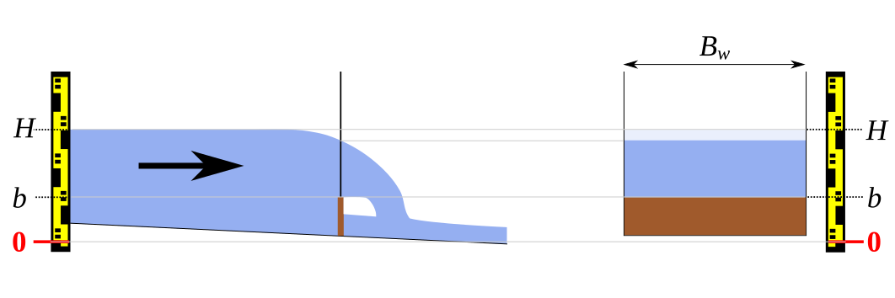

 Rectangular weir: longitudinal view (left) and front view of control cross-section (right). 

The equation of this type of control is:

$$Q(H) = C_r \sqrt{2g} B_w (H-b)^c $$

For each control modelled as a rectangular weir, priors must be assigned for the following parameters:

* $\kappa$ = the water level (in $m$) above which the control becomes active; when the control is the first, or when the control adds to existing controls, this activation stage is equal to the weir crest elevation $b$;
* $B_w$ = the spillway width (in $m$), i.e. the transverse length of the weir, normal to the flow direction.

Default priors are already specified for the other parameters:

* $C_r$ = discharge coefficient $\approx 0.4 ± 0.1$
* $g$ = gravitational acceleration $\approx 9.81 ± 0.01 $ m.s$^{-2}$
* $c$ = exponent for a rectangular critical cross-section $\approx 1.5 ± 0.05$

## Parabolic weir

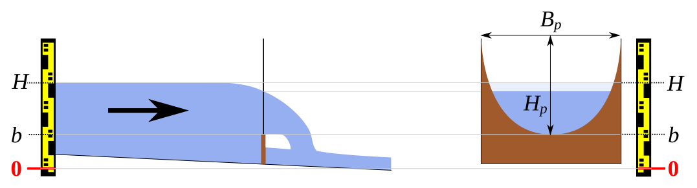

 Parabolic weir: longitudinal view (left) and front view of control cross-section (right). 

Re-arranging the results of [Igathinathane et al. (2007)](https://doi.org/10.1016/j.biosystemseng.2006.09.006), the equation of this type of control is:

$$Q(H) = C_p \sqrt{2g} \frac{B_p}{\sqrt{H_p}} (H-b)^c $$

For each control modelled as a parabolic weir, priors must be assigned for the following parameters:

* $\kappa$ = the water level (in $m$)above which the control becomes active; when the control is the first, or when the control adds to existing controls, this activation stage is equal to the weir crest elevation $b$ at the centre of the parabola;
* $B_p$ et $H_p$ = the width and height (in $m$), of the parabola, respectively, measured at the same given elevation (e.g. the bankful stage).

Default priors are already specified for the other parameters:

* $C_p$ = discharge coefficient $\approx 0.22 ± 0.04$ ([Igathinathane et al. 2007](https://doi.org/10.1016/j.biosystemseng.2006.09.006))
* $g$ = gravitational acceleration $\approx 9.81 ± 0.01 $ m.s$^{-2}$
* $c$ = exponent for a parabolic critical cross-section $\approx 2.0 ± 0.05$

Note: The discharge coefficient seems to be larger than 0.22 for wider parabolic weirs: according to [Igathinathane et al. (2007)](https://doi.org/10.1016/j.biosystemseng.2006.09.006), $C_p \approx 0.25$ for $B_p=2H_p$. There is no precise information on very wide
parabolic weirs and on broad-crested parabolic weirs.

## Triangular weir

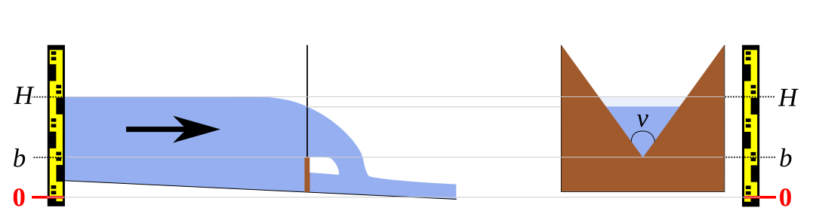

 Triangular weir: longitudinal view (left) and front view of control cross-section
(right). 

The equation of this type of control is:
$$Q(H) = C_t \sqrt{2g} \tan(\nu/2) (H-b)^c $$

For each control modelled as a triangular weir, priors must be assigned for the following parameters:

* $\kappa$ = the water level (in $m$) above which the control becomes active; when the control is the first, or when the control adds to existing controls, this activation stage is equal to the elevation of the triangle vertex $b$;
* $\nu$ = the triangle opening angle (in degrees).

Default priors are already specified for the other parameters:

* $C_t$ = discharge coefficient $\approx 0.31 ± 0.05$
* $g$ = gravitational acceleration $\approx 9.81 ± 0.01 $ m.s$^{-2}$
* $c$ = exponent for a triangular critical cross-section $\approx 2.5 ± 0.05$

## Free-flowing orifice

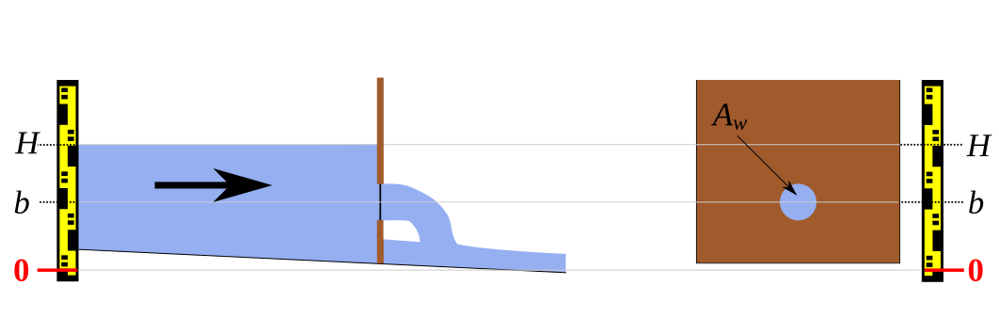

 Free-flowing orifice: longitudinal view (left) and front view of the control cross-section (right). 

The equation of this type of control is:
$$Q(H) = C_o \sqrt{2g} A_w (H-b)^c $$

For each control modelled as a free-flowing orifice (flow fills the orifice but there is a free fall at the outlet, with no influence of the downstream stage on the stage-discharge relation, see Figure above), priors must be assigned for the following parameters:

* $\kappa$ = the water level (in $m$) above which the control becomes active;
* $A_w$ = the cross-sectional area (en $m²$) of the orifice.

Default priors are already specified for the other parameters:

* $C_o$ = discharge coefficient $\approx 0.6 ± 0.1$
* $g$ = gravitational acceleration $\approx 9.81 ± 0.01 $ m.s$^{-2}$
* $c$ = exponent for a free-flowing orifice $\approx 0.5 ± 0.05$

Note. The hydraulic structure featuring the orifice may produce a backwater that influences the water level before the hole is completely filled and that the previous equation to apply. Hydraulic modelling can then be used to represent this transition phase and this specific backwater effect.

## Rectangular channel (wide)

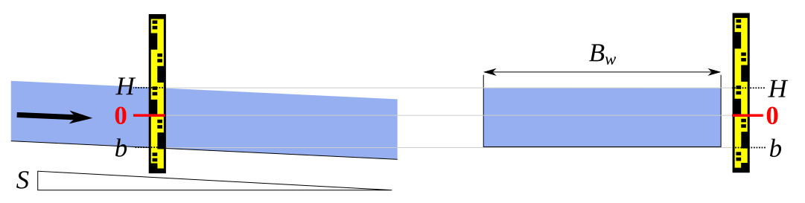

 Wide rectangular channel: longitudinal view (left) and cross-section at the staff gauge (right). 

The Manning-Strickler equation is applied to a wide rectangular channel, i.e. $H-b \ll B_w$ (typically $5(H-b) < B_w$).

The equation of this type of control is:

$$Q(H) = K_S \sqrt{S} B_w (H-b)^c $$

For each control modelled as a wide rectangular channel control, priors must be assigned for the following parameters:

* $\kappa$ = the water level (in $m$) above which the control becomes active; when the control is the first, or when the control adds to existing controls this activation stage is equal to the mean bed elevation $b$ at the gauge;
* $B_w$ = the width (in $m$) of the rectangular channel;
* $S$ = the longitudinal slope of the river channel (dimensionless, e.g. write 0.01 for a 1% slope, etc.);
* $K_S$ = the flow resistance parameter (Strickler coefficient in m$^{1/3}.$s$^{-1}$);
* The  Manning coefficient $n=1/K_S$ (m$^{-1/3}.$s) can be used instead.

Default priors are already specified for the remaining parameter:

* $c$ = exponent for a wide rectangular channel control $\approx 1.67 ± 0.05$

## Parabolic channel (wide)

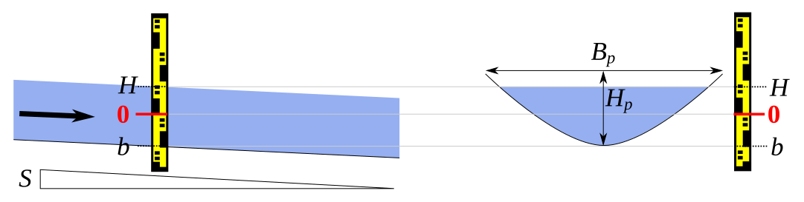

 Wide parabolic channel: longitudinal view (left) and cross-section at the staff gauge (right). 

The Manning-Strickler equation is applied to a wide parabolic channel, i.e.
$$H-b \ll \frac{3}{8}\frac{B_p^2}{H_p}$$

Typically, the condition is:

$$5(H-b) < \frac{3}{8}\frac{B_p^2}{H_p}$$

The equation of this type of control is:

$$Q(H) = K_S \sqrt{S} \left( \frac{2}{3} \right)^{5/3}\frac{B_p}{H_p} (H-b)^c $$

For each control modelled as a wide parabolic channel control, priors must be assigned for the following parameters:

* $\kappa$ = the water level (in $m$) above which the control becomes active; when the control is the first, or when the control adds to existing controls this activation stage is equal to the mean thalweg elevation $b$ at the gauge;
* $B_p$ and $H_p$ = the width and height (in $m$) of the parabola, respectively, measured at the same given elevation (e.g. the bankful stage);
* $S$ = the longitudinal slope of the river channel (dimensionless, e.g. write 0.01 for a 1% slope, etc.);
* $K_S$ = the flow resistance parameter (Strickler coefficient in m$^{1/3}.$s$^{-1}$)
* Manning's $n=1/K_S$ (m$^{-1/3}.$s) can be used instead.

Default priors are already specified for the remaining parameter:

* $c$ = exponent for a wide parabolic channel control $\approx 2.17 ± 0.05$

## Triangular channel

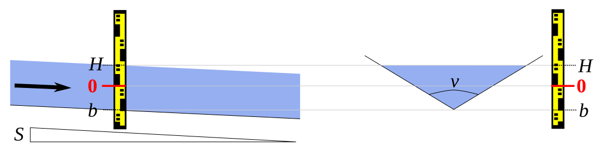

 Triangular channel: longitudinal view (left) and cross-section at the staff gauge (right).

The Manning-Strickler equation is applied to a triangular channel. The equation of this type of control is:

$$Q(H) = K_S \sqrt{S} \tan(\nu/2) \left( \frac{\sin(\nu/2)}{2} \right)^{2/3} (H-b)^c $$

For each control modelled as a triangular channel control, priors must be assigned for the following parameters:

* $\kappa$ = the water level (in $m$) above which the control becomes active; when the control is the first, or when the control adds to existing controls this activation stage is equal to the mean thalweg elevation $b$ at the gauge;
* $\nu$ = the triangle opening angle (in degrees);
* $S$ = the longitudinal slope of the river channel (dimensionless, e.g. write 0.01 for a 1% slope,etc.);
* $K_S$ = the flow resistance parameter (Strickler coefficient in m$^{1/3}.$s$^{-1}$)
* Manning's $n=1/K_S$ (m$^{-1/3}.$s) can be used instead.

Default priors are already specified for the remaining parameter:

* $c$ = exponent for a triangular channel control $\approx 2.67 ± 0.05$

# Other types of control (‘Q=f(h)’ configuration)

Experience shows that with the small number of standard controls presented so far, it is possible to describe a very large number of situations encountered in practice. The key is to combine these standard controls (by making them succeed one another or by adding them) to best describe the hydraulic configuration.

However, there are some controls that cannot be modelled trivially by combining the standard controls of the classic BaRatin configuration. This [case study](/en/doc/case/charbonnieres)) provides an example: a triangular weir whose sides stop at a given height and is bordered by (fictitious) vertical walls. 

Since version 3.1 of BaRatinAGE, it has been possible to define a ‘Q=f(h)’ configuration, i.e. to write the equation for one or more controls. A set of predefined controls is available, described below.

## Parametric weir

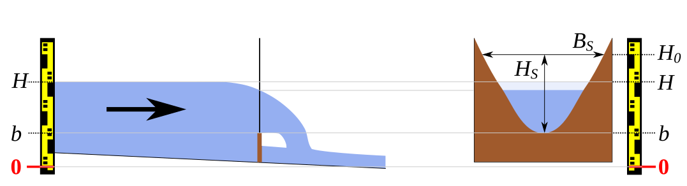

 Parametric weir: longitudinal view (left) and front view of control cross-section
(right). 

As with other types of weir, the equation $Q=f(H)$ is established by applying Bernoulli's theorem between the water level $H$ measurement cross-section and the critical-flow cross-section. Since the velocity head due to the approach flow velocity is assumed to be negligible, the hydrostatic head $H$ is close to the total hydraulic head.

Any form of weir is considered whose wetted area $A$ is proportional to the flow depth $H-b$ to the power $k$:

$$A(H)=\frac{B_s}{kH_s^{k-1}} (H-b)^k$$
with $B_s$ and $H_s$ respectively the width and height of the cross-section taken for the same (any) height $H_0$. 

This type of weir shape includes the special cases of BaRatin's rectangular ($k=1$), parabolic ($k=1.5$) and triangular ($k=2$) section controls, as well as all intermediate shapes. 

The equation for this type of control explains the direct relationship between the flow coefficient $C(k)$ and the exponent $k+1/2$ of the control:

$$Q(H)= C(k) \sqrt{2g} \frac{B_s}{H_s^{k-1}} (H-b)^{k+1/2}$$
where

$$C(k) = \frac{C_0}{\sqrt{2}} \frac{k^{k-1}}{(k+\frac{1}{2})^{k+\frac{1}{2}}} $$

$C_0$ ($\approx 1$) is an empirical calibration coefficient, representing the difference between the actual discharge coefficient and the theoretical discharge coefficient, as a function of the actual conditions of flow approach, weir geometry, weir surface condition, and so on.

The prior values of the coefficients proposed by default for the classic section controls in BaRatinAGE are more or less the same: 

* rectangular weir: $C(1) = 0.385$ (theoretical value for broad-crested rectangular weir, rounded to 0.4 in BaRatinAGE)
* parabolic weir: $C(1.5) = 0.217$ (rounded to 0.22 in BaRatinAGE)
* triangular weir: $C(2) = 0.143$ (corresponds to double in the BaRatin equation since $B_s/H_s=2 {\rm tan}(\nu/2)$, i.e. 0.286, which is the theoretical value for the thick triangular weir, the 0.31 value in BaRatinAGE being the value for the thin weir).

The default parameters to which prior values must be assigned are:

* $b$ = the offset (in $m$) equal to the elevation of the lowest point of the cross-section
* $B_s$ = the width (in $m$) of the cross-section at a height $H_0$ (any height)
* $H_s$ = the height (in $m$) of the cross-section at the same height $H_0$

For the other parameters, default prior values are already specified:

* $C_0$ = calibration coefficient ($\approx 1 ± 0.05$)
* $g$ = acceleration due to gravity ($\approx 9.81 ± 0.01 $ m.s$^{-2}$)
* $k$ = the exponent of the relationship between wetted area $A$ and flow depth $H-b$ (uniform distribution between 1 and 2, i.e. between a rectangular cross-section and a triangular cross-section)

## Trapezoidal weir

 Trapezoidal weir: longitudinal view (left) and front view of control cross-section
(right). 

The trapezoidal weir is modelled by adding a triangular weir (representing the edges of the trapezoid) to the rectangular weir representing the centre of the trapezoid. Both weirs have the same activation stage $\kappa_1$.

The equation for this type of control is therefore:

$$Q(H) = C_t \sqrt{2g} \tan(\nu/2) (H-\kappa_1)^{c_t} + C_r \sqrt{2g} B_r (H-\kappa_1)^{c_r}$$. 

if $H>\kappa_1$

The parameters not entered by default to which prior values must be assigned are:

* $\kappa_1$ = the activation stage (in $m$) equal to the height of the tip of the triangular notch and the height of the crest of the rectangular weir
* $\nu$ = the opening angle of the triangle (in degrees), which is the sum of the angles of the two triangles at the edges of the trapezoidal weir
* $B_r$ = the overflow width (in $m$) of the rectangular weir, perpendicular to the direction of flow

For the other parameters, default prior values are already specified:

* $C_t$ = discharge coefficient ($\approx 0.31 ± 0.05$) of the triangular weir
* $g$ = gravity acceleration ($\approx 9.81 ± 0.01 $ m.s$^{-2}$)
* $c_t$ = exponent for a triangular critical cross-section $\approx 2.5 ± 0.05$
* $C_r$ = discharge coefficient $\approx 0.4 ± 0.1$ of the rectangular weir
* $c_r$ = exponent for a rectangular critical cross-section $\approx 1.5 ± 0.05$

## Circular weir 

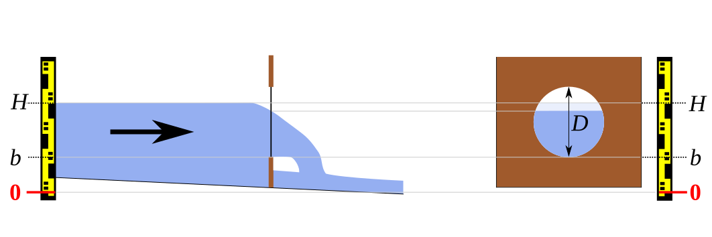

 Circular weir: longitudinal view (left) and front view of control cross-section
(right). 

Despite its simple geometry, there is no explicit formulation for the exact rating curve of a circular weir. Several approximate formulations have been proposed in the literature. They give similar results. We propose one of the oldest (Addison, 1941, p. 107), because it is classical and predicts a discharge close to that of the orifice, when the circular weir is full.

The equation for this type of control is therefore :

$$ Q(H) = 0.001 \times [C_c + (110(H-b)/D)^{-1} + 0.041 (H-b)/D ] \times (10D)^{2.5} \times [a_1 ((H-b)/D)^{c_1} - a_2 ((H-b)/D)^{c_2} ]$$ 

if $b \leq H \leq b+D$

The default parameters to which prior values must be assigned are:

* $b$ = the elevation (in $m$) of the bottom of the circular weir crest
* $D$ = the diameter (in $m$) of the circular weir.

For the other parameters, default prior values are already specified:

* $C_c$ = constant part of the discharge coefficient ($\approx 0.5550 ± 0.05$) of the circular weir
* $c_1$ = exponent $\approx 1.975 ± 0.001$
* $a_1$ = coefficient $\approx 10.12 ± 0.1$
* $c_2$ = exponent $\approx 3.78 ± 0.001$
* $a_2$ = coefficient $\approx 2.66 ± 0.03$

## Rectangular weir with triangular notch

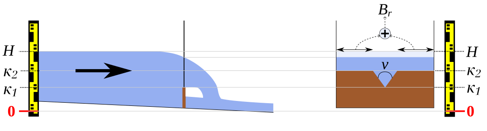

 Rectangular weir with triangular notch: longitudinal view (left) and front view of control cross-section
(right). 

The ‘truncated triangle’ is modelled by adding a ‘negative’ triangular weir to the actual triangular weir to remove the excess wetted section when the water reaches the vertical walls. We simply add a conventional rectangular weir to model the horizontal sills (of the same $\kappa_2$) on either side of the notch.

The equation for this type of control is:

$$ Q(H) = C_t \sqrt{2g} \tan(\nu/2) (H-\kappa_1)^{c_t}$$ 

if $\kappa_1\leq H \leq \kappa_2$.

$$ Q(H) = C_t \sqrt{2g} \tan(\nu/2) (H-\kappa_1)^{c_t} - C_t \sqrt{2g} \tan(\nu/2) (H-\kappa_2)^{c_t} + C_r \sqrt{2g} B_r (H-\kappa_2)^{c_r}$$. 

if $H>\kappa_2$.

The default parameters to which prior values must be assigned are :

* $\kappa_1$ = the activation stage (in $m$) equal to the height of the tip of the triangular notch.
* $\nu$ = the opening angle of the triangle (in degrees)
* $\kappa_2$ = the activation stage (in $m$) equal to the height of the crest of the rectangular weir
* $B_r$ = the overflow width (in $m$), i.e. the transverse length of the rectangular weir, perpendicular to the direction of flow.

For the other parameters, default prior values are already specified:

* $C_t$ = discharge coefficient ($\approx 0.31 ± 0.05$) of the triangular notch.
* $g$ = acceleration due to gravity ($\approx 9.81 ± 0.01 $ m.s$^{-2}$)
* $c_t$ = exponent for a triangular critical cross-section $\approx 2.5 ± 0.05$
* $C_r$ = discharge coefficient $\approx 0.4 ± 0.1$ of the rectangular weir
* $c_r$ = exponent for a rectangular critical cross-section $\approx 1.5 ± 0.05$

## Rectangular weir with trapezoidal notch

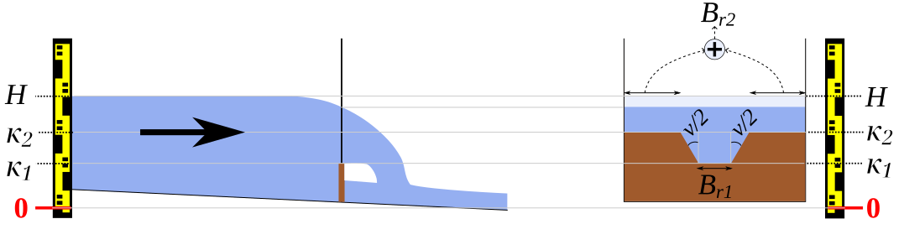

 Rectangular weir with trapezoidal notch: longitudinal view (left) and front view of control cross-section
(right). 

The rectangular weir with trapezoidal notch is modelled by adding a rectangular weir (of the same height $\kappa_1$) to the rectangular weir with triangular notch, so as to represent the notch as a ‘truncated trapezoid’. There are two different coefficients $C_{r1}$ and $C_{r2}$ for the two rectangular weirs because the flow approach conditions (and gate height) are not the same upstream of the notch and upstream of the sill.

The equation for this type of control is therefore:

$$ Q(H) = C_t \sqrt{2g} \tan(\nu/2) (H-\kappa_1)^{c_t} + C_{r1} \sqrt{2g} B_{r1} (H-\kappa_1)^{c_r}$$ 

if $\kappa_1\leq H \leq \kappa_2$.

$$ Q(H) = C_t \sqrt{2g} \tan(\nu/2) (H-\kappa_1)^{c_t} - C_t \sqrt{2g} \tan(\nu/2) (H-\kappa_2)^{c_t} + C_{r1} \sqrt{2g} B_{r1} (H-\kappa_1)^{c_r} + C_{r2} \sqrt{2g} B_{r2} (H-\kappa_2)^{c_r}$$ 

if $H>\kappa_2$.

The default parameters to which prior values must be assigned are:

* $\kappa_1$ = the activation stage (in $m$) equal to the height of the tip of the triangular notch and the height of the bottom of the trapezoidal weir.
* $\nu$ = the opening angle of the triangle (in degrees)
* $\kappa_2$ = the activation height (in $m$) equal to the elevation of the crest of the rectangular weir (sill)
* $B_{r1}$ = the overflow width (in $m$) of the bottom of the trapezoidal weir
* $B_{r2}$ = the overflow width (in $m$) of the rectangular weir (sill)

For the other parameters, default priors are already specified:

* $C_t$ = discharge coefficient ($\approx 0.31 ± 0.05$) of the triangular notch
* $g$ = acceleration due to gravity ($\approx 9.81 ± 0.01 $ m.s$^{-2}$)
* $c_t$ = exponent for a triangular critical cross-section $\approx 2.5 ± 0.05$
* $C_{r1}$ = discharge coefficient $\approx 0.4 ± 0.1$ of the rectangular weir corresponding to the bottom of the trapezoidal weir
* $C_{r2}$ = discharge coefficient $\approx 0.4 ± 0.1$ of the rectangular weir (sill)
* $c_r$ = exponent for a rectangular critical cross-section $\approx 1.5 ± 0.05$

## Triangular weir with triangular notch

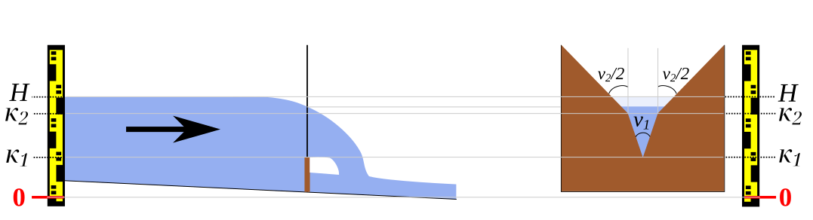

 Triangular weir with triangular notch: longitudinal view (left) and front view of control cross-section
(right). 

The triangular weir with triangular notch is modelled in the same way as the rectangular weir with triangular notch, simply by replacing the rectangular weir with a triangular weir. There are two different coefficients $C_{t1}$ and $C_{t2}$ for the two triangular weirs because the flow approach conditions (and gate heights) are not the same upstream of the notch and upstream of the sill.

The equation for this type of control is therefore:

$$Q(H) = C_{t1} \sqrt{2g} \tan(\nu_1/2) (H-\kappa_1)^{c_t}$$ 

if $\kappa_1\leq H \leq \kappa_2$.

$$ Q(H) = C_{t1} \sqrt{2g} \tan(\nu_1/2) (H-\kappa_1)^{c_t} - C_{t1} \sqrt{2g} \tan(\nu_1/2) (H-\kappa_2)^{c_t} + C_{t2} \sqrt{2g}\tan(\nu_2/2) (H-\kappa_2)^{c_t}$$ 

if $H>\kappa_2$.

The parameters which are not set by default and to which priori values must be assigned are:

* $\kappa_1$ = the activation stage (in $m$) equal to the height of the tip of the triangular notch
* $\nu_1$ = the opening angle of the triangular notch (in degrees)
* $\kappa_2$ = the activation stage (in $m$) equal to the elevation of the tip of the triangular weir, where the sill meets the edges of the notch.
* $\nu_1$ = the opening angle of the triangle of the sill (in degrees)

For the other parameters, default prior values are already specified:

* $C_{t1}$ = discharge coefficient ($\approx 0.31 ± 0.05$) of the triangular notch
* $g$ = acceleration due to gravity ($\approx 9.81 ± 0.01 $ m.s$^{-2}$)
* $c_t$ = exponent for a triangular critical cross-section $\approx 2.5 ± 0.05$
* $C_{t2}$ = discharge coefficient ($\approx 0.31 ± 0.05$) of the triangular weir (sill).

## Rectangular weir-orifice

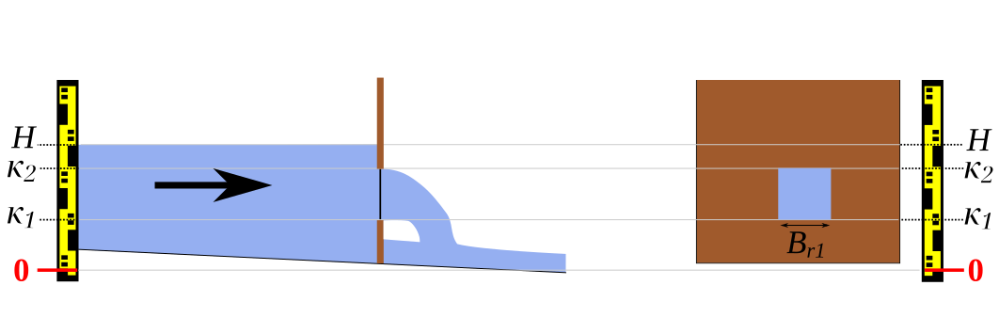

 Rectangular weir-orifice: longitudinal view (left) and front view of the control cross-section (right). 

The rectangular weir-orifice is modelled by adding a ‘negative’ rectangular weir to the actual rectangular weir to remove the excess wetted section when the water level reaches the orifice ceiling. The two rectangular weirs have the same width and coefficient, but different activation stages $\kappa_1$ and $\kappa_2$, corresponding to the bottom and top of the orifice.

The equation for this type of control is therefore:

$$Q(H) = C_r \sqrt{2g} B_r (H-\kappa_1)^{c_r}$$. 

if $\kappa_1\leq H \leq \kappa_2$.

$$ Q(H) = C_r \sqrt{2g} B_r \left[ (H-\kappa_1)^{c_r} - (H-\kappa_2)^{c_r} \right]$$ 

if $H>\kappa_2$.

The default parameters to which prior values must be assigned are:

* $\kappa_1$ = the activation stage (in $m$) equal to the height of the bottom of the rectangular orifice.
* $\kappa_2$ = the activation stage (in $m$) equal to the height of the top of the rectangular orifice
* $B_r$ = the width (in $m$) of the rectangular orifice.

For the other parameters, default prior values are already specified:

* $C_r$ = discharge coefficient $0.4 ± 0.1$
* $g$ = acceleration due to gravity ($\approx 9.81 ± 0.01 $ m.s$^{-2}$)
* $c_r$ = exponent for a rectangular critical cross-section $\approx 1.5 ± 0.05$

## Trapezoidal channel

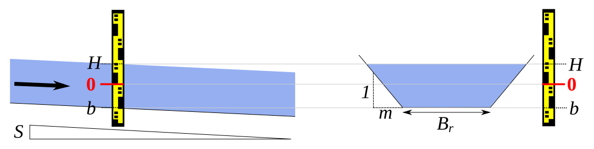

 Trapezoidal channel: longitudinal view (left) and cross-section at the staff gauge (right). 

The Manning-Strickler formula is applied to any trapezoidal channel (with no condition on width). The shape of the trapezoidal cross-section is defined by the width at the bottom $B_r$ and by the batter $m$, i.e. the slope (with respect to the vertical) of the walls of the channel. The batter $m$ is the tangent of the angle between the wall and the vertical, i.e. the ratio of the horizontal distance to the vertical height. For zero batter ($m=0$), the equation is that of a rectangular channel control (with no width condition, unlike BaRatin's wide rectangular channel control).

The equation for this type of control is:

$$Q(H) = K_S \sqrt{S} \frac{\left[B_r (H-b) + m (H-b)^2 \right]^{c+1}}{\left[B_r + 2 (H-b) \sqrt{1+m^2} \right]^{c}} $$

For each control modelled as a trapezoidal channel, the default parameters to which prior values must be assigned are:

* $b$ = average channel bottom elevation
* $K_S$ = the flow resistance coefficient (Strickler coefficient in m$^{1/3}.$s$^{-1}$)
* $B_r$ = the width (in $m$) of the channel bottom
* $m$ = the batter of the cross-section walls (horizontal distance over vertical height, dimensionless)
* $S$ = the longitudinal slope of the channel around the gauge (unitless, enter 0.01 for 1%, etc.)

* The Manning coefficient $n=1/K_S$ (m$^{-1/3}.$s) can be used instead of the Strickler coefficient.

For the remaining parameter, default prior values are already specified:

* $c$ = exponent of the Manning-Strickler formula $\approx 0.67 ± 0.05$

## Circular channel

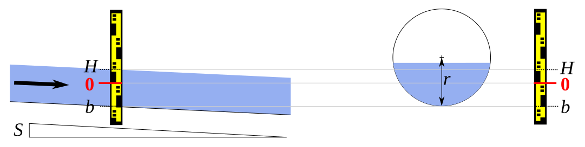

 Circular channel: longitudinal view (left) and cross-section at the staff gauge (right). 

The Manning-Strickler formula is applied to a circular channel: the case of uniform open-channel flow, not pipe flow, in a canal, pipe or duct of circular cross-section, with radius $r$. 

Despite the very simple geometry, the equation for this type of control is relatively complicated:

$$Q(H) = K_S \sqrt{S} \frac{r^{8/3}}{2^{2/3}} {\rm acos}(1-\frac{H}{r}) \left[ 1- \frac{{\rm sin}(2{\rm acos}(1-\frac{H}{r}))}{2{\rm acos}(1-\frac{H}{r})} \right]^{c+1} $$

if $b < H\leq b+r$.

$$Q(H) = K_S \sqrt{S} \frac{r^{8/3}}{2^{2/3}} \left[ \pi - {\rm acos}(\frac{H}{r}-1) \right] \left[ 1+ \frac{{\rm sin}(2{\rm acos}(\frac{H}{r}-1))}{2\pi - 2{\rm acos}(\frac{H}{r}-1)} \right]^{c+1} $$

if $b+r < H < b+2r$.

The formula is not really simplified, even considering that ${\rm sin}(2{\rm acos}(x))=2x\sqrt{1-x^2}$. 

For each control modelled as a circular channel, the default parameters to which prior values must be assigned are:

* $b$ = the average channel bottom elevation
* $K_S$ = the flow resistance coefficient (Strickler coefficient in m$^{1/3}.$s$^{-1}$)
* $r$ = the radius (in $m$) of the circular channel (or pipe)
* $S$ = the longitudinal slope of the channel around the gauge (unitless, enter 0.01 for 1%, etc.)

* Manning's coefficient $n=1/K_S$ (m$^{-1/3}.$s) can be used instead of Strickler's coefficient.

For the remaining parameter, default prior values are already specified:

* $c$ = exponent of the Manning-Strickler formula $\approx 0.67 ± 0.05$

# Prior specification

## Determination of prior parameters

The hydraulic analysis (matrix of controls) induced the mathematical model of the rating curve by combining the equations of the standard controls (for more details on the rating curve equation, see [this page](/en/doc/topics/rating-curve/)).

At this stage of the method the objective is to give plausible values to the different parameters of this model. The Bayesian inference, i.e. the basis of the method, requires assigning a central value and a non-zero uncertainty to each parameter. This is what we call prior parameters (see this page: [Bayesian basics](/en/doc/topics/bayesian/)).

Therefore, prior parameters $\kappa$, $a$ and $c$ must be specified for every control. However, it is not necessary to specify a prior parameter $b$: the discharge continuity of the rating curve is a constraint which implies that the parameter $b$ is automatically inferred from the other three parameters.

In BaRatinAGE, priors consist of a value and a "±" uncertainty expressed in the same unit as the parameter to which it is assigned. This expanded uncertainty is equal to twice the standard-uncertainty (standard-deviation). The underlying assumption is that the prior uncertainty of the true value of the parameter follows a Gaussian distribution.

Notes:

* The prior values must be estimated with care by the user but **without ever using the gaugings**. If however one or more gaugings are used to estimate the priors, they must be removed from the dataset that will be used by BaRatin to compute the rating curve.
* It is rarely necessary to use gaugings to estimate the priors since the parameters of the standard controls equations are relatively easy to determine physical parameters as discussed in the examples.

BaRatinAGE offers help in the prior setting of the equations of each of the standard controls presented above. In these formulas, the coefficient $a$ of the basic equation $a(H-b)^c$ is a function of several physical parameters, of which the user must specify a central value and an uncertainty, i.e. the mean and twice the standard deviation of the underlying Gaussian distribution.

BaRatinAGE then calculates the central value of the coefficient $a$ and its uncertainty, by the method of propagation of uncertainty given by the GUM ([JCGM, 2008](https://www.iso.org/sites/JCGM/GUM/JCGM100/C045315e-html/C045315e.html?csnumber=50461)), based on a first order Taylor series expansion. The formulas implemented for the various standard-controls are detailed in the sections below. Remember that the standard uncertainties, $u$, are half of expanded uncertainties visible in the BaRatinAGE interface.

**General propagation formula**

$$
\begin{align}
a = & f(x_1,\ldots,x_p) \\
u^2(a) = & \sum_{i=1}^p \left( \frac{\partial f(x_1,\ldots,x_p)}{\partial x_i} \right)^2 u^2(x_i)
\end{align}
$$
**Rectangular weir**

$$
\begin{align}
a= & C_r \sqrt{2g} B_w  \\
u^2(a) = & \left( \sqrt{2g} B_w \right)^2 u^2(C_r) +
\left(\frac{C_r B_w}{\sqrt{2g}}  \right)^2 u^2(g)+
\left( C_r \sqrt{2g} \right)^2 u^2(B_w)
\end{align}
$$
**Parabolic weir**

$$
\begin{align}
a = & C_p \sqrt{2g} \frac{B_p}{\sqrt{H_p}}  \\
u^2(a) = & \left(\sqrt{2g} \frac{B_p}{\sqrt{H_p}} \right)^2 u^2(C_p)+
\left( C_p  \frac{B_p}{\sqrt{2g}\sqrt{H_p}} \right)^2 u^2(g)+
\left( \frac{C_p \sqrt{2g}}{\sqrt{H_p}} \right)^2 u^2(B_p)+
\left( C_p \sqrt{2g} \frac{B_p}{2H_p^{3/2}} \right)^2 u^2(H_p)
\end{align}
$$

**Triangular weir**

$$
\begin{align}
a = & C_t \sqrt{2g} \tan(\nu/2)  \\
u^2(a) = & \left( \sqrt{2g} \tan(\nu/2) \right)^2 u^2(C_t)+
\left( \frac{C_t \tan(\nu/2)}{\sqrt{2g}} \right)^2 u^2(g)+
\left( \frac{C_t \sqrt{2g}}{2\cos^2(\nu/2)} \right)^2 u^2(\nu)
\end{align}
$$
**Free-flowing orifice**

$$
\begin{align}
a = & C_o \sqrt{2g} A_w  \\
u^2(a) = & \left( \sqrt{2g} A_w \right)^2 u^2(C_o) +
\left(\frac{C_o A_w}{\sqrt{2g}}  \right)^2 u^2(g)+
\left( C_o \sqrt{2g} \right)^2 u^2(A_w)
\end{align}
$$
**Large rectangular channel**

$$
\begin{align}
a = & K_S \sqrt{S} B_w  \\
u^2(a) = & \left( \sqrt{S} B_w \right)^2 u^2(K_S) +
\left(\frac{K_S B_w}{2\sqrt{S}}  \right)^2 u^2(S)+
\left( K_S \sqrt{S} \right)^2 u^2(B_w)
\end{align}
$$

**Large parabolic channel**

$$
\begin{align}
a = & K_S \left( \frac{2}{3}\right)^{5/3}  \sqrt{S} \frac{B_p}{\sqrt{H_p}} \\
u^2(a) = & \left( \frac{2}{3}\right)^{10/3} \left[ 
\left( \sqrt{S} \frac{B_p}{\sqrt{H_p}}  \right)^2 u^2(K_S)+
\left( \frac{K_S B_p}{2 \sqrt{S} \sqrt{H_p}} \right)^2 u^2(S)+
\left(  \frac{K_S \sqrt{S}}{\sqrt{H_p}} \right)^2 u^2(B_p)+
\left(  \frac{K_S \sqrt{S} B_p}{2H_p^{3/2}} \right)^2 u^2(H_p) \right]
\end{align}
$$

**Triangular channel**

$$
\begin{align}
a = & K_S \sqrt{S} \tan(\nu/2) \left( \frac{\sin(\nu/2)}{2} \right)^{2/3}  \\
u^2(a) = & \left( \sqrt{S} \tan(\nu/2) \left( \frac{\sin(\nu/2)}{2} \right)^{2/3} \right)^2 u^2(K_S)+
\left( \frac{K_S \tan(\nu/2) \left( \frac{\sin(\nu/2)}{2} \right)^{2/3}}{2\sqrt{S}} \right)^2 u^2(S)+
\left( K_S \sqrt{S} \left( \frac{1}{2} \right)^{5/3} \sin^{2/3}(\nu/2) \left( \frac{1}{\cos^2(\nu/2)}+\frac{2}{3} \right) \right)^2 u^2(\nu)
\end{align}
$$

## Approximation of actual, complex controls

Modelling real controls using idealised, standard controls usually requires to approximate the actual geometry by an equivalent, simple shape. For instance, estimating the prior parameters of rectangular section or channel controls requires finding the rectangle that would be the best approximation of the average shape of the natural riffle or channel (see Figure below). Note the "average" controlling channel actually extends upstream and downstream of the station, so the geometry approximation should be done at the reach scale, based on representative cross-sections.

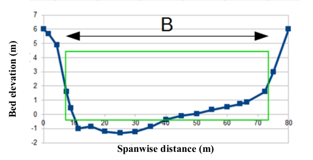

 Cross-section of the controlling channel and the principle of its modelling by an equivalent rectangle (green). 

The flow resistance parameter $K_S$ or $n$ of channel controls is often difficult to determine precisely. There exist look-up tables of typical values (e.g. [Chow's table](Chow_en.xlsx)) and calculation
methods that rely on a more detailed description of flow conditions (e.g. [Cowan's method](Cowan_en.xlsx)).

In channel controls equations, the friction slope is approximated by the longitudinal slope $S$ of the bed or of the water profile. The slope of the water profile in flood conditions is rarely known. By default, we use the average slope of the bed or the low flow water profile, which is easier to measure.

## Remarks

Priors reflect what the user knows about the configuration of the studied station, but also the
uncertainty of such knowledge. This is not about guessing the “right” results. The objective is to
determine “honest” priors, i.e. reasonable estimates of each parameter and its uncertainty.

For example, for a rectangular weir the spillway width will not receive the same uncertainty whether
it has been estimated by eye or with a topographic device.

This approach echoes the complex of the modeller, always seeking the perfect value. Modelled
phenomena are so complex that even the sharpest models, propped by the best algorithms ALWAYS
contain an element of uncertainty. The perfect value does not exist. There are only expected values;
we must approach it by giving our best but remain humble. Uncertainties on the physical values must
simply be representative of the reliability that is attributed to our estimation of these values. Some
examples are provided in the [case study](/en/doc/case) section.

