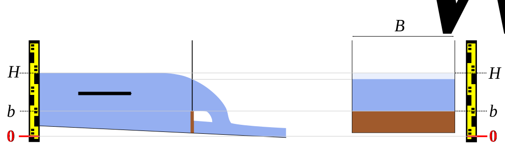
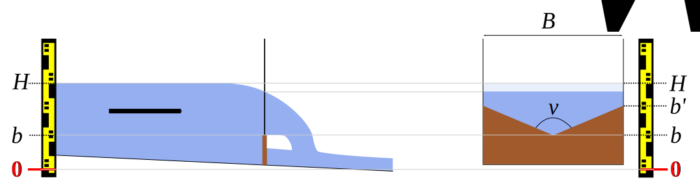

# Controls

## The basic equation

For all the standard controls used in BaRatinAGE, the stage-discharge relation is described by a power function which is active above a given stage. The basic equation is as follows:

$$ Q(H) = 
\begin{cases}
0 \text{ si } H \leq b \text{ ou } h \leq \kappa \\
a(H-b)^c \text { sinon}
\end{cases}
$$

* $Q$ is the discharge and $H$ is the stage;
* $\kappa$ is the *activation stage*; when the water level falls below $\kappa$, the control becomes inactive;
* $a$ is the *coefficient*, which depends on the physical properties of the control;
* $c$ is the *exposant*, which depends on the type of control;
* $b$ is the *offset*; when the water level falls below the value $b$, the flow is zero.

Note that the offset is generally different from the activation stage $\kappa$. For example, for a channel control that follows a weir control, the parameter $b$ represents the average elevation of the bottom of the bed, but the control will only be active for a water level above which the weir is flooded, which is physically different from $b$.

## Section controls and channel controls

For section controls, the stage-discharge relation at the measurement cross-section is determined by a downstream cross-section where the flow is critical (Froude number is equal to 1). For simple cross-section shapes such as the ones used in BaRatinAGE (rectangular, triangular, parabolic), the following equation holds: 

$$Q(H) = C\sqrt{2g}A_w(H)\sqrt{H-b}$$

where $C$ is a discharge coefficient accounting for the head losses between the measurement cross-section (upstream) and the critical cross-section (downstream) and depending on the cross-section shape, $A_w$ is the wetted area ($m^2$), $g$ is the gravity
acceleration ($g \approx 9.81 m.s^{-2}$).

For channel controls, i.e. when the stage-discharge relation is determined by friction, equation 1 is established from the Manning-Strickler equation applied to the given geometry of the channel. The Manning-Strickler equation is:

$$Q(H) = K_S A_w R_h^{2/3} \sqrt{S_f}$$

where $K_S$ = flow resistance coefficient (Strickler coefficient in $m^{1/3}.s^{-1}$) ; Manning coefficient $n = 1 / K_S$ ($m^{-1/3}.s$) can be used instead. $A_w$ = wetted area ($m^2$), $R_h=A_w/P_w$ = hydraulic radius ($m$), $P_w$ = wetted perimeter ($m$), $S_f$ = head line slope (or friction slope), approximated by the longitudinal slope of the bed or of the water profile for steady uniform flows.

# Equations of the standard controls

## Rectangular weir

 Figure 1: Rectangular weir: longitudinal view (left) and front view of control cross-section (right). 

The equation of this type of control is:

$$Q(H) = C_r \sqrt{2g} B_w (H-b)^c $$

For each control modelled as a rectangular weir, priors must be assigned for the following parameters:

* $\kappa$ = the water level (in $m$) above which the control becomes active; when the control is the first, or when the control adds to existing controls, this activation stage is equal to the weir crest elevation $b$;
* $B_w$ = the spillway width (in $m$), i.e. the transverse length of the weir, normal to the flow direction.

Default priors are already specified for the other parameters:

* $C_r$ = discharge coefficient $\approx 0.4 ± 0.1$
* $g$ = gravitational acceleration $\approx 9.81 ± 0.01 m.s^{-2}$
* $c$ = exponent for a rectangular critical cross-section $\approx 1.5 ± 0.05$

## Parabolic weir

 Figure 2. Parabolic weir: longitudinal view (left) and front view of control cross-section (right). 

Re-arranging the results of [Igathinathane et al. (2007)](https://doi.org/10.1016/j.biosystemseng.2006.09.006), the equation of this type of control is:

$$Q(H) = C_p \sqrt{2g} \frac{B_p}{\sqrt{H_p}} (H-b)^c $$

For each control modelled as a parabolic weir, priors must be assigned for the following parameters:

* $\kappa$ = the water level (in $m$)above which the control becomes active; when the control is the first, or when the control adds to existing controls, this activation stage is equal to the weir crest elevation $b$ at the centre of the parabola;
* $B_p$ et $H_p$ = the width and height (in $m$), of the parabola, respectively, measured at the same given elevation (e.g. the bankful stage).

Default priors are already specified for the other parameters:

* $C_p$ = discharge coefficient $\approx 0.22 ± 0.04$ ([Igathinathane et al. 2007](https://doi.org/10.1016/j.biosystemseng.2006.09.006))
* $g$ = gravitational acceleration $\approx 9.81 ± 0.01 m.s^{-2}$
* $c$ = exponent for a parabolic critical cross-section $\approx 2.0 ± 0.05$

Note: The discharge coefficient seems to be larger than 0.22 for wider parabolic weirs: according to [Igathinathane et al. (2007)](https://doi.org/10.1016/j.biosystemseng.2006.09.006), $C_p \approx 0.25$ for $B_p=2H_p$. There is no precise information on very wide
parabolic weirs and on broad-crested parabolic weirs.

## Triangular weir

 Figure 3: Triangular weir: longitudinal view (left) and front view of control cross-section
(right). 

The equation of this type of control is:
$$Q(H) = C_t \sqrt{2g} \tan(\nu/2) (H-b)^c $$

For each control modelled as a triangular weir, priors must be assigned for the following parameters:

* $\kappa$ = the water level (in $m$) above which the control becomes active; when the control is the first, or when the control adds to existing controls, this activation stage is equal to the elevation of the triangle vertex $b$;
* $\nu$ = the triangle opening angle (in degrees).

Default priors are already specified for the other parameters:

* $C_t$ = discharge coefficient $\approx 0.31 ± 0.05$
* $g$ = gravitational acceleration $\approx 9.81 ± 0.01 m.s^{-2}$
* $c$ = exponent for a triangular critical cross-section $\approx 2.5 ± 0.05$

## Free-flowing orifice

 Figure 4: Free-flowing orifice: longitudinal view (left) and front view of the control cross-section (right). 

The equation of this type of control is:
$$Q(H) = C_o \sqrt{2g} A_w (H-b)^c $$

For each control modelled as a free-flowing orifice (flow fills the orifice but there is a free fall at the outlet, with no influence of the downstream stage on the stage-discharge relation, see Figure 4), priors must be assigned for the following parameters:

* $\kappa$ = the water level (in $m$) above which the control becomes active;
* $A_w$ = the cross-sectional area (en $m²$) of the orifice.

Default priors are already specified for the other parameters:

* $C_o$ = discharge coefficient $\approx 0.6 ± 0.1$
* $g$ = gravitational acceleration $\approx 9.81 ± 0.01 m.s^{-2}$
* $c$ = exponent for a free-flowing orifice $\approx 0.5 ± 0.05$

Note. The hydraulic structure featuring the orifice may produce a backwater that influences the water level before the hole is completely filled and that the previous equation to apply. Hydraulic modelling can then be used to represent this transition phase and this specific backwater effect.

## Rectangular channel (wide)

 Figure 5: Wide rectangular channel: longitudinal view (left) and cross-section at the staff gauge (right). 

The Manning-Strickler equation is applied to a wide rectangular channel, i.e. $H-b \ll B_w$ (typically $5(H-b) < B_w$).

The equation of this type of control is:

$$Q(H) = K_S \sqrt{S} B_w (H-b)^c $$

For each control modelled as a wide rectangular channel control, priors must be assigned for the following parameters:

* $\kappa$ = the water level (in $m$) above which the control becomes active; when the control is the first, or when the control adds to existing controls this activation stage is equal to the mean bed elevation $b$ at the gauge;
* $B_w$ = the width (in $m$) of the rectangular channel;
* $S$ = the longitudinal slope of the river channel (dimensionless, e.g. write 0.01 for a 1% slope, etc.);
* $K_S$ = the flow resistance parameter (Strickler coefficient in $m^{1/3}.s^{-1}$);
* The  Manning coefficient $n=1/K_S$ ($m^{-1/3}.s$) can be used instead.

Default priors are already specified for the remaining parameter:

* $c$ = exponent for a wide rectangular channel control $\approx 1.67 ± 0.05$

## Parabolic channel (wide)

 Figure 6: Wide parabolic channel: longitudinal view (left) and cross-section at the staff gauge (right). 

The Manning-Strickler equation is applied to a wide parabolic channel, i.e.
$$H-b \ll \frac{3}{8}\frac{B_p^2}{H_p}$$

Typically, the condition is:

$$5(H-b) < \frac{3}{8}\frac{B_p^2}{H_p}$$

The equation of this type of control is:

$$Q(H) = K_S \sqrt{S} \left( \frac{2}{3} \right)^{5/3}\frac{B_p}{H_p} (H-b)^c $$

For each control modelled as a wide parabolic channel control, priors must be assigned for the following parameters:

* $\kappa$ = the water level (in $m$) above which the control becomes active; when the control is the first, or when the control adds to existing controls this activation stage is equal to the mean thalweg elevation $b$ at the gauge;
* $B_p$ and $H_p$ = the width and height (in $m$) of the parabola, respectively, measured at the same given elevation (e.g. the bankful stage);
* $S$ = the longitudinal slope of the river channel (dimensionless, e.g. write 0.01 for a 1% slope, etc.);
* $K_S$ = the flow resistance parameter (Strickler coefficient in $m^{1/3}.s^{-1}$)
* Manning's $n=1/K_S$ ($m^{-1/3}.s$) can be used instead.

Default priors are already specified for the remaining parameter:

* $c$ = exponent for a wide parabolic channel control $\approx 2.17 ± 0.05$

## Triangular channel

 Figure 7: Triangular channel: longitudinal view (left) and cross-section at the staff gauge (right).

The Manning-Strickler equation is applied to a triangular channel. The equation of this type of control is:

$$Q(H) = K_S \sqrt{S} \tan(\nu/2) \left( \frac{\sin(\nu/2)}{2} \right)^{2/3} (H-b)^c $$

For each control modelled as a triangular channel control, priors must be assigned for the following parameters:

* $\kappa$ = the water level (in $m$) above which the control becomes active; when the control is the first, or when the control adds to existing controls this activation stage is equal to the mean thalweg elevation $b$ at the gauge;
* $\nu$ = the triangle opening angle (in degrees);
* $S$ = the longitudinal slope of the river channel (dimensionless, e.g. write 0.01 for a 1% slope,etc.);
* $K_S$ = the flow resistance parameter (Strickler coefficient in $m^{1/3}.s^{-1}$)
* Manning's $n=1/K_S$ ($m^{-1/3}.s$) can be used instead.

Default priors are already specified for the remaining parameter:

* $c$ = exponent for a triangular channel control $\approx 2.67 ± 0.05$

## Other types of controls
Experience shows that with the small number of standard controls presented so far, many situations encountered in practice can be described. The key is to combine these standard controls (by making them succeed or add to each other) to best describe the actual hydraulic configuration.

Nevertheless, there are some controls that cannot be modelled trivially by combining the standard controls. Figure 8 shows an example: a triangular weir which laterally expands up to a given stage, then is framed with vertical walls. The best way to model such a section control would be consider the excess wetted area by removing a second triangular weir equation from the first triangular weir equation.

The equation of this type of control (`truncated triangle’) would be:

$$ Q(H) = C_t \sqrt{2g} \tan(\nu/2) (H-b)^c - C_t \sqrt{2g} \tan(\nu/2) (H-b')^c $$

for $H>b'$ with $b'$ = the water level at which the triangle meets the vertical walls. However, this is not possible with BaRatinAGE since negative coefficients are not allowed.

A practical way to model this type of configuration is to combine a triangular section control for low stages and a rectangular section control for high stages. For intermediate stages, a fair transition between triangle and rectangle approximations can be computed using a parabolic section control of intermediate offset and suitable height and width.

 Figure 8: Triangular weir framed with vertical walls: longitudinal view (left) and front view of control cross-section (right). 

# Prior specification

## Determination of prior parameters

The hydraulic analysis (matrix of controls) induced the mathematical model of the rating curve by combining the equations of the standard controls (for more details on the rating curve equation, see [this page](/en/doc/topics/rating-curve/)).

At this stage of the method the objective is to give plausible values to the different parameters of this model. The Bayesian inference, i.e. the basis of the method, requires assigning a central value and a non-zero uncertainty to each parameter. This is what we call prior parameters (see this page: [Bayesian basics](/en/doc/topics/bayesian/)).

Therefore, prior parameters $\kappa$, $a$ and $c$ must be specified for every control. However, it is not necessary to specify a prior parameter $b$: the discharge continuity of the rating curve is a constraint which implies that the parameter $b$ is automatically inferred from the other three parameters.

In BaRatinAGE, priors consist of a value and a "±" uncertainty expressed in the same unit as the parameter to which it is assigned. This expanded uncertainty is equal to twice the standard-uncertainty (standard-deviation). The underlying assumption is that the prior uncertainty of the true value of the parameter follows a Gaussian distribution.

Notes:

* The prior values must be estimated with care by the user but **without ever using the gaugings**. If however one or more gaugings are used to estimate the priors, they must be removed from the dataset that will be used by BaRatin to compute the rating curve.
* It is rarely necessary to use gaugings to estimate the priors since the parameters of the standard controls equations are relatively easy to determine physical parameters as discussed in the examples.

BaRatinAGE offers help in the prior setting of the equations of each of the standard controls presented above. In these formulas, the coefficient $a$ of the basic equation $a(H-b)^c$ is a function of several physical parameters, of which the user must specify a central value and an uncertainty, i.e. the mean and twice the standard deviation of the underlying Gaussian distribution.

BaRatinAGE then calculates the central value of the coefficient $a$ and its uncertainty, by the method of propagation of uncertainty given by the GUM ([JCGM, 2008](https://www.iso.org/sites/JCGM/GUM/JCGM100/C045315e-html/C045315e.html?csnumber=50461)), based on a first order Taylor series expansion. The formulas implemented for the various standard-controls are detailed in the sections below. Remember that the standard uncertainties, $u$, are half of expanded uncertainties visible in the BaRatinAGE interface.

**General propagation formula**

$$
\begin{align}
a = & f(x_1,\ldots,x_p) \\
u^2(a) = & \sum_{i=1}^p \left( \frac{\partial f(x_1,\ldots,x_p)}{\partial x_i} \right)^2 u^2(x_i)
\end{align}
$$
**Rectangular weir**

$$
\begin{align}
a= & C_r \sqrt{2g} B_w  \\
u^2(a) = & \left( \sqrt{2g} B_w \right)^2 u^2(C_r) +
\left(\frac{C_r B_w}{\sqrt{2g}}  \right)^2 u^2(g)+
\left( C_r \sqrt{2g} \right)^2 u^2(B_w)
\end{align}
$$
**Parabolic weir**

$$
\begin{align}
a = & C_p \sqrt{2g} \frac{B_p}{\sqrt{H_p}}  \\
u^2(a) = & \left(\sqrt{2g} \frac{B_p}{\sqrt{H_p}} \right)^2 u^2(C_p)+
\left( C_p  \frac{B_p}{\sqrt{2g}\sqrt{H_p}} \right)^2 u^2(g)+
\left( \frac{C_p \sqrt{2g}}{\sqrt{H_p}} \right)^2 u^2(B_p)+
\left( C_p \sqrt{2g} \frac{B_p}{2H_p^{3/2}} \right)^2 u^2(H_p)
\end{align}
$$

**Triangular weir**

$$
\begin{align}
a = & C_t \sqrt{2g} \tan(\nu/2)  \\
u^2(a) = & \left( \sqrt{2g} \tan(\nu/2) \right)^2 u^2(C_t)+
\left( \frac{C_t \tan(\nu/2)}{\sqrt{2g}} \right)^2 u^2(g)+
\left( \frac{C_t \sqrt{2g}}{2\cos^2(\nu/2)} \right)^2 u^2(\nu)
\end{align}
$$
**Free-flowing orifice**

$$
\begin{align}
a = & C_o \sqrt{2g} A_w  \\
u^2(a) = & \left( \sqrt{2g} A_w \right)^2 u^2(C_o) +
\left(\frac{C_o A_w}{\sqrt{2g}}  \right)^2 u^2(g)+
\left( C_o \sqrt{2g} \right)^2 u^2(A_w)
\end{align}
$$
**Large rectangular channel**

$$
\begin{align}
a = & K_S \sqrt{S} B_w  \\
u^2(a) = & \left( \sqrt{S} B_w \right)^2 u^2(K_S) +
\left(\frac{K_S B_w}{2\sqrt{S}}  \right)^2 u^2(S)+
\left( K_S \sqrt{S} \right)^2 u^2(B_w)
\end{align}
$$

**Large parabolic channel**

$$
\begin{align}
a = & K_S \left( \frac{2}{3}\right)^{5/3}  \sqrt{S} \frac{B_p}{\sqrt{H_p}} \\
u^2(a) = & \left( \frac{2}{3}\right)^{10/3} \left[ 
\left( \sqrt{S} \frac{B_p}{\sqrt{H_p}}  \right)^2 u^2(K_S)+
\left( \frac{K_S B_p}{2 \sqrt{S} \sqrt{H_p}} \right)^2 u^2(S)+
\left(  \frac{K_S \sqrt{S}}{\sqrt{H_p}} \right)^2 u^2(B_p)+
\left(  \frac{K_S \sqrt{S} B_p}{2H_p^{3/2}} \right)^2 u^2(H_p) \right]
\end{align}
$$

**Triangular channel**

$$
\begin{align}
a = & K_S \sqrt{S} \tan(\nu/2) \left( \frac{\sin(\nu/2)}{2} \right)^{2/3}  \\
u^2(a) = & \left( \sqrt{S} \tan(\nu/2) \left( \frac{\sin(\nu/2)}{2} \right)^{2/3} \right)^2 u^2(K_S)+
\left( \frac{K_S \tan(\nu/2) \left( \frac{\sin(\nu/2)}{2} \right)^{2/3}}{2\sqrt{S}} \right)^2 u^2(S)+
\left( K_S \sqrt{S} \left( \frac{1}{2} \right)^{5/3} \sin^{2/3}(\nu/2) \left( \frac{1}{\cos^2(\nu/2)}+\frac{2}{3} \right) \right)^2 u^2(\nu)
\end{align}
$$

## Approximation of actual, complex controls

Modelling real controls using idealised, standard controls usually requires to approximate the actual geometry by an equivalent, simple shape. For instance, estimating the prior parameters of rectangular section or channel controls requires finding the rectangle that would be the best approximation of the average shape of the natural riffle or channel (see Figure 9). Note the "average" controlling channel actually extends upstream and downstream of the station, so the geometry approximation should be done at the reach scale, based on representative cross-sections.

 Figure 9. Cross-section of the controlling channel and the principle of its modelling by an equivalent rectangle (green). 

The flow resistance parameter $K_S$ or $n$ of channel controls is often difficult to determine precisely. There exist look-up tables of typical values (e.g. [Chow's table](Chow_en.xlsx)) and calculation
methods that rely on a more detailed description of flow conditions (e.g. [Cowan's method](Cowan_en.xlsx)).

In channel controls equations, the friction slope is approximated by the longitudinal slope $S$ of the bed or of the water profile. The slope of the water profile in flood conditions is rarely known. By default, we use the average slope of the bed or the low flow water profile, which is easier to measure.

## Remarks

Priors reflect what the user knows about the configuration of the studied station, but also the
uncertainty of such knowledge. This is not about guessing the “right” results. The objective is to
determine “honest” priors, i.e. reasonable estimates of each parameter and its uncertainty.

For example, for a rectangular weir the spillway width will not receive the same uncertainty whether
it has been estimated by eye or with a topographic device.

This approach echoes the complex of the modeller, always seeking the perfect value. Modelled
phenomena are so complex that even the sharpest models, propped by the best algorithms ALWAYS
contain an element of uncertainty. The perfect value does not exist. There are only expected values;
we must approach it by giving our best but remain humble. Uncertainties on the physical values must
simply be representative of the reliability that is attributed to our estimation of these values. Some
examples are provided in the [case study](/en/doc/case) section.

