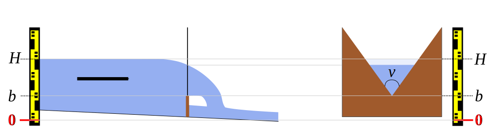
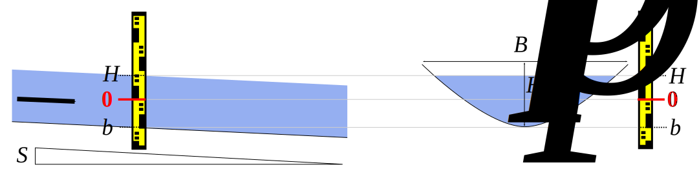

# Contrôles

## Equation de base

Pour tous les contrôles-types utilisés dans BaRatinAGE, la relation hauteur-débit est décrite par une loi puissance qui s’active à partir d’une certaine hauteur. L’équation de base est la suivante :

$$ Q(H) = 
\begin{cases}
0 \text{ si } H \leq b \text{ ou } h \leq \kappa \\
a(H-b)^c \text { sinon}
\end{cases}
$$

* $Q$ est le débit et $H$ est la hauteur d’eau
* $\kappa$ est la *hauteur d'activation* ; quand la hauteur descend sous la valeur $\kappa$, le contrôle devient inactif
* $a$ est le *coefficient*, qui dépend des propriétés physiques du contrôle
* $c$ est l'*exposant*, qui dépend uniquement du type de contrôle
* $b$ est l'*offset* ; quand la hauteur descend sous la valeur $b$, le débit est nul.

Notez que ce dernier paramètre est en général différent de la hauteur d'activation $\kappa$. A titre d'exemple, pour un contrôle par chenal qui succède à un contrôle par seuil, le paramètre $b$ représente la cote moyenne du fond du lit, mais le contrôle ne s'active qu'au-delà de la hauteur d'ennoiement du seuil, qui est différente de $b$.

## Contrôles par section et contrôles par chenal

Pour les contrôles par section, la relation hauteur-débit à la section de mesure est déterminée par le passage de l’écoulement par le régime critique (nombre de Froude égal à 1) au niveau d'une section de contrôle située à l'aval du point de mesure. Pour les formes de section simples telles que celles considérées dans BaRatinAGE (cas rectangle, triangle, parabole), on établit l’équation ci-dessous :

$$Q(H) = C\sqrt{2g}A_w(H)\sqrt{H-b}$$

avec $C$ un coefficient de débit dépendant de la forme de la section de contrôle et reflétant les pertes de charge entre la section de mesure et la section critique située à l’aval, $A_w$ l'aire mouillée (en $m^2$), $g$ l'accélération de la gravité ($g \approx 9.81 m.s^{-2}$).

Pour les contrôles par chenal, i.e. quand la relation hauteur-débit est déterminée par les frottements, on établit l’équation puissance à partir de la formule de Manning-Strickler appliquée à la géométrie du chenal. La formule de Manning-Strickler s’écrit :

$$Q(H) = K_S A_w R_h^{2/3} \sqrt{S_f}$$

Avec $K_S$ = le coefficient de résistance à l’écoulement (coefficient de Strickler en $m^{1/3}.s^{-1}$) ; le
coefficient de Manning $n = 1 / K_S$ (en $m^{-1/3}.s$) peut être utilisé à la place. $A_w$ = aire mouillée (en $m^2$), $R_h=A_w/P_w$ = rayon hydraulique (en $m$), $P_w$ = périmètre mouillé (en $m$), $S_f$ = pente de la ligne d’énergie (ou pente de frottement), approximée par la pente longitudinale du fond ou de la ligne d’eau pour un écoulement permanent uniforme.

# Equations des contrôles-types

## Déversoir rectangulaire

 Figure 1: Déversoir rectangulaire : vue en long (à gauche) et vue en travers de la section de contrôle (à droite). 

L’équation de ce type de contrôle est :
$$Q(H) = C_r \sqrt{2g} B_w (H-b)^c $$

Pour chaque contrôle modélisé par un déversoir rectangulaire, les paramètres non renseignés par défaut auxquels il faut affecter des a priori sont :

* $\kappa$ = la hauteur d’eau (en $m$) à partir de laquelle le contrôle devient actif ; quand le contrôle est le premier, ou qu’il s’ajoute à des contrôles existants, cette hauteur d’activation est égale à la cote $b$ de la crête du déversoir ;
* $B_w$ = la largeur déversante (en $m$), i.e. la longueur transversale du déversoir, perpendiculairement à la direction de l’écoulement.

Pour les autres paramètres, des a priori par défaut sont déjà spécifiés :

* $C_r$ = coefficient de débit $\approx 0.4 ± 0.1$
* $g$ = accélération de la gravité $\approx 9.81 ± 0.01 m.s^{-2}$
* $c$ = exposant pour une section critique rectangulaire $\approx 1.5 ± 0.05$

## Déversoir parabolique

 Figure 2. Déversoir parabolique : vue en long (à gauche) et vue en travers de la section de contrôle (à droite). 

L’équation de ce type de contrôle est :

$$Q(H) = C_p \sqrt{2g} \frac{B_p}{\sqrt{H_p}} (H-b)^c $$

Pour chaque contrôle modélisé par un déversoir parabolique, les paramètres non renseignés par défaut auxquels il faut affecter des a priori sont :

* $\kappa$ = la hauteur d’eau (en $m$) à partir de laquelle le contrôle devient actif ; quand le contrôle est le premier, ou qu’il s’ajoute à des contrôles existants, cette hauteur d’activation est égale à la cote $b$ de la crête du déversoir au centre de la parabole ;
* $B_p$ et $H_p$ = respectivement la largeur et la hauteur de la parabole (en $m$), mesurés à la même cote (par exemple au plein-bord).

Pour les autres paramètres, des a priori par défaut sont déjà spécifiés :

* $C_p$ = coefficient de débit $\approx 0.22 ± 0.04$ ([Igathinathane et al. 2007](https://doi.org/10.1016/j.biosystemseng.2006.09.006))
* $g$ = accélération de la gravité $\approx 9.81 ± 0.01 m.s^{-2}$
* $c$ = exposant pour une section critique parabolique $\approx 2.0 ± 0.05$

Note: le coefficient de débit semble être plus grand que 0.22 pour les déversoirs paraboliques les
plus larges : selon les résultats d’[Igathinathane et al. (2007)](https://doi.org/10.1016/j.biosystemseng.2006.09.006), $C_p \approx 0.25$ pour $B_p=2H_p$. Nous ne disposons pas d’information précise sur le coefficient des déversoirs paraboliques très larges ou à seuil épais.

## Déversoir triangulaire

 Figure 3: Déversoir triangulaire : vue en long (à gauche) et vue en travers de la section de contrôle (à droite). 

L’équation de ce type de contrôle est :
$$Q(H) = C_t \sqrt{2g} \tan(\nu/2) (H-b)^c $$

Pour chaque contrôle modélisé par un déversoir triangulaire, les paramètres non renseignés par défaut auxquels il faut affecter des a priori sont :

* $\kappa$ = la hauteur d’eau (en $m$) à partir de laquelle le contrôle devient actif ; quand le contrôle est le premier, ou qu’il s’ajoute à des contrôles existants, cette hauteur d’activation est égale à la cote $b$ de la pointe du déversoir ;
* $\nu$ = l'angle d'ouverture du triangle (en degrés).

Pour les autres paramètres, des a priori par défaut sont déjà spécifiés :

* $C_t$ = coefficient de débit $\approx 0.31 ± 0.05$
* $g$ = accélération de la gravité $\approx 9.81 ± 0.01 m.s^{-2}$
* $c$ = exposant pour une section critique triangulaire $\approx 2.5 ± 0.05$

## Orifice dénoyé

 Figure 4 : Orifice dénoyé : vue en long (à gauche) et vue en travers de la section de contrôle (à droite). 

L’équation de ce type de contrôle est :
$$Q(H) = C_o \sqrt{2g} A_w (H-b)^c $$

Pour chaque contrôle modélisé par un orifice dénoyé (l’écoulement remplit tout l’orifice mais sort librement à l’aval, sans influence de la hauteur d’eau aval sur la relation hauteur-débit, voir Figure 4), les paramètres non renseignés par défaut auxquels il faut affecter des a priori sont :

* $\kappa$ = la hauteur d’eau (en $m$) à partir de laquelle le contrôle devient actif ;
* $A_w$ = l'aire mouillée (en $m²$) de la section de l’orifice.

Pour les autres paramètres, des a priori par défaut sont déjà spécifiés :

* $C_o$ = coefficient de débit $\approx 0.6 ± 0.1$
* $g$ = accélération de la gravité $\approx 9.81 ± 0.01 m.s^{-2}$
* $c$ = exposant pour une section critique triangulaire $\approx 0.5 ± 0.05$

Note : souvent l'ouvrage comprenant l'orifice produit un remous hydraulique qui influence la hauteur d'eau avant que l'orifice ne soit complètement rempli et que la loi précédente puisse s'appliquer. La modélisation hydraulique peut alors permettre de représenter cette phase de transition et l'effet de ce remous spécifique.

## Chennal rectangulaire (large)

 Figure 5: Chennal rectangulaire large : vue en long (à gauche) et section en travers à l'échelle (à droite). 

La formule de Manning-Strickler est appliquée à un chenal rectangulaire large, i.e. $H-b \ll B_w$ (typiquement $5(H-b) < B_w$).

L’équation de ce type de contrôle est :

$$Q(H) = K_S \sqrt{S} B_w (H-b)^c $$

Pour chaque contrôle modélisé par un chennal rectangulaire large, les paramètres non renseignés par défaut auxquels il faut affecter des a priori sont :

* $\kappa$ = la hauteur d’eau (en $m$) à partir de laquelle le contrôle devient actif ; quand le contrôle est le premier, ou qu’il s’ajoute à des contrôles existants, cette hauteur d’activation est égale à la cote moyenne $b$ du fond du chenal ;
* $B_w$ = la largeur (en $m$), du chenal.
* $S$ = la pente longitudinale du chenal autour de la station (sans unité, il faut saisir
0.01 pour 1%, etc.)
* $K_S$ = le coefficient de résistance à l’écoulement (coefficient de Strickler en $m^{1/3}.s^{-1}$)
* Le coefficient de Manning $n=1/K_S$ ($m^{-1/3}.s$) peut être utilisé à la place.

Pour le paramètre restant, des a priori par défaut sont déjà spécifiés :

* $c$ = exposant pour un chenal rectangulaire large $\approx 1.67 ± 0.05$

## Chennal parabolique (large)

 Figure 6: Chennal parabolique large : vue en long (à gauche) et section en travers à l'échelle (à droite). 

La formule de Manning-Strickler est appliquée à un chenal parabolique large, i.e. :
$$H-b \ll \frac{3}{8}\frac{B_p^2}{H_p}$$

Typiquement, la condition prise est :

$$5(H-b) < \frac{3}{8}\frac{B_p^2}{H_p}$$

L’équation de ce type de contrôle est :

$$Q(H) = K_S \sqrt{S} \left( \frac{2}{3} \right)^{5/3}\frac{B_p}{H_p} (H-b)^c $$

Pour chaque contrôle modélisé par un chennal rectangulaire large, les paramètres non renseignés par défaut auxquels il faut affecter des a priori sont :

* $\kappa$ = la hauteur d’eau (en $m$) à partir de laquelle le contrôle devient actif ; quand le contrôle est le premier, ou qu’il s’ajoute à des contrôles existants, cette hauteur d’activation est égale à la cote moyenne $b$ du fond du chenal (thalweg) ;
* $B_p$ et $H_p$ = respectivement la largeur et la hauteur de la parabole (en $m$), mesurés à la même
cote (par exemple au plein-bord).
* $S$ = la pente longitudinale du chenal autour de la station (sans unité, il faut saisir
0.01 pour 1%, etc.)
* $K_S$ = le coefficient de résistance à l’écoulement (coefficient de Strickler en $m^{1/3}.s^{-1}$)
* Le coefficient de Manning $n=1/K_S$ ($m^{-1/3}.s$) peut être utilisé à la place.

Pour le paramètre restant, des a priori par défaut sont déjà spécifiés :

* $c$ = exposant pour un chenal parabolique large $\approx 2.17 ± 0.05$

## Chennal triangulaire

 Figure 7: Chennal triangulaire : vue en long (à gauche) et section en travers à l'échelle (à droite). 

La formule de Manning-Strickler est appliquée à un chenal triangulaire. L’équation de ce type de contrôle est :

$$Q(H) = K_S \sqrt{S} \tan(\nu/2) \left( \frac{\sin(\nu/2)}{2} \right)^{2/3} (H-b)^c $$

Pour chaque contrôle modélisé par un chennal triangulaire, les paramètres non renseignés par défaut auxquels il faut affecter des a priori sont :

* $\kappa$ = la hauteur d’eau (en $m$) à partir de laquelle le contrôle devient actif ; quand le contrôle est le premier, ou qu’il s’ajoute à des contrôles existants, cette hauteur d’activation est égale à la cote moyenne $b$ du fond du chenal (thalweg) ;
* $\nu$ = l’angle d’ouverture du triangle (en degrés) ;
* $S$ = la pente longitudinale du chenal autour de la station (sans unité, il faut saisir
0.01 pour 1%, etc.) ;
* $K_S$ = le coefficient de résistance à l’écoulement (coefficient de Strickler en $m^{1/3}.s^{-1}$)
* Le coefficient de Manning $n=1/K_S$ ($m^{-1/3}.s$) peut être utilisé à la place.

Pour le paramètre restant, des a priori par défaut sont déjà spécifiés :

* $c$ = exposant pour un chenal triangulaire large $\approx 2.67 ± 0.05$

## Autres types de contrôles

L’expérience montre qu’avec le petit nombre de contrôles-type présentés jusqu’ici, on peut décrire de très nombreuses situations rencontrées en pratique. La clé est de combiner ces contrôles-type (en les faisant se succéder les uns aux autres ou en les ajoutant) pour décrire au mieux la configuration hydraulique.

Il existe néanmoins certains contrôles qui ne peuvent pas être modélisés de façon triviale en combinant les contrôles-type. La Figure 8 ci-dessous fournit un exemple : un seuil triangulaire dont l’évasement s'interrompt à partir d’une certaine hauteur pour être bordé de parois verticales. La meilleure façon de modéliser ce type d’ouvrage serait d’ajouter un déversoir triangulaire « négatif » au déversoir triangulaire réel pour retrancher l’excès de section mouillée quand la hauteur d’eau atteint les parois verticales. 

L’équation de ce type de contrôle (« triangle tronqué ») serait donc :

$$ Q(H) = C_t \sqrt{2g} \tan(\nu/2) (H-b)^c - C_t \sqrt{2g} \tan(\nu/2) (H-b')^c $$

pour $H>b'$ avec $b'$ = la cote à laquelle les bords du triangle rencontrent les parois verticales. Ceci ne pourrait cependant pas être implémenté dans BaRatinAGE puisque les coefficients négatifs n’y sont pas autorisés.

Un moyen commode de modéliser ce type de situation est de combiner un déversoir triangulaire pour les bas débits et un déversoir rectangulaire pour les hauts débits. Pour les débits intermédiaires, une transition acceptable entre les approximations triangles et rectangles peut être calculée avec un déversoir parabolique équivalent, d’offset intermédiaire et de dimensions appropriées.

 Figure 8: Déversoir triangulaire confiné par des parois verticales: vue en long (à gauche) et vue en travers de la section de contrôle (à droite). 

# Spécification des a priori

## Détermination des paramètres a priori

L'analyse hydraulique (la matrice des contrôles) induit le modèle mathématique de la courbe de tarage en combinant les équations des contrôles-type (pour plus de détails sur l’équation de la courbe de tarage, voir [cette page](/fr/doc/topics/courbe-de-tarage/)).

A cette étape de la méthode il s'agit de donner des valeurs vraisemblables aux différents paramètres
de ce modèle. En effet l'inférence bayésienne, fondement de la méthode, implique d'attribuer à
chacun des paramètres une valeur ET une incertitude non nulle. C'est ce que nous appelons les
paramètres a priori (voir la page [inférence Bayésienne](/fr/doc/topics/bayesien/)).

Pour chaque contrôle il faut donc spécifier un a priori sur les paramètres $\kappa$, $a$ et $c$. Il n’est par contre pas nécessaire d’en spécifier un pour le paramètre $b$ : en effet, la continuité de la courbe de tarage impose une contrainte qui implique que le paramètre $b$ se déduit automatiquement des trois autres paramètres.

Dans BaRatinAGE, un a priori se compose d'une valeur et d'une incertitude de type "±" exprimée dans la même unité que le paramètre auquel elle est attribuée. Cette incertitude élargie est égale à deux fois l’incertitude-type (écart-type). L’hypothèse sous-jacente est que l’incertitude a priori sur la valeur du paramètre est exprimée comme une loi gaussienne.

Notes:

* La valeur a priori doit être estimée avec soin par l'utilisateur mais **sans jamais utiliser les jaugeages**. Si malgré tout un ou plusieurs jaugeages sont utilisés pour estimer un a priori, il faut retirer ces jaugeages du jeu de données qui sera utilisé par BaRatin pour produire la courbe de tarage.
* Il n'est que très rarement indispensable d'utiliser des jaugeages pour estimer les a priori car les paramètres des lois des contrôles-type sont des paramètres physiques relativement faciles à déterminer comme on le verra par la suite dans les exemples.

BaRatinAGE propose une aide au paramétrage a priori de l’équation de chacun des différents contrôles-types présentés plus haut. Dans ces formules, le coefficient $a$ de l’équation de base $a(H-b)^c$ est une fonction de plusieurs paramètres physiques, dont l’utilisateur doit spécifier une valeur centrale et une incertitude (moyenne et deux fois l’écart-type de la distribution gaussienne sous-jacente).

BaRatinAGE calcule ensuite la valeur centrale du coefficient $a$ et son incertitude, par la méthode de propagation des incertitudes proposée par le GUM ([JCGM, 2008](https://www.iso.org/sites/JCGM/GUM/JCGM100/C045315e-html/C045315e.html?csnumber=50461)), soit un développement limité de série de Taylor au premier ordre. Les formules implémentées pour les différents contrôles-types sont détaillées ci-dessous. On rappelle que les incertitudes-types notées $u$ valent la moitié des incertitudes élargies visibles dans l’interface de BaRatinAGE.

**Formule générale de propagation**

$$
\begin{align}
a = & f(x_1,\ldots,x_p) \\
u^2(a) = & \sum_{i=1}^p \left( \frac{\partial f(x_1,\ldots,x_p)}{\partial x_i} \right)^2 u^2(x_i)
\end{align}
$$
**Déversoir rectangulaire**

$$
\begin{align}
a= & C_r \sqrt{2g} B_w  \\
u^2(a) = & \left( \sqrt{2g} B_w \right)^2 u^2(C_r) +
\left(\frac{C_r B_w}{\sqrt{2g}}  \right)^2 u^2(g)+
\left( C_r \sqrt{2g} \right)^2 u^2(B_w)
\end{align}
$$
**Déversoir parabolique**

$$
\begin{align}
a = & C_p \sqrt{2g} \frac{B_p}{\sqrt{H_p}}  \\
u^2(a) = & \left(\sqrt{2g} \frac{B_p}{\sqrt{H_p}} \right)^2 u^2(C_p)+
\left( C_p  \frac{B_p}{\sqrt{2g}\sqrt{H_p}} \right)^2 u^2(g)+
\left( \frac{C_p \sqrt{2g}}{\sqrt{H_p}} \right)^2 u^2(B_p)+
\left( C_p \sqrt{2g} \frac{B_p}{2H_p^{3/2}} \right)^2 u^2(H_p)
\end{align}
$$

**Déversoir triangulaire**

$$
\begin{align}
a = & C_t \sqrt{2g} \tan(\nu/2)  \\
u^2(a) = & \left( \sqrt{2g} \tan(\nu/2) \right)^2 u^2(C_t)+
\left( \frac{C_t \tan(\nu/2)}{\sqrt{2g}} \right)^2 u^2(g)+
\left( \frac{C_t \sqrt{2g}}{2\cos^2(\nu/2)} \right)^2 u^2(\nu)
\end{align}
$$
**Orifice dénoyé**

$$
\begin{align}
a = & C_o \sqrt{2g} A_w  \\
u^2(a) = & \left( \sqrt{2g} A_w \right)^2 u^2(C_o) +
\left(\frac{C_o A_w}{\sqrt{2g}}  \right)^2 u^2(g)+
\left( C_o \sqrt{2g} \right)^2 u^2(A_w)
\end{align}
$$
**Chenal rectangulaire large**

$$
\begin{align}
a = & K_S \sqrt{S} B_w  \\
u^2(a) = & \left( \sqrt{S} B_w \right)^2 u^2(K_S) +
\left(\frac{K_S B_w}{2\sqrt{S}}  \right)^2 u^2(S)+
\left( K_S \sqrt{S} \right)^2 u^2(B_w)
\end{align}
$$

**Chenal parabolique large**

$$
\begin{align}
a = & K_S \left( \frac{2}{3}\right)^{5/3}  \sqrt{S} \frac{B_p}{\sqrt{H_p}} \\
u^2(a) = & \left( \frac{2}{3}\right)^{10/3} \left[ 
\left( \sqrt{S} \frac{B_p}{\sqrt{H_p}}  \right)^2 u^2(K_S)+
\left( \frac{K_S B_p}{2 \sqrt{S} \sqrt{H_p}} \right)^2 u^2(S)+
\left(  \frac{K_S \sqrt{S}}{\sqrt{H_p}} \right)^2 u^2(B_p)+
\left(  \frac{K_S \sqrt{S} B_p}{2H_p^{3/2}} \right)^2 u^2(H_p) \right]
\end{align}
$$

**Chenal triangulaire**

$$
\begin{align}
a = & K_S \sqrt{S} \tan(\nu/2) \left( \frac{\sin(\nu/2)}{2} \right)^{2/3}  \\
u^2(a) = & \left( \sqrt{S} \tan(\nu/2) \left( \frac{\sin(\nu/2)}{2} \right)^{2/3} \right)^2 u^2(K_S)+
\left( \frac{K_S \tan(\nu/2) \left( \frac{\sin(\nu/2)}{2} \right)^{2/3}}{2\sqrt{S}} \right)^2 u^2(S)+
\left( K_S \sqrt{S} \left( \frac{1}{2} \right)^{5/3} \sin^{2/3}(\nu/2) \left( \frac{1}{\cos^2(\nu/2)}+\frac{2}{3} \right) \right)^2 u^2(\nu)
\end{align}
$$

## Approximation des contrôles réels complexes

Modéliser les contrôles reels avec des contrôles-types idéalisés nécessite d’approximer la géométrie réelle par une forme simple équivalente. Par exemple, pour estimer les paramètres a priori des contrôles rectangulaires par section ou par chenal, il faut trouver le rectangle qui fournit la meilleure approximation de la forme moyenne du radier naturel ou du chenal moyen (voir Figure 9). Attention, le chenal de contrôle "moyen" s’étend en fait à l’amont et à l’aval de la station, de sorte que l’approximation devrait être conduite à l’échelle du tronçon, à partir de sections en travers représentatives.

 Figure 9. Profil en travers du chenal de contrôle et principe de sa modélisation par un rectangle équivalent (en vert). 

Le paramètre de résistance à l’écoulement $K_S$ ou $n$ des contrôles par chenal est souvent délicat à déterminer. Il existe des tables des valeurs courantes (par exemple [table de Chow](Chow_fr.xlsx)) mais également des modes de calcul qui s'appuient sur une description plus fine des conditions d'écoulement (par exemple [méthode de Cowan](Cowan_fr.xlsx)).

Pour les contrôles par chenal, la pente de frottement est approchée par la pente longitudinale $S$ du fond du chenal moyen ou de la ligne d'eau. La pente de la ligne d'eau en crue est rarement connue, à défaut on utilisera la pente moyenne du fond ou celle de la ligne d'eau d'étiage, plus facile à mesurer.

## Remarques

Les a priori sont le reflet de ce que connaît l'utilisateur du fonctionnement hydraulique de la station étudiée, mais aussi de l'incertitude de ces connaissances. Il ne s'agit pas de trouver le paramètre "juste", il s'agit de trouver des a priori "honnêtes", c'est à dire raisonnablement estimés, que ce soit la valeur ou l'incertitude attribuée à cette valeur.

Par exemple, pour un seuil rectangulaire, une largeur de cours d'eau ne recevra pas la même incertitude selon qu'elle ait été estimée "à l'oeil" ou avec un appareil topographique. 

Cette approche affranchit du complexe du modélisateur cherchant la valeur parfaite. Les phénomènes modélisés sont si complexes que même le plus pointu des modèles, calé par les meilleurs algorithmes contiendra TOUJOURS une part d'incertitude. La valeur parfaite d'existe pas. Il y a seulement des valeurs probables, il faut les approcher de notre mieux mais avec modestie. Les incertitudes sur les valeurs physiques doivent donc être simplement représentative de la fiabilité que l'on attribue à notre estimation de ces valeurs. Quelques exemples de cas sont traités dans la partie [cas d'étude](/fr/doc/case).

