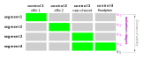

The equation of the rating curve used in BaRatinAGE is entirely determined by the matrix of controls, an example of which is recalled in the Figure below. This equation is written as follows:

$$
Q(h) = \sum_{r=1}^{N_{segment}} \left(
1_{[\kappa_r;\kappa_{r+1}]}(h) \times
\sum_{j=1}^{N_{control}} M(r,j) \times a_j(h-b_j)^{c_j} 
\right)
$$

In the equation above, $M(r,j)$ is the matrix of controls, and the notation $1_I(h) $ denotes a function equal to 1 if $h$ is included in the interval $I$, and zero otherwise. This equation shows that the stage-discharge relation is a combination of power functions, and the matrix of controls is used to specify how this combination operates (succession or addition of controls).

To ensure the continuity of the rating curve, the $b_j$ parameters of the above equation are actually deducted from other parameters by solving an equation of continuity at each activation stage $(Q(\kappa_{r+1}) = Q(\kappa_r))$, which leads to:
$$ b_1=\kappa_1 \text{, then for } j>1:$$
$$ b_j=\kappa_j - \left( 
\frac{1}{a_j} \sum_{i=1}^{j-1} 
\left( M(j-1,i)-M(j,i) \right) \times
a_i(\kappa_j-b_i)^{c_i}
\right)^{1/c_j}$$

 Figure: Example of a matrix of controls corresponding to a frequent case (two successive section controls at low flows, then control channel by the main channel plus a control channel by the floodplain). 

