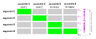

L’équation de la courbe de tarage utilisée dans BaRatinAGE est entièrement déterminée par la matrice des contrôles, dont un exemple est rappelé dans la figure ci-dessous. Cette équation s’écrit de la façon suivante :

$$
Q(h) = \sum_{r=1}^{N_{segment}} \left(
1_{[\kappa_r;\kappa_{r+1}]}(h) \times
\sum_{j=1}^{N_{control}} M(r,j) \times a_j(h-b_j)^{c_j} 
\right)
$$

Dans l’équation ci-dessus, $M(r,j)$ représente la matrice des contrôles, et la notation $1_I(h) $ désigne
une fonction qui vaut 1 si $h$ est inclus dans l’intervalle $I$, et zéro sinon. On voit donc que la relation
hauteur-débit est une combinaison de lois puissances, et la matrice des contrôles est utilisée pour
spécifier comment cette combinaison s’opère (contrôles se succédant ou s’ajoutant).

Afin d’assurer la continuité de la courbe de tarage, les paramètres $b_j$ de l’équation ci-dessus sont en
fait déduits des autres paramètres, en résolvant une équation de continuité à chaque hauteur d'activation $(Q(\kappa_{r+1}) = Q(\kappa_r))$, ce qui conduit à :
$$ b_1=\kappa_1 \text{, puis pour } j>1:$$
$$ b_j=\kappa_j - \left( 
\frac{1}{a_j} \sum_{i=1}^{j-1} 
\left( M(j-1,i)-M(j,i) \right) \times
a_i(\kappa_j-b_i)^{c_i}
\right)^{1/c_j}$$

 

 Figure: Exemple de matrice des contrôles correspondant à un cas fréquemment rencontré en pratique (deux seuils successifs en basses eaux, puis contrôle chenal par le lit mineur auquel s’ajoute un contrôle chenal par le lit majeur). 

