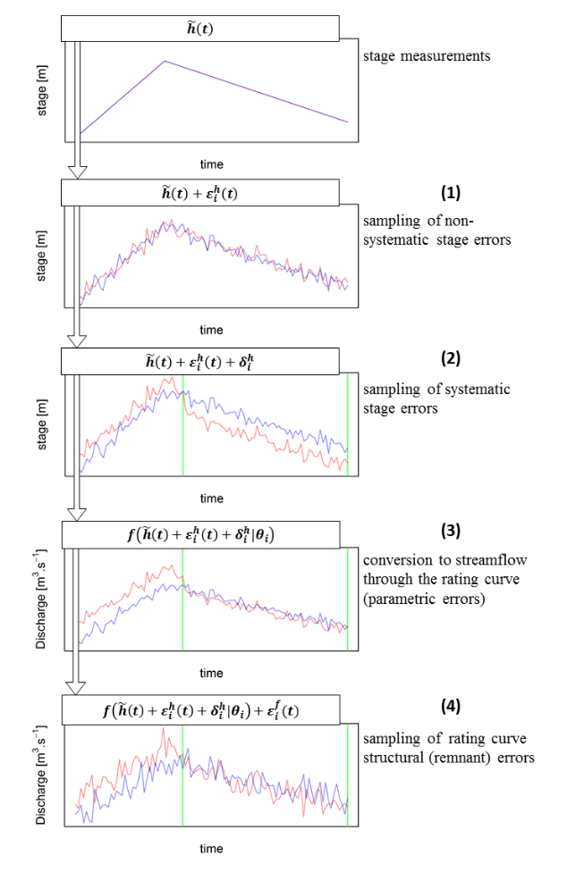

This document describes how errors [from the rating curve](/en/doc/topics/stat-model) (parametric errors and structural errors) and those [from the stage time series](/en/doc/topics/stage-series) (non-systematic and systematic stage measurement errors) are propagated to the discharge time series in BaRatinAGE.

The estimation of a rating curve in BaRatinAGE is actually based on 500 rating curves, each corresponding to a parameter set (parameters are those of the equation of the rating curve, $\boldsymbol{\theta}$, along with parameters $\boldsymbol{\gamma}=(\gamma_1,\gamma_2)$ used to define the standard deviation of structural errors). The stage series is a time series of recorded water levels $\tilde{h}(t)$. Standard deviations $\sigma_A^h$ and $\sigma_B^h$ (corresponding to non-systematic and systematic errors affecting the stage series) can be used to generate 500 stage series. The propagation method is described below for a rating curve $i$ (i.e., one particular parameter set):

1. At each time step $t$, an error $\varepsilon_i^h(t)$ is sampled from the Gaussian distribution $\mathcal{N}(0,\sigma_A^h)$. The error is added to the measured stage $\tilde{h}(t)$.
2. For each period during which the systematic error affecting the stage series is constant, an error $\delta_i^h$ is sampled from the Gaussian distribution $\mathcal{N}(0,\sigma_B^h)$. The error is added to the measured stage already affected by non-systematic errors. The $i$th stage series is hence obtained as: $h_i(t) = \tilde{h}(t) + \varepsilon_i^h(t) + \delta_i^h$.
3. At each time step $t$, the discharge $\hat{Q}_i(t)$ is computed from the stage series $h_i(t)$ and the rating curve equation $f$ with parameters $\boldsymbol{\theta}_i$.
4. At each time step $t$, a structural error rating curve $\varepsilon_i^f(t)$ is finally added to the computed discharge $\hat{Q}_i(t)$. The error is sampled from the Gaussian distribution $\mathcal{N}\left( 0,\gamma_1 + \gamma_2 \hat{Q}_i(t) \right)$.

The equation combining these various steps is given below:

$$Q_i(t) = \underbrace{f \left( 
\overbrace{\tilde{h}(t) + \varepsilon_i^h(t) + \delta_i^h}^{h_i(t)}
; \boldsymbol{\theta}_i \right)}_{\hat{Q}_i(t)}
+ \varepsilon_i^f(t)$$

The figure below illustrates and summarizes the successive computational steps.

 Principle of the propagation method illustrated with two parameter sets $\boldsymbol{\theta}_{i_1}$ (red) and $\boldsymbol{\theta}_{i_2}$ (blue): from the measured stage series to the two flow series (each corresponding to a parameter set, i.e. a possible rating curve and a possible stage series). 

The MaxPost (most probable) rating curve is obtained by ignoring all error sources: $Q_{MP}(t) = f(\tilde{h}(t) ; \boldsymbol{\theta}_{MP})$ where $\boldsymbol{\theta}_{MP}$ is the paameter set defining the MaxPost rating curve.
