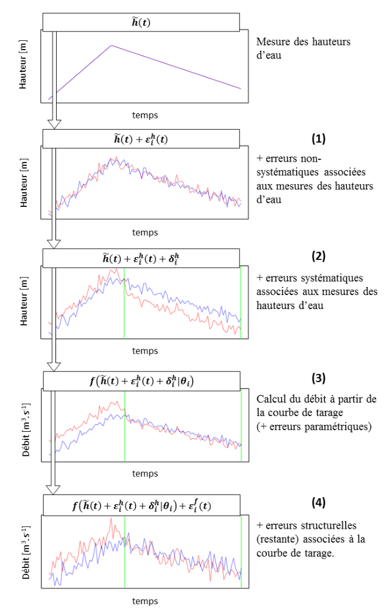

Cette page décrit comment les erreurs [provenant de la courbe de tarage](/fr/doc/topics/modele-stat) (erreurs paramétriques et erreurs structurelles) et celles [provenant du limnigramme](/fr/doc/topics/limni) (erreurs non-systématiques et erreurs systématiques) sont propagées aux hydrogrammes dans BaRatinAGE.

L’estimation d’une courbe de tarage dans BaRatinAGE conduit en fait à 500 courbes de tarage, chacune correspondant à un jeu de paramètres possible (les paramètres sont ceux de l’équation de la courbe de tarage, $\boldsymbol{\theta}$, ainsi que les paramètres $\boldsymbol{\gamma}=(\gamma_1,\gamma_2)$ qui permettent de définir l’écart-type de la loi normale de l’erreur structurelle). Le limnigramme est une série temporelle de hauteurs d’eau mesurées $\tilde{h}(t)$. Les écart-types $\sigma_A^h$ et $\sigma_B^h$ (qui correspondent respectivement aux erreurs non-systématiques et systématiques affectant le limnigramme) permettent de générer 500 limnigrammes. La méthode de propagation est décrite ci-dessous pour une courbe de tarage $i$ (un jeu de paramètres) :

1. Pour chaque pas de temps $t$, une erreur $\varepsilon_i^h(t)$ est échantillonnée selon la loi normale $\mathcal{N}(0,\sigma_A^h)$. Celle-ci est ensuite ajoutée au limnigramme mesuré $\tilde{h}(t)$.
2. Pour chaque période où l’erreur systématique affectant le limnigramme est supposée constante, une erreur $\delta_i^h$ est échantillonnée selon la loi normale $\mathcal{N}(0,\sigma_B^h)$. Celle-ci est ensuite ajoutée au limnigramme mesuré déjà affecté des erreurs non-systématiques. On a alors un limnigramme numero $i$ pouvant s’écrire : $h_i(t) = \tilde{h}(t) + \varepsilon_i^h(t) + \delta_i^h$.
3. Pour chaque pas de temps $t$, un débit $\hat{Q}_i(t)$ est calculé à partir de la série de hauteurs d’eau $h_i(t)$, de l’équation de la courbe de tarage $f$ et du jeu de paramètres $\boldsymbol{\theta}_i$.
4. Pour chaque pas de temps $t$, une erreur structurelle $\varepsilon_i^f(t)$ est ensuite ajoutée au débit calculé $\hat{Q}_i(t)$. Cette erreur est échantillonée selon la loi normale $\mathcal{N}\left( 0,\gamma_1 + \gamma_2 \hat{Q}_i(t) \right)$.

L’équation synthétisant ces différentes étapes est présentée ci-dessous:

$$Q_i(t) = \underbrace{f \left( 
\overbrace{\tilde{h}(t) + \varepsilon_i^h(t) + \delta_i^h}^{h_i(t)}
| \boldsymbol{\theta}_i \right)}_{\hat{Q}_i(t)}
+ \varepsilon_i^f(t)$$

La Figure ci-dessous illustre et résume les différentes étapes présentées ci-dessus.

 Principe de la méthode d'échantillonnage considérant deux jeux de paramètres $\boldsymbol{\theta}_{i_1}$ (en rouge) et $\boldsymbol{\theta}_{i_2}$ (en bleu) : depuis le limnigramme mesuré jusqu’aux deux hydrogrammes (chacun correspondant à un jeu de paramètres, i.e. à une courbe de tarage possible et à un limnigramme possible). 

Pour l’obtention de l’hydrogramme MaxPost (le plus probable), toutes les erreurs sont ignorées : $Q_{MP}(t) = f(\tilde{h}(t) | \boldsymbol{\theta}_{MP})$ où $\boldsymbol{\theta}_{MP}$ correspond au jeu de paramètre de la courbe de tarage MaxPost.

