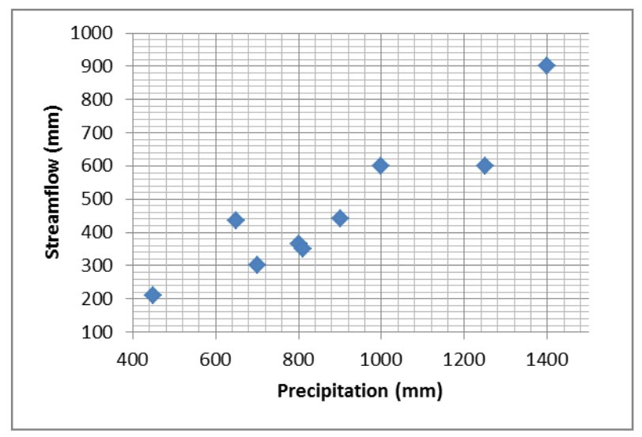

The objective of this document is to describe the basics of Bayesian inference. The text is supplemented by a set of tutorials that can be dowloaded [here](TP_bayesian.en.zip). 

# Introduction : statistical inference

Statistical inference refers to the use of observed data to estimate some properties of a probabilistic model – typically, unknown parameters. This is a very well-developed field in Statistics, and we will only discuss two particular estimation methods in this document: maximum likelihood and Bayesian estimation, the latter being the estimation method used in BaRatinAGE.

The general notation is defined as follows. Let $(y_1,\ldots,y_n)$ denote the observed values, considered as realisations from the random variables $(Y_1,\ldots,Y_n)$. An assumption on the distribution of $(Y_1,\ldots,Y_n)$ has to be made: for instance, all $Y_i$'s may be assumed to follow a Gaussian distribution with unknown parameters $(\mu,\sigma)$. The objective is to estimate the value of parameters $(\mu,\sigma)$ from the observed data $(y_1,\ldots,y_n)$. More generally, $\boldsymbol{\theta}$ denotes the vector of unknown parameters and $f(z;\boldsymbol{\theta})$ denotes the probability density function (pdf) of the distribution assumed for $Y_i$'s. In this latter notation, $z$ is the value at which the pdf is evaluated, while the notation «$;\boldsymbol{\theta}$» aims at making unknown parameters explicit in the notation.

# Likelihood

The concept of likelihood is central in Statistics, because it is at the core of several estimation methods, including Bayesian inference. The objective of this section is to define the concept of likelihood and to describe its practical computation from a given observed dataset and a given probabilistic model. We will also describe the principles of maximum likelihood estimation.

## Definition

### Discrete random variable

In intuitive terms, the likelihood is equal to the probability of observing the data according to the probabilistic model. As an illustration, consider a coin tossing game, for which after two successive trials, the outcome is tail then head. Let $Y_1$ denote the random variable describing the outcome of the first trial (with $Y_1=0$ for tail and $Y_1=1$ for head), and similarly let $Y_2$ describe the outcome of the second trial. Observations can be written as $\boldsymbol{y}=(y_1,y_2)=(0,1)$. If the coin is fair, the random variables $Y_1$ and $Y_2$ both follow a Bernoulli distribution with parameter $p=1/2$ : this is the probabilistic model we will use here. The likelihood $V(\boldsymbol{y})$ associated with data $\boldsymbol{y}$ is hence equal to:

$$ \begin{align}
V(\boldsymbol{y}) &= Pr(Y_1=y_1 \cap Y_2=y_2)\\
&= Pr(Y_1=0 \cap Y_2=1)\\
&= Pr(Y_1=0) \times Pr( Y_2=1) \text{ (independant trials)}\\
&= 1/2 \times 1/2 = 1/4
\end{align}
$$
This intuitive definition can be formalized as follows. Let $\boldsymbol{y}=(y_1,\ldots,y_n)$ denote observed data and $\boldsymbol{Y}=(Y_1,\ldots,Y_n)$ denote the parent random variables, which we assume mutually independent. Moreover, the probability mass function (pmf) of $Y_i$ is noted $f_{Y_i}(z)=Pr(Y_i=z)$. The likelihood $V(\boldsymbol{y})$ is defined as follows:

$$V(\boldsymbol{y}) = \prod_{i=1}^{n}{f_{Y_i}(y_i)}$$

**Remark 1** : The independence hypothesis is necessary to write the likelihood as the simple product of the equation above. We won’t consider the non-independence case in this document. 

**Remark 2** : It is frequently assumed that the data are identically distributed, i.e. that all random
variables have the same pmf: $f_{Y_1}(z)=f_{Y_2}(z)=\ldots=f_{Y_n}(z)$. Noting this common pmf $f(z)$, the likelihood simplifies to:

$$V(\boldsymbol{y}) = \prod_{i=1}^{n}{f(y_i)}$$

**Remark 3** : The acronym *iid* is used to refer to such independent and identically distributed random
variables.

> [**Tutorial 1. Likelihood computation for a discrete variable**](TP_bayesian.en.zip). The data file describes the occurrence of a flood exceeding the 10-year event (or more precisely, an estimated 10-year event): 1 if the 10-year flood is exceeded, 0 otherwise. It is assumed that data are *iid* realisations from a Bernoulli distribution with parameter $p=0.1$. Compute the likelihood, then repeat the computation with $p=0.3$ and $p=0.5$. How do you interpret these likelihood values?

### Continuous random variable

For a continuous random variable, the likelihood can still be computed with the equations given for the discrete case, with $f_{Y_i}(z)$ denoting the pdf instead of the pmf. The interpretation is slightly different since the likelihood is not equal to the *probability* of having observed the data, but is rather equal to the *probability density* of the data. Given the strong similarity between discrete and continuous variables, we will only focus on the latter in the remainder of this document. The case of discrete variables can be obtained by simply replacing « pdf » by « pmf ».

> [**Tutorial 2. Likelihood computation for a continuous variable**](TP_bayesian.en.zip). The picture below has been taken in the city of Sommières, along the Vidourle River (Mediterranean France). The flood marks allow computing the duration between two successive flood events. We assume that these durations are *iid* and are realisations from an exponential distribution with parameter $\lambda=25$ (the pdf of the exponential distribution is $f(z)=\frac{e^{-z/\lambda}}{\lambda}$). Compute the likelihood, then repeat the computation with $\lambda=10$ and $\lambda=100$. How do you interpret these likelihood values?

 Picture taken in the city of Sommières showing flood marks on a building. Photo : Diane Laberge, [http://www.dianelaberge.com/blogue/2012/11/09/laccent-du-sud/](http://www.dianelaberge.com/blogue/2012/11/09/laccent-du-sud/).

## Maximum likelihood estimation

The idea behind maximum likelihood estimation should be intuitive after the tutorials proposed in the previous section: an estimate can be obtained by picking up the parameter maximizing the likelihood. This can be formalized as follows, using the same notation as in previous sections: $\boldsymbol{y}=(y_1,\ldots,y_n)$ denote the data, and $\boldsymbol{Y}=(Y_1,\ldots,Y_n)$ the corresponding random variables. We now assume that the pdf of the random variable $Y_i$ depends on one or several unknown parameters denoted by $\boldsymbol{\theta}$. This pdf is noted $f_{Y_i}(z;\boldsymbol{\theta})$. The likelihood $V(\boldsymbol{y};\boldsymbol{\theta})$ is then equal to:

$$V(\boldsymbol{y};\boldsymbol{\theta}) = \prod_{i=1}^{n}{f_{Y_i}(y_i;\boldsymbol{\theta})}$$

This equation is basically identical to the preceding likelihood equations, except that unknown parameters $\boldsymbol{\theta}$ are made explicit in the notation. The maximum likelihood estimator $\hat{\boldsymbol{\theta}}$ then corresponds to the parameter vector maximizing the likelihood:

$$\hat{\boldsymbol{\theta}} = \mathop{\mathrm{argmax}}_{\boldsymbol{\theta}} V(\boldsymbol{y};\boldsymbol{\theta})$$

> [**Tutorial 3. Maximum likelihood estimation, discrete case**](TP_bayesian.en.zip). Using the data of Tutorial 1, compute the likelihood for a grid of values of parameter $p$. Plot the likelihood as a function of $p$, and deduce the maximum likelihood estimate. Is there any other information one could use in this likelihood function?

> [**Tutorial 4. Maximum likelihood estimation, continuous case**](TP_bayesian.en.zip). Using the data of Tutorial 2, compute the likelihood for a grid of values of parameter $\lambda$. Plot the likelihood as a function of $\lambda$, and deduce the maximum likelihood estimate. Is there any other information one could use in this likelihood function?

> [**Tutorial 5. Maximum likelihood estimation for a linear regression**](TP_bayesian.en.zip). Consider the data in the figure below, representing annual precipitation($X$) and annual streamflow ($Y$) for some
catchment. A roughly linear link being apparent in this figure, a linear relation is assumed as follows:

$$y_i=\theta  x_i + \varepsilon_i \text{ with }  \varepsilon_i \sim \mathcal{N}(0,\sigma)$$

 Relation between annual precipitation $X$ and annual streamflow $Y$

> This relation assumes that the annual streamflow is equal to a fraction $\theta$ of the annual precipitation, plus a residual value varying from year to year. The residuals are further assumed to be *iid* realisations from a Gaussian distribution with mean zero and unknown standard deviation $\sigma$. Under these hypotheses, the $i$th annual streamflow is a realisation from a Gaussian distribution $\mathcal{N}(\theta x_i,\sigma)$: in other words, the linear regression model gives the mean of the annual streamflow, while the residual standard deviation gives the uncertainty on the predicted annual streamflow. Note that the annual streamflow data $\boldsymbol{y}$ are not identically distributed here (because the mean is different every year).

> 1. Plot the data along with the regression line for $\theta=0.1$.
2. Compute the likelihood of data $\boldsymbol{y}$ for $\theta=0.1$ and $\sigma=50$.
3. By trial-and-error, compute the maximum likelihood estimate of $\theta$ (keeping $\sigma=50$ fixed).
4. Compare the maximum likelihood regression line with the one computed by Excel (right click…Add Trendline).

> Remark: although very simple, this example provides an excellent illustration of the way parameters from a deterministic model can be estimated. Here the deterministic model is the simple linear relation $y_{sim}=\theta x$. Streamflow $y_{sim}$ is the output variable (also called predictand), precipitation $x$ is the input variable (also called predictor), and $\theta$ is the unknown parameter to be estimated. The example can be generalized to much more complex models, including rating curves or hydrologic models.

# Bayesian inference

As maximum likelihood, the Bayesian approach is an estimation method. Some of its properties are of particular interest in a hydrologic context, in particular in terms of uncertainty quantification. Here we describe the building blocks of Bayesian estimation: likelihood, prior distribution and posterior distribution.

## Likelihood

Bayesian estimation uses the likelihood as defined in the preceding sections. However in a Bayesian context, the likelihood is generally noted $p(\boldsymbol{y}|\boldsymbol{\theta})$ instead of $V(\boldsymbol{y};\boldsymbol{\theta})$):

$$p(\boldsymbol{y}|\boldsymbol{\theta}) = \prod_{i=1}^{n}{f_{Y_i}(y_i;\boldsymbol{\theta})}$$

The likelihood quantifies the information brought by the data about the unknown parameters $\boldsymbol{\theta}$. However, unlike with maximum likelihood estimation, we will not attempt to maximize it here.

## Prior distribution

The Bayesian does not only use the information brought by the data, but allows including any knowledge on $\boldsymbol{\theta}$ that would be available even before acquiring the data. This prior information is encoded as a distribution, whose pdf is noted $p(\boldsymbol{\theta})$. As suggested by this notation, the prior distribution does not depend on the data$\boldsymbol{y}$. This is actually a golden rule: the data should never be used to specify the prior distribution, since this would be akin to using the same data twice, leading to a strong under-estimation of uncertainties.

The specification of a prior distribution is completely context-dependent, and there is therefore no universal rule to follow. This specification is entirely the responsibility of the analyst, who has to translate his/her knowledge in the form of a distribution. This introduces an additional subjective step into the analysis, which led to vigorous debates between supporters and opponents of the Bayesian approach. One may still argue that: (1) fully objective computations sometimes lead to unrealistic results; (2) in most data analyses, there exist many subjective choices anyway; (3) the prior distribution at least forces the analyst to formalize this subjectivity, and makes it transparent (the prior distribution should always be communicated along with the results of the analysis!); (4) subjectivity and knowledge are not antithetical.

The tutorials will illustrate practical examples of prior specification. In the meantime, the following cases show that prior knowledge often exists in Hydrology:

* Consider the precipitation-streamflow regression in Tutorial 5: in most cases it is realistic to restrict $\theta$ between 0 and 1 (except if strong groundwater import is expected), and therefore it makes sense to use a prior distribution that induces this constraint (e.g. a uniform distribution between 0 and 1). Moreover, given the catchment size and its geographic location, one may have more information on the value of this parameter, which represents a runoff coefficient. For instance, in an arid or semi-arid region, a runoff coefficient as high as 0.8 would be unlikely for a medium-sized natural catchment (more than a few km²).
* Rating curves provide an excellent illustration of the availability of prior knowledge: rating curve parameters can indeed be linked with measurable hydraulic properties (e.g. geometry of a channel or a cross-section, slope of a channel, etc.), for which a rigorous quantification is possible. This is one underlying principle of BaRatin.
* Although using the data $\boldsymbol{y}$ to specify the prior distribution is strictly forbidden, it is not forbidden to use other data! This idea can for instance be used in flood frequency analysis for regionalisation purposes: sites nearby and similar (in some sense) to the target site can be used to specify a prior distribution; this information is then combined with the data at the target site $\boldsymbol{y}$ with a Bayesian analysis (see for instance [Ribatet 2007](https://hal.inrae.fr/tel-02590034)).

Finally, remind that in general $\boldsymbol{\theta}$ is a vector (as soon as there are several unknown parameters). The prior distribution is therefore multi-dimensional. A simple and frequently used approach to specify a multi-dimensional prior distribution is to use independent priors for each parameter. A joint prior distribution can then be obtained with a simple multiplication:

$$p(\boldsymbol{\theta})=p(\theta_1,\ldots,\theta_p)=\prod_{i=1}^{p}{p(\theta_i)}$$

##  Posterior distribution

Bayes theorem (image below) allows combining the information brought by the data (through the likelihood) with prior information into a distribution for the unknown parameter $\boldsymbol{\theta}$ , termed the
posterior distribution. The pdf of the posterior distribution, noted $p(\boldsymbol{\theta}|\boldsymbol{y})$, is defined by:

$$ p(\boldsymbol{\theta}|\boldsymbol{y}) = \frac{
\overbrace{p(\boldsymbol{y}|\boldsymbol{\theta})}^{\text{likelihood}} 
\times \overbrace{p(\boldsymbol{\theta})}^{\text{prior}}
}
{\underbrace{\int p(\boldsymbol{y}|\boldsymbol{\nu}) \times p(\boldsymbol{\nu})d\boldsymbol{\nu}}_{\text{normalization constant}}}$$

 Thomas Bayes. Source : [Wikipedia](https://en.wikipedia.org/wiki/Thomas_Bayes)

The numerator is simply the product of the likelihood and the prior pdf. The denominator looks more
complex, since it requires integrating this product with respect to unknown parameters. However, this denominator is in fact just a constant: the data $\boldsymbol{y}$ are given and fixed, and parameters $\boldsymbol{\nu}$ disappear from the denominator since they correspond to the integration variables. Consequently, the denominator only serves as a normalizing constant: it ensures that the area below the posterior pdf is equal to 1 (which is required for any pdf). In practice, it is actually not even necessary to compute this constant in general (the reason will be explained in page on [MCMC methods MCMC](/en/doc/topics/mcmc)). This allows simplifying Bayes theorem as follows:

$$ p(\boldsymbol{\theta}|\boldsymbol{y}) \propto p(\boldsymbol{y}|\boldsymbol{\theta}) p(\boldsymbol{\theta})$$

where the symbol « $\propto$ » stands for « is proportional to ». This equation shows that the derivation of the posterior pdf (up to a constant of proportionality) is disarmingly simple: it is just the product of the likelihood and the prior pdf! The resulting posterior pdf quantifies the knowledge on parameters $\boldsymbol{\theta}$, given two sources of information: the data and prior knowledge.

It is worth noting that the raw result of Bayesian estimation is a distribution, as opposed to a value (as in other estimation methods such as moments, maximum likelihood, etc.). This remark calls for further comments:

* The raw result of Bayesian inference directly provides a quantification of uncertainty.
* This does not mean that quantifying uncertainty is impossible with other estimation methods: in fact, most estimation methods come with a solid and well-developed theory for uncertainty quantification. But this quantification only comes in a second step, after having estimated a particular value.
* Conversely, this does not mean that estimating a value is impossible with Bayesian estimation: typically, the maximum of the posterior pdf is a standard choice. This can be considered as the Bayesian version of the maximum likelihood estimate, and it is often abbreviated as the Maxpost estimate (or alternatively the MAP estimate for Maximum A Posteriori).

The comments above show that all estimation methods can provide both a point-estimate (i.e. a value) and a quantification of uncertainty. Bred-in-the-bone Bayesians may argue that uncertainty quantification is somewhat more natural in a Bayesian framework, because uncertainty is the raw result and point-estimate is the by-product (while it’s the contrary with other estimation methods).

> [**Tutorial 6. Bayesian estimation, discrete case**](TP_bayesian.en.zip). Complete Tutorial 3 to perform a full Bayesian analysis, which requires: (1) specifying a prior pdf; (2) computing the posterior pdf (up to a constant of proportionality). Plot the likelihood, the prior pdf and the posterior pdf and compare them.

> The person who estimated the 10-year flood let you know that she/he did not used your data to make her/his estimation;moreover, she/he performed an analysis suggesting that the uncertainty on the exceedance probability of the estimated 10-year flood could be represented by a lognormal distribution$Log\mathcal{N}(\mu=log(0.1),\sigma=0.75)$. Use this information.

> [**Tutorial 7. Bayesian estimation, continuous case**](TP_bayesian.en.zip). Complete Tutorial 4 to perform a full Bayesian analysis. Moreover, a colleague who made some hydrology/hydraulics study for this area let you know that the return period associated with a flooding of this building is comprised between 10 and 100 years, at a confidence level of 95%. Use this information.

> [**Tutorial 8. Bayesian estimation for a linear regression**](TP_bayesian.en.zip). Complete Tutorial 5 to perform a full Bayesian analysis for parameter $\theta$ (keep $\sigma=50$ as a known value). Plot the likelihood, the prior pdf and the posterior pdf. Repeat the computation with other values for $\sigma$, and comment on the results.

