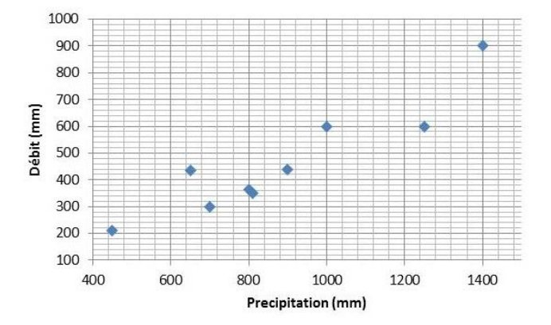

L'objectif de ce document est de présenter les bases de l'inférence Bayesienne. Le texte est complété par un ensemble de travaux pratiques qui sont téléchargeables [ici](TP_bayesian.fr.zip). 

# Introduction : l’inférence statistique

L’inférence statistique consiste à utiliser des données observées pour estimer certaines propriétés d’un modèle probabiliste – typiquement des paramètres inconnus que l’on doit estimer. C’est un domaine important et vaste des Statistiques. Dans cette fiche, nous nous focalisons sur deux méthodes d’estimation particulières : l’estimation par maximum de vraisemblance, et surtout l’estimation bayésienne, qui est implémentée dans BaRatinAGE.

Le cadre général est le suivant : on dispose d’un échantillon d’observations $(y_1,\ldots,y_n)$, réalisations de variables aléatoires $(Y_1,\ldots,Y_n)$. Nous allons émettre une hypothèse sur la distribution de $(Y_1,\ldots,Y_n)$ : par exemple on supposera que tous les $Y_i$ suivent une loi normale de paramètres inconnus $(\mu,\sigma)$. L’objectif est d’estimer la valeur des paramètres $(\mu,\sigma)$ à partir des données observées $(y_1,\ldots,y_n)$. De manière général, on désigne par $\boldsymbol{\theta}$ le vecteur de paramètres à estimer et $f(z;\boldsymbol{\theta})$ la densité de la distribution supposée des $Y_i$. Dans cette notation, $z$ est une valeur quelconque où la densité est calculée, tandis que la notation «$;\boldsymbol{\theta}$» vise à rendre explicite les paramètres inconnus.

# La notion de vraisemblance

Le concept de vraisemblance est central en Statistiques, car il est à la base de plusieurs méthodes d’estimation, dont l’estimation bayésienne. L’objectif de cette section est de définir ce qu’est une vraisemblance, et de décrire la manière pratique de la calculer à partir d’un jeu de données et d’un modèle probabiliste. Nous en profiterons pour décrire l’estimation par maximum de vraisemblance.

## Définition

### Variable aléatoire discrète

En termes intuitifs, la vraisemblance est simplement égale à la probabilité d’avoir observé les données d’après le modèle probabiliste. Considérons par exemple un jeu de pile ou face, pour lequel après deux lancers successifs, nous obtenons pile puis face. Notons $Y_1$ la variable aléatoire décrivant l’issue du premier lancer (avec par convention $Y_1=0$ pour pile et $Y_1=1$ pour face), et $Y_2$ la variable aléatoire décrivant l’issue du second lancer. Les observations peuvent donc être notées $\boldsymbol{y}=(y_1,y_2)=(0,1)$. Si la pièce n’est pas truquée, les variables aléatoires $Y_1$ et $Y_2$ suivent une loi de Bernoulli de paramètre $p=1/2$ : c'est le modele probabiliste que nous utiliserons. La vraisemblance $V(\boldsymbol{y})$ associée aux données $\boldsymbol{y}$ est donc égale à :

$$ \begin{align}
V(\boldsymbol{y}) &= Pr(Y_1=y_1 \cap Y_2=y_2)\\
&= Pr(Y_1=0 \cap Y_2=1)\\
&= Pr(Y_1=0) \times Pr( Y_2=1) \text{ (car les lancers sont indépendants)}\\
&= 1/2 \times 1/2 = 1/4
\end{align}
$$
Cette définition intuitive peut être formalisée mathématiquement de la manière suivante. Notons $\boldsymbol{y}=(y_1,\ldots,y_n)$ les données, et $\boldsymbol{Y}=(Y_1,\ldots,Y_n)$ les variables aléatoires ayant généré chaque observation. On suppose que ces variables aléatoires sont indépendantes deux à deux. De plus, la fonction de masse de la variable aléatoire $Y_i$ est notée $f_{Y_i}(z)=Pr(Y_i=z)$. La vraisemblance $V(\boldsymbol{y})$ est alors définie par :

$$V(\boldsymbol{y}) = \prod_{i=1}^{n}{f_{Y_i}(y_i)}$$

**Remarque 1** : L’hypothèse d’indépendance est importante, en son absence la vraisemblance est plus complexe que le simple produit de l’équation ci-dessus – mais nous n’aborderons pas ce cas de figure ici. 

**Remarque 2** : Il est fréquent de supposer également que les données sont identiquement distribuées, c’est-à-dire que toutes les variables aléatoires ont la même fonction de masse : $f_{Y_1}(z)=f_{Y_2}(z)=\ldots=f_{Y_n}(z)$. Si l’on note $f(z)$ cette fonction de masse commune, la vraisemblance s’écrit simplement :

$$V(\boldsymbol{y}) = \prod_{i=1}^{n}{f(y_i)}$$

**Remarque 3** : Lorsque les données sont supposées indépendantes et identiquement distribuées, on utilise l’acronyme *iid*.

> [**TP 1. Calcul d’une vraisemblance discrète**](TP_bayesian.fr.zip). Le fichier de données contient les occurrences d’un dépassement de la crue décennale (ou, pour être plus précis, de la crue estimée comme décennale) : 1 si la crue décennale est dépassée au cours d’une année, 0 sinon. On suppose que ces données sont *iid* suivant une distribution de Bernoulli de paramètre $p=0.1$. Calculez la vraisemblance, puis recommencez le calcul avec $p=0.3$ et $p=0.5$. Comment interprétez-vous ces différentes vraisemblances ?

### Variable aléatoire continue

Dans le cas d’une variable aléatoire continue, la définition de la vraisemblance est identique à celle des equations précédentes pour le cas discret, à l’exception du fait que $f_{Y_i}(z)$ désigne la densité de probabilité (au lieu de la fonction de masse dans le cas discret). En termes d’interprétation, la vraisemblance n’est donc plus égale à la probabilité d’avoir observé les données, mais plutôt à la densité de probabilité des données. Etant donné cette grande similarité entre variables discrètes et continues, nous nous focaliserons sur les variables continues dans la suite de ce document. Le passage à une variable discrète pourra être fait en remplaçant simplement « densité de probabilité » par « fonction de masse ».

> [**TP 2. Calcul d’une vraisemblance continue**](TP_bayesian.fr.zip). La photo ci-dessous a été prise à Sommières, à proximité du Vidourle. Les dates des crues permettent de calculer la durée ayant séparé des événements successifs. On suppose que ces durées sont *iid* suivant une loi exponentielle de paramètre $\lambda=25$, dont la densité s’écrit $f(z)=\frac{e^{-z/\lambda}}{\lambda}$. Calculez la vraisemblance, puis recommencez le calcul avec $\lambda=10$ et $\lambda=100$. Comment interprétez-vous ces différentes vraisemblances ?

 Marques de crue au détour d’une rue de Sommières. Crédit photo : Diane Laberge, [http://www.dianelaberge.com/blogue/2012/11/09/laccent-du-sud/](http://www.dianelaberge.com/blogue/2012/11/09/laccent-du-sud/).

## Estimation par maximum de vraisemblance

Le principe de l’estimation par maximum de vraisemblance apparaît intuitivement suite aux TPs proposés dans la section précédente : il s’agit simplement de choisir le paramètre qui maximise la vraisemblance. Cette approche peut être formalisée de la façon suivante, en reprenant les notations
introduites dans les sections précédentes : les données sont notées $\boldsymbol{y}=(y_1,\ldots,y_n)$, et $\boldsymbol{Y}=(Y_1,\ldots,Y_n)$ représentent les variables aléatoires ayant généré chaque observation. On suppose à présent que la densité de probabilité de la variable aléatoire $Y_i$ dépend d’un ou plusieurs paramètres inconnus, que nous noterons $\boldsymbol{\theta}$. Cette densité peut être notée $f_{Y_i}(z;\boldsymbol{\theta})$. La vraisemblance $V(\boldsymbol{y};\boldsymbol{\theta})$ est alors définie par :

$$V(\boldsymbol{y};\boldsymbol{\theta}) = \prod_{i=1}^{n}{f_{Y_i}(y_i;\boldsymbol{\theta})}$$

Tout ce que nous avons réalisé ici est de rendre explicite le vecteur contenant les paramètres inconnus $\boldsymbol{\theta}$ dans les équations. L’estimateur du maximum de vraisemblance est alors défini comme le vecteur de paramètre qui maximise la vraisemblance:

$$\hat{\boldsymbol{\theta}} = \mathop{\mathrm{argmax}}_{\boldsymbol{\theta}} V(\boldsymbol{y};\boldsymbol{\theta})$$

> [**TP 3. Estimation par maximum de vraisemblance, cas discret**](TP_bayesian.fr.zip). Reprenez les données d’occurrence du TP 1, et calculez la vraisemblance pour une grille de valeurs du paramètre $p$. Tracez la vraisemblance comme une fonction de $p$, et déduisez-en l’estimateur du maximum de vraisemblance. Quelle autre information utile peut-on tirer de cette fonction de vraisemblance ?

> [**TP 4. Estimation par maximum de vraisemblance, cas continu**](TP_bayesian.fr.zip). Reprenez les données de durée inter-événements du TP 2, et calculez la vraisemblance pour une grille de valeurs du paramètre $\lambda$. Tracez la vraisemblance comme une fonction de $\lambda$, et déduisez-en l’estimateur du maximum de vraisemblance. Quelle autre information utile peut-on tirer de cette fonction de vraisemblance ?

> [**TP 5. Estimation d’une régression linéaire**](TP_bayesian.fr.zip). Considérons les données représentées dans la figure ci-dessous, qui correspondent à des précipitations ($X$) et des débits moyens annuels ($Y$) pour un certain bassin versant. Un lien entre ces deux variables étant apparent dans cette figure, on cherche à établir une relation linéaire du type :
>
$$y_i=\theta  x_i + \varepsilon_i \text{ avec }  \varepsilon_i \sim \mathcal{N}(0,\sigma)$$
>

 Relation entre la précipitation annuelle $X$ et le débit annuel $Y$

>
> Cette relation suppose que le débit annuel est égal à une fraction $\theta$ de la précipitation annuelle, plus un résidu variant d’année en année. Ces résidus sont supposées être des réalisations d’une loi normale de moyenne nulle et d’écart-type inconnu $\sigma$. Sous ces hypothèses, il est possible de montrer que le $i$e débit annuel est une réalisation d’une loi normale $\mathcal{N}(\theta x_i,\sigma)$ : en d’autres termes, le modèle de régression linéaire donne l’espérance du débit annuel, tandis que l’écart-type des résidus donne l’incertitude sur le débit annuel qui sera effectivement observé. Notez en particulier que les données $\boldsymbol{y}$ ne sont pas identiquement distribuées ici (puisque la moyenne change chaque année).
>
> 1. Tracez les données ainsi que la droite de régression pour $\theta=0.1$.
2. Calculez la vraisemblance des données $\boldsymbol{y}$ pour $\theta=0.1$ et $\sigma=50$.
3. Recherchez en tâtonnant l’estimateur du maximum de vraisemblance de $\theta$ (on gardera $\sigma=50$).
4. Comparez la droite de régression ainsi obtenue avec celle proposée par Excel (clic droit…Ajouter une courbe de tendance).
>
> Remarque : cet exemple, bien qu’extrêmement simple, fournit une excellente illustration de l’estimation des paramètres d’un modèle déterministe. Ici, le modèle est la simple relation linéaire $y_{sim}=\theta x$. Le débit $y_{sim}$ est la variable de sortie du modèle (aussi appelé prédictande), la précipitation $x$ est la variable d’entrée (aussi appelé prédicteur), et $\theta$ le paramètre à estimer. L’exemple se généralise à des modèles bien plus complexes, et en particulier à des courbes de tarage !

# L’approche bayésienne

L’approche bayésienne est une méthode d’estimation, tout comme la méthode du maximum de vraisemblance décrite précédemment. Certaines de ses propriétés sont particulièrement intéressantes dans le contexte hydrologique, notamment en termes de quantification des incertitudes. Nous décrivons ici les briques de bases qui composent l’édifice bayésien : vraisemblance, distribution a priori et distribution a posteriori.

## Vraisemblance

L’estimation bayésienne utilise la vraisemblance telle que définie dans la section précédente. En reprenant
les notations définies précédemment,  $\boldsymbol{y}=(y_1,\ldots,y_n)$ représentent les données et $\boldsymbol{Y}=(Y_1,\ldots,Y_n)$ les variables aléatoires ayant généré chaque observation. Dans un contexte bayésien, la vraisemblance est notée $p(\boldsymbol{y}|\boldsymbol{\theta})$ (plutôt que $V(\boldsymbol{y};\boldsymbol{\theta})$), et nous adopterons donc cette notation dorénavant :

$$p(\boldsymbol{y}|\boldsymbol{\theta}) = \prod_{i=1}^{n}{f_{Y_i}(y_i;\boldsymbol{\theta})}$$

La vraisemblance quantifie l’information portée par les données à propos des paramètres inconnus $\boldsymbol{\theta}$. Cependant, contrairement à l’estimation par maximum de vraisemblance, nous ne chercherons pas à la maximiser ici.

## Distribution a priori

L’approche bayésienne ne se contente pas d’utiliser l’information portée par les données : elle permet également d’intégrer toute connaissance sur $\boldsymbol{\theta}$ qui serait disponible avant même d’avoir vu les données. Cette information est encodée sous la forme d’une distribution, dont la densité de probabilité est notée $p(\boldsymbol{\theta})$. Comme suggéré par cette notation, cette distribution ne dépend aucunement des données $\boldsymbol{y}$. Il s’agit même là d’une règle d’or : il est strictement interdit de s’aider des données pour spécifier la distribution a priori, car cela reviendrait à utiliser chaque donnée en double, et conduirait à une forte sous-estimation des incertitudes.

La spécification de la distribution a priori est complètement dépendante du contexte, et il n’existe donc pas de procédure universelle pour la définir : cette spécification est de la responsabilité du modélisateur, qui doit traduire ses connaissances sous la forme d’une distribution. Ceci introduit inévitablement une part de subjectivité dans l’analyse, ce qui a donné lieu à d’interminables débats entre partisans et opposants de l’approche bayésienne. On peut cependant argumenter que : (1) des calculs totalement objectifs et automatisés conduisent parfois à des résultats extravagants; (2) dans la plupart des analyses de données, il existe en fait de nombreuses autres étapes où des choix subjectifs sont faits ; (3) le mérite de l’a priori est de forcer l’analyste à formaliser cette subjectivité, et à la rendre transparente (il faut toujours communiquer l’a priori que vous avez utilisé !) ; (4) subjectivité et connaissance ne sont pas antinomiques.

Nous verrons des exemples pratiques de spécification des a priori lors des TPs. D’ici là, les quelques exemples ci-dessous visent à illustrer qu’une connaissance a priori existe souvent en Hydrologie :

* Considérons le cas de la régression pluie-débit du TP 5 : on peut déjà supposer que $\theta$ est compris entre 0 et 1 (sauf si on soupçonne des apports sous-terrain importants d’un autre bassin versant), et donc le refléter dans l’a priori (par exemple en spécifiant une distribution a priori uniforme entre 0 et 1). De plus, en fonction de la région climatique où se trouve le bassin versant et de sa taille, on aura vraisemblablement un ordre de grandeur sur la valeur de ce paramètre, qui représente un coefficient d’écoulement. Par exemple, dans une région aride ou semi-aride, on serait étonné de trouver un coefficient de 0.8 pour un bassin naturel de taille moyenne (plus de quelques km²).
* Les courbes de tarage fournissent un excellent exemple d’un cas où une connaissance a priori assez forte existe : en effet, les paramètres d’une courbe de tarage peuvent être reliés à des propriétés hydrauliques mesurables (géométrie de la section ou du chenal, pente, etc.), pour lesquelles une quantification rigoureuse des incertitudes de mesure est possible. C’est un des principe de base de BaRatin.
* Bien qu’il soit strictement interdit d’utiliser les données $\boldsymbol{y}$ pour spécifier la distribution a priori, il n’est pas interdit d’en utiliser d’autres ! Cette idée est utilisée pour la prédétermination en utilisant le concept de régionalisation : on utilise des sites « similaires » au site cible pour spécifier une distribution a priori ; cette information est alors combinée avec les données du site cible $\boldsymbol{y}$ via une analyse bayésienne (voir par exemple [Ribatet 2007](https://hal.inrae.fr/tel-02590034)).

Pour finir, rappelons que dans le cas général, $\boldsymbol{\theta}$ est un vecteur (dès qu’il y a plusieurs paramètres inconnus à estimer). La distribution a priori est alors multi-dimensionnelle. Une approche fréquemment utilisée est d’utiliser des distributions a priori indépendantes sur chaque paramètre, la distribution sur le vecteur (appelée distribution jointe) étant alors obtenue par simple multiplication :

$$p(\boldsymbol{\theta})=p(\theta_1,\ldots,\theta_p)=\prod_{i=1}^{p}{p(\theta_i)}$$

##  Distribution a posteriori

Le théorème de Bayes (image ci-dessous) permet de combiner l’information portée par les données (via la vraisemblance) et l’information a priori en une unique distribution portant sur le vecteur de paramètres inconnus $\boldsymbol{\theta}$ , nommée distribution a posteriori. La densité de probabilité a posteriori, notée $p(\boldsymbol{\theta}|\boldsymbol{y})$ , est définie par :

$$ p(\boldsymbol{\theta}|\boldsymbol{y}) = \frac{
\overbrace{p(\boldsymbol{y}|\boldsymbol{\theta})}^{\text{vraisemblance}} 
\times \overbrace{p(\boldsymbol{\theta})}^{\text{a priori}}
}
{\underbrace{\int p(\boldsymbol{y}|\boldsymbol{\nu}) \times p(\boldsymbol{\nu})d\boldsymbol{\nu}}_{\text{constante de normalisation}}}$$

 Thomas Bayes. Source : [Wikipedia](https://fr.wikipedia.org/wiki/Thomas_Bayes)

On voit apparaître au numérateur le produit de la vraisemblance et de la densité a priori. Le dénominateur est plus complexe, puisqu’il s’agit d’intégrer ce produit par rapport au vecteur de paramètres. Néanmoins, on peut remarquer que le dénominateur est en fait une constante : les données $\boldsymbol{y}$ sont fixées, et le paramètre $\boldsymbol{\nu}$ disparait puisqu’il s’agit de la variable d’intégration. Cette constante est en fait une simple constante de normalisation : elle permet d’assurer que l’aire sous la densité a posteriori vaut 1 (ce qui, rappelons-le, est une propriété nécessaire de toute densité). Il se trouve qu’il n’est pas nécessaire de calculer cette constante en pratique (nous verrons pourquoi dans la page sur les [méthodes MCMC](/fr/doc/topics/mcmc)). Ceci permet de simplifier la présentation du théorème de Bayes de la manière suivante :

$$ p(\boldsymbol{\theta}|\boldsymbol{y}) \propto p(\boldsymbol{y}|\boldsymbol{\theta}) p(\boldsymbol{\theta})$$

où le symbole « $\propto$ » signifie « est proportionnel à… ». Cette équation montre que l’obtention de la densité a posteriori (à une constante près) est d’une simplicité absolue : il suffit de multiplier la vraisemblance par la densité a priori. Le résultat quantifie la connaissance sur les paramètres $\boldsymbol{\theta}$, étant donné les deux sources d’information que sont les données et la connaissance a priori.

Il est intéressant de noter que le résultat brut d’une estimation bayésienne est une distribution. A titre de comparaison, le résultat brut des autres méthodes d’estimation (moments, maximum de vraisemblance, etc.) est un nombre. Cette observation appelle les remarques suivantes :

* Le résultat brut de l’estimation bayésienne fournit directement une incertitude.
* Ceci ne signifie pas qu’il est impossible de quantifier l’incertitude avec les autres méthodes d’estimation : en fait, elles possèdent toutes une théorie solide et bien développée à cet effet. Mais cette quantification se fait seulement dans un second temps, après avoir estimé une valeur.
* Inversement, ceci ne signifie pas non plus qu’il est impossible d’obtenir une valeur estimée avec l’approche bayésienne : typiquement, le maximum de la densité a posteriori est couramment utilisé à cet effet. C’est en quelque sorte l’équivalent bayésien du maximum de vraisemblance. On appellera cet estimateur l’estimateur Maxpost (« estimateur MAP » est également utilisé pour Maximum A Posteriori).

Les remarques ci-dessus montrent que toutes les méthodes d’estimation peuvent fournir une estimation ponctuelle (i.e. une valeur) ainsi qu’une incertitude. Les bayésiens convaincus prétendront néanmoins que la quantification de l’incertitude est plus naturelle dans le cadre bayésien, car l’incertitude est le résultat brut, et l’estimation ponctuelle le produit dérivé (alors que c’est l’inverse avec les autres méthodes d’estimation).

> [**TP 6. Estimation bayésienne, cas discret**](TP_bayesian.fr.zip). Reprenez les calculs effectués dans le TP 3 et complétez-les pour effectuer une analyse bayésienne complète. Ceci implique de : (1) spécifier une densité a priori ; (2) calculer la densité a posteriori. Tracez la vraisemblance, la densité a priori et la densité a posteriori et comparez-les.
>
> La personne ayant effectué le calcul de la crue décennale vous informe qu'elle n’a pas utilisé vos données pour faire ce calcul. De plus, elle a effectué une analyse d’incertitude et d’après cette analyse, l’incertitude sur la probabilité de dépassement peut-être représentée par une loi log-normale $Log\mathcal{N}(\mu=log(0.1),\sigma=0.75)$. Tirez parti de cette information.

> [**TP 7. Estimation bayésienne, cas continu**](TP_bayesian.fr.zip). Reprenez les calculs effectués dans le TP 4 et complétez-les pour effectuer une analyse bayésienne complète. 
De plus, un collègue hydrologue-hydraulicien vous informe que d’après son estimation, la période de retour
avec laquelle ce coin de rue est inondé est comprise dans l’intervalle [10 ans; 100 ans] à un niveau de
confiance 95%. Tirez parti de cette information.

> [**TP 8. Estimation bayésienne d’une régression linéaire**](TP_bayesian.fr.zip). Reprenez les calculs effectués dans le TP 5 et complétez-les pour effectuer une estimation bayésienne du paramètre $\theta$ (on supposera $\sigma=50$ connu). Tracez la vraisemblance, la densité a priori et la densité a posteriori. Relancez les calculs en choisissant d’autres valeurs pour $\sigma$, et commentez les résultats.

