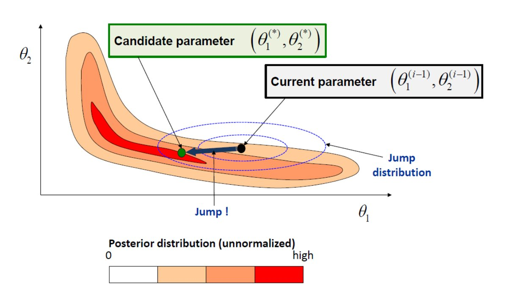
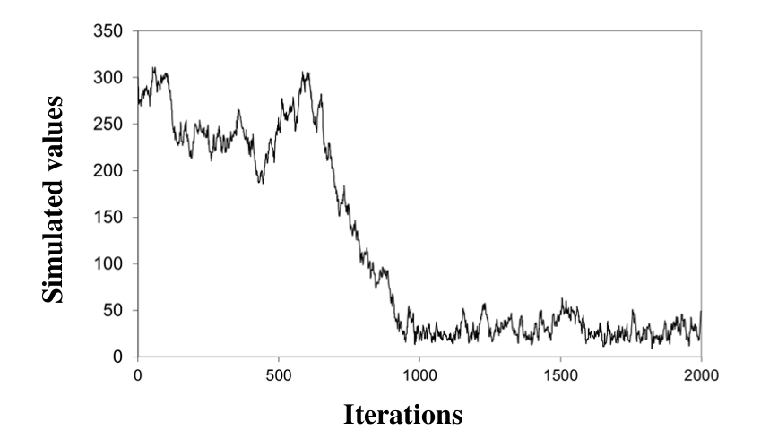
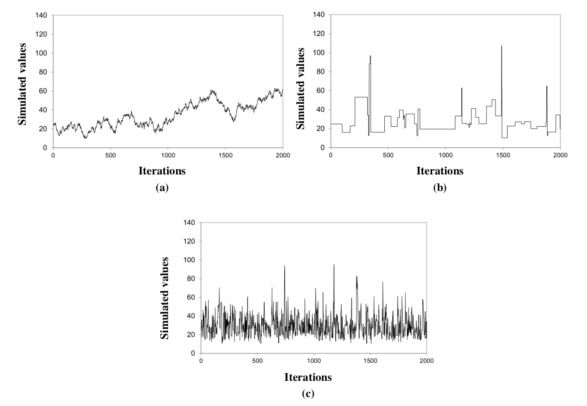

# Introduction

The tutorials proposed in the [Bayesian Basics](/en/doc/topics/bayesian) page have one peculiarity: there is only one unknown parameter $\theta$. One can easily imagine that the practical implementation of Bayesian inference gets more complicated when the number of unknown parameters increases. For instance, when the vector of unknown parameters $\boldsymbol{\theta}=(\theta_1,\theta_2,\theta_3)$ has 3 components, the posterior pdf $p(\theta_1,\theta_2,\theta_3|\boldsymbol{y})$ is 3-dimensional: it cannot even be represented graphically in a simple 2-D plot.

This issue can be tackled by means of a Monte Carlo approach: instead of graphically representing the posterior distribution, the idea is to generate many realizations from it, and to use these simulated values to describe properties of the posterior distribution. A particular family of Monte Carlo simulator is used for this purpose and is described in this note: Markov Chain Monte Carlo (MCMC) samplers.

# General principle of MCMC samplers

Consider the posterior pdf schematized in Figure 1. There are 2 unknown parameters $\boldsymbol{\theta}=(\theta_1,\theta_2)$ , and the pdf $p(\theta_1,\theta_2|\boldsymbol{y})$ is shown from above as a contour plot. Simulating realizations from this pdf seems challenging for the following reasons:

1. The distribution is multidimensional.
2. The shape of the pdf looks quite weird, and does not look like any “standard” distribution. There is therefore little hope to find an existing off-the-shelf algorithm for this
particular pdf in Excel, R, Python, Matlab, etc.
3. Moreover, remember that in practice the posterior pdf is only evaluated up to a constant of proportionality (see [Bayesian Basics](/en/doc/topics/bayesian)). Figure 1 is therefore only proportional to
the posterior pdf.

 Figure 1. Illustration of the general principle behind MCMC sampling: a candidate parameter is generated by jumping from the current parameter, using an easy-to-simulate distribution (typically, a Gaussian distribution). The candidate is accepted or rejected depending on the
ratio between the new and the old posterior pdf.

Bad news: in most cases, posterior pdfs are affected by the three issues above. But good news: none of these issues is problematic for a MCMC sampler! This is precisely the reason why MCMC samplers have become Bayesians’ best friends.

The general principle of a MCMC sampler is the following: since directly simulating values from a complex target distribution (such as the one shown in Figure 1) is difficult, the simulation is done indirectly. To this aim, a MCMC sampler visits the parameter space by means of successive jumps. Each jump is generated from an easy-to-simulate distribution (typically, a Gaussian distribution). After the jump, the “candidate” parameter $\boldsymbol{\theta}^{(*)}$ is accepted or rejected depending on the “elevation difference”, or more precisely, depending on the ratio between the new and the old posterior pdf value. The next section gives more details for the most standard MCMC algorithm: the Metropolis sampler.

# The Metropolis algorithm

Algorithm 1 describes the Metropolis sampler. Given the current parameter $\boldsymbol{\theta}^{(i-1)}$, the candidate parameter $\boldsymbol{\theta}^{(*)}$ is generated by randomly jumping from $\boldsymbol{\theta}^{(i-1)}$ (step 1.a.).The jump size and orientation are controlled by the covariance matrix $\boldsymbol{\Sigma}$.The next step is to accept or reject the candidate. The acceptance rule is given in step 1.c: uphill jumps($\tau \ge 1$) are always accepted, while downhill jumps ($\tau \lt 1$) are randomly accepted, with acceptance probability equal to $\tau$. If the candidate is rejected, the current parameter stays at the same location $(\boldsymbol{\theta}^{(i)}=\boldsymbol{\theta}^{(i-1)})$. It can be proven that with this acceptance rule, the random walk thus generated is a realization from the posterior distribution (if the number of simulations is large enough).

  Algorithme 1: Metropolis. For the sake of correctness, the Metropolis algorithm is actually more general than this: the Gaussian jump distribution can be replaced by any symmetrical distribution.

 
0. Choose a starting point $\boldsymbol{\theta}^{(0)}$ and a covariance matrix $\boldsymbol{\Sigma}$.
1. Repeat for $i=1:N_{sim}$ :
    a. Generate the candidate $\boldsymbol{\theta}^{(*)}$ from a Gaussian distribution centered on the current parameter $\boldsymbol{\theta}^{(i-1)}$ and with covariance matrix $\boldsymbol{\Sigma}$ : $\boldsymbol{\theta}^{(*)} \leftarrow \mathcal{N}(\boldsymbol{\theta}^{(i-1)},\boldsymbol{\Sigma})$
    b. Compute the ratio between the new and the old posterior pdf: $\tau=\frac{p(\boldsymbol{\theta}^{(*)}|\boldsymbol{y})}{p(\boldsymbol{\theta}^{(i-1)}|\boldsymbol{y})}$
    c. Accept the candidate $(\boldsymbol{\theta}^{(i)}=\boldsymbol{\theta}^{(*)})$ with probability $min(\tau;1)$; otherwise, reject the candidate $(\boldsymbol{\theta}^{(i)}=\boldsymbol{\theta}^{(i-1)})$

 

Note that in Algorithm 1, the posterior pdf is only used to compute the ratio $\tau$. This explains why it is sufficient to know the posterior pdf up to a constant of proportionality: this constant simply cancels out in the ratio.

As an aside, the term “Markov Chain” is used in the naming “MCMC” to refer to the “memoryless” property of simulated values: indeed, the value simulated at iteration $i+1$ (“future”) depends on the result of iteration $i$ (“present”) but not on previous iterations (“past”). This type of stochastic process is known as a Markov chain, in tribute to the Russian mathematician Andreï Andreïevitch Markov (Image 1) who developed the theoretical framework for such processes.

Lastly, and before moving on to the practice, let us note that MCMC samplers are not intrinsically linked to Bayesian inference: a MCMC sampler can indeed be applied to any target distribution (not only posteriors).

 

 Image 1. Andrey Andreyevich Markov (1856 – 1922). Source: [Wikipedia](https://en.wikipedia.org/wiki/Andrey_Markov)

 

> [**Tutorial 1. Bayesian-MCMC approach, discrete case**](TP_MCMC.en.zip). The Excel file implements the Metropolis algorithm for the occurrences of a flood larger than the estimated 10-year flood (see Tutorial 1 in [Bayesian Basics](/en/doc/topics/bayesian) page). 
>
> 1. Observe the rows of iterations 0 and 1 cell by cell in order to understand the way the algorithm is implemented, and verify that it is consistent with Algorithm 1.
2. Plot simulated values, then modify the jump size (C3) and observe how it impacts simulated values.
3. Create a histogram of simulated values (you can use the “analysis tools” in the tab “Data”). Compute a 90% credibility interval.
4. Some people prefer using return periods rather than occurrence probabilities. Compute and represent the posterior distribution of this return period (you have to fill in empty cells in the “Extras…” columns), then compute a 90% credibility interval. In your opinion, should the colleague who estimated the 10-year flood be fired?
>
> Note: appart from its didactic aspect, implementing a MCMC sampler with Excel is a dubious idea, which is likely to fail for analyses more complicated than those presented in these introductory tutorials (computing time, crashes with too many rows/columns, reliability of the random number generator implemented in Excel, limited graphical capabilities, etc.). R, Python or Matlab languages provide implementations of MCMC samplers. 

> [**Tutorial 2. Bayesian-MCMC approach, continuous case**](TP_MCMC.en.zip). The Excel file is similar to the previous one, but is adapted for the inter-event duration data at Sommières (see Tutorial 2 in [Bayesian Basics](/en/doc/topics/bayesian) page).
>
> 1. Create an histogram of simulated values and compute a 90% credibility interval.
2. For every simulated value, compute the associated cumulated distribution function (cdf; you have to fill in empty cells in the “Extras…” columns). Represent all these cdfs graphically (or at least the first ~100 cdfs, Excel may crash if you plot them all…).
3. Based on these “spaghettis”, what is the probability of waiting less than 10 years between two events? Less than 100 years? Less than 1000 years?

> [**Tutorial 3. Bayesian-MCMC approach, linear regression**](TP_MCMC.en.zip). The Excel file is again similar to the previous ones, but is adapted for the rainfall-runoff regression data (see Tutorial 5 in [Bayesian Basics](/en/doc/topics/bayesian) page). However, there is a noticeable difference: there are two unknown parameters($\theta$, the regression slope, and $\sigma$, the residual standard deviation).
>
> 1. Observe the row of iteration 1 to understand the way the algorithm was adapted to the case of several unknown parameters.
2. Plot simulated values of $\theta$ and $\sigma$ in two separate panels, then the scatterplot of simulated $(\theta,\sigma)$ pairs. What information can be gained from the latter figure?
3. For every simulated value of $\theta$, compute the corresponding regression line (you have to fill empty cells in the “Extras…Parametric Uncertainty” columns). Plot all these regression lines (or at least the first ~100), then add the observed (rainfall; runoff) values.
4. The previous representation ignores the fact that the regression model contains an error term $\varepsilon$, assumed to be a realization from a Gaussian distribution $\mathcal{N}(0,\sigma)$. Modify the previous regression lines by adding, for every point, an error simulated from a distribution $\mathcal{N}(0,\sigma)$ (you have to fill empty cells in the “Extras…Total Uncertainty” columns). Plot all these curves (or at least the first ~100).
5. Superimpose both figures (you can copy the graphic of question 3, and paste it into the graphic of question 4). Comment on the interpretation of this plot.

# Convergence and representativeness of MCMC simulations

Some care is needed before using MCMC-simulate values: one should indeed first asses their convergence and their representativeness.

Consider the MCMC simulations in Figure 2, which correspond to the inter-event durations data of Tutorial 2. The starting point was set to $\theta=300$, which is much too high and corresponds to a near-zero posterior pdf. Consequently, the random walk needs some iterations before reaching the range of “better” values (say 10-100), corresponding to higher posterior pdf values. 

In such a case, the first part of iterations cannot be considered as representative of the posterior distribution: the MCMC simulations did not reach convergence yet. The solution to this issue is very simple: the first part of iterations is discarded and only iterations beyond the ~1000th are preserved for further analysis. This is called the “burn-in period”, or alternatively, the first 1000 iterations are said to be “burned”.

 MCMC simulations for Tutorial 2 with a poorly-chosen starting point $\theta=300$.

Consider now the three MCMC chains shown in Figure 3 (still related to Tutorial 2), corresponding to three different jump sizes. The first chain (Figure 3a) correspond to a very small jump size: the candidate parameter is very close to the current parameter, leading to a Metropolis ratio $\tau$ very close to 1. The candidate parameter therefore tends to be systematically accepted. In this particular case, the acceptance ratio is equal to 97%.

Figure 3b corresponds to the opposite situation: the jump size is very large, so that most candidates are generated in an area where the posterior pdf is close to zero. The Metropolis ratio $\tau$ is hence also very close to zero, and the candidate parameter therefore tends to be systematically rejected: the acceptance ratio is equal to 3% here.

Although opposite, both situations lead to same problem: the number of iterations necessary to properly visit the whole parameter space is prohibitive, and probably amounts to hundreds of thousands. As a consequence, subsequent estimations based on a too small number of iterations may be poorly representative. Figure 3c shows the case of a well-chosen jump size: the acceptance rate is equal to 50% here.

 MCMC simulations for Tutorial 2 with different jump sizes. (a) Jump size is too small ($=1$); (b) jump size is too large ($=500$); (c) jump size is well chosen ($=20$).

Several simple, good-practice verifications exist to tackle the issues raised above. The first one is to systematically plot the simulated values: obvious problems such as a poorly chosen starting point or jump size can generally be diagnosed by eye. Computing the acceptance rate is also useful: values close to 0% or 100% should alert on a possible problem. In BaRatinAGE, MCMC simulations can be visualized on a dedicated tab of the « Rating Curve » component.

Another strategy is to simulate several MCMC chains, whith different starting points, and to verify that they yield similar estimations (after burning the first iterations). If this is not the case, it suggests that the number of iterations is too small and / or that the jump size is poorly-chosen. More generally, there exist many advanced tools to monitor the convergence and the representativeness of MCMC simulations (not yet implemented in BaRatinAGE). The interested reader can refer to the following references: the book by [Gelman et al., 2013](http://www.stat.columbia.edu/~gelman/book/) proposes a general description of such techniques; the paper by [El Adlouni et al., 2006](https://doi.org/10.1016/j.csda.2005.04.018) makes a complete review; the R package [coda](https://cran.r-project.org/package=coda) implements several tools.

# Building efficient MCMC samplers

The Metropolis algorithm is the simplest MCMC sampler and its performance are largely sufficient for cases with small to moderate complexity. However, many other MCMC samplers have been developed over the years to tackle more challenging cases. The objective of this section is not to make a review of existing MCMC samplers (they are aplenty!), but rather to explain a few general strategies to improve the efficiency of MCMC sampling.

The previous section and the tutorials have demonstrated that the efficiency of the Metropolis algorithm is mostly controlled by the jump sizes (which, in turn, are controlled by the diagonal elements of the covariance matrix $\boldsymbol{\Sigma}$ in Algorithm 1). When some parameters are strongly correlated, the jump orientation may also be important (off-diagonal terms in $\boldsymbol{\Sigma}$): the jump should be made in the direction suggested by the correlation. Overall, a “good” jump distribution should look like the posterior distribution, at least in terms of size and orientation.

This last sentence sounds paradoxical: the objective of MCMC simulations is precisely to explore the properties of the posterior distribution. How could these unknown properties be used to tune the MCMC sampler? The answer is to develop adaptive algorithms: the jump distribution is modified as iterations unfold, using the previously-generated values. For instance, it is possible to modify the jump sizes depending on the acceptance rate computed on previously-generated values. A small acceptance rate suggests too large jumps (see previous section) and the jump size should therefore be decreased, and inversely is the acceptance rate is large.

Another strategy can be very efficient when the parameter vector $\boldsymbol{\theta}=(\theta_1,\ldots,\theta_p)$ has a large dimension (i.e. $p$ is large). It is based on jumping for an unique component of $\boldsymbol{\theta}$ at a time. For instance, at iteration $(i-1)$, the jump will be made from current parameter $\left(\theta_1^{(i-1)},\theta_2^{(i-1)},\ldots, \theta_p^{(i-1)}\right)$to candidate parameter $\left(\theta_1^{(*)},\theta_2^{(i-1)},\ldots, \theta_p^{(i-1)}\right)$ (only the first component jumps). After acceptance or rejection, the first component is updated and the current parameter vector becomes $\left(\theta_1^{(i)},\theta_2^{(i-1)},\ldots, \theta_p^{(i-1)}\right)$. One can then do the same thing for the second component, jumping from current parameter to candidate parameter $\left(\theta_1^{(i)},\theta_2^{(*)},\ldots, \theta_p^{(i-1)}\right)$, accepting/rejecting to get $\left(\theta_1^{(i)},\theta_2^{(i)},\theta_3^{(i-1)},\ldots, \theta_p^{(i-1)}\right)$, and so forth until all components are updated. The interest of this approach
is that it replaces a single jump in a $p$-dimensional space by $p$ jumps in a one-dimensional space. The
latter are much easier to tune, especially using an adaptive approach as described previously.

# MCMC algorithm implemented in BaRatinAGE

The MCMC algorithm implemented in BaRatinAGE uses both strategies described above (for a complete description, see [Renard et al., 2006](https://doi.org/10.1029/2005WR004591)). It can be summarized as shown below.

  Algorithm 2. MCMC algorithm implemented in BaRatinAGE.

 
0. Choose a starting point $\boldsymbol{\theta}^{(0)}=\left(\theta_1^{(0)},\ldots, \theta_p^{(0)}\right)$ and initial jump variances $\boldsymbol{\nu}^{(0)}=\left(\nu_1,\ldots, \nu_p\right)$.
1. $k=0$  # Initialize counter 
2. Repeat for $i=1:N_{cycles}$:  # After each cycle the jump variance is adapted 
    a. Repeat for $j=1:N_{adapt}$:  # Loop with no adaption of the jump variances 
        i. $k=k+1$  # Increment counter 
        ii. Repeat for $d=1:p$:  # Loop on each component of vector $\boldsymbol{\theta}$ 
            * Generate a candidate $\theta_d^{(*)}$ from a Gaussian distribution with mean $\theta_d^{(k-1)}$ and variance $\nu_d$;
            * Compute the ratio between the new and the old posterior pdf values: $\tau=\frac{p \left( \theta_1^{(k)},\ldots,\theta_{d-1}^{(k)},\theta_d^{(*)},\theta_{d+1}^{(k-1)},\ldots,\theta_{p}^{(k-1)} |\boldsymbol{y} \right)}{p \left( \theta_1^{(k)},\ldots,\theta_{d-1}^{(k)},\theta_d^{(k-1)},\theta_{d+1}^{(k-1)},\ldots,\theta_{p}^{(k-1)} |\boldsymbol{y} \right)}$;
            * Accept the candidate $\left( \theta_d^{(k)}=\theta_d^{(*)} \right)$ with probability $min(\tau;1)$; otherwise, reject the candidate $\left( \theta_d^{(k)}=\theta_d^{(k-1)} \right)$
    b. Update jump variances
        i. Repeat for $d=1:p$:  # Loop on each component of vector $\boldsymbol{\theta}$ 
            * Compute the acceptance rate $\alpha_d$ for the $d$th component;
            * If $\alpha_d \le \alpha_{min}$ , $\nu_d=\phi^{-}\times\nu_d$  # acceptance rate is too low => decrease jump variance 
            * If $\alpha_d \ge \alpha_{max}$ , $\nu_d=\phi^{+}\times\nu_d$  # acceptance rate is too high => increase jump variance 
            * Otherwise keep $\nu_d$  # acceptance rate is between the specified bounds $[\alpha_{min};\alpha_{max}]$, the jump variance is therefore preserved 

 

In the algorithm above, the values of $N_{cycles}$, $N_{adapt}$, $\alpha_{min}$, $\alpha_{max}$, $\phi^{-}$ and $\phi^{+}$ can be modified to tune the properties of the MCMC sampler. The default values defined in BaRatinAGE ($N_{cycles}=100$, $N_{adapt}=100$, $\alpha_{min}=0.1$, $\alpha_{max}=0.5$, $\phi^{-}=0.9$ and $\phi^{+}=1.1$) should work well in most cases.

Finally, the raw simulations from the algorithm above are post-treated as follows:

* Burn-in: the first part of iterations is discarded, as explained in a previous section. In BaRatinAGE, the default burn-in factor is set to 0.5 (i.e. the first half is discarded);
* Slimming: for the remaining values, only one every $N_{affinage}$ is preserved. In BaRatinAGE, the default value is set to $N_{affinage}=10$. The resulting information loss is actually quite small because the raw MCMC simulations are generally strongly autocorrelated.

Consequently, with the default values in BaRatinAGE, the MCMC algorithm generates 10,000 values, but after post-treatment, only 500 simulations are preserved for further analyzes. This is in general largely sufficient, and has the positive effect of decreasing both computing time (for computing discharge time series in particular) and memory requirements.

