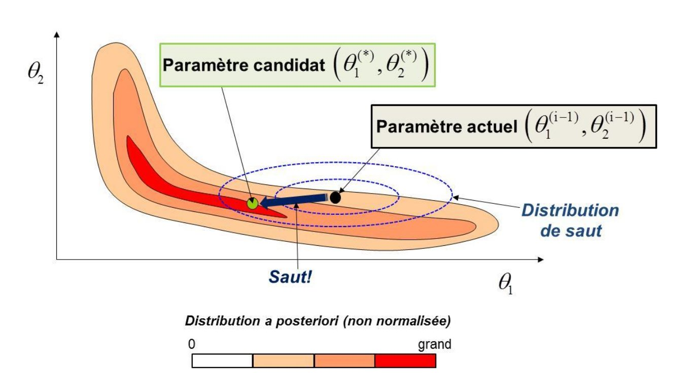
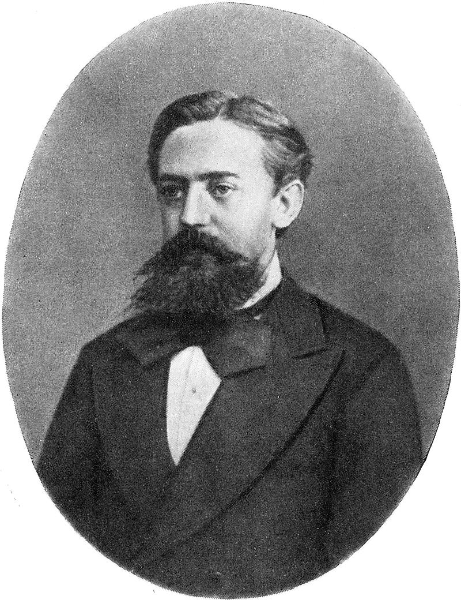
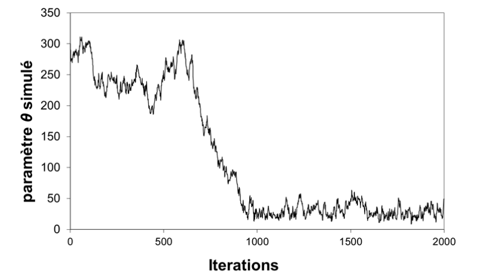
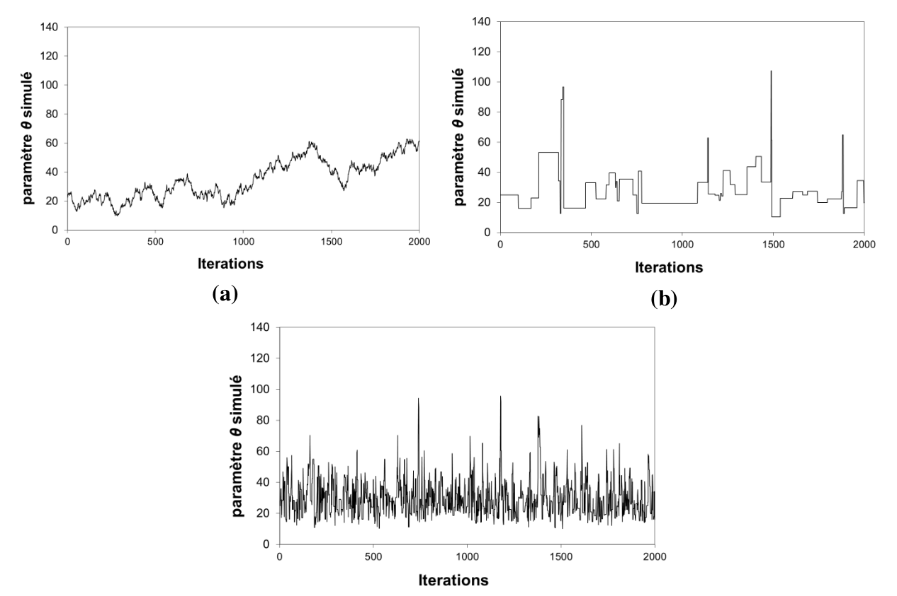

# Introduction

Les TPs proposés dans la page [B.A.-BA de l’inférence Bayesienne](/fr/doc/topics/bayesien) avaient la particularité de ne considérer qu’un unique paramètre inconnu $\theta$. On peut assez facilement se convaincre que l’implémentation d’une analyse bayésienne se complique lorsque le nombre de paramètres inconnus augmente. Par exemple, si le vecteur $\boldsymbol{\theta}=(\theta_1,\theta_2,\theta_3)$ contient 3 paramètres inconnus, alors la distribution a posteriori $p(\theta_1,\theta_2,\theta_3|\boldsymbol{y})$ est une distribution tridimensionnelle : on ne peut même plus la représenter graphiquement dans un simple graphique en 2 dimensions.

Pour remédier à cette difficulté, on utilise une approche de type Monte Carlo : plutôt que de chercher à représenter graphiquement la distribution a posteriori, on va essayer de simuler un grand nombre de paramètres depuis cette distribution, puis on utilisera ces simulations pour décrire indirectement la distribution a posteriori. Pour y parvenir, on utilise un type de simulateur Monte Carlo particulier, qui fait l’objet de cette fiche : les simulateurs de Monte Carlo par Chaînes de Markov (MCMC).

# Principe général des méthodes MCMC

Considérons la densité a posteriori illustrée dans la Figure ci-dessous. Il y a ici 2 paramètres inconnus $\boldsymbol{\theta}=(\theta_1,\theta_2)$ , et la densité $p(\theta_1,\theta_2|\boldsymbol{y})$ est représentée vue de dessus. Générer des réalisations à partir de cette distribution peut sembler difficile pour les raisons suivantes :

1. La distribution est multidimensionnelle.
2. La distribution est assez biscornue, et en tout cas ne ressemble à aucune distribution « classique ». Il y a donc peu d’espoir de trouver un algorithme prêt à l’emploi sous Excel, R, Python, Matlab, etc.
3. Pour couronner le tout, rappelons qu’en pratique, on se contente souvent de calculer la densité a posteriori à une constante de proportionnalité près – la Figure ci-dessous n’est donc que proportionnelle à la densité a posteriori.

 Figure 1. Illustration du principe général d’un simulateur MCMC. Un paramètre candidat est généré en sautant depuis le paramètre actuel, le saut étant généré à partir d’une distribution de laquelle on sait simuler facilement (typiquement, une loi normale). Ce candidat sera accepté ou rejeté en fonction du « dénivelé » parcouru, i.e. du ratio entre la nouvelle et l’ancienne valeur de la densité a posteriori.

La mauvaise nouvelle est que sauf cas très particulier, l’immense majorité des distributions a posteriori est affectée par les trois difficultés décrites ci-dessus. La bonne nouvelle est qu’aucune de ces trois difficultés n’est rédhibitoire pour un simulateur MCMC ! Ceci explique pourquoi les algorithmes MCMC sont devenus les inséparables compagnons de route des Bayésiens.

Le principe général d’un simulateur MCMC est le suivant : puisqu’il semble impossible de générer directement des réalisations depuis une distribution compliquée comme celle représentée en Figure 1, la génération se fera de manière indirecte. Pour cela, un simulateur MCMC va visiter l’espace des paramètres par sauts successifs. Ces sauts seront générés à partir d’une distribution pour laquelle la simulation est aisée (typiquement, une distribution gaussienne). Le « nouveau » vecteur de paramètres ainsi généré, $\boldsymbol{\theta}^{(*)}$, sera alors accepté ou rejeté en fonction du « dénivelé » parcouru, ou pour être plus précis, en fonction du ratio entre la nouvelle et l’ancienne valeur de la densité a posteriori. La section suivante détaille ce principe général pour un simulateur MCMC classique connu sous le nom d’algorithme de Metropolis.

# L’algorithme de Metropolis

L’Algorithme ci-dessous décrit l’algorithme de Metropolis. Etant donné le vecteur de paramètres actuel $\boldsymbol{\theta}^{(i-1)}$, on génère un paramètre candidat $\boldsymbol{\theta}^{(*)}$ en sautant aléatoirement depuis le paramètre actuel $\boldsymbol{\theta}^{(i-1)}$ (étape 1.a.). La taille et l’orientation du saut sont gérées par la matrice de covariance $\boldsymbol{\Sigma}$. Il s’agit à présent d’accepter ou de rejeter ce candidat. La règle d’acceptation est énoncée en 1.c: on accepte tous les sauts vers le haut ($\tau \ge 1$); les saut vers le bas ($\tau \lt 1$) seront acceptés de manière aléatoire, avec une probabilité égale à $\tau$. Si le candidat est rejeté, on reste sur la position actuelle  $(\boldsymbol{\theta}^{(i)}=\boldsymbol{\theta}^{(i-1)})$. Il est possible de démontrer qu’avec cette règle d’acceptation, la marche aléatoire ainsi générée est une réalisation de la loi a posteriori, pourvu que le nombre de simulations effectuées soit assez grand.

  Algorithme 1: Metropolis. Pour être tout à fait exact, l’algorithme de Metropolis est en fait plus général que ce qui est décrit ci-dessous : on peut remplacer la distribution de saut gaussienne par n’importe quelle distribution symétrique.

 
0. Choisir un point de départ $\boldsymbol{\theta}^{(0)}$ et une matrice de covariance $\boldsymbol{\Sigma}$.
1. Répéter pour $i=1:N_{sim}$ :
    a. Générer un candidat $\boldsymbol{\theta}^{(*)}$ à partir d’une distribution gaussienne centrée sur le paramètre actuel $\boldsymbol{\theta}^{(i-1)}$ et de matrice de covariance $\boldsymbol{\Sigma}$ : $\boldsymbol{\theta}^{(*)} \leftarrow \mathcal{N}(\boldsymbol{\theta}^{(i-1)},\boldsymbol{\Sigma})$
    b. Calculer le ratio entre la nouvelle et l’ancienne valeur de la densité a posteriori : $\tau=\frac{p(\boldsymbol{\theta}^{(*)}|\boldsymbol{y})}{p(\boldsymbol{\theta}^{(i-1)}|\boldsymbol{y})}$
    c. Accepter le candidat $(\boldsymbol{\theta}^{(i)}=\boldsymbol{\theta}^{(*)})$ avec une probabilité égale à $min(\tau;1)$ ; sinon, rejeter le candidat $(\boldsymbol{\theta}^{(i)}=\boldsymbol{\theta}^{(i-1)})$

 

Remarquons que dans l’Algorithme 1, la densité a posteriori n’intervient que dans le calcul du ratio $\tau$. Ceci explique pourquoi il n’est pas nécessaire de calculer la constante de normalisation : toute constante se simplifiera dans ce ratio, si bien que ne connaitre la densité a posteriori qu’à une constante multiplicative près ne pose absolument aucun problème !

Précisons que le terme « chaîne de Markov » est utilisé dans la nomenclature « MCMC » en référence à la propriété d’absence de mémoire des simulations MCMC : en effet, la simulation à l’étape $i+1$ (« futur ») ne dépend que des résultats de l’étape $i$ (« présent ») et aucunement des simulations antérieures (« passé »). Ce type de processus s’appelle une chaîne de Markov, en hommage au mathématicien russe Andreï Andreïevitch Markov (Image 1) qui en a développé la théorie.

Pour finir, et avant de passer à la pratique, signalons que les méthodes MCMC ne sont pas intrinsèquement liées à l’approche bayésienne : on peut appliquer un simulateur MCMC à n’importe quelle distribution cible.

 

 Image 1. Andreï Andreïevitch Markov (1856 – 1922). Source: [Wikipedia](https://fr.wikipedia.org/wiki/Andre%C3%AF_Markov_(math%C3%A9maticien))

 

> [**TP 1. Approche bayésienne-MCMC, cas discret**](TP_MCMC.fr.zip). Le fichier Excel propose une implémentation de l’algorithme de Metropolis pour les données de dépassement de la crue estimée comme décennale (voir TP1 de la page [inférence Bayesienne](/fr/doc/topics/bayesien)).

> 1. Etudiez les lignes des itérations 0 et 1 cellule par cellule pour comprendre comment l’algorithme est implémenté, et vérifier que cela correspond bien à l’Algorithme 1.
2. Tracez les valeurs simulées dans un graphique, puis jouez avec la taille du saut (cellule C3) et observez l’impact sur les valeurs simulées.
3. Réalisez un histogramme des valeurs simulées (utilisez l’utilitaire d’analyse dans l’onglet « Données »). Calculez un intervalle de crédibilité à 90%.
4. Plutôt que de parler en termes de probabilité de dépassement, on préfère parler en termes de période de retour. Représentez la distribution a posteriori de cette période de retour (remplissez la colonne vide dans la partie « Extras… »), puis calculez un intervalle de crédibilité à 90%. Le collègue ayant estimé la crue décennale doit-il être renvoyé ?

> Note: à part pour l'aspect didactique, implémenter un simulateur MCMC sous Excel est globalement une très mauvaise idée, qui a toutes les chances de ne pas fonctionner dès que les cas d’étude seront un peu plus complexes que ceux traités en TP (temps de calcul, plantages intempestifs dès qu’il y a trop de lignes/colonnes, fiabilité des générateurs de nombres aléatoires incertaine, capacités graphiques très limitées, etc.). Des langages comme R, Python ou Matlab proposent des implémentations de simulateurs MCMC.

> [**TP 2. Approche bayésienne-MCMC, cas continu**](TP_MCMC.fr.zip). Le fichier Excel est similaire au précédent, et est simplement adapté aux durées inter-événements à Sommières (voir TP2 de la page [inférence Bayesienne](/fr/doc/topics/bayesien)).

> 1. Réalisez un histogramme des valeurs simulées et calculez un intervalle de crédibilité à 90%.
2. Pour chaque valeur simulée du paramètre, calculez la fonction de répartition associée (remplissez les colonnes vides dans la partie « Extras… »). Représentez graphiquement l’ensemble de ces fonctions de répartition (limitez-vous en fait aux ~100 premières, sinon Excel risque de planter).
3. Sur la base de ces « spaghettis », quelle est la probabilité d’attendre moins de 10 ans entre deux inondations ? moins de 100 ans ? moins de 1000 ans ?

> [**TP 3. Approche bayésienne-MCMC, régression linéaire**](TP_MCMC.fr.zip). Le fichier Excel est encore similaire aux deux précédents, et est simplement adapté aux données de la régression pluie-débit (voir TP5 de la page [inférence Bayesienne](/fr/doc/topics/bayesien)). Néanmoins, il y a une différence notable : les paramètres inconnus sont maintenant au nombre de deux ($\theta$, la pente de la régression, et $\sigma$, l’écart-type des résidus).

> 1. Etudiez la ligne de l’itération 1 pour comprendre comment l’implémentation a été adaptée au cas de plusieurs paramètres inconnus.
2. Tracez les valeurs simulées de $\theta$ et $\sigma$ dans deux graphiques séparés, puis tracez le nuage des points $(\theta,\sigma)$ simulés. Quelle information peut-on tirer de ce dernier graphique ?
3. Pour chaque valeur simulée de $\theta$, calculez la droite de régression associée (remplissez les colonnes vides dans la partie « Extras…Incertitude paramétrique »). Représentez graphiquement l’ensemble de ces droites (limitez-vous encore aux ~100 premières), et superposez-y les couples (pluie ; débit) observés.
4. La représentation précédente ignore le fait que le modèle de régression est entaché d’une
erreur $\varepsilon$, supposée être une réalisation d’un loi normale $\mathcal{N}(0,\sigma)$. Modifiez les droites de régressions précédentes en y ajoutant, en chaque point, une erreur simulée dans une $\mathcal{N}(0,\sigma)$ (remplissez les colonnes vides dans la partie « Extras…Incertitude totale »). Représentez graphiquement l’ensemble des courbes ainsi obtenues (~100 premières).
5. Superposez les deux graphiques précédents (copiez le graphique de la question 3, et collez-le dans le graphique de la question 4). Commentez.

# Convergence et représentativité des simulations MCMC

Il convient de prendre quelques précautions avant d’utiliser les valeurs simulées par MCMC. En particulier, il faut évaluer la convergence et la représentativité des simulations.

Considérons la Figure 2, qui correspond aux simulations MCMC effectuées dans le TP 2 (durées inter-événements). Le point de départ choisi est $\theta=300$, ce qui est beaucoup trop grand et correspond à une densité a posteriori proche de zéro. En conséquence, la marche aléatoire a besoin d’un certain nombre d’itérations avant de rejoindre une gamme de valeurs plus faibles (disons 10-100), qui correspond à la zone où la densité a posteriori est grande.

Dans ce cas de figure, la première partie des itérations ne peut pas être considérée comme issue de la distribution a posteriori : on dit que le simulateur n’a pas encore convergé. La solution pour y remédier est simple : on ignore toute la première partie des simulations, et on utilisera seulement les valeurs simulées au-delà de la 1000e itération par exemple. On parle de « temps de chauffe », ou de manière équivalente, on dit qu’on « brûle » les 1000 premières itérations.

 Figure 2. Simulations MCMC correspondant au TP 2 avec un point de départ mal choisi $\theta=300$.

Considérons à présent la Figure 3, qui correspond toujours au TP 2. Les trois chaînes ont été simulées avec des tailles de saut différentes. Dans le premier cas (Figure 3a), la taille des sauts est très petite, si bien que le paramètre candidat est très proche du paramètre courant, conduisant à un ratio de Metropolis $\tau$ très proche de 1. On aura donc tendance à systématiquement accepter le paramètre candidat. Il est d’ailleurs possible de calculer le taux d’acceptation sur l’ensemble des simulations, et on trouve ici environ 97%.

La Figure 3b correspond au cas de figure opposé : la taille des sauts est très grande, si bien que la plupart des paramètres candidats sont générés dans des zones où la densité a posteriori est quasi nulle. Le ratio de Metropolis $\tau$ est ainsi très proche de 0, et on aura donc tendance à systématiquement rejeter le paramètre candidat : le taux d’acceptation est ici égal à environ 3%.

Ces deux cas de figure, biens qu’opposés, conduisent à la même conséquence : le temps nécessaire pour visiter convenablement tout l’espace des paramètres sera très long, nécessitant des centaines de milliers d’itérations. Il en découle que les estimations faites à partir d’un trop petit nombre d’itérations risquent d’être peu représentatives. La Figure 3c illustre un cas où la taille des sauts a été bien choisie, conduisant à un taux d’acceptation d’environ 50%.

 Figure 3. Simulations MCMC correspondant au TP 2 avec différentes valeurs pour la taille du saut (i.e. l’écart-type de la distribution de saut gaussienne) : (a) taille du saut trop petite égale à 1 ; (b) taille du saut trop grande égale à 500 ; (c) taille du saut bien choisie égale à 20.

Il existe plusieurs bonnes pratiques simples à appliquer pour éviter les désagréments décrits précédemment. La première est de systématiquement visualiser les simulations : les problèmes flagrants comme un point de départ très mal choisi ou une taille de saut totalement inappropriée sont facilement détectables à l’oeil. On peut également calculer le taux d’acceptation : des valeurs proches de 0% ou 100% doivent alerter sur un possible problème. Dans BaRatinAGE, on peut visualiser les simulations MCMC dans un onglet dédié du composant « Courbe de Tarage ».

Une seconde stratégie est de simuler plusieurs chaînes, avec des points de départ différents, et de vérifier que les estimations qui en découlent (après brûlage des premières itérations) sont similaires. Si ce n’est pas le cas, il est vraisemblable que le nombre d’itérations est insuffisant et/ou que la taille des sauts n’est pas appropriée. Plus généralement, il existe de nombreuses techniques plus avancées pour évaluer la convergence et a représentativité des simulations MCMC. A l’heure actuelle, ces techniques ne sont pas implémentées dans BaRatinAGE. Le lecteur intéressé pourra consulter les sources suivantes: le livre de [Gelman et al., 2013](http://www.stat.columbia.edu/~gelman/book/) propose une description générale de ces techniques ; l’article de [El Adlouni et al., 2006](https://doi.org/10.1016/j.csda.2005.04.018) en propose une revue ; le package R [coda](https://cran.r-project.org/package=coda) implémente plusieurs techniques.

# Construire des simulateurs MCMC efficaces

L’algorithme de Metropolis est le simulateur MCMC le plus simple, et ses performances sont suffisantes pour des cas de complexité faible à modérée. Néanmoins, de nombreux autres simulateurs ont été développés pour faire face à des cas plus complexes. L’objectif de cette section n’est pas d’en dresser la liste exhaustive (il en existe une myriade !), mais simplement de donner quelques stratégies générales pour améliorer l’efficacité des simulateurs MCMC.

Les TPs ainsi que la section précédente ont montré que l’efficacité de l’algorithme de Metropolis est en grande partie gouvernée par la taille des sauts (elle-même gouvernée par les éléments diagonaux
de la matrice $\boldsymbol{\Sigma}$ dans l’Algorithme 1). Dans les cas où certains paramètres sont fortement corrélés, l’orientation des sauts est également importante (éléments hors diagonale de la matrice $\boldsymbol{\Sigma}$) : il faut autant que possible essayer de sauter dans la direction suggérée par la corrélation. Au final, on peut dire qu’un bon réglage de la distribution de saut doit conduire cette dernière à ressembler à la distribution a posteriori, au moins en termes de taille et d’orientation. 

Cette dernière phrase peut sembler paradoxale : l’objectif d’un simulateur MCMC est justement d’explorer les propriétés de la distribution a posteriori. Comment peut-on utiliser ces propriétés inconnues pour régler le simulateur MCMC ? La réponse est de développer des simulateurs adaptatifs : on modifie les propriétés de la distribution de saut au fur et à mesure des itérations, en s’aidant des valeurs générées jusque-là. Par exemple, on peut modifier la taille des sauts en fonction du taux d’acceptation calculé sur les itérations précédentes. Un taux d’acceptation trop faible suggère que la taille des sauts est trop grande (cf. section précédente) et devrait donc être diminuée, et inversement si le taux d’acceptation est trop grand.

Une autre stratégie peut s’avérer très efficace dans le cas où le paramètre $\boldsymbol{\theta}=(\theta_1,\ldots,\theta_p)$ a une grande dimension (i.e. $p$ est grand). Elle consiste à effectuer un saut pour une unique composante de $\boldsymbol{\theta}$ à la fois. Par exemple, à l’itération $(i-1)$, on sautera du paramètre courant $\left(\theta_1^{(i-1)},\theta_2^{(i-1)},\ldots, \theta_p^{(i-1)}\right)$ vers le paramètre $\left(\theta_1^{(*)},\theta_2^{(i-1)},\ldots, \theta_p^{(i-1)}\right)$ (seule la première composante saute). Après acceptation ou rejet, on aura mis à jour la première composante du paramètre, et obtenu $\left(\theta_1^{(i)},\theta_2^{(i-1)},\ldots, \theta_p^{(i-1)}\right)$. On passera alors à la seconde composante, en sautant vers $\left(\theta_1^{(i)},\theta_2^{(*)},\ldots, \theta_p^{(i-1)}\right)$, et en acceptant/rejetant pour obtenir $\left(\theta_1^{(i)},\theta_2^{(i)},\theta_3^{(i-1)},\ldots, \theta_p^{(i-1)}\right)$, et ainsi de suite jusqu’à ce que toutes les composantes soient mises à jour. L’intérêt de cette approche est qu’elle remplace un saut dans un espace de dimension $p$ par $p$ sauts dans un espace de dimension 1. Ces derniers sont plus faciles à régler, surtout si l’on utilise une approche adaptative comme décrite précédemment.

# L’algorithme MCMC implémenté dans BaRatin

Le simulateur MCMC implémenté dans BaRatin utilise les deux stratégies décrites ci-dessus (pour une description complète, voir [Renard et al., 2006](https://doi.org/10.1029/2005WR004591)). L’algorithme est résumé ci-dessous.

  Algorithme 2. Algorithme MCMC implémenté dans BaRatin.

 
0. Choisir un point de départ $\boldsymbol{\theta}^{(0)}=\left(\theta_1^{(0)},\ldots, \theta_p^{(0)}\right)$ et des variances de saut $\boldsymbol{\nu}^{(0)}=\left(\nu_1,\ldots, \nu_p\right)$.
1. $k=0$  # initialisation du compteur 
2. Répéter pour $i=1:N_{cycles}$ :  # A l’issue de chaque cycle on adaptera la variance de saut 
    a. Répéter pour $j=1:N_{adapt}$ :  # Boucle sans adaptation des variances de saut 
        i. $k=k+1$  # Incrément du compteur 
        ii. Répéter pour $d=1:p$ :  # Boucle sur chaque composante du vecteur $\boldsymbol{\theta}$ 
            * Générer un candidat $\theta_d^{(*)}$ à partir d’une distribution gaussienne de moyenne $\theta_d^{(k-1)}$ et de variance $\nu_d$ ;
            * Calculer le ratio entre la nouvelle et l’ancienne valeur de la densité a posteriori : $\tau=\frac{p \left( \theta_1^{(k)},\ldots,\theta_{d-1}^{(k)},\theta_d^{(*)},\theta_{d+1}^{(k-1)},\ldots,\theta_{p}^{(k-1)} |\boldsymbol{y} \right)}{p \left( \theta_1^{(k)},\ldots,\theta_{d-1}^{(k)},\theta_d^{(k-1)},\theta_{d+1}^{(k-1)},\ldots,\theta_{p}^{(k-1)} |\boldsymbol{y} \right)}$ ;
            * Accepter le candidat $\left( \theta_d^{(k)}=\theta_d^{(*)} \right)$ avec une probabilité égale à $min(\tau;1)$ ; sinon, rejeter le candidat $\left( \theta_d^{(k)}=\theta_d^{(k-1)} \right)$
    b. Mise à jour des variances de saut
        i. Répéter pour $d=1:p$ :  # Boucle sur chaque composante du vecteur $\boldsymbol{\theta}$ 
            * Calculer le taux d’acceptation $\alpha_d$ pour la composante $d$ ;
            * Si $\alpha_d \le \alpha_{min}$ , $\nu_d=\phi^{-}\times\nu_d$  # Le taux d’acceptation est trop faible, donc on diminue la variance de saut 
            * Si $\alpha_d \ge \alpha_{max}$ , $\nu_d=\phi^{+}\times\nu_d$  # Le taux d’acceptation est trop grand, donc on augmente la variance de saut 
            * Sinon conserver $\nu_d$  # Le taux d’acceptation est entre les bornes souhaitées $[\alpha_{min};\alpha_{max}]$, on conserve donc la variance de saut 

 

Dans l’algorithme ci-dessus, les valeurs de $N_{cycles}$, $N_{adapt}$, $\alpha_{min}$, $\alpha_{max}$, $\phi^{-}$ et $\phi^{+}$ peuvent être modifiées pour régler les propriétés de l’échantillonneur MCMC. Les valeurs par défaut définies dans BaRatinAGE ($N_{cycles}=100$, $N_{adapt}=100$, $\alpha_{min}=0.1$, $\alpha_{max}=0.5$, $\phi^{-}=0.9$ et $\phi^{+}=1.1$) devraient néanmoins convenir dans la grande majorité des cas.

Pour finir, les simulations brutes issues de l’algorithme ci-dessus sont post-traitées de la manière suivante :

* Brûlage : on efface une partie des simulations, comme expliqué précédemment. Dans BaRatinAGE, le facteur de brûlage utilisé par défaut est égal à 0.5 (c’est-à-dire qu’on efface la première moitié des simulations) ;
* Affinage : sur les simulations restantes, on ne conserve qu’une valeur toutes les $N_{affinage}$. Dans BaRatinAGE, la valeur par défaut est $N_{affinage}=10$. La perte d’information qui en résulte est limitée car les simulations MCMC brutes sont très autocorrélées.

Ainsi, avec les valeurs par défaut définies dans BaRatinAGE, l’algorithme MCMC générera 10 000 simulations, mais après post-traitement, seules 500 simulations seront conservées, ce qui est largement suffisant dans la plupart des cas et permet de diminuer à la fois le temps de calcul (pour le calcul des hydrogrammes en particulier) et les volumes de stockage.
